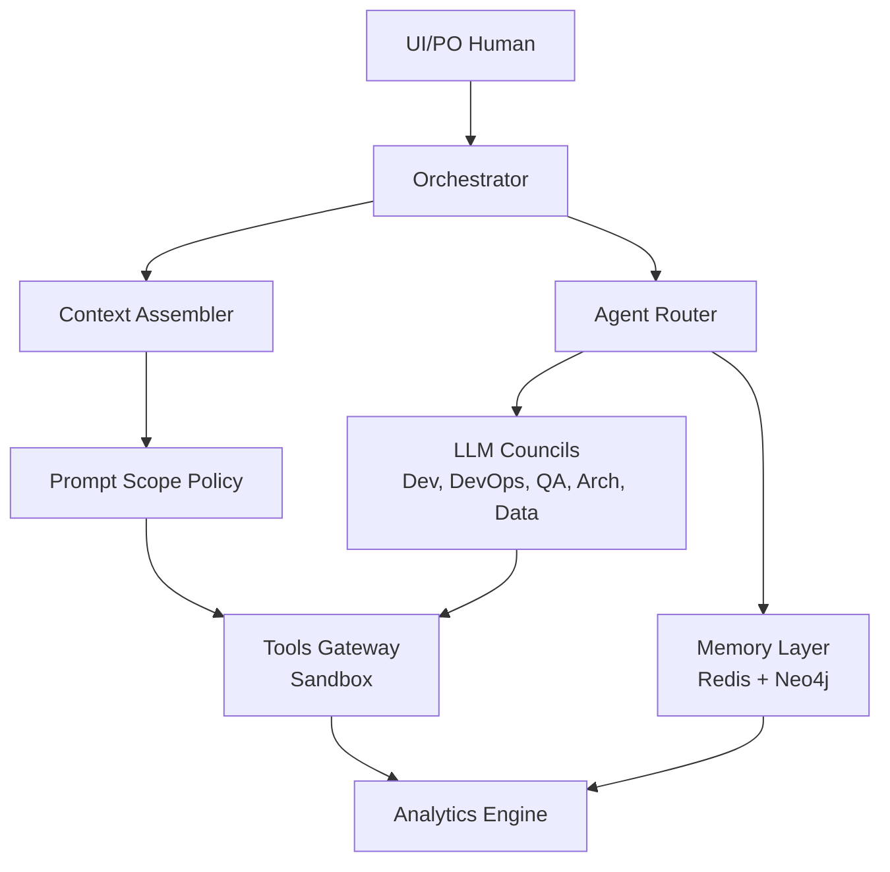

# SWE AI Fleet - Context Architecture

## 🎯 Project Description

**SWE AI Fleet** is an open-source multi-agent system for software development and systems engineering. It simulates a real development team with specialized LLM agents (developers, devops, QA, architect, data engineer) that work in a coordinated manner under human supervision.

## 🏗️ System Architecture

### Core Components



#### ASCII Version (Legacy)

```
┌─────────────────┐    ┌──────────────────┐    ┌─────────────────┐
│   UI/PO Human   │───▶│   Orchestrator   │───▶│  Context        │
│                 │    │                  │    │  Assembler      │
└─────────────────┘    └──────────────────┘    └─────────────────┘
                                │                        │
                                ▼                        ▼
                       ┌──────────────────┐    ┌─────────────────┐
                       │   Agent Router   │    │  Prompt Scope   │
                       │                  │    │  Policy         │
                       └──────────────────┘    └─────────────────┘
                                │                        │
                                ▼                        ▼
                       ┌──────────────────┐    ┌─────────────────┐
                       │  LLM Councils    │    │   Tools         │
                       │  (Dev, DevOps,   │───▶│   Gateway       │
                       │   QA, Arch,      │    │   (Sandbox)     │
                       │   Data)          │    │                 │
                       └──────────────────┘    └─────────────────┘
                                │                        │
                                ▼                        ▼
                       ┌──────────────────┐    ┌─────────────────┐
                       │   Memory Layer   │    │   Analytics     │
                       │  Redis + Neo4j   │    │   Engine        │
                       └──────────────────┘    └─────────────────┘
```

### Memory Layers

1. **Redis (Tier-0)**: Ephemeral working memory with TTL
   - Streams for LLM events
   - Cache for frequent context
   - Automatic TTL for cleanup

2. **Neo4j (Tier-2)**: Decision and dependency graph
   - Nodes: Decisions, Tasks, Dependencies, Milestones
   - Relationships: DECIDES, DEPENDS_ON, IMPACTS, APPROVED_BY
   - Complete use case traceability

## 🔧 Containerized Tool Execution System

### Runner Contract Protocol

SWE AI Fleet implements a standardized protocol for agent-container interaction through the **Runner Contract**, enabling secure and traceable execution of development tasks.

#### Key Components

1. **TaskSpec**: Declarative task specification
   - Container image and command
   - Environment variables and mounts
   - Resource limits and timeouts
   - Context metadata for Redis/Neo4j integration

2. **TaskResult**: Structured execution results
   - Execution status and exit codes
   - Log references and artifact paths
   - Performance metadata and timing
   - Integration with case/task tracking

3. **agent-task Shim**: Standardized execution interface
   - Language-specific setup (Python, Go)
   - Task type routing (unit, integration, e2e, build)
   - Structured logging with timestamps
   - Artifact collection and organization

4. **Runner Tool**: MCP implementation
   - Async task execution
   - CRI-O (local) and Kubernetes (next phase)
   - Real-time log streaming
   - Automatic artifact management

#### Architecture Flow

```
Agent LLM → Runner Tool (MCP) → TaskSpec → Container Execution → TaskResult
     ↓              ↓                ↓              ↓                ↓
Context      Policy Engine    agent-task     Testcontainers    Redis/Neo4j
Assembly     Validation       Shim           Services          Audit Trail
```

#### Security Features

- **Non-root execution**: All tasks run as non-root user
- **Resource limits**: CPU and memory constraints enforced
- **Timeout protection**: Automatic task termination
- **Isolated workspace**: Mounted directories with proper permissions
- **No secrets**: All secrets injected at runtime
- **Complete audit**: Every execution logged to Redis/Neo4j

#### Integration with SWE AI Fleet Context

The Runner integrates seamlessly with the existing context system:

- **Redis**: Short-term plan/spec/events storage
- **Neo4j**: Graph of decisions/plan/subtasks  
- **Context Assembler**: Builds filtered context packs by role and phase

The `context.hydration_refs` in TaskSpec files reference Redis keys and Neo4j queries that the orchestrator uses to hydrate the agent's context before task execution.

## 📁 Code Structure

### Module Organization

```
src/swe_ai_fleet/
├── __init__.py
├── cli/                    # Command line interface
├── context/               # Intelligent context system
│   ├── adapters/         # Data source adapters
│   ├── domain/           # Domain models (DDD)
│   │   ├── scopes/       # Scope management
│   │   │   ├── prompt_scope_policy.py    # Scope enforcement
│   │   │   ├── prompt_blocks.py          # Structured prompts
│   │   │   └── scope_check_result.py     # Scope validation
│   │   ├── context_sections.py           # Context organization
│   │   ├── role_context_fields.py        # Role-specific data
│   │   ├── case_header.py                # Case metadata
│   │   ├── plan_header.py                # Plan metadata
│   │   ├── milestone.py                  # Milestone tracking
│   │   ├── decision_relation.py          # Decision relationships
│   │   └── rehydration_bundle.py         # Data bundles
│   ├── ports/            # Interfaces/Protocols
│   ├── context_assembler.py    # Main assembler
│   ├── session_rehydration.py  # Session rehydration
│   └── utils.py
├── memory/               # Memory system
│   ├── redis_store.py    # Redis store implementation
│   ├── neo4j_store.py    # Neo4j store (base)
│   ├── cataloger.py      # Memory catalog
│   └── summarizer.py     # Automatic summaries
├── models/               # Data models
├── orchestrator/         # Agent orchestration
│   ├── architect.py      # Architect agent
│   ├── council.py        # Agent council
│   ├── router.py         # Task router
├── tools/                # Tool execution system
│   ├── runner/           # Containerized task runner
│   │   ├── agent-task    # Standardized task execution shim
│   │   ├── runner_tool.py # MCP Runner Tool implementation
│   │   ├── examples/     # TaskSpec/TaskResult examples
│   │   ├── Containerfile # Multi-tool container image
│   │   └── Makefile      # Build and deployment automation
│   ├── adapters/         # Tool adapters (kubectl, helm, psql)
│   ├── domain/           # Tool domain models
│   ├── ports/            # Tool interfaces
│   └── services/         # Tool services
│   └── config.py         # Configuration
├── reports/              # Report generation
│   ├── adapters/         # Analytics adapters
│   │   ├── neo4j_graph_analytics_read_adapter.py  # Neo4j analytics
│   │   └── redis_planning_read_adapter.py         # Redis planning
│   ├── domain/           # Report domain models
│   │   ├── graph_analytics_types.py      # Analytics data types
│   │   ├── report.py                     # Report structure
│   │   ├── report_request.py             # Report requests
│   │   └── decision_enriched_report.py   # Decision reports
│   ├── ports/            # Report interfaces
│   │   ├── graph_analytics_read_port.py  # Analytics interface
│   │   ├── planning_read_port.py         # Planning interface
│   │   └── decision_graph_read_port.py   # Decision interface
│   ├── dtos/             # Data transfer objects
│   └── report_usecase.py # Implementation reports
├── tools/                # Execution tools
│   ├── kubectl_tool.py   # kubectl tool
│   ├── helm_tool.py      # Helm tool
│   ├── psql_tool.py      # PostgreSQL tool
│   └── validators.py     # Validators
└── evaluators/           # Quality evaluators
```

## 🧠 Context System Architecture

### Domain-Driven Design (DDD) Implementation

The context system follows DDD principles with clear separation of concerns:

#### **Domain Objects**
- **`ContextSections`**: Orchestrates context building with inverted control flow
- **`RoleContextFields`**: Encapsulates role-specific context data
- **`PromptScopePolicy`**: Enforces scope policies and data redaction
- **`PromptBlocks`**: Structured prompt representation

#### **Context Assembly Flow**
```
1. Session Rehydration → RoleContextFields
2. Context Assembler → ContextSections
3. Scope Policy → PromptBlocks
4. Analytics Integration → Enhanced Reports
```

### Analytics Integration

#### **Graph Analytics Engine**
- **Critical Decision Analysis**: Indegree-based importance scoring
- **Cycle Detection**: Dependency cycle identification
- **Topological Layering**: Kahn's algorithm for dependency ordering
- **Impact Assessment**: Decision impact analysis

#### **Analytics Data Types**
```python
@dataclass(frozen=True)
class CriticalNode:
    id: str
    label: str
    score: float

@dataclass(frozen=True)
class PathCycle:
    nodes: list[str]
    rels: list[str]

@dataclass(frozen=True)
class LayeredTopology:
    layers: list[list[str]]
```

## 🔧 Current Implementation Status

### ✅ Completed (M0-M2)

#### **Core Infrastructure**
- **Infrastructure**: Docker Compose for Redis + Neo4j
- **Redis Memory**: `RedisStoreImpl` with Streams and TTL
- **Context System**: `ContextAssembler` with DDD principles
- **Scope Management**: `PromptScopePolicy` with redaction
- **Session Management**: `SessionRehydrationUseCase`

#### **Analytics & Reporting**
- **Graph Analytics**: Neo4j-based analytics engine
- **Implementation Reports**: Comprehensive report generation
- **Analytics Integration**: Optional analytics in reports
- **Decision Analysis**: Critical decision identification

#### **Testing & Quality**
- **Unit Tests**: 69+ comprehensive unit tests
- **Integration Tests**: E2E testing with Redis/Neo4j
- **Code Quality**: Ruff linting and type checking
- **Test Coverage**: Complete analytics functionality

### 🚧 In Progress (M3)

- **Context optimization**: Automatic compression of long sessions
- **Advanced analytics**: Machine learning-based insights
- **Context dashboard**: Basic UI for monitoring
- **Performance optimization**: Query optimization and caching

## 📊 Analytics Features

### Decision Graph Analytics

#### **Critical Decision Identification**
```cypher
MATCH (c:Case {id:$cid})-[:HAS_PLAN]->(p:PlanVersion)
WITH p ORDER BY coalesce(p.version,0) DESC LIMIT 1
MATCH (p)-[:CONTAINS_DECISION]->(d:Decision)
WITH collect(d) AS D
UNWIND D AS m
OPTIONAL MATCH (m)<-[r]-(:Decision)
WHERE ALL(x IN [startNode(r), endNode(r)] WHERE x:Decision) 
  AND endNode(r) IN D AND startNode(r) IN D
WITH m, count(r) AS indeg
RETURN m.id AS id, 'Decision' AS label, toFloat(indeg) AS score
ORDER BY score DESC LIMIT $limit
```

#### **Cycle Detection**
```cypher
MATCH (c:Case {id:$cid})-[:HAS_PLAN]->(p:PlanVersion)
WITH p ORDER BY coalesce(p.version,0) DESC LIMIT 1
MATCH (p)-[:CONTAINS_DECISION]->(d:Decision)
WITH collect(d) AS D
UNWIND D AS start
MATCH p=(start)-[r*1..$maxDepth]->(start)
WHERE ALL(rel IN r WHERE startNode(rel):Decision AND endNode(rel):Decision 
  AND startNode(rel) IN D AND endNode(rel) IN D)
RETURN [x IN nodes(p) | x.id] AS nodes, [rel IN relationships(p) | type(rel)] AS rels
LIMIT 20
```

#### **Topological Layering**
- **Kahn's Algorithm**: Dependency-based layering
- **Cycle Handling**: Graceful cycle detection and handling
- **Layer Sorting**: Deterministic layer ordering
- **Impact Analysis**: Dependency impact assessment

### Implementation Reports

#### **Report Structure**
```python
@dataclass(frozen=True)
class Report:
    case_id: str
    plan_id: str
    generated_at_ms: int
    markdown: str
    stats: dict[str, Any]
```

#### **Analytics Integration**
- **Optional Analytics**: Backward-compatible analytics integration
- **Real-time Data**: Live analytics from Neo4j
- **Comprehensive Coverage**: Critical decisions, cycles, and layers
- **Export Capabilities**: Markdown and structured data

## 🧪 Testing Architecture

### Test Organization

```
tests/
├── unit/                           # Unit tests
│   ├── test_context_assembler_unit.py
│   ├── test_prompt_scope_policy_unit.py
│   ├── test_reports_usecase_unit.py
│   └── test_neo4j_graph_analytics_read_adapter_unit.py
├── integration/                    # Integration tests
│   └── test_router_integration.py
└── e2e/                           # End-to-end tests
    ├── test_report_usecase_e2e.py
    ├── test_context_assembler_e2e.py
    └── test_session_rehydration_e2e.py
```

### Test Coverage

#### **Unit Tests (69+ tests)**
- **Context Assembly**: Complete context building functionality
- **Scope Policy**: Scope enforcement and redaction
- **Analytics**: Graph analytics and decision analysis
- **Reports**: Implementation report generation

#### **Integration Tests**
- **End-to-End Workflows**: Complete system integration
- **Redis/Neo4j Integration**: Real database testing
- **Analytics Integration**: Full analytics pipeline testing

#### **Code Quality**
- **Ruff Compliance**: Zero linting issues
- **Type Safety**: Full type hints and validation
- **Documentation**: Comprehensive docstrings
- **Performance**: Optimized query execution

## 🚀 Future Enhancements

### Planned Features (M4+)

#### **Advanced Analytics**
- **Machine Learning**: ML-based decision prediction
- **Performance Metrics**: Agent performance analysis
- **Trend Analysis**: Historical decision patterns
- **Risk Assessment**: Automated risk identification

#### **Enhanced Context**
- **Semantic Search**: Context-aware search capabilities
- **Auto-summarization**: Automatic context compression
- **Knowledge Graphs**: Enhanced knowledge representation
- **Collaborative Filtering**: Agent recommendation system

#### **UI/UX Improvements**
- **Web Dashboard**: Real-time monitoring interface
- **Interactive Reports**: Dynamic report exploration
- **Visual Analytics**: Graph visualization tools
- **Mobile Support**: Mobile-optimized interface