# 🧠 Knowledge Graph Architecture — Visual Guide
**Decision-Centric AI Context Engine**

> **Technology Agnostic**: Graph Database (Neo4j, ArangoDB, TigerGraph, etc.) + Cache Layer (Redis, Memcached, Valkey, etc.)

---

## 📊 System Architecture Overview

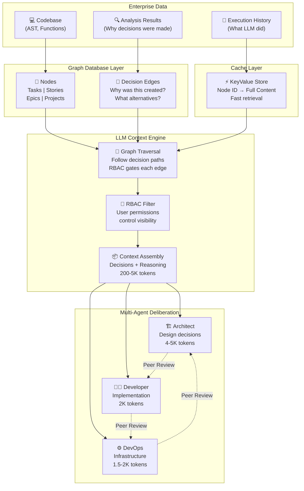

---

## 🔄 Data Flow: From Decision to Context

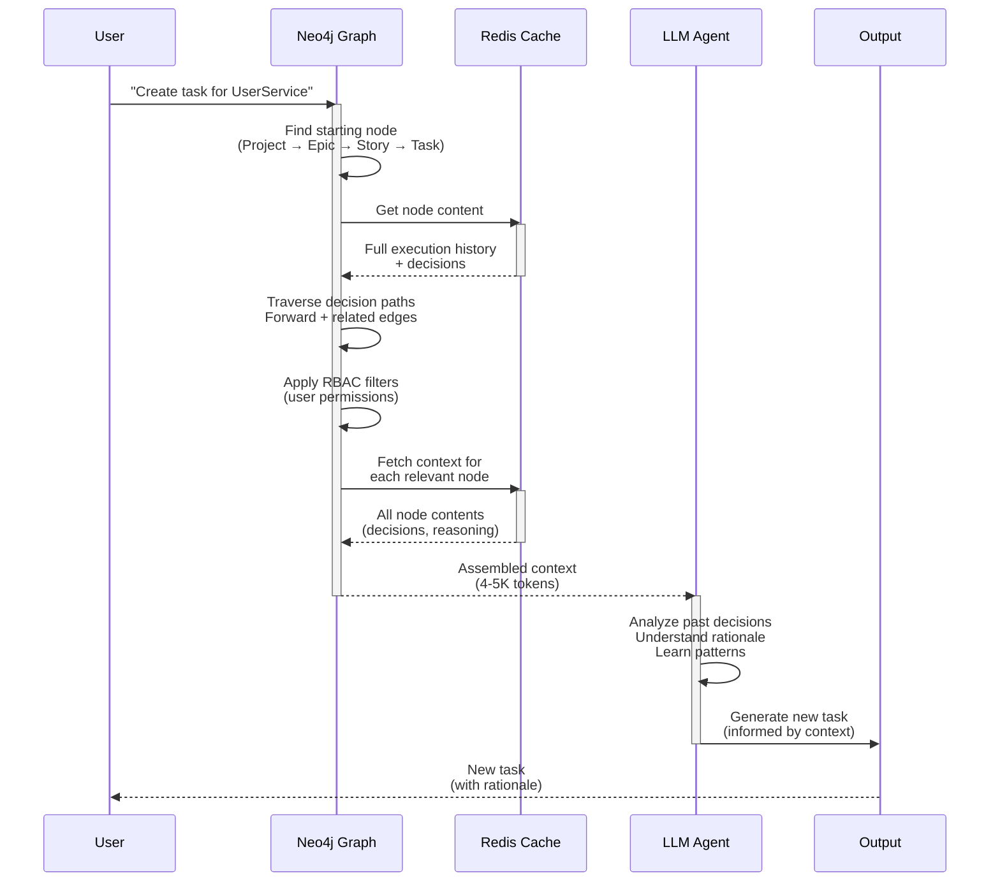

---

## 🌳 Graph Structure: Decision Relationships

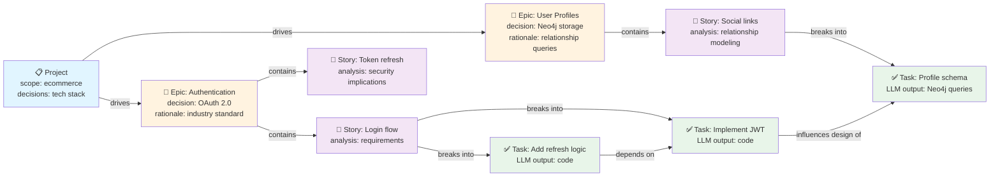

---

## 📦 Node Structure: What Lives in Each

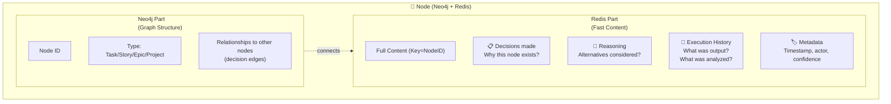

---

## 🎯 Context Retrieval: Graph Traversal

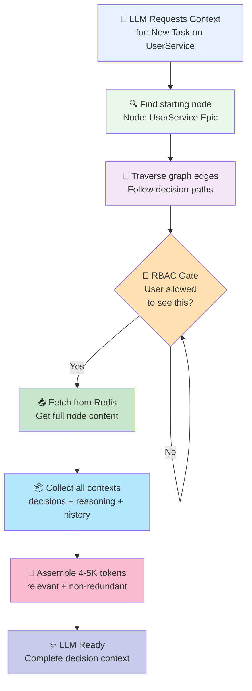

---

## 🧠 Multi-Agent Deliberation with Shared Context

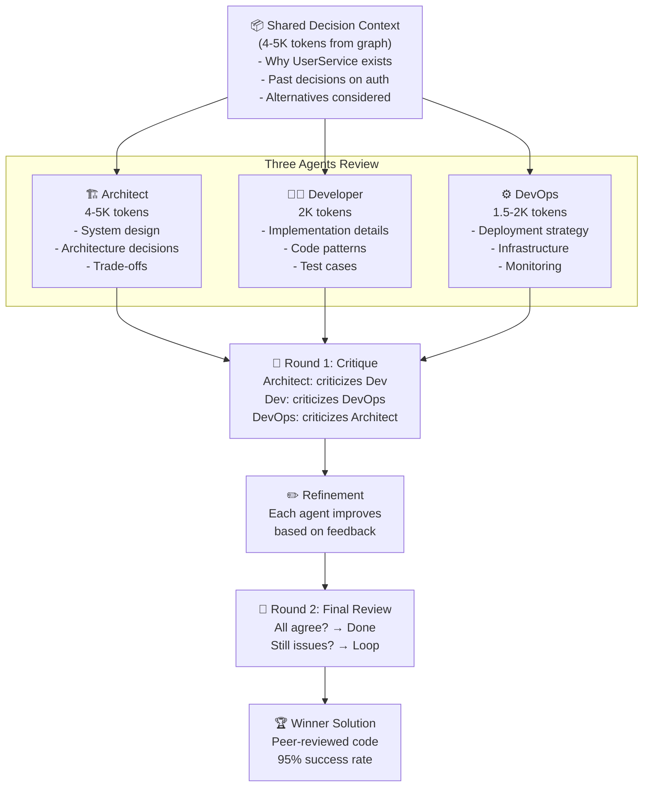

---

## 🔄 Learning Loop: New Tasks from Past Decisions

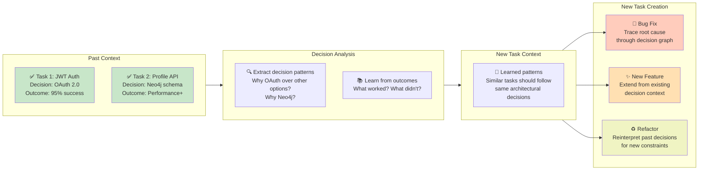

---

## 📊 Token Efficiency: Why Decision-Rich Beats Scatter

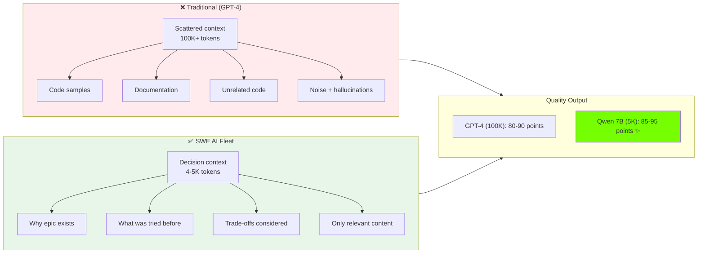

---

## 🔐 RBAC + Graph: Security & Compliance

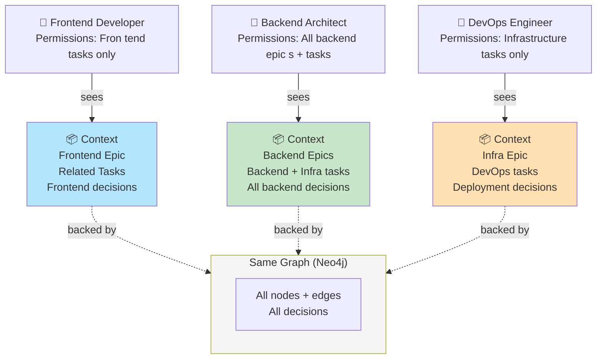

---

## 🎯 Use Cases Enabled by Decision Graph

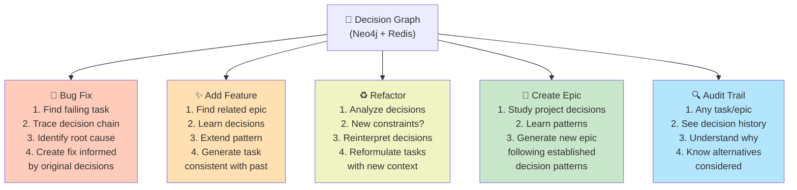

---

## 💡 The Innovation: Decision-Centric, Not Code-Centric

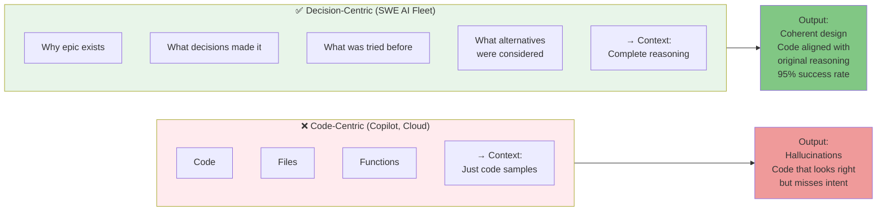

---

## 📈 Horizontal Scalability: From Startup to Enterprise

```mermaid
graph LR
    subgraph Scale1["🚀 Stage 1: Startup<br/>Team: 5-10 devs"]
        GPU1["1x GPU Node<br/>(RTX 3090)"]
        GraphDB1["Graph DB<br/>(Single node)"]
        Cache1["Cache Layer<br/>(Single node)"]
        GPU1 -.-> GraphDB1
        GPU1 -.-> Cache1
        Throughput1["📊 Throughput:<br/>50 tasks/sec"]
    end

    subgraph Scale2["⚡ Stage 2: Growth<br/>Team: 50+ devs"]
        GPU2a["GPU Node 1"]
        GPU2b["GPU Node 2"]
        GraphDB2["Graph DB Cluster<br/>(2 nodes)"]
        Cache2["Cache Cluster<br/>(2 nodes)"]
        GPU2a -.-> GraphDB2
        GPU2b -.-> GraphDB2
        GPU2a -.-> Cache2
        GPU2b -.-> Cache2
        Throughput2["📊 Throughput:<br/>100 tasks/sec"]
    end

    subgraph Scale3["🏢 Stage 3: Enterprise<br/>Team: 500+ devs"]
        GPU3a["GPU Node 1"]
        GPU3b["GPU Node 2"]
        GPU3c["GPU Node N"]
        GraphDB3["Graph DB Cluster<br/>(N nodes)"]
        Cache3["Cache Cluster<br/>(N nodes)"]
        GPU3a -.-> GraphDB3
        GPU3b -.-> GraphDB3
        GPU3c -.-> GraphDB3
        GPU3a -.-> Cache3
        GPU3b -.-> Cache3
        GPU3c -.-> Cache3
        Throughput3["📊 Throughput:<br/>50 × N tasks/sec"]
    end

    Scale1 -->|"Add node"| Scale2
    Scale2 -->|"Add nodes"| Scale3

    style Scale1 fill:#c8e6c9
    style Scale2 fill:#fff9c4
    style Scale3 fill:#ffccbc
```

**Scaling Strategy:**
- **Automatic Rebalancing**: Graph DB + Cache handle distribution automatically
- **No Downtime**: Add nodes while cluster is running
- **Linear Scaling**: Each GPU node adds ~50 tasks/sec capacity
- **High Availability**: Multi-node = no single point of failure
- **Geographic Distribution**: Can deploy nodes across regions (eventual consistency)

---

## 🏆 Competitive Advantage Matrix

```mermaid
quadrantChart
    title Competitive Positioning
    x-axis Code-Centric --> Decision-Centric
    y-axis Cheap --> Expensive

    Copilot: 0.3, 0.7
    GPT-4 API: 0.2, 0.9
    Google Colab: 0.25, 0.6
    SWE AI Fleet: 0.95, 0.1

    classDef cheap fill:#81c784
    classDef expensive fill:#ef5350

    class SWE AI Fleet cheap
    class GPT-4 API expensive
    class Copilot expensive
```

---

## 👥 Human Role Transformation: Developer → Fleet Director

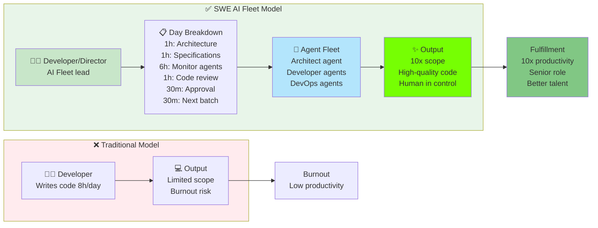

**Why This Matters for Recruitment:**
- ✅ Senior developers WANT architectural roles
- ✅ They HATE repetitive coding
- ✅ SWE AI Fleet: Architectural focus + agent management
- ✅ Better work-life balance (less coding, more directing)
- ✅ More fulfilling career trajectory

**Why This Matters for Companies:**
- ✅ Keep senior talent (don't lose to burnout)
- ✅ Increase output per developer (10x)
- ✅ Reduce time-to-market
- ✅ Better code quality (humans review + approve)
- ✅ Full human control + compliance

---

## 📋 Summary: Why This Architecture Matters

| Aspect | Traditional LLM | SWE AI Fleet |
|--------|---|---|
| **Context Type** | Code samples | Decision reasoning |
| **Context Size** | 100K+ tokens | 4-5K tokens |
| **Learning** | Single-shot | Learns from decisions |
| **Repeatability** | Hallucinations | Consistent patterns |
| **RBAC** | No | Per-team visibility |
| **Cost** | $0.03/1K tokens | $0 (local) |
| **Privacy** | Cloud | On-premises |
| **Audit Trail** | No | Full decision history |

---

**The Innovation**: Not better code generation, but **better context through decision graphs**.

When LLMs have decision context instead of code context, they generate better code because they understand **WHY** it matters.


