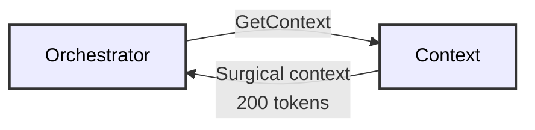

# 🎨 Mermaid Diagram Style Guide

**Goal**: Clean, professional diagrams with consistent styling across the entire codebase.

## Styling Rules

### 1. **NO Background Colors**
- ❌ `style Node fill:#c5cae9` (colored background)
- ✅ `style Node stroke:#333,color:#000` (outline only, neutral text)

### 2. **Color Palette (Grayscale + Neutral)**
- Dark text: `color:#000` or `color:#333`
- Neutral strokes: `stroke:#333` or `stroke:#666`
- Light backgrounds: White (default)
- For emphasis: Use `stroke-width:2px` instead of colors

### 3. **Font Styling**
```
style Node stroke:#333,color:#000,stroke-width:2px
```

## Examples

### ❌ BAD (Current Style - Colorful Background)


**Problem**: Different colored backgrounds make it hard to read, especially when printed.

### ✅ GOOD (New Style - Grayscale)


**Benefits**: 
- Clean, professional appearance
- Works in both light and dark modes
- Prints well
- Accessible (no color-dependent information)

## Pattern Templates

### Graph Diagrams


### Sequence Diagrams


**Note**: Sequence diagrams don't use style sections; they're already neutral.

### Subgraph Organization


## Checklist for Diagram Styling

- [ ] No `fill:#` (no background colors)
- [ ] All nodes use `stroke:#333` or `stroke:#666`
- [ ] All nodes use `color:#000` or `color:#333`
- [ ] Emphasis via `stroke-width:2px` or `stroke-width:3px` (not color)
- [ ] Text is readable in both light and dark backgrounds
- [ ] Diagram prints well in grayscale
- [ ] Labels use emoji where appropriate (universal symbols)
- [ ] No contrasting text colors (stick to black/dark gray)

## Migration Checklist

Files to update:

1. [ ] `KNOWLEDGE_GRAPH_ARCHITECTURE.md` - Multiple diagrams
2. [ ] `README.md` - System overview diagram
3. [ ] `docs/architecture/MICROSERVICES_ARCHITECTURE.md` - Service diagram
4. [ ] `docs/architecture/AGENTS_AND_TOOLS_USECASES.md` - Use case diagram
5. [ ] Other files with Mermaid diagrams

## Tools

To find all Mermaid diagrams:
```bash
grep -r "^.\`\`\`mermaid" --include="*.md" .
```

To check for background colors:
```bash
grep -r "fill:#" --include="*.md" .
```

---

**Version**: 2025-11-15  
**Status**: Style guide ready for implementation

