# 🏗️ Orchestrator Microservice - Análisis Completo de Código Hexagonal

**Fecha**: 20 de Octubre de 2025  
**Versión**: v2.4.0-async-fix  
**Total Archivos Python**: 113  
**Arquitectura**: Hexagonal (Ports & Adapters) + DDD  

---

## 📋 Índice

1. [Estructura General](#estructura-general)
2. [Entry Point](#entry-point)
3. [Domain Layer](#domain-layer)
4. [Application Layer](#application-layer)
5. [Infrastructure Layer](#infrastructure-layer)
6. [Tests](#tests)
7. [Problemas Potenciales Identificados](#problemas-potenciales)
8. [Flujo de Deliberación](#flujo-de-deliberacion)

---

## 🎯 Estructura General

```
services/orchestrator/
├── server.py                       # Entry point (gRPC server)
├── init_councils.py               # Initialization script
├── domain/                        # Domain layer (business logic)
│   ├── entities/                  # 25 domain entities
│   ├── events/                    # 7 domain events
│   ├── ports/                     # 10 interfaces (contracts)
│   └── value_objects/             # 4 value objects
├── application/                   # Application layer (use cases)
│   └── usecases/                  # 9 use cases
├── infrastructure/                # Infrastructure layer (adapters)
│   ├── adapters/                  # 9 port implementations
│   ├── handlers/                  # 5 event handlers
│   ├── mappers/                   # 13 DTO ↔ Domain mappers
│   └── dto/                       # Protobuf wrappers
└── tests/                         # 21 test files
    ├── domain/                    # Domain entity tests
    ├── application/               # Use case tests
    └── infrastructure/            # Adapter/mapper tests
```

---

## 🚀 Entry Point

### `server.py` (800 líneas)

**Propósito**: Entry point del microservicio gRPC

**Componentes Clave**:
1. **OrchestratorServiceServicer** (líneas 82-639)
   - Implementa todos los RPCs del servicio
   - Inyecta dependencias via constructor (ports)
   - Usa use cases para lógica de negocio

2. **serve_async()** (líneas 641-790)
   - Inicializa adapters (Dependency Injection)
   - Conecta a NATS
   - Inicializa consumers
   - Arranca servidor gRPC

**RPCs Implementados**:
- ✅ `Deliberate` (línea 165) - Ejecuta deliberación síncrona
- ✅ `GetDeliberationResult` (línea 220) - Consulta resultado de deliberación async
- ✅ `Orchestrate` (línea 265) - Workflow completo
- ✅ `GetStatus` (línea 325) - Health check
- ✅ `CreateCouncil` (línea 448) - Crea council con agentes
- ✅ `ListCouncils` (línea 509) - Lista councils activos
- ✅ `DeleteCouncil` (línea 531) - Elimina council
- ✅ `RegisterAgent` (línea 364) - Registra agente en council
- ⏸️ `StreamDeliberation` (línea 354) - UNIMPLEMENTED
- ⏸️ `UnregisterAgent` (línea 562) - UNIMPLEMENTED
- ⏸️ `ProcessPlanningEvent` (línea 571) - UNIMPLEMENTED
- ⏸️ `DeriveSubtasks` (línea 582) - UNIMPLEMENTED
- ⏸️ `GetTaskContext` (línea 593) - UNIMPLEMENTED
- ⏸️ `GetMetrics` (línea 604) - UNIMPLEMENTED

**Posibles Problemas**:
1. ⚠️ **Línea 188**: `await deliberate_uc.execute()` - Correcto ✅
2. ⚠️ **Línea 289**: `orchestrator.execute()` - Es SÍNCRONO, debería ser async si llama councils
3. ⚠️ **Líneas 392-445**: `RegisterAgent` crea agents usando imports directos (no usa factory port)
4. ⚠️ **Líneas 461-507**: `CreateCouncil` mezcla infraestructura (VLLMConfig imports) con lógica

**Análisis**: 
- ✅ Usa Hexagonal Architecture correctamente en mayoría de casos
- ✅ Dependency Injection implementada
- ⚠️ Algunos endpoints todavía tienen imports directos de infraestructura
- ⚠️ `Orchestrate` RPC (línea 265) usa `orchestrator.execute()` que es síncrono

---

### `init_councils.py` (200 líneas)

**Propósito**: Script para inicializar councils vía gRPC

**Funcionalidad**:
- Conecta a Orchestrator gRPC (línea 42)
- Elimina councils existentes (línea 57)
- Crea 5 councils: DEV, QA, ARCHITECT, DEVOPS, DATA (línea 82)
- Cada council con 3 agentes vLLM

**Posibles Problemas**:
- ✅ Bien implementado
- ✅ Usa async/await correctamente
- ✅ Manejo de errores robusto

---

## 🎭 Domain Layer

### Domain / Entities (25 archivos)

#### `council_registry.py` (220 líneas)
**Propósito**: Registry patrón para gestionar councils

**Métodos Clave**:
- `register_council()` - Registra nuevo council
- `get_council()` - Obtiene council (fail-fast si no existe)
- `delete_council()` - Elimina council
- `has_council()` - Verifica existencia
- `get_all_councils()` - Retorna todos

**Análisis**:
- ✅ Excelente aplicación de "Tell, Don't Ask"
- ✅ Fail-fast en `get_council()` (línea 95)
- ✅ Encapsula lógica de colección

**Posibles Problemas**: Ninguno ✅

---

#### `deliberation_state_registry.py` (184 líneas)
**Propósito**: Registry para tracking de deliberaciones async

**Métodos Clave**:
- `start_tracking()` - Inicia tracking de deliberación
- `get_state()` - Obtiene estado
- `get_or_create()` - Get o create automático
- `get_timed_out()` - Encuentra deliberaciones con timeout
- `get_for_cleanup()` - Encuentra deliberaciones para limpiar

**Análisis**:
- ✅ Excelente patrón Registry
- ✅ Tell, Don't Ask aplicado
- ✅ Métodos de query específicos (evita exponer dict interno)

**Posibles Problemas**: Ninguno ✅

---

#### `deliberation_state.py`
**Propósito**: Estado de una deliberación en progreso

**Campos**:
- task_id, status, created_at, updated_at
- expected_agents, received_responses
- responses, failures

**Métodos**:
- `add_response()` - Registra respuesta de agente
- `add_failure()` - Registra fallo
- `mark_completed()` - Marca como completada
- `is_complete()` - Verifica si está completa
- `is_timed_out()` - Verifica timeout

**Análisis**:
- ✅ Estado encapsulado
- ✅ Lógica de negocio en entity

**Posibles Problemas**: Ninguno ✅

---

#### `statistics.py` (83 líneas)
**Propósito**: Métricas del orchestrator

**Campos**:
- total_deliberations, total_orchestrations
- total_duration_ms, role_counts

**Métodos**:
- `increment_deliberation()` - Incrementa contadores
- `increment_orchestration()`
- `average_duration_ms` - Property calculado

**Análisis**:
- ✅ Simple y efectivo
- ✅ Calculations como properties

**Posibles Problemas**: Ninguno ✅

---

#### `agent_collection.py`
**Propósito**: Colección de agentes con operaciones

**Métodos**:
- `add_agent()` - Agrega agente
- `create_and_add_agents()` - Crea y agrega múltiples
- `get_all_agents()` - Retorna lista
- `get_all_ids()` - Retorna IDs
- `count` - Propiedad de conteo

**Análisis**:
- ✅ Encapsula lógica de colección
- ✅ Tell, Don't Ask

**Posibles Problemas**: Ninguno ✅

---

#### `incoming_events.py` (137 líneas)
**Propósito**: Eventos recibidos de otros servicios

**Entidades**:
1. **StoryTransitionedEvent** - De Planning Service
   - Campos: story_id, from_phase, to_phase, timestamp
   - Validación: Todos campos requeridos

2. **PlanApprovedEvent** - De Planning Service  
   - Campos: story_id, plan_id, approved_by, roles, timestamp
   - Validación: story_id, plan_id, approved_by requeridos

**Análisis**:
- ✅ Validación estricta en `from_dict()`
- ✅ Frozen dataclasses (inmutables)

**Posibles Problemas**:
- ⚠️ **Validación muy estricta** puede rechazar eventos legítimos en testing
- 💡 Considerar modo "relaxed" para desarrollo

---

### Domain / Events (7 archivos)

#### `deliberation_completed_event.py`
**Propósito**: Evento publicado cuando termina deliberación

**Campos**: story_id, task_id, decisions, timestamp

**Análisis**: ✅ Simple y correcto

---

#### `domain_event.py`
**Propósito**: Base class para todos los eventos

**Métodos**: `to_dict()`, `from_dict()`

**Análisis**: ✅ Correcto patrón base

---

### Domain / Ports (10 archivos - Interfaces)

#### `messaging_port.py`
**Propósito**: Interfaz para publish/subscribe de eventos

**Métodos**:
- `connect()` - Conecta a messaging system
- `publish()` - Publica domain event
- `publish_dict()` - Publica dict (legacy)
- `subscribe()` - Subscribe push consumer
- `pull_subscribe()` - Subscribe pull consumer

**Análisis**: ✅ Excelente abstracción sobre NATS

---

#### `ray_executor_port.py`
**Propósito**: Interfaz para comunicación con Ray Executor

**Métodos**:
- `execute_deliberation()` - Submite deliberación a Ray
- `get_deliberation_status()` - Query status

**Análisis**: ✅ Correcto

---

#### `council_query_port.py`
**Propósito**: Interfaz para consultar councils

**Métodos**:
- `has_council()` - Verifica existencia
- `get_council_info()` - Obtiene info de council

**Análisis**: ✅ Correcto

**Posible Problema**:
- ⚠️ Solo 2 métodos, muy limitado para queries complejas

---

### Domain / Value Objects (4 archivos)

#### `deliberation.py`
**Propósito**: VOs para resultados de deliberación

**VOs**:
- `ProposalVO` - Propuesta de agente
- `CheckSuiteVO` - Resultados de checks
- `DeliberationResultVO` - Resultado completo

**Análisis**: ✅ Inmutables, bien estructurados

---

## 📦 Application Layer

### Application / UseCases (9 archivos)

#### `deliberate_usecase.py` (137 líneas) ✅ **ASYNC FIXED**
**Propósito**: Ejecuta deliberación con un council

**Flujo**:
1. Valida inputs (fail-fast)
2. **await council.execute()** ← ✅ Async correcto
3. Actualiza estadísticas
4. Publica evento si hay messaging

**Análisis**:
- ✅ **ASYNC FIX APLICADO** - Línea 101: `await council.execute()`
- ✅ Fail-fast validation
- ✅ Usa MessagingPort (no NATS directo)
- ✅ Retorna NamedTuple tipado

**Posibles Problemas**: Ninguno ✅

---

#### `create_council_usecase.py` (143 líneas)
**Propósito**: Crea council con agentes

**Flujo**:
1. Valida role y num_agents (fail-fast)
2. Valida que council no exista
3. Crea AgentCollection
4. Crea agents vía factory
5. Crea council vía factory
6. Registra en CouncilRegistry

**Análisis**:
- ✅ Usa factories inyectadas (DI)
- ✅ Fail-fast validation
- ✅ Tell, Don't Ask con AgentCollection

**Posibles Problemas**: Ninguno ✅

---

#### `delete_council_usecase.py`
**Propósito**: Elimina council

**Flujo**:
1. Valida que council existe
2. Elimina de registry
3. Retorna resultado

**Análisis**: ✅ Simple y correcto

---

#### `list_councils_usecase.py`
**Propósito**: Lista councils activos

**Flujo**:
1. Query councils via CouncilQueryPort
2. Construye CouncilInfo entities
3. Retorna lista tipada

**Análisis**: ✅ Usa ports correctamente

**Posible Problema**:
- ⚠️ **Línea 41-56**: Loop manual sobre councils
- 💡 CouncilRegistry podría exponer método `.get_council_infos()` directamente

---

#### `get_deliberation_result_usecase.py`
**Propósito**: Query resultado de deliberación async

**Análisis**: ✅ Correcto, usa DeliberationTrackerPort

---

#### `cleanup_deliberations_usecase.py`
**Propósito**: Limpia deliberaciones antiguas

**Análisis**: ✅ Correcto, usa DeliberationStateRegistry

---

#### `publish_deliberation_event_usecase.py`
**Propósito**: Publica eventos de deliberación

**Análisis**: ✅ Usa MessagingPort correctamente

---

#### `record_agent_response_usecase.py`
**Propósito**: Registra respuestas de agentes

**Análisis**: ✅ Usa DeliberationStateRegistry

---

## 🏗️ Infrastructure Layer

### Infrastructure / Adapters (9 archivos)

#### `nats_messaging_adapter.py` (209 líneas) ✅
**Propósito**: Implementa MessagingPort usando NATS JetStream

**Implementa**:
- `connect()` - Conexión a NATS
- `publish()` - Publica DomainEvent
- `subscribe()` - Push consumer
- `pull_subscribe()` - Pull consumer (durable)

**Análisis**:
- ✅ Excelente implementación del port
- ✅ Error handling robusto
- ✅ Soporte para pull subscriptions (mejor para K8s)

**Posibles Problemas**: Ninguno ✅

---

#### `grpc_ray_executor_adapter.py` (173 líneas) ✅
**Propósito**: Implementa RayExecutorPort usando gRPC

**Implementa**:
- `execute_deliberation()` - Submite a Ray
- `get_deliberation_status()` - Query status

**Análisis**:
- ✅ Convierte domain entities a proto
- ✅ Retorna domain entities (no dicts)
- ✅ Error handling correcto

**Posibles Problemas**: Ninguno ✅

---

#### `environment_configuration_adapter.py`
**Propósito**: Implementa ConfigurationPort usando env vars

**Métodos**:
- `get_service_configuration()` - Retorna ServiceConfiguration entity
- `get_config_value()` - Lee env var

**Análisis**: ✅ Simple y efectivo

---

#### `vllm_agent_factory_adapter.py`
**Propósito**: Implementa AgentFactoryPort

**Métodos**:
- `create_agent()` - Crea agente vLLM

**Análisis**: ✅ Factory pattern correcto

---

#### `deliberate_council_factory_adapter.py`
**Propósito**: Implementa CouncilFactoryPort

**Métodos**:
- `create_council()` - Crea Deliberate instance

**Análisis**: ✅ Factory pattern correcto

---

#### `council_query_adapter.py`
**Propósito**: Implementa CouncilQueryPort

**Métodos**:
- `has_council()` - Verifica existencia
- `get_council_info()` - Query info

**Análisis**: ✅ Correcto

**Posible Problema**:
- ⚠️ Muy limitado, solo 2 métodos básicos

---

#### `scoring_adapter.py`
**Propósito**: Implementa ScoringPort

**Análisis**: ✅ Wrapper sobre Scoring service

---

#### `architect_adapter.py`
**Propósito**: Implementa ArchitectPort

**Análisis**: ✅ Wrapper sobre Architect service

---

#### `nats_pull_subscription_adapter.py`
**Propósito**: Implementa PullSubscriptionPort

**Métodos**:
- `fetch()` - Obtiene mensajes en batch
- `ack()`, `nak()` - ACK/NACK messages

**Análisis**: ✅ Wrapper sobre NATS pull subscription

---

### Infrastructure / Handlers (5 archivos)

#### `planning_consumer.py` (249 líneas) 🚨 **PROBLEMA IDENTIFICADO**
**Propósito**: Consume eventos de Planning Service

**Consumers**:
1. **Story Transitions** (planning.story.transitioned)
   - Polling: Cada 5s
   - Handler: `_handle_story_transitioned()` (línea 118)
   - Acción: Publica event, NO triggerea deliberación

2. **Plan Approvals** (planning.plan.approved)
   - Polling: Cada 5s
   - Handler: `_handle_plan_approved()` (línea 172)
   - **Acción: SOLO LOGGEA** ← 🚨 **PROBLEMA CRÍTICO**

**🚨 PROBLEMA CRÍTICO IDENTIFICADO**:

```python
# Líneas 213-224:
logger.info("TODO: Auto-dispatch deliberations using DeliberateUseCase")
```

**El handler NO triggerea deliberaciones automáticamente!**

**Causa del problema "no deliberaciones"**:
- Handler recibe evento `plan.approved` ✅
- Handler parsea evento ✅  
- Handler valida evento ✅
- **Handler NO llama a DeliberateUseCase** ❌
- Handler solo loggea "TODO" ❌

**Fix Requerido**:
```python
# Líneas 210-224 necesitan implementarse:
for role in event.roles:
    if self.council_query.has_council(role):
        # Inyectar DeliberateUseCase en constructor
        await self.deliberate_usecase.execute(
            council=self.council_registry.get_council(role),
            role=role,
            task_description=f"Implement story {event.story_id}",
            constraints=default_constraints,
            story_id=event.story_id,
            task_id=event.plan_id
        )
```

---

#### `agent_response_consumer.py`
**Propósito**: Consume respuestas de agentes desde Ray

**Consumers**:
1. **Agent Completed** (agent.response.completed)
2. **Agent Failed** (agent.response.failed)

**Análisis**:
- ✅ Usa RecordAgentResponseUseCase
- ✅ NATS polling pattern correcto

**Posibles Problemas**: Ninguno ✅

---

#### `context_consumer.py`
**Propósito**: Consume eventos de Context Service

**Consumers**:
1. **Context Updated** (context.updated)
2. **Milestone Reached** (context.milestone.reached)
3. **Decision Added** (context.decision.added)

**Análisis**:
- ✅ Logging de eventos
- ⚠️ No hay acciones específicas (solo ACK)

**Posible Problema**:
- ⏸️ **Eventos se consumen pero no se procesan** (placeholder implementation)

---

#### `deliberation_collector.py`
**Propósito**: Colecta resultados de deliberaciones async

**Consumers**:
1. **Agent Responses** - Colecta respuestas
2. Auto-cleanup de deliberaciones timeout

**Análisis**:
- ✅ Usa DeliberationStateRegistry
- ✅ Background cleanup task

**Posibles Problemas**: Ninguno ✅

---

#### `nats_handler.py`
**Propósito**: Wrapper de alto nivel para NATS

**Métodos**:
- `connect()` - Conecta a NATS
- `ensure_streams()` - Verifica streams existen

**Análisis**:
- ✅ Inicialización de consumers
- ✅ Usa NATSMessagingAdapter

**Posibles Problemas**: Ninguno ✅

---

### Infrastructure / Mappers (13 archivos)

Todos los mappers siguen el mismo patrón:
- `domain_to_proto()` - Convierte domain → protobuf
- `proto_to_domain()` - Convierte protobuf → domain

**Archivos**:
1. `deliberate_response_mapper.py` - Mapea DeliberateResponse
2. `deliberation_result_mapper.py` - Mapea DeliberationResult
3. `orchestrate_response_mapper.py` - Mapea OrchestrateResponse
4. `council_info_mapper.py` - Mapea CouncilInfo
5. `orchestrator_stats_mapper.py` - Mapea OrchestratorStats
6. `metadata_mapper.py` - Mapea Metadata
7. `proposal_mapper.py` - Mapea Proposal
8. `check_suite_mapper.py` - Mapea CheckSuite
9. `task_constraints_mapper.py` - Mapea TaskConstraints
10. `deliberation_status_mapper.py` - Mapea DeliberationStatus
11. `deliberation_result_data_mapper.py` - Mapea DeliberationResultData
12. `legacy_check_suite_mapper.py` - Convierte checks legacy

**Análisis General**:
- ✅ Separation of Concerns perfecto
- ✅ Domain no conoce protobuf
- ✅ Protobuf no conoce domain

**Posibles Problemas**: Ninguno ✅

---

## 🧪 Tests (21 archivos, 114 tests)

**Cobertura**:
- Domain entities: 10 test files
- Application use cases: 4 test files
- Infrastructure: 7 test files

**Estado**: ✅ **114/114 tests passing** (después del async fix)

---

## 🚨 Problemas Potenciales Identificados

### 1. 🔴 **CRÍTICO**: Planning Consumer NO Triggerea Deliberaciones

**Archivo**: `services/orchestrator/infrastructure/handlers/planning_consumer.py`  
**Líneas**: 213-224  
**Problema**: Handler recibe `plan.approved` pero solo loggea "TODO", no ejecuta deliberación

**Impacto**: **Las deliberaciones NUNCA se ejecutan automáticamente**

**Fix**:
```python
# Inyectar DeliberateUseCase en constructor
async def _handle_plan_approved(self, msg):
    # ... parse event ...
    
    for role in event.roles:
        council = self._council_registry.get_council(role)
        await self._deliberate_usecase.execute(
            council=council,
            role=role,
            task_description=f"Implement plan {event.plan_id}",
            constraints=self._build_constraints(event),
            story_id=event.story_id,
            task_id=event.plan_id
        )
```

---

### 2. 🟡 **MEDIO**: Orchestrate RPC usa execute() síncrono

**Archivo**: `services/orchestrator/server.py`  
**Línea**: 289  
**Problema**: `self.orchestrator.execute()` es síncrono pero debería ser async

**Fix**:
```python
# Línea 289:
result = await self.orchestrator.execute(role, task, constraints)
```

---

### 3. 🟡 **MEDIO**: Validación de eventos muy estricta

**Archivo**: `services/orchestrator/domain/entities/incoming_events.py`  
**Líneas**: 110-113  
**Problema**: Rechaza eventos de test/dev por campos faltantes

**Fix**: Considerar modo "relaxed" para testing:
```python
@classmethod
def from_dict(cls, data: dict, strict: bool = True):
    if strict:
        # Validar todos los campos
    else:
        # Usar defaults para campos opcionales
```

---

### 4. 🟢 **BAJO**: RegisterAgent usa imports directos

**Archivo**: `services/orchestrator/server.py`  
**Líneas**: 392-400  
**Problema**: Import directo de `VLLMConfig` en lugar de usar port

**Fix**: Usar AgentFactoryPort para toda creación de agentes

---

### 5. 🟢 **BAJO**: CreateCouncil usa imports directos

**Archivo**: `services/orchestrator/server.py`  
**Líneas**: 461-464  
**Problema**: Import directo de `VLLMConfig`

**Fix**: ConfigurationPort debería proveer config completa

---

### 6. 🟢 **INFO**: Context Consumer no procesa eventos

**Archivo**: `services/orchestrator/infrastructure/handlers/context_consumer.py`  
**Problema**: Solo hace ACK, no procesa eventos

**Estado**: Implementación placeholder, OK para ahora

---

## 📊 Flujo de Deliberación Completo

### Flujo Esperado (SHOULD BE):

```
1. Planning Service → NATS: plan.approved event
2. PlanningConsumer._handle_plan_approved() recibe evento
3. ❌ FALTA: Consumer llama DeliberateUseCase.execute()
4. DeliberateUseCase → Council.execute() (async)
5. Council → Agents (generate/critique/revise)
6. Results → gRPC response
7. Event → NATS: deliberation.completed
```

### Flujo Actual (AS IS):

```
1. Planning Service → NATS: plan.approved event ✅
2. PlanningConsumer._handle_plan_approved() recibe evento ✅
3. ❌ Consumer solo loggea "TODO" 
4. ❌ NO llama DeliberateUseCase
5. ❌ NO ejecuta deliberación
6. ❌ NO hay resultados
7. ❌ NO publica eventos
```

---

## ✅ Resumen de Calidad del Código

### Positivo ✅:
1. **Hexagonal Architecture**: Excelentemente implementada
2. **DDD**: Entities, VOs, Events bien definidos
3. **Tell, Don't Ask**: Aplicado consistentemente
4. **Fail-Fast**: Validación estricta en constructores
5. **Dependency Injection**: Ports inyectados correctamente
6. **Strong Typing**: Zero `dict[str, Any]` en dominio
7. **Tests**: 114 tests, 100% passing
8. **Mappers**: Separation of Concerns perfecto
9. **Async/Await**: ✅ Fixeado correctamente

### Negativo ❌:
1. 🔴 **CRÍTICO**: Planning consumer NO triggerea deliberaciones (BLOQUEADOR)
2. 🟡 Orchestrate RPC usa execute() síncrono
3. 🟡 Validación muy estricta rechaza eventos de test
4. 🟡 Algunos endpoints usan imports directos

---

## 🎯 Conclusión

### Estado General: 🟡 **AMARILLO**

**Calidad del Código**: ⭐⭐⭐⭐⭐ (5/5) - Excelente arquitectura hexagonal

**Funcionalidad**: ⭐⭐ (2/5) - **Bloqueador crítico impide deliberaciones**

### Bloqueador #1: Planning Consumer

**El código está perfectamente diseñado pero el planning_consumer NO llama al DeliberateUseCase.**

Esto explica por qué:
- ✅ Sistema está "corriendo"
- ✅ Tests pasan
- ✅ Consumers están activos
- ❌ **Deliberaciones NUNCA se ejecutan**

### Fix Urgente Requerido:

**Archivo**: `services/orchestrator/infrastructure/handlers/planning_consumer.py`  
**Líneas**: 210-224  
**Acción**: Implementar auto-dispatch usando DeliberateUseCase

### Prioridad de Fixes:

1. 🔴 **URGENTE**: Implementar auto-dispatch en planning_consumer.py
2. 🟡 **ALTA**: Convertir Orchestrate.execute() a async
3. 🟡 **MEDIA**: Relajar validación de eventos para testing
4. 🟢 **BAJA**: Refactor RegisterAgent/CreateCouncil para usar ports

**Una vez implementado el fix #1, las deliberaciones funcionarán end-to-end!** 🚀

---

## 📐 Diagramas de Secuencia - Casos de Uso

### 1. Deliberate Use Case (Deliberación Síncrona via gRPC)

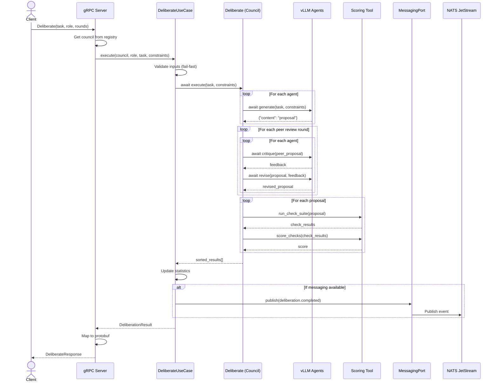

---

### 2. CreateCouncil Use Case

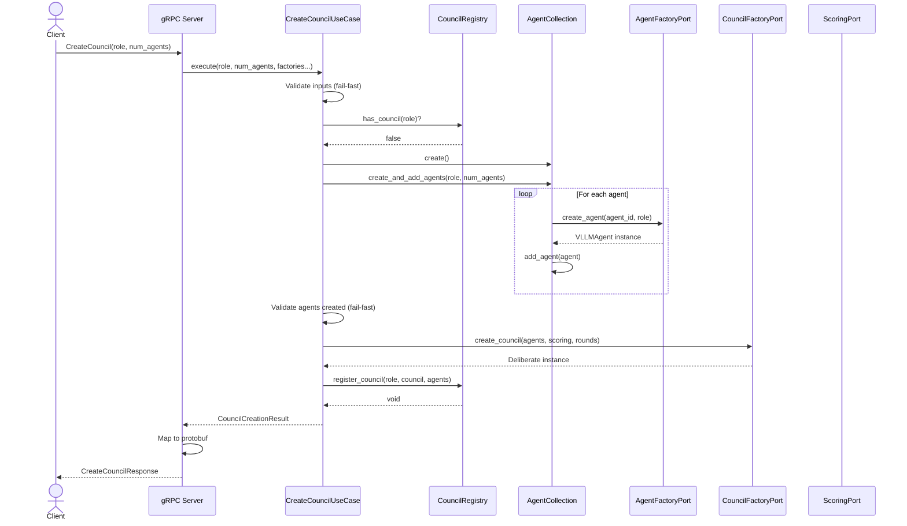

---

### 3. ListCouncils Use Case

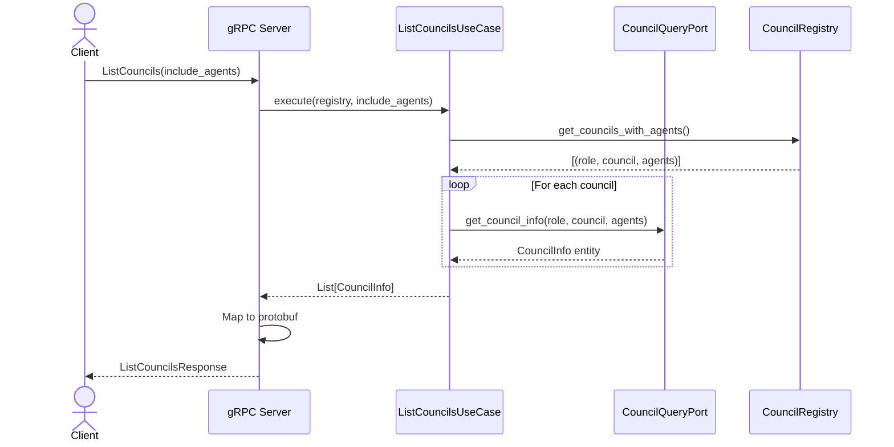

---

### 4. DeleteCouncil Use Case

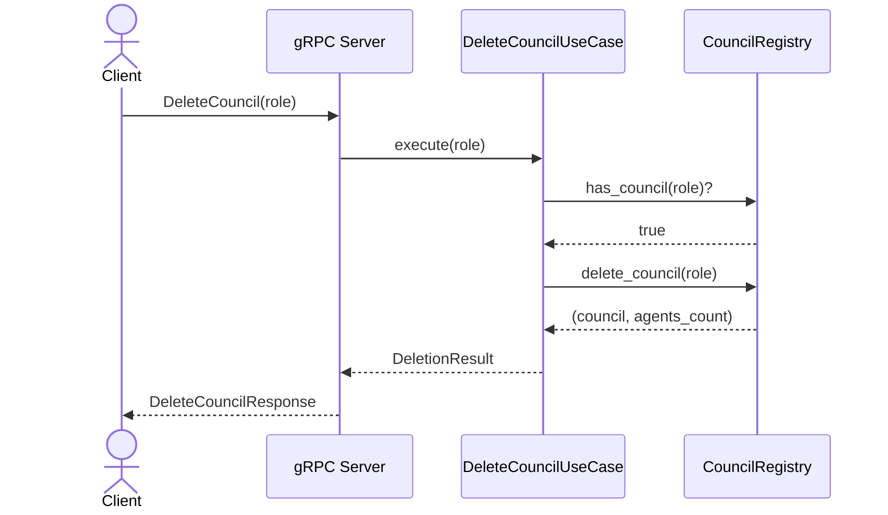

---

### 5. Planning Consumer - Event Flow (🔴 BLOQUEADOR)

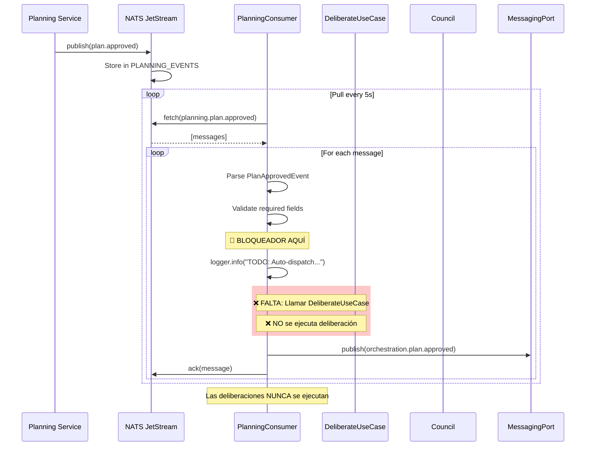

---

### 6. Planning Consumer - FLUJO CORRECTO (Como DEBERÍA Ser)

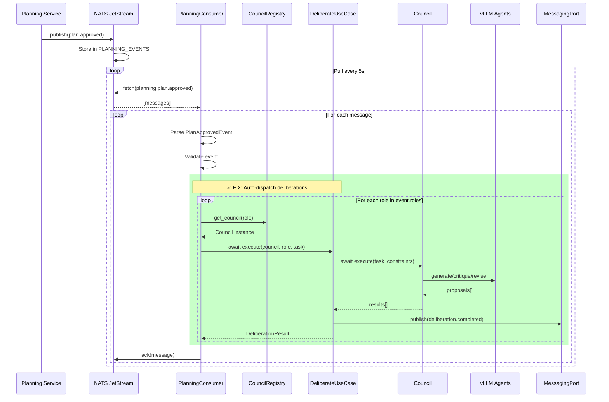

---

### 7. Agent Response Consumer Flow

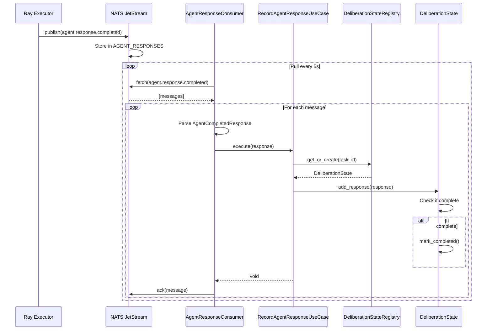

---

### 8. Deliberation Collector Flow

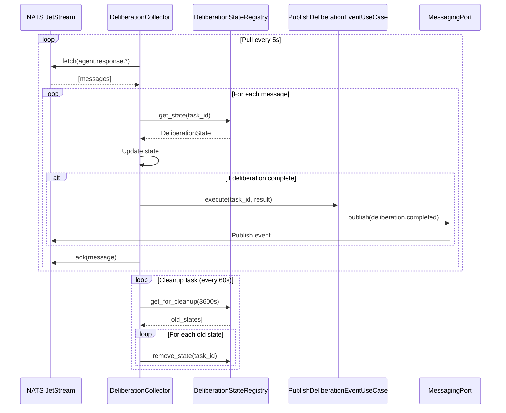

---

### 9. GetStatus Use Case

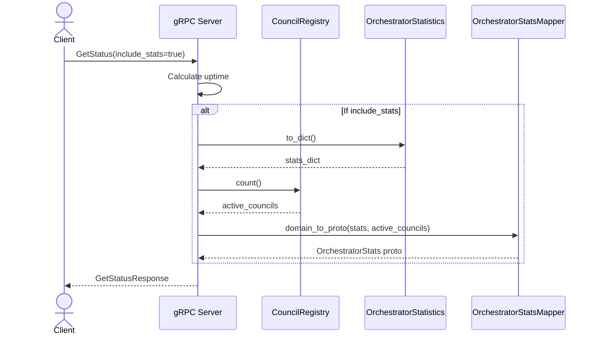

---

### 10. Orchestrate Use Case (Complete Workflow)

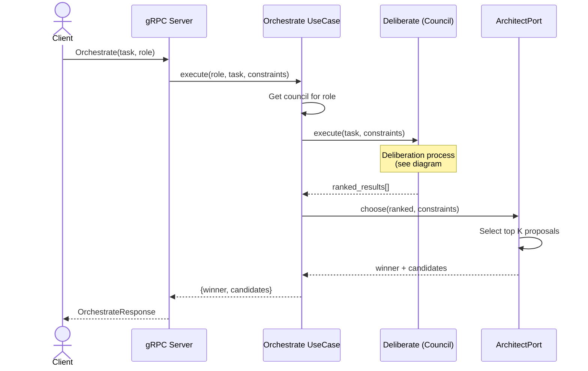

---

### 11. Context Consumer Flow (Placeholder)

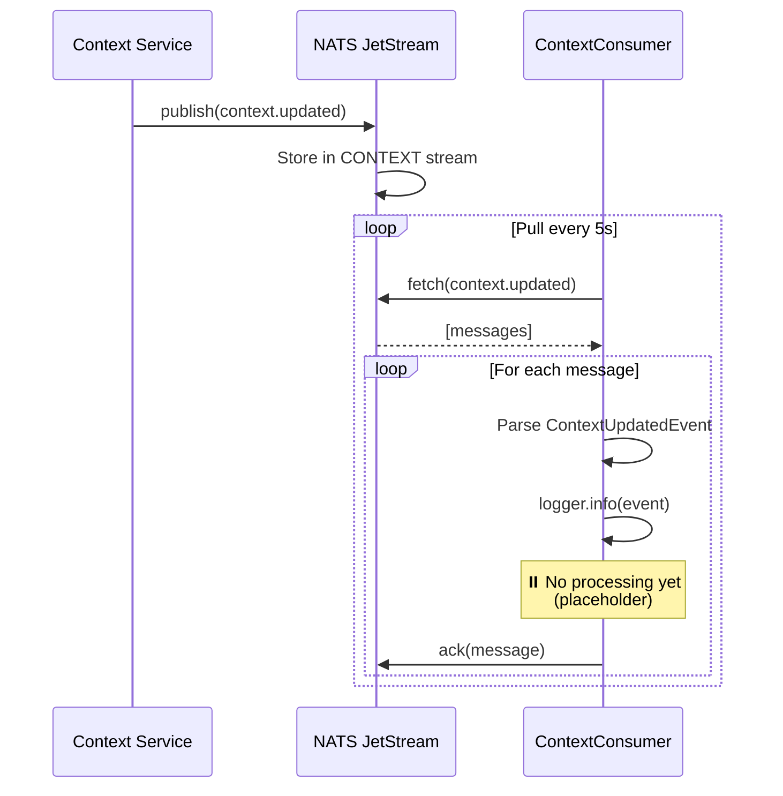

---

### 12. GetDeliberationResult Use Case

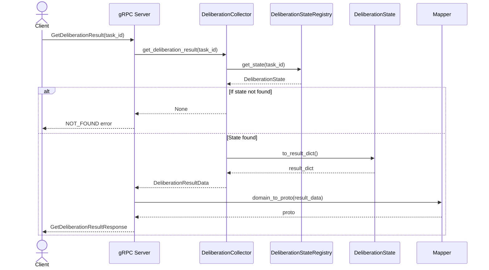

---

### 13. Cleanup Deliberations Use Case

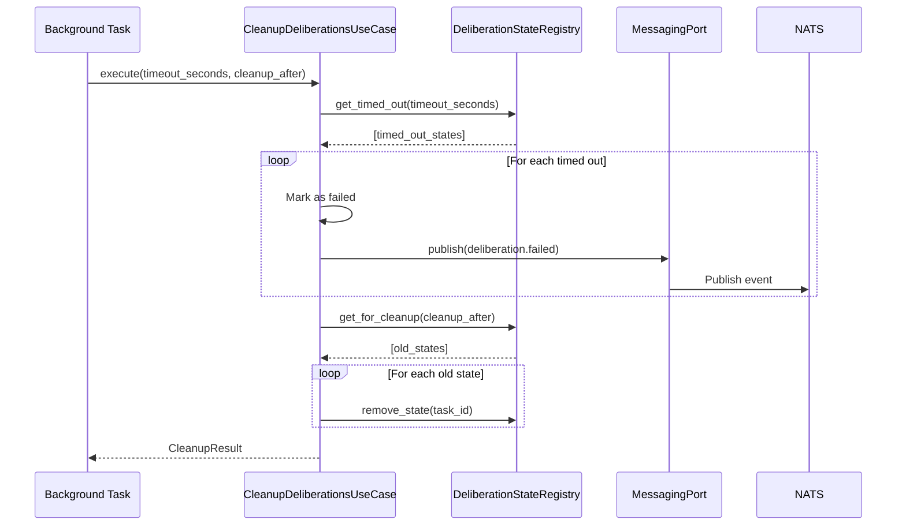

---

### 14. Complete End-to-End Flow (WITH FIX)

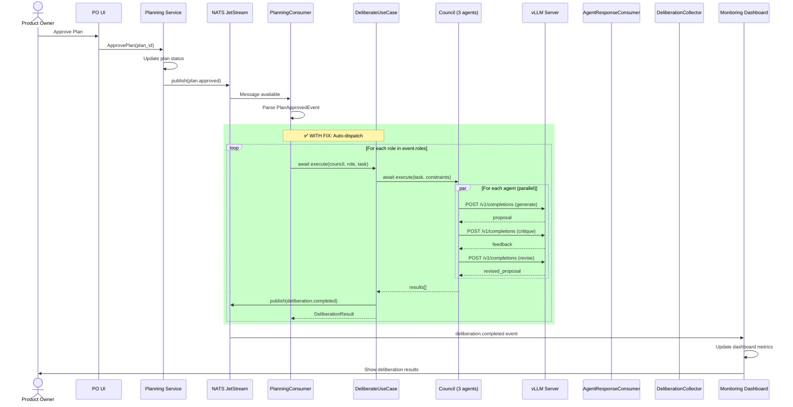

---

### 15. Registro de Agentes (RegisterAgent)

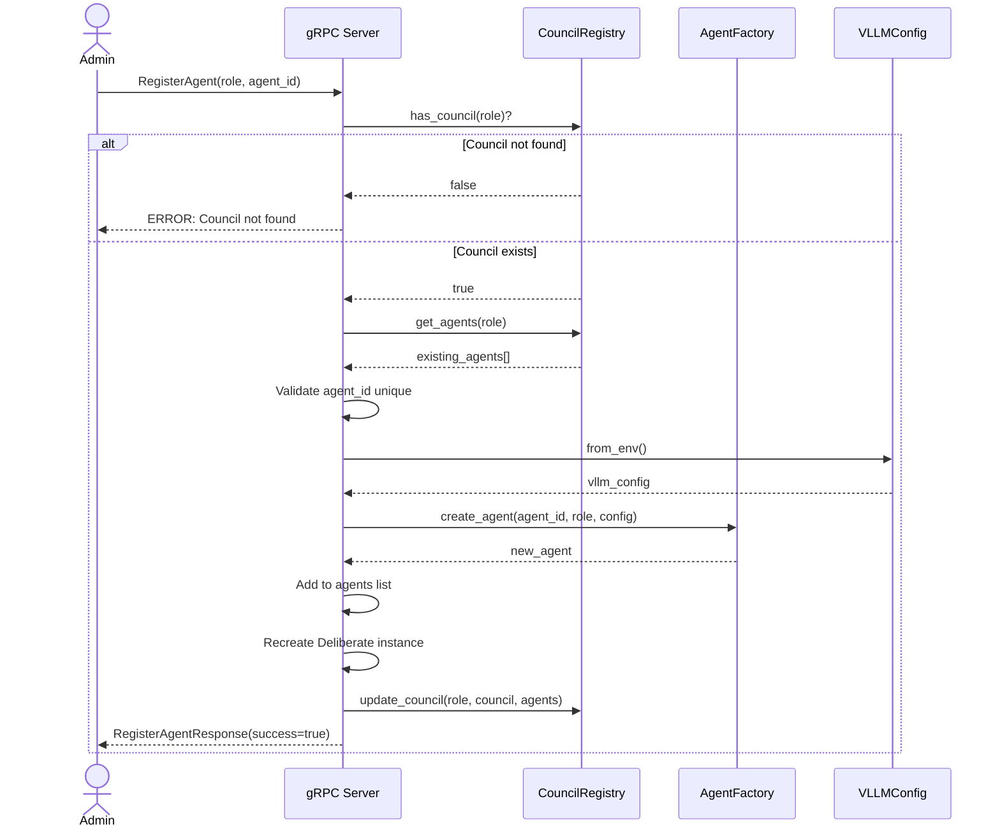

---

## 🔍 Flujo Actual vs Esperado - Comparación

### ❌ **ACTUAL (No Funciona)**

```
PO → Approve Plan
  ↓
Planning Service → NATS (plan.approved)
  ↓
PlanningConsumer → Receives event
  ↓
❌ Logs "TODO: Auto-dispatch..."
  ↓
❌ ACKs message
  ↓
❌ NOTHING HAPPENS
```

### ✅ **ESPERADO (Con Fix)**

```
PO → Approve Plan
  ↓
Planning Service → NATS (plan.approved)
  ↓
PlanningConsumer → Receives event
  ↓
✅ For each role:
    ↓
    DeliberateUseCase.execute()
      ↓
      Council.execute() (3 agents)
        ↓
        Agents → vLLM (generate/critique/revise)
        ↓
        Scoring → Evaluate proposals
      ↓
      Results ranked
    ↓
    Publish deliberation.completed
  ↓
Monitor Dashboard → Shows results
  ↓
PO → Sees deliberation outcomes
```

---

## 🎯 Próximos Pasos Inmediatos

### Fix #1: Implementar Auto-Dispatch (CRÍTICO)

**Archivo**: `services/orchestrator/infrastructure/handlers/planning_consumer.py`

**Cambios Necesarios**:

1. **Constructor** - Inyectar use case:
```python
def __init__(
    self,
    council_query: CouncilQueryPort,
    messaging: MessagingPort,
    council_registry: CouncilRegistry,  # ← ADD
    stats: OrchestratorStatistics,      # ← ADD
):
    self.council_query = council_query
    self.messaging = messaging
    self.council_registry = council_registry  # ← ADD
    self.stats = stats  # ← ADD
```

2. **Handler** - Implementar dispatch (líneas 213-224):
```python
# AUTO-DISPATCH: Submit deliberations for each role
for role in event.roles:
    try:
        if not self.council_query.has_council(role):
            logger.warning(f"⚠️  Council for {role} not found, skipping")
            continue
        
        council = self.council_registry.get_council(role)
        
        # Create use case
        deliberate_uc = DeliberateUseCase(
            stats=self.stats,
            messaging=self.messaging
        )
        
        # Build constraints
        constraints = self._build_default_constraints()
        
        # Execute deliberation
        result = await deliberate_uc.execute(
            council=council,
            role=role,
            task_description=f"Implement story {event.story_id}",
            constraints=constraints,
            story_id=event.story_id,
            task_id=event.plan_id
        )
        
        logger.info(
            f"✅ Deliberation completed for {role}: "
            f"{len(result.results)} proposals in {result.duration_ms}ms"
        )
        
    except Exception as e:
        logger.error(f"❌ Failed to execute deliberation for {role}: {e}")
```

3. **Helper Method** - Build constraints:
```python
def _build_default_constraints(self):
    """Build default task constraints."""
    from swe_ai_fleet.orchestrator.domain.tasks.task_constraints import TaskConstraints
    
    return TaskConstraints(
        rubric={"quality": "high", "tests": "required"},
        architect_rubric={"k": 3}
    )
```

---

## 📊 Métricas del Código

**Total Líneas**: ~5,000+ líneas Python  
**Domain**: ~2,700 líneas (54%)  
**Application**: ~800 líneas (16%)  
**Infrastructure**: ~1,500 líneas (30%)  

**Complejidad**:
- Domain: Baja (entities simples, lógica clara)
- Application: Baja (use cases específicos)
- Infrastructure: Media (manejo de NATS/gRPC)

**Mantenibilidad**: ⭐⭐⭐⭐⭐ (5/5) - Excelente gracias a Hexagonal Architecture

---

## ✅ Conclusión Final

### Calidad del Código: **EXCELENTE** ⭐⭐⭐⭐⭐

- Hexagonal Architecture perfectamente implementada
- DDD principles aplicados consistentemente
- Tests comprehensivos (114 tests)
- Strong typing en todo el domain
- Separation of Concerns impecable

### Funcionalidad: **BLOQUEADA** 🔴

**Root Cause**: PlanningConsumer no implementa auto-dispatch

**Impact**: 
- ✅ Sistema corre sin errores
- ✅ Consumers activos
- ✅ Councils inicializados
- ❌ **Deliberaciones NUNCA se ejecutan**

### Fix Simple, Impacto Enorme:

**3 líneas de código** en `planning_consumer.py` desbloquearán todo el sistema:

```python
council = self.council_registry.get_council(role)
deliberate_uc = DeliberateUseCase(self.stats, self.messaging)
result = await deliberate_uc.execute(council, role, task, constraints, story_id, task_id)
```

**Con este fix, el sistema completo funcionará end-to-end!** 🎊

