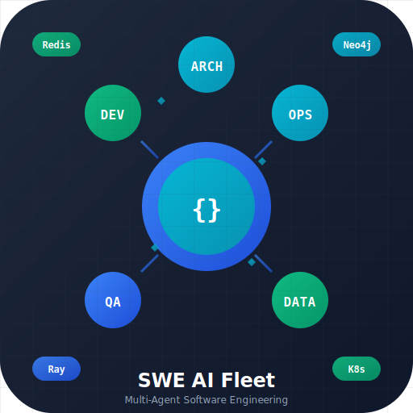

# SWE AI Fleet

  
  <h3>Multi-Agent Software Engineering at the Edge</h3>

SWE AI Fleet is an open-source, multi-agent system for software development and systems architecture.
It orchestrates role-based LLM agents (developers, devops, data, QA, architect) with Ray/KubeRay,
provides safe tool wrappers (kubectl, helm, psql, etc.), and maintains a long-term knowledge graph
(Neo4j) plus a short-term memory (Redis).

## Quick Start (local dev)

- Requirements: Python 3.13+, Docker, kind, kubectl, helm.
- Create a virtual env, install dev deps, and run the local stack via scripts in `scripts/`.
- See `deploy/helm` for Redis, Neo4j, and KubeRay chart.

## Repository Layout

See the `swe_ai_fleet/` tree for folders and roles.
