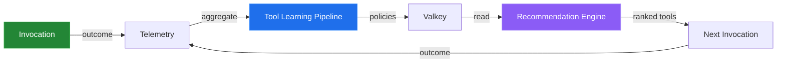

<div align="center">

# SWE AI Fleet

**Memory and governed execution for operational AI systems.**

The kernel restores the exact memory. The runtime governs the action.<br/>
Specialized agents react to real events, not prompts.

[](https://github.com/underpass-ai/underpass-runtime)
[](LICENSE)

</div>

---

### A real incident recovery, running in our cluster


> *This is not a concept diagram. This is E2E test 13 — a real ceremony that
> runs on every `helm test`. 5 agents, 14 tool invocations, 10 NATS events,
> 6 artifacts. The tools are real. The events are real. The code compiles.*

---

## What this is

Underpass is **not** an incident bot. It is **not** an AIOps assistant.

It is a platform with two product planes:

| Plane | Repository | What it does |
|-------|-----------|--------------|
| **Memory** | [Rehydration Kernel](https://github.com/underpass-ai/rehydration-kernel) | Restores exactly the context an agent needs — runbooks, past incidents, decisions, code history — from a knowledge graph with explanatory relationships |
| **Execution** | [Underpass Runtime](https://github.com/underpass-ai/underpass-runtime) | Governs tool execution in isolated workspaces — 99 tools, policy enforcement, telemetry, adaptive recommendations |

Together they support any operational workflow that needs **exact memory plus governed action**:

- Incident recovery
- Deploy verification
- Config remediation
- Runbook execution
- Queue or database recovery
- Infrastructure stabilization

The incident demo is the first proof point, not the boundary of the product.

## How it works

```
Observability alert fires
    |
    v
Diagnostic agent classifies the incident
    |
    v
Rehydration agent restores surgical context from the knowledge graph
    |
    v
Repair agent executes governed tools in an isolated workspace
    |
    v
Verification agent runs tests and validation
    |
    v
Evidence recorded, policies improve, next incident handled better
```

Each agent is a specialist. Each agent only activates when its event fires.
No polling. No central orchestrator. No sprawling prompts.

<details>
<summary><b>Adaptive tool selection</b></summary>

<br/>

The runtime scores tools using a 4-tier algorithm stack that learns from
execution outcomes:

| Data maturity | Algorithm | Behavior |
|--------------|-----------|----------|
| Cold start | Heuristic | Risk, cost, task-hint scoring |
| 50+ samples | Thompson Sampling | Beta-distribution explore/exploit |
| 100+ samples | **Neural Thompson Sampling** | MLP with weight perturbation |

Every recommendation is auditable: `algorithm_id`, `decision_source`, and
`recommendation_id` in every response.


```mermaid
graph LR
    A[Invocation] -->|outcome| B[Telemetry]
    B -->|aggregate| C[Tool Learning Pipeline]
    C -->|policies| D[Valkey]
    D -->|read| E[Recommendation Engine]
    E -->|ranked tools| F[Next Invocation]
    F -->|outcome| B

    style A fill:#238636,stroke:#3fb950,color:#fff
    style C fill:#1f6feb,stroke:#388bfd,color:#fff
    style E fill:#8b5cf6,stroke:#a78bfa,color:#fff
```

</details>

<details>
<summary><b>Surgical context, not token dumps</b></summary>

<br/>

The [Rehydration Kernel](https://github.com/underpass-ai/rehydration-kernel)
traverses a knowledge graph and delivers **only what the agent needs** for
its specific role. Typed explanatory relationships preserve *why* each piece
of context exists.

```
432 LLM-as-judge evaluations:

  Explanatory context (kernel):  72% task recovery
  Structural context (edges):     3% task recovery
  Mixed (both):                  92% task recovery
```

A 7B model with 394 tokens of surgical context outperforms a frontier model
drowning in 6,000 tokens of noise.

</details>

## Status

The core infrastructure is deployed and validated:

- **15 runtime E2E tests** + **4 kernel E2E tests** via `helm test`
- Full mTLS across all transports
- Closed learning loop: telemetry → Thompson Sampling → NeuralTS
- K8s workspace backend with runner pods (6 profiles: base → toolchains → fat)
- Incident demo running end-to-end: alert → rehydrate → patch → test → validate

Agent coordination protocols and incident packs are being developed
internally. Components ship to the public repositories as they mature.

<details>
<summary>What's shipping and what's next</summary>

<br/>

**Shipped** (public, tested, deployed):
- Governed tool execution with 99 tools across 23 families
- 4-tier adaptive recommendation engine (Heuristic → Thompson → NeuralTS)
- Auditable evidence plane (every recommendation traceable)
- Context rehydration with explanatory graph relationships
- Full mTLS, Helm charts, CI/CD automation

**In development** (internal):
- Incident packs: event-driven scenarios with preflight + oracle verification
- Agent coordination protocols (diagnostic → repair → verify → comms)
- Multi-workflow support beyond incidents
- Context-dependent model routing (local vs frontier)

</details>

---

## What to remember

- Incident response is the first proof point, not the boundary of the product.
- Kernel and runtime are reusable operational planes, not a one-off incident bot.
- The demo is specific; the architecture is broader.

## Legal

Copyright © 2026 Tirso García Ibáñez.

This repository is part of the Underpass AI project.
Licensed under the Apache License, Version 2.0, unless stated otherwise.

Original author: [Tirso García Ibáñez](https://github.com/tgarciai) · [LinkedIn](https://www.linkedin.com/in/tirsogarcia/) · [Underpass AI](https://github.com/underpass-ai)
