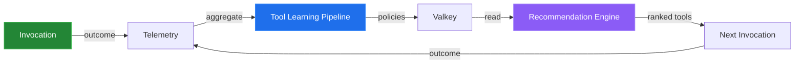

<div align="center">

# SWE AI Fleet

**A scrum team of AI agents that ship code.**

One plans. One codes. One tests. One reviews. One deploys.<br/>
They coordinate through events, not prompts.

[](https://github.com/underpass-ai/underpass-runtime)
[](LICENSE)

</div>

---

### A real ceremony, running in our cluster



> *This is not a concept diagram. This is E2E test 13 — a real ceremony that
> runs on every `helm test`. 5 agents, 14 tool invocations, 10 NATS events,
> 6 artifacts. The tools are real. The events are real. The code compiles.*

---

## The problem

LLM agents today are either:
- **Chatbots with tools** — no isolation, no policy, no learning
- **Workflow engines** — rigid DAGs that can't adapt to what they find

Neither works for real software engineering, where tasks are ambiguous,
tools fail, and the right approach depends on context that changes
between commits.

## Our approach

<details>
<summary><b>Event-driven specialists, not a monolithic agent</b></summary>

<br/>

Each agent is a specialist with a bounded role:

| Agent | Role | Tools it uses |
|-------|------|---------------|
| **Architect** | Analyze codebase, produce design | `fs.read_file`, `repo.detect`, `repo.symbols` |
| **Developer** | Write implementation code | `fs.write_file`, `go.build`, `git.commit` |
| **Tester** | Validate correctness | `go.test`, `repo.coverage`, `security.scan_dependencies` |
| **Reviewer** | Check quality + standards | `fs.read_file`, `quality.gate`, `git.diff` |
| **QA** | Final acceptance | `repo.test`, `fs.read_file`, `artifact.upload` |

When a task event fires, the right agent activates. No polling. No orchestrator.

</details>

<details>
<summary><b>Tools that learn, not tools that break</b></summary>

<br/>

The runtime recommends tools through a 4-tier algorithm stack that adapts
as data accumulates:


```mermaid
graph LR
    A[Invocation] -->|outcome| B[Telemetry]
    B -->|aggregate| C[Tool Learning Pipeline]
    C -->|policies| D[Valkey]
    D -->|read| E[Recommendation Engine]
    E -->|ranked tools| F[Next Invocation]
    F -->|outcome| B

    style A fill:#238636,stroke:#3fb950,color:#fff
    style C fill:#1f6feb,stroke:#388bfd,color:#fff
    style E fill:#8b5cf6,stroke:#a78bfa,color:#fff
```

| Data maturity | Algorithm | Behavior |
|--------------|-----------|----------|
| Cold start | Heuristic | Risk, cost, task-hint scoring |
| 50+ samples | Thompson Sampling | Beta-distribution explore/exploit |
| 100+ samples | **Neural Thompson Sampling** | MLP with weight perturbation |

Every recommendation is auditable: `algorithm_id`, `decision_source`, and
`recommendation_id` in every response.

</details>

<details>
<summary><b>Surgical context, not token dumps</b></summary>

<br/>

The [Rehydration Kernel](https://github.com/underpass-ai/rehydration-kernel)
traverses a knowledge graph and delivers **only what the agent needs** for
its specific role. Typed explanatory relationships preserve *why* each piece
of context exists.

```
432 LLM-as-judge evaluations:

  Explanatory context (kernel):  72% task recovery
  Structural context (edges):     3% task recovery
  Mixed (both):                  92% task recovery
```

A 7B model with 394 tokens of surgical context outperforms a frontier model
drowning in 6,000 tokens of noise.

</details>

---

## Built on

| Component | Language | What it provides |
|-----------|----------|-----------------|
| [**Underpass Runtime**](https://github.com/underpass-ai/underpass-runtime) | Go | 99 governed tools, policy enforcement, telemetry, NeuralTS, mTLS, 15 E2E tests |
| [**Rehydration Kernel**](https://github.com/underpass-ai/rehydration-kernel) | Rust | Knowledge graph traversal, explanatory context, token-bounded delivery |

Both run on Kubernetes with full mTLS, validated through E2E tests on live
clusters.

## Status

Active development. The infrastructure layer (runtime + kernel) is
production-validated. Agent coordination protocols are maturing internally.

<details>
<summary>What's shipping and what's next</summary>

<br/>

**Shipped** (public, tested, deployed):
- Governed tool execution with 99 tools across 23 families
- 4-tier adaptive recommendation engine (Heuristic → Thompson → NeuralTS)
- Auditable evidence plane (every recommendation traceable)
- Full mTLS across 5 transports
- 15 E2E tests via `helm test`
- Offline learning pipeline (DuckDB + Thompson Sampling + Neural trainer)
- Context rehydration with explanatory graph relationships

**In development** (internal):
- Ceremony execution protocols (planning, review, retrospective)
- Multi-agent task decomposition with dependency graphs
- Agent-to-agent event coordination
- Story lifecycle management
- Context-dependent model routing (local vs frontier)

</details>

---

## Legal

Copyright © 2026 Tirso García Ibáñez.

This repository is part of the Underpass AI project.
Licensed under the Apache License, Version 2.0, unless stated otherwise.

Original author: [Tirso García Ibáñez](https://github.com/tgarciai) · [LinkedIn](https://www.linkedin.com/in/tirsogarcia/) · [Underpass AI](https://github.com/underpass-ai)
