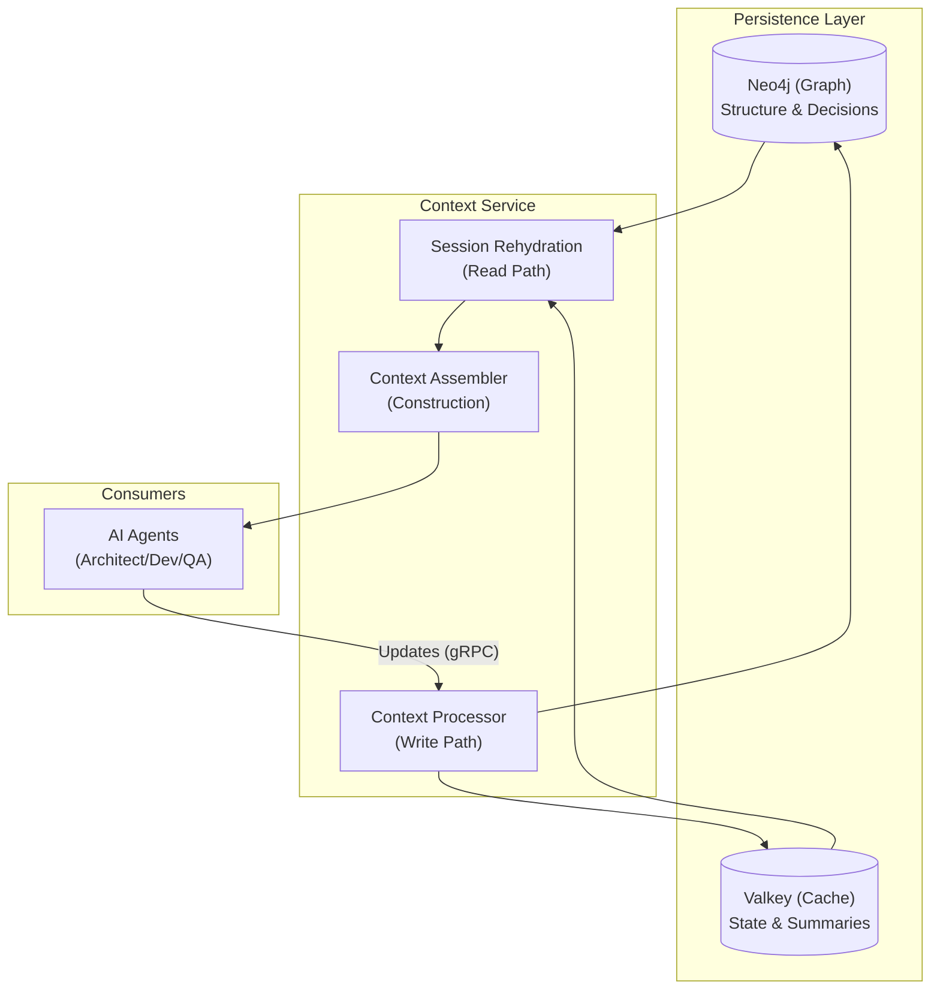

# Context Bounded Context

**Package:** `core.context`

The **Context Bounded Context** is the "brain" of the SWE AI Fleet. Unlike traditional coding assistants that rely primarily on code snippets (AST, file contents), this module builds a **Decision-Centric Context** graph. It captures *why* decisions were made, not just *what* code was written, enabling agents to reason about architecture, trade-offs, and project history.

## 🧠 Core Concept: Decision-Centric AI

Traditional LLM context often floods the prompt with 100k+ tokens of raw code, leading to "lost in the middle" problems and high costs. The Context Service takes a different approach:

1. **Decision Graph (Neo4j):** Stores the structural relationships between Projects, Epics, Stories, Tasks, and **Decisions**. It answers "Why does this exist?" and "What depends on this?".
2. **Planning State (Valkey/Redis):** Stores the mutable state of plans, milestones, and summaries.
3. **Context Assembly:** Dynamically assembles a surgical context (~4-5k tokens) relevant to the specific **Role** (e.g., Architect, Developer) and **Phase** of work.

### Architecture Overview

## 📂 Domain Model

The domain logic resides in `core/context/domain` and enforces strict boundaries.

### Key Entities (`core/context/domain/`)

* **`Decision`**: The core atom of the system. Represents a technical or architectural choice (e.g., "Use OAuth2", "Switch to Neo4j").
* **`Role`** (`Enum`): Defines who is asking for context (`ARCHITECT`, `DEVELOPER`, `QA`, `PO`). Context is tailored to the role.
* **`ContextSections`**: A Value Object that organizes the prompt into logical blocks (Case ID, Plan Rationale, Current Work, Decisions, History).
* **`RoleContextFields`**: A DTO-like domain object that holds the raw data required to build the context for a specific role.

### Scopes & Security

* **`PromptScopePolicy`** (`core/context/domain/scopes/`): Enforces RBAC at the prompt level. It ensures that a "Developer" only sees context relevant to implementation, while an "Architect" sees system-wide implications.
  * **Redaction:** Automatically scrubs sensitive patterns (API keys, passwords) before context leaves the boundary.
  * **Scope Checks:** Validates that the requested context matches the allowed scopes for the current Phase/Role configuration.

## ⚙️ Core Components & Use Cases

### 1. Context Assembly (Read Path)

**Entry Point:** `core/context/context_assembler.py` -> `build_prompt_blocks`

1. **Rehydration:** `SessionRehydrationUseCase` fetches structural data from Neo4j and state from Valkey.
2. **Filtering:** `_narrow_pack_to_subtask` focuses the context on the active subtask if specified.
3. **Policy Check:** `PromptScopePolicy` verifies permissions.
4. **Assembly:** `ContextSections` builds the human-readable prompt strings.
5. **Redaction:** Sensitive data is masked.

### 2. Context Rehydration (Deep Dive)

**Service:** `SessionRehydrationApplicationService` (`core/context/application/session_rehydration_service.py`)

This is the core engine that reconstructs the "mental state" for an agent. It follows a precise 8-step process:

1. **Fetch Spec:** Retrieves the `CaseSpec` (story requirements) from the Planning Store (Valkey).
2. **Parallel Fetch:** Concurrently loads:
   * **Graph:** Decisions, dependencies, and impacts from Neo4j.
   * **Plan:** Current draft plan and event timeline from Valkey.
3. **Indexing:** `DataIndexer` creates fast lookup maps for decisions and tasks.
4. **Header Construction:** Builds `StoryHeader` and `PlanHeader` domain entities.
5. **Role-Specific Packing:** For each requested Role (e.g., `DEVELOPER`):
   * **Task Filtering:** Selects only tasks assigned to that role.
   * **Decision Selection:** Uses `DecisionSelector` to find decisions that impact those specific tasks.
   * **Impact Calculation:** Uses `ImpactCalculator` to link decisions to downstream tasks.
   * **Milestone Processing:** Converts timeline events into `Milestone` value objects.
   * **Token Budgeting:** `TokenBudgetCalculator` estimates prompt size.
6. **Statistics:** Computes rehydration stats (decision counts, edge counts).
7. **Bundle Assembly:** Wraps everything into an immutable `RehydrationBundle`.
8. **Persistence (Optional):** Saves the bundle back to Valkey if this is a handoff between agents.

### 3. Context Updates (Write Path)

**Entry Point:** `core/context/application/usecases/process_context_change.py`

Implements a **CQRS Command Handler** pattern. It accepts `ContextChange` messages (protobuf) and routes them to specific use cases based on `entity_type`:

* **`DECISION`** -> `ProjectDecisionUseCase`: Persists new decisions and their impacts in Neo4j.
* **`SUBTASK`** -> `ProjectTaskUseCase`: Updates task status/details.
* **`MILESTONE`** -> `RecordMilestoneUseCase`: Logs significant events (timeline).
* **`CASE`/`PLAN`** -> Story/Plan updates.

## 🔐 RBAC Implementation (Security Layer)

Role-Based Access Control is implemented across multiple layers (L1-L3) to ensure data security and minimal privilege.

### 🛡️ L3: Application Service Layer

**Service:** `RbacContextApplicationService` (`core/context/application/rbac_context_service.py`)

This service orchestrates the security enforcement flow:

1. **Authorization Check:** Verifies if the Role can access the Story at all.
2. **Row-Level Filtering:** Removes entire entities (e.g., Tasks/Decisions) that the Role is not permitted to see.
3. **Column-Level Filtering:** Strips sensitive fields (e.g., internal IDs, cost data) from the returned objects.
4. **Audit Logging:** Logs every access attempt via `DataAccessAuditPort`.

### 🛡️ L2: Domain Logic (Rules)

**Service:** `AuthorizationChecker`

Uses `RoleVisibilityPolicy` to evaluate rules like:

* "Can DEVELOPER see Story X?" -> Only if assigned to the Epic or Story.
* "Can QA see Story Y?" -> Only if status is `TESTING` or `QA_REVIEW`.

### 🛡️ L1: Infrastructure (Query Level)

**Adapter:** `Neo4jStoryAuthorizationAdapter` (`core/context/adapters/neo4j_story_authorization_adapter.py`)

Implements "Defense in Depth" by executing authorization checks directly in the graph database:

* Checks assignment relationships (`(User)-[:ASSIGNED_TO]->(Story)`).
* Traverses graph to verify Epic ownership.

### 🔍 Scope & Redaction (L4 - Prompt Level)

**Policy:** `PromptScopePolicy` (`config/prompt_scopes.yaml`)

Defines what *types* of information are included in the LLM prompt based on Role + Phase:

* **Architect/DESIGN:** Sees global decisions, dependencies, and full history.
* **Developer/BUILD:** Sees only relevant decisions, assigned subtasks, and limited history.

This ensures that even if data is fetched, it is not exposed to the LLM unless explicitly allowed for that phase.

## 🔌 Ports & Adapters (Hexagonal Architecture)

The module interacts with the outside world exclusively through Ports defined in `core/context/ports/`.

* **`DecisionGraphReadPort` / `GraphCommandPort`**: Interface for Neo4j operations.
* **`PlanningReadPort`**: Interface for reading planning data (Redis).
* **`StoryAuthorizationPort`**: Interface for RBAC checks.

## 🛠️ Deployment & Infrastructure

The Context Service is deployed as a gRPC microservice in Kubernetes.

* **Service Image:** `registry.underpassai.com/swe-fleet/context`
* **Dependencies:**
  * **Neo4j 5.14+:** Stores the knowledge graph.
  * **Valkey 8.0+ (Redis):** Stores ephemeral state and session caches.
* **Configuration:**
  * `config/prompt_scopes.yaml`: Defines the scope matrix per Role/Phase.

### Kubernetes Resources

* `deploy/k8s/30-microservices/context.yaml`: Service definition.
* `deploy/k8s/10-infrastructure/neo4j.yaml`: Graph database statefulset.
* `deploy/k8s/10-infrastructure/valkey.yaml`: Cache statefulset.

## 🚀 Development

### Key Files

* `core/context/session_rehydration.py`: Main logic for fetching context data.
* `core/context/context_assembler.py`: Main logic for formatting prompts.
* `core/context/domain/context_sections.py`: Controls the layout of the prompt.

### Testing

Tests should focus on:

1. **Rehydration Logic:** Ensure correct graph traversal and data merging.
2. **Prompt Assembly:** Verify that prompts are formatted correctly for the LLM.
3. **Redaction:** Ensure secrets are never leaked in the generated context.
