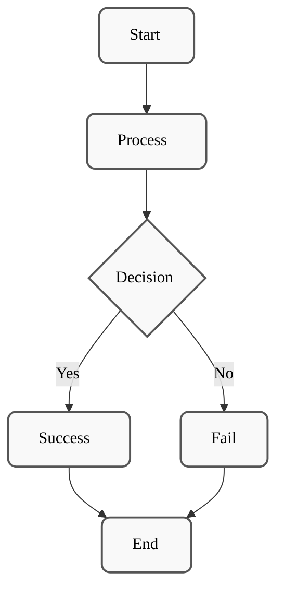
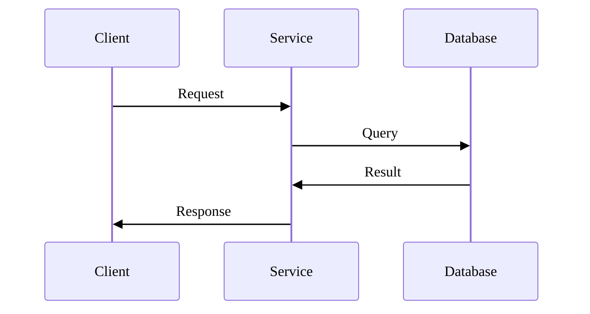
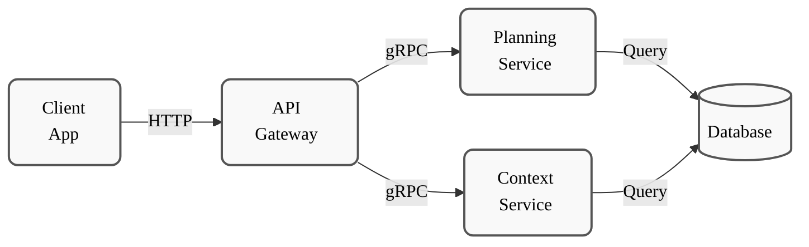

# Mermaid Diagram Style Guide

## Standard Styling

All Mermaid diagrams in SWE AI Fleet MUST follow this unified grayscale style for consistency, readability, and maintainability.

### Color Palette (Grayscale)

```
Stroke (borders):     #555        (medium-dark gray)
Fill (background):    #f9f9f9     (light gray)
Text (foreground):    #000        (black)
Stroke width:         2px
Border radius:        8px (rx:8, ry:8)
```

### Apply Styling to All Diagrams

Add this configuration block at the start of every Mermaid diagram:

```mermaid
%%{init: {
  'theme': 'default',
  'themeVariables': {
    'fontSize': '14px',
    'primaryColor': '#f9f9f9',
    'primaryBorderColor': '#555',
    'lineColor': '#555',
    'secondaryColor': '#f9f9f9',
    'tertiaryColor': '#f9f9f9',
    'textColor': '#000',
    'fontFamily': 'sans-serif'
  }
}}%%

graph TD
    ...
```



### Node and Edge Styling

For individual nodes/edges that need explicit styling:

```mermaid
style NodeName fill:#f9f9f9,stroke:#555,stroke-width:2px,color:#000,rx:8,ry:8
```

---

## Approved Diagram Types

| Type | Use Case | Example |
|------|----------|---------|
| **Flowchart** | Process flows, decision trees | Component initialization, state transitions |
| **Sequence Diagram** | Component interactions, message flows | Service calls, event handling |
| **Graph** | System architecture, relationships | Microservice topology, data flow |
| **State Diagram** | State machines, lifecycle | FSM for Planning, Workflow services |
| **Class Diagram** | Data structures, relationships | Domain models, API contracts |

### NOT Approved (Remove These)

❌ **Algorithm flowcharts** - Use sequence diagrams instead (maintainability)
❌ **Colored boxes** - Use grayscale only
❌ **High contrast** - Stick to approved palette
❌ **Custom themes** - Use standard config only

---

## Examples

### Example 1: Simple Flowchart (Approved)



### Example 2: Sequence Diagram (Approved)



### Example 3: Architecture Graph (Approved)



---

## Validation Checklist

Before committing any Mermaid diagram, verify:

- [ ] Uses standard `%%{init: {...}}%%` block with approved colors
- [ ] All nodes explicitly styled with grayscale palette
- [ ] Text is black (#000) and readable
- [ ] Border radius is 8px (rx:8, ry:8)
- [ ] Stroke width is 2px
- [ ] No custom colors or themes
- [ ] No algorithm flowcharts (use sequence diagrams instead)
- [ ] Diagram is placed in a markdown code fence
- [ ] Renders correctly in GitHub/GitLab markdown preview

---

## Tools

- **Mermaid Live Editor**: https://mermaid.live/
- **Mermaid Documentation**: https://mermaid.js.org/
- **Theme Configuration**: https://mermaid.js.org/syntax/theming.html

---

**Last Updated**: 2025-11-16  
**Version**: 1.0.0  
**Status**: APPROVED STANDARD

