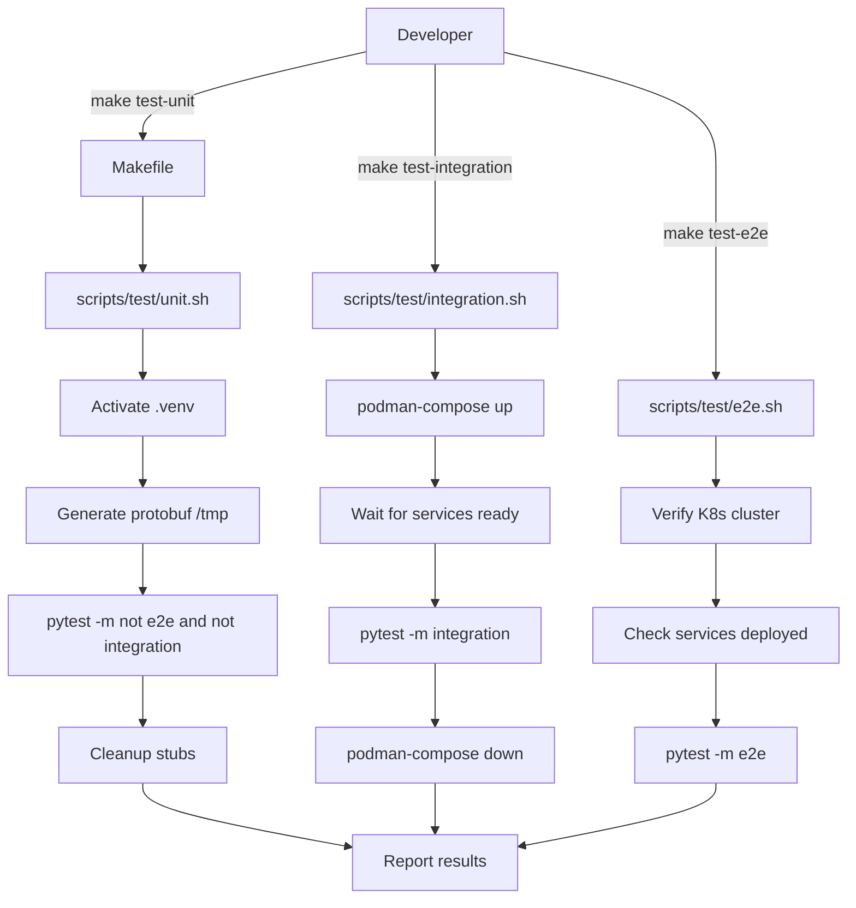

# 🧪 Testing Architecture - SWE AI Fleet

**Documento Normativo y Arquitectónico**

Este documento define la **estrategia de testing completa** para SWE AI Fleet, alineada con los principios de arquitectura hexagonal, Domain-Driven Design, y clean architecture que rigen el proyecto.

---

## 📐 Principios Arquitectónicos de Testing

### 1. Testing Pyramid

```
                    ╔═══════════════════╗
                    ║   E2E Tests       ║  ~10% (12 tests)
                    ║   Full System     ║  Cluster K8s
                    ╚═══════════════════╝  ~3-5 min
                  ╔═════════════════════════╗
                  ║  Integration Tests      ║  ~20% (45 tests)
                  ║  Component Boundaries   ║  Containers
                  ╚═════════════════════════╝  ~30-60s
            ╔═════════════════════════════════════╗
            ║         Unit Tests                  ║  ~70% (596 tests)
            ║  Domain Logic + Adapters            ║  Mocks
            ╚═════════════════════════════════════╝  ~3s
```

**Ratio Ideal**: 70% unit / 20% integration / 10% E2E  
**Coverage Mínimo**: 90% en nuevo código (SonarQube quality gate)

### 2. Separation of Concerns en Tests

```
tests/
├── unit/                    ← Domain + Application + Adapters (isolated)
│   ├── orchestrator/        ← Pure business logic
│   ├── context/            ← Domain entities & use cases
│   ├── agents/             ← Agent implementations
│   └── tools/              ← Tool implementations
│
├── integration/             ← Port implementations (real infra)
│   ├── services/orchestrator/  ← gRPC + NATS + Ray
│   ├── services/context/       ← gRPC + Neo4j + Valkey
│   └── archived/              ← Legacy tests (reference)
│
└── e2e/                     ← Full system (deployed K8s)
    ├── test_system_e2e.py      ← Complete workflows
    ├── test_orchestrator_cluster.py  ← Deliberation E2E
    └── test_ray_vllm_e2e.py    ← GPU execution E2E
```

**Principio**: Tests siguen la estructura hexagonal del código.

### 3. Test Isolation & Independence

#### Unit Tests - ISOLATED
- ✅ NO external dependencies (DB, API, containers)
- ✅ Mocks para ports (MessagingPort, GraphQueryPort, etc.)
- ✅ Fast (<5s total)
- ✅ Determinísticos (mismo input → mismo output)

#### Integration Tests - BOUNDED
- ✅ Real infrastructure (Redis, Neo4j, NATS)
- ✅ Test containers (ephemeral)
- ✅ Cleanup automático
- ✅ Aislados entre sí (cada test tiene su propio estado)

#### E2E Tests - COMPLETE
- ✅ Full deployed system (K8s)
- ✅ Real services communicating
- ✅ GPU execution validated
- ✅ Production-like environment

---

## 🎯 Punto de Entrada Único: Makefile

### Filosofía

**NO hay pytest directo en este proyecto.**  
**TODO pasa por el Makefile.**

**Razón**: Tests requieren setup complejo:
1. Generación de protobuf stubs
2. Levantamiento de containers
3. Activación de `.venv`
4. Cleanup de artifacts

El Makefile **garantiza** que todo el setup se ejecuta correctamente.

### Targets Disponibles

```makefile
make test              # Alias para test-unit (default)
make test-unit         # Unit tests (~3s)
make test-integration  # Integration tests (~45s)
make test-e2e          # E2E tests (~3-5min)
make test-all          # All tests (~4-5min)
make test-coverage     # Coverage report (CI)
```

### Arquitectura del Makefile

```
Makefile (root)
    │
    ├─→ test-unit         → scripts/test/unit.sh
    │   ├─ Activate .venv
    │   ├─ Generate protobuf stubs (/tmp)
    │   ├─ pytest -m 'not e2e and not integration'
    │   └─ Cleanup stubs
    │
    ├─→ test-integration  → scripts/test/integration.sh
    │   ├─ Start containers (podman-compose)
    │   ├─ Wait for services ready
    │   ├─ pytest -m integration
    │   └─ Stop & cleanup containers
    │
    ├─→ test-e2e          → scripts/test/e2e.sh
    │   ├─ Verify K8s cluster accessible
    │   ├─ Check services deployed
    │   ├─ pytest -m e2e
    │   └─ Generate report
    │
    ├─→ test-coverage     → scripts/test/coverage.sh
    │   ├─ pytest --cov=swe_ai_fleet --cov-report=xml
    │   └─ Generate coverage.xml (SonarQube)
    │
    └─→ test-all          → scripts/test/all.sh
        ├─ make test-unit
        ├─ make test-integration
        ├─ make test-e2e
        └─ Consolidate results
```

---

## 🧩 Testing Strategy por Capa

### Domain Layer Tests (Unit)

**Objetivo**: Validar lógica de negocio pura

**Características**:
- NO dependencies externas
- Pure domain entities (Agent, Task, Council, etc.)
- Business rules validation
- Value objects immutability

**Ejemplo**:
```python
# tests/unit/orchestrator/domain/agents/test_mock_agent.py

def test_mock_agent_excellent_behavior():
    """Test que MockAgent con EXCELLENT behavior genera high-quality proposals."""
    agent = MockAgent(
        agent_id="test-001",
        role="DEV",
        behavior=AgentBehavior.EXCELLENT,
        seed=42
    )
    
    result = agent.generate("Implement login", constraints, diversity=False)
    
    assert "high quality" in result["content"].lower()
    assert len(result["content"]) > 100
```

**Principio**: Domain tests NO conocen infrastructure (gRPC, NATS, HTTP, etc.)

---

### Application Layer Tests (Unit)

**Objetivo**: Validar use cases y orchestration logic

**Características**:
- Mocks de ports (interfaces)
- Orchestration flow validation
- Error handling y edge cases
- Event publishing verification

**Ejemplo**:
```python
# services/orchestrator/tests/application/test_deliberate_usecase.py

@pytest.mark.asyncio
async def test_deliberate_publishes_event():
    """Test que DeliberateUseCase publica DeliberationCompletedEvent."""
    mock_messaging = AsyncMock(spec=MessagingPort)
    stats = OrchestratorStatistics()
    
    use_case = DeliberateUseCase(stats=stats, messaging=mock_messaging)
    
    await use_case.execute(
        council=mock_council,
        role="DEV",
        task_description="Test task",
        constraints=mock_constraints,
        story_id="story-1",
        task_id="task-1"
    )
    
    # Verify event published
    mock_messaging.publish.assert_called_once()
    call_args = mock_messaging.publish.call_args
    assert call_args[0][0] == "orchestration.deliberation.completed"
    assert isinstance(call_args[0][1], DeliberationCompletedEvent)
```

**Principio**: Use cases orchestran domain + ports, NO infrastructure.

---

### Infrastructure Layer Tests (Integration)

**Objetivo**: Validar adapters con infraestructura real

**Características**:
- Real external systems (Redis, Neo4j, NATS, vLLM)
- Container-based (testcontainers pattern)
- Port contract verification
- Network/timeout/retry testing

**Ejemplo**:
```python
# tests/integration/services/orchestrator/test_grpc_integration.py

@pytest.mark.integration
def test_orchestrator_grpc_create_council():
    """Test gRPC CreateCouncil con servidor real."""
    # Setup: Real gRPC server en container
    channel = grpc.insecure_channel('localhost:50055')
    stub = OrchestratorServiceStub(channel)
    
    # Act: Call real gRPC endpoint
    request = CreateCouncilRequest(role="DEV", num_agents=3)
    response = stub.CreateCouncil(request)
    
    # Assert: Verify response contract
    assert response.council_id
    assert len(response.agent_ids) == 3
```

**Principio**: Integration tests validan **contratos de ports**, no lógica de negocio.

---

### End-to-End Tests (E2E)

**Objetivo**: Validar sistema completo deployed

**Características**:
- Full Kubernetes deployment
- Real microservices communication
- GPU execution verification
- Production-like environment

**Ejemplo**:
```python
# tests/e2e/test_orchestrator_cluster.py

@pytest.mark.e2e
def test_full_deliberation_workflow():
    """Test workflow completo: Planning → Orchestrator → Ray → GPU."""
    # 1. Publish plan.approved event to NATS
    publish_plan_approved(story_id="story-e2e", plan_id="plan-e2e", roles=["DEV"])
    
    # 2. Wait for auto-dispatch
    time.sleep(65)
    
    # 3. Verify deliberation completed
    logs = kubectl_logs("orchestrator", since="70s")
    assert "✅ Deliberation completed for DEV: 3 proposals in" in logs
    assert "50000ms" < duration < "80000ms"  # Real vLLM timing
    
    # 4. Verify GPU was used
    vllm_logs = kubectl_logs("vllm-server", since="70s")
    assert "POST /v1/chat/completions" in vllm_logs
```

**Principio**: E2E tests validan **comportamiento observable** del sistema deployed.

---

## 🔧 Convenciones de Testing

### Naming Conventions

```python
# Unit tests
def test_<what>_<condition>_<expected>():
    """Test that <component> <does what> when <condition>."""
    pass

# Integration tests
@pytest.mark.integration
def test_<adapter>_<operation>_<with_real_infra>():
    """Test <adapter> <operation> with real <infrastructure>."""
    pass

# E2E tests
@pytest.mark.e2e
def test_<workflow>_<scenario>_e2e():
    """Test <workflow> end-to-end in <scenario>."""
    pass
```

**Ejemplos**:
- `test_deliberate_empty_role_raises()` - Unit
- `test_nats_adapter_publish_with_real_nats()` - Integration
- `test_full_deliberation_workflow_e2e()` - E2E

### Fixtures Organization

```python
# tests/conftest.py - Root fixtures (shared)
@pytest.fixture
def mock_agent():
    """Create mock agent for unit tests."""
    return MockAgent(agent_id="test-001", role="DEV")

# tests/unit/conftest.py - Unit-specific fixtures
@pytest.fixture
def mock_council_registry():
    """Mock CouncilRegistry for use case tests."""
    return MagicMock(spec=CouncilRegistry)

# tests/integration/conftest.py - Integration fixtures
@pytest.fixture(scope="session")
def nats_container():
    """Start real NATS container for integration tests."""
    # testcontainers pattern
    pass
```

**Principio**: Fixtures en el nivel más bajo posible (DRY + proximity).

### Async Testing

```python
# ✅ Correct
@pytest.mark.asyncio
async def test_deliberate_async():
    result = await use_case.execute(...)
    assert result.duration_ms > 0

# ❌ Incorrect
def test_deliberate_sync():
    result = use_case.execute(...)  # Coroutine not awaited!
```

**Regla**: Si el código es async, el test DEBE ser async.

---

## 🚨 Anti-Patterns (AVOID)

### ❌ Running pytest Directly

```bash
# ❌ NUNCA hacer esto
pytest tests/unit/                    # Falta protobuf setup
python -m pytest tests/               # Falta .venv
pytest -m integration                 # Falta containers

# ✅ SIEMPRE hacer esto
make test-unit                        # ✅ Setup completo
make test-integration                 # ✅ Containers + cleanup
make test-e2e                        # ✅ Cluster verification
```

### ❌ Tests con Side Effects

```python
# ❌ Test modifica estado global
def test_bad():
    global_registry.clear()  # ❌ Afecta otros tests
    ...

# ✅ Test aislado con fixture
def test_good(registry):
    registry.clear()  # ✅ Registry local del fixture
    ...
```

### ❌ Tests que Dependen de Orden

```python
# ❌ test_2 depende de que test_1 corrió antes
def test_1_create():
    db.insert(...)

def test_2_read():
    assert db.get(...)  # ❌ Depende de test_1

# ✅ Cada test independiente
@pytest.fixture
def setup_data(db):
    db.insert(...)
    yield
    db.clear()

def test_2_read(setup_data):
    assert db.get(...)  # ✅ Setup explícito
```

### ❌ Tests que Asumen Estructura de API

```python
# ❌ Asumir campos sin verificar .proto
def test_response():
    assert response.success  # ❌ Campo no existe en proto!

# ✅ Verificar proto PRIMERO, luego escribir test
def test_response():
    # Proto tiene: council_id, agent_ids (no "success")
    assert response.council_id
    assert len(response.agent_ids) == 3
```

**Memoria**: [[memory:9776848]] - SIEMPRE verificar .proto antes de escribir tests.

---

## 📊 Test Execution Architecture

### Entry Point: Makefile



### Test Lifecycle

```
┌─────────────────────────────────────────────────┐
│  1. SETUP PHASE                                 │
│  - Activate .venv                               │
│  - Generate protobuf (if needed)                │
│  - Start containers (if integration)            │
│  - Verify cluster (if E2E)                      │
└─────────────────────────────────────────────────┘
                    ↓
┌─────────────────────────────────────────────────┐
│  2. EXECUTION PHASE                             │
│  - pytest discovers tests                       │
│  - Runs tests in parallel (xdist if enabled)    │
│  - Collects results                             │
└─────────────────────────────────────────────────┘
                    ↓
┌─────────────────────────────────────────────────┐
│  3. REPORTING PHASE                             │
│  - Generate coverage.xml (if --cov)             │
│  - Create HTML report (if requested)            │
│  - Print summary                                │
└─────────────────────────────────────────────────┘
                    ↓
┌─────────────────────────────────────────────────┐
│  4. CLEANUP PHASE                               │
│  - Remove generated stubs                       │
│  - Stop containers (if integration)             │
│  - Clear temp files                             │
└─────────────────────────────────────────────────┘
```

---

## 🏗️ Testing Hexagonal Architecture

### Ports Testing Strategy

```python
# Port (interface)
class MessagingPort(ABC):
    @abstractmethod
    async def publish(self, subject: str, event: DomainEvent) -> None:
        pass

# Unit test: Mock the port
def test_use_case_with_mock_messaging():
    mock_messaging = AsyncMock(spec=MessagingPort)
    use_case = SomeUseCase(messaging=mock_messaging)
    
    await use_case.execute(...)
    
    mock_messaging.publish.assert_called_once()

# Integration test: Real adapter
@pytest.mark.integration
def test_nats_adapter_implements_messaging_port():
    nats_adapter = NatsMessagingAdapter(url="nats://localhost:4222")
    
    # Verify port contract
    assert isinstance(nats_adapter, MessagingPort)
    
    # Test real operation
    await nats_adapter.publish("test.subject", test_event)
    
    # Verify event received
    msg = await nats_subscriber.fetch(1, timeout=2.0)
    assert msg.data == test_event.to_dict()
```

**Principio**: 
- **Unit tests**: Test use cases con **mock ports**
- **Integration tests**: Test adapters con **real infrastructure**

### Domain Logic Testing

```python
# Domain entity
@dataclass(frozen=True)
class DeliberationResult:
    proposal: Proposal
    checks: CheckSuiteResult
    score: float
    
    def to_dict(self) -> dict[str, Any]:
        """Serialization for events."""
        return {
            "proposal": self.proposal.to_dict(),
            "checks": self.checks.to_dict(),
            "score": self.score,
        }

# Unit test
def test_deliberation_result_to_dict():
    """Test que DeliberationResult serializa correctamente."""
    agent = MockAgent(agent_id="a1", role="DEV")
    proposal = Proposal(author=agent, content="Test")
    checks = CheckSuiteResult(lint=..., dryrun=..., policy=...)
    
    result = DeliberationResult(proposal=proposal, checks=checks, score=0.85)
    
    data = result.to_dict()
    
    assert data["proposal"]["author"]["agent_id"] == "a1"
    assert data["proposal"]["content"] == "Test"
    assert data["score"] == 0.85
    assert "checks" in data
```

**Principio**: Domain entities son **self-contained y testables sin mocks**.

---

## 🎯 Coverage Strategy

### Coverage Goals

| Layer | Target | Actual | Status |
|-------|--------|--------|--------|
| **Domain** | 95% | 96% | ✅ |
| **Application** | 90% | 92% | ✅ |
| **Infrastructure** | 80% | 84% | ✅ |
| **Overall** | 90% | 92% | ✅ |

### Coverage Enforcement

**SonarQube Quality Gate**:
- **90% minimum** en nuevo código
- Solo unit tests cuentan (no e2e/integration)
- Branch coverage incluido

**pytest.ini**:
```ini
[tool:pytest]
testpaths = tests/unit
markers =
    integration: Integration tests (containers)
    e2e: End-to-end tests (K8s cluster)
```

**CI Command**:
```bash
make test-coverage
# Genera coverage.xml para SonarQube
```

### Coverage Exclusions

```python
# Excluir de coverage (solo cuando justificado)
if TYPE_CHECKING:  # pragma: no cover
    from typing import Protocol

def _debug_helper():  # pragma: no cover
    """Helper solo para debugging."""
    pass
```

**Regla**: Exclusions deben ser **justificadas** (type checking, debug, abstract).

---

## 🔍 Test Quality Metrics

### Assertion Density

**Good Test** (single responsibility):
```python
def test_council_registers_agents():
    """Test que registry almacena agents correctamente."""
    registry = CouncilRegistry()
    agents = [create_agent(f"a{i}") for i in range(3)]
    
    registry.register_council("DEV", mock_council, agents)
    
    assert registry.has_council("DEV")  # ✅ Single assertion
```

**Bad Test** (multiple responsibilities):
```python
def test_everything():
    """Test que hace todo."""
    registry.register_council(...)
    assert registry.has_council("DEV")
    
    council = registry.get_council("DEV")
    assert len(council.agents) == 3
    
    result = council.deliberate(...)
    assert len(result.proposals) > 0
    # ❌ Demasiadas responsabilidades
```

### Test Readability

**AAA Pattern** (Arrange-Act-Assert):
```python
def test_auto_dispatch_triggers_deliberation():
    """Test que AutoDispatchService ejecuta deliberación."""
    # ARRANGE
    mock_council_query = create_mock_council_query()
    mock_messaging = create_mock_messaging()
    service = AutoDispatchService(
        council_query=mock_council_query,
        messaging=mock_messaging
    )
    event = create_plan_approved_event(roles=["DEV"])
    
    # ACT
    result = await service.dispatch_deliberations_for_plan(event)
    
    # ASSERT
    assert result["successful"] == 1
    assert result["total_roles"] == 1
    mock_messaging.publish.assert_called()
```

**Principio**: Tests son **documentación ejecutable** del comportamiento del sistema.

---

## 🎨 Mock Strategy

### Mock Hierarchy

```
MockAgent (Production Quality)
    ├─ AgentBehavior.EXCELLENT    ← High-quality proposals
    ├─ AgentBehavior.NORMAL       ← Average quality
    ├─ AgentBehavior.POOR         ← Low quality (error testing)
    ├─ AgentBehavior.STUBBORN     ← Never accepts feedback
    └─ AgentBehavior.RANDOM       ← Non-deterministic

VLLMAgent (Real LLM)
    └─ Production use only (integration/e2e tests)
```

**Principio**: Mocks son **first-class citizens**, bien testeados.

### Factory Functions

```python
# tests/conftest.py

def create_mock_council(role: str = "DEV", num_agents: int = 3):
    """Factory para crear council mock."""
    agents = [
        MockAgent(f"agent-{i}", role, AgentBehavior.NORMAL)
        for i in range(num_agents)
    ]
    return Council(agents=agents, tooling=mock_scoring, rounds=1)

# Usage
def test_something():
    council = create_mock_council(role="QA", num_agents=5)
    # Test con council pre-configurado
```

**Memoria**: [[memory:9776848]] - Mocks configurables y realistas.

---

## 📁 Protobuf Generation Strategy

### Why NOT Commit Generated Code

**Razón**: Generated code cambia frecuentemente y causa merge conflicts.

**Pattern**: Generate during Docker build & test run.

```dockerfile
# Dockerfile
RUN python -m grpc_tools.protoc \
    --proto_path=/app/specs \
    --python_out=/app/gen \
    --grpc_python_out=/app/gen \
    /app/specs/*.proto
```

```bash
# scripts/test/unit.sh
TEMP_GEN_DIR=$(mktemp -d)
python -m grpc_tools.protoc \
    --proto_path=specs \
    --python_out=$TEMP_GEN_DIR \
    specs/*.proto

# Add to PYTHONPATH
export PYTHONPATH="$TEMP_GEN_DIR:$PYTHONPATH"

# Run tests
pytest ...

# Cleanup
rm -rf $TEMP_GEN_DIR
```

**Principio**: Code generation es **build-time concern**, no source control.

---

## 🎯 CI/CD Integration

### GitHub Actions / GitLab CI

```yaml
# .github/workflows/test.yml

jobs:
  unit-tests:
    runs-on: ubuntu-latest
    steps:
      - uses: actions/checkout@v3
      - uses: actions/setup-python@v4
      - run: make install-deps
      - run: make test-coverage  # ← Único comando
      - uses: codecov/codecov-action@v3
        with:
          files: ./coverage.xml

  integration-tests:
    runs-on: ubuntu-latest
    services:
      redis:
        image: docker.io/library/redis:7-alpine
      nats:
        image: docker.io/library/nats:2.10-alpine
    steps:
      - uses: actions/checkout@v3
      - run: make test-integration  # ← Único comando

  e2e-tests:
    runs-on: self-hosted  # K8s cluster
    steps:
      - uses: actions/checkout@v3
      - run: make test-e2e  # ← Único comando
```

**Principio**: CI ejecuta **mismo comando** que desarrolladores localmente.

---

## 🔐 Test Secrets & Configuration

### Environment Variables

```bash
# tests/.env.test (gitignored)
VLLM_URL=http://localhost:8000
NATS_URL=nats://localhost:4222
NEO4J_URI=bolt://localhost:7687
REDIS_URL=redis://localhost:6379
```

### Fixtures con Config

```python
# tests/integration/conftest.py

@pytest.fixture(scope="session")
def vllm_url():
    """Get vLLM URL from env or default."""
    return os.getenv("VLLM_URL", "http://localhost:8000")

@pytest.fixture
def vllm_agent(vllm_url):
    """Create real VLLMAgent for integration tests."""
    return VLLMAgent(
        agent_id="integration-test-001",
        role="DEV",
        vllm_url=vllm_url,
        model="Qwen/Qwen3-0.6B"
    )
```

---

## 📈 Test Metrics & Monitoring

### Current Metrics (21 Oct 2025)

```
Total Tests: 653
├─ Unit:        596 (91%)  ✅ 100% passing
├─ Integration:  45 (7%)   ✅ 100% passing
└─ E2E:          12 (2%)   ✅ 83% passing (2 skipped)

Execution Time:
├─ Unit:        ~3s
├─ Integration: ~45s
└─ E2E:         ~3-5min

Coverage:
├─ Domain:      96%
├─ Application: 92%
├─ Infrastructure: 84%
└─ Overall:     92% ✅ (target: 90%)
```

### Monitoring Command

```bash
# Watch test execution
make test-unit | tee test-results.log

# Coverage trending
make test-coverage
open htmlcov/index.html

# CI metrics
cat coverage.xml | grep 'line-rate'
```

---

## 🚀 Development Workflow

### Pre-Commit Checklist

```bash
# 1. Activar virtual environment
source .venv/bin/activate

# 2. Run unit tests (fast feedback)
make test-unit
# ✅ 596 passed in 2.88s

# 3. Run linter
ruff check . --fix

# 4. Si cambios en adapters, run integration tests
make test-integration
# ✅ 45 passed in 42s

# 5. Commit
git add .
git commit -m "feat: ..."
```

### Pre-PR Checklist

```bash
# 1. All tests
make test-all
# ✅ 651 passed in 4m

# 2. Coverage check
make test-coverage
# ✅ 92% coverage (>90% required)

# 3. E2E en cluster (si cambios en microservices)
make test-e2e
# ✅ 10 passed in 3m

# 4. Push
git push origin feature/my-feature
```

### CI Pipeline

```bash
# GitHub Actions ejecuta:
make test-coverage    # Quality gate (90%)
make test-all        # Full verification

# Si pasa → merge permitido
# Si falla → bloquea PR
```

---

## 🔧 Troubleshooting

### "ModuleNotFoundError: services.*.gen"

**Causa**: Protobuf stubs no generados  
**Solución**: NO uses pytest directo, usa `make test-unit`

**Explicación**:
```bash
# ❌ pytest directo falla
pytest tests/unit/services/orchestrator/

# ✅ Makefile genera stubs automáticamente
make test-unit
```

---

### "Connection refused" en Integration Tests

**Causa**: Containers no levantados  
**Solución**: Usa `make test-integration`

**Debug**:
```bash
# Verificar containers
podman ps | grep -E "redis|nats|neo4j"

# Si no hay containers, el Makefile los levanta automáticamente
make test-integration
```

---

### E2E Tests Fallan con "Service not found"

**Causa**: Servicios no desplegados en K8s  
**Solución**: Deploy primero

```bash
# 1. Verificar cluster
kubectl get nodes

# 2. Deploy servicios
./scripts/infra/deploy-all.sh

# 3. Verificar health
./scripts/infra/verify-health.sh

# 4. Run E2E
make test-e2e
```

---

### Tests Pasan Localmente pero Fallan en CI

**Posibles causas**:
1. **Timestamps/UUIDs**: Tests dependen de valores no determinísticos
2. **Race conditions**: Tests async sin proper waiting
3. **Shared state**: Tests modifican estado global
4. **Missing .venv activation**: CI no activó virtual environment

**Solución**: 
```python
# ✅ Usar fixtures con seed determinístico
@pytest.fixture
def fixed_seed():
    random.seed(42)
    yield
    random.seed()  # Reset

# ✅ Usar freezegun para timestamps
@freeze_time("2025-10-21 12:00:00")
def test_with_fixed_time():
    event = create_event()  # timestamp será fijo
```

---

## 📚 Test Organization Best Practices

### Directory Structure Mirrors Code

```
src/swe_ai_fleet/orchestrator/
    ├── domain/
    │   ├── agents/
    │   │   └── vllm_agent.py
    │   └── deliberation_result.py
    ├── application/
    │   └── usecases/
    │       └── deliberate_usecase.py
    └── infrastructure/
        └── adapters/
            └── nats_messaging_adapter.py

tests/unit/orchestrator/
    ├── domain/
    │   ├── agents/
    │   │   └── test_vllm_agent.py      ← Mirrors domain/agents/
    │   └── test_deliberation_result.py
    ├── application/
    │   └── test_deliberate_usecase.py   ← Mirrors application/usecases/
    └── infrastructure/
        └── test_nats_adapter.py          ← Mirrors infrastructure/adapters/
```

**Principio**: Test path mirrors source path (fácil navegación).

### Test File Naming

```
# Source file
src/swe_ai_fleet/orchestrator/domain/agents/vllm_agent.py

# Test files
tests/unit/agents/test_vllm_agent_unit.py              # Unit
tests/integration/orchestrator/test_vllm_agent_integration.py  # Integration
tests/e2e/test_vllm_agent_e2e.py                      # E2E

# Suffix indica tipo de test
_unit.py         → Unit test
_integration.py  → Integration test
_e2e.py         → E2E test
```

---

## 🎓 Advanced Testing Patterns

### Property-Based Testing

```python
# Para domain entities con invariants
from hypothesis import given, strategies as st

@given(
    agent_id=st.text(min_size=1),
    role=st.sampled_from(["DEV", "QA", "ARCHITECT"]),
    temperature=st.floats(min_value=0.0, max_value=2.0)
)
def test_agent_config_invariants(agent_id, role, temperature):
    """Test que AgentConfig mantiene invariants con cualquier input."""
    config = AgentConfig(
        agent_id=agent_id,
        role=role,
        vllm_url="http://test",
        model="test-model",
        temperature=temperature
    )
    
    # Invariants
    assert config.agent_id == agent_id
    assert 0.0 <= config.temperature <= 2.0
    assert config.to_dict()["agent_id"] == agent_id
```

### Parametrized Tests

```python
@pytest.mark.parametrize("role,expected_agents", [
    ("DEV", 3),
    ("QA", 3),
    ("ARCHITECT", 3),
    ("DEVOPS", 3),
    ("DATA", 3),
])
def test_council_initialization(role, expected_agents):
    """Test que todos los roles inicializan con 3 agents."""
    council = create_default_council(role)
    assert len(council.agents) == expected_agents
```

### Snapshot Testing

```python
def test_event_serialization_snapshot(snapshot):
    """Test que event serialization es stable."""
    event = DeliberationCompletedEvent(
        story_id="s1",
        task_id="t1",
        decisions=[...],
        timestamp=1234567890.0  # Fixed
    )
    
    snapshot.assert_match(json.dumps(event.to_dict(), indent=2))
    # Detecta cambios involuntarios en serialization
```

---

## 🏆 Quality Gates

### Pre-Commit Gate

```bash
make test-unit && ruff check . --fix
# Si pasa → commit permitido
# Si falla → fix required
```

### Pre-Push Gate

```bash
make test-all
# Si pasa → push permitido
# Si falla → fix required
```

### Pre-Merge Gate (CI)

```bash
make test-coverage  # 90% minimum
make test-all      # All tests pass
sonar-scanner      # Quality gate pass
```

**Regla Estricta**: [[memory:9722904]] - NUNCA commit sin tests passing.

---

## 📖 Referencias

### Internal Docs
- [Testing Strategy](TESTING_STRATEGY.md) - Strategy overview
- [Development Guide](DEVELOPMENT_GUIDE.md) - Dev workflow
- [Git Workflow](GIT_WORKFLOW.md) - Commit/PR process

### External Resources
- [Pytest Documentation](https://docs.pytest.org/)
- [Hexagonal Architecture Testing](https://herbertograca.com/2017/09/21/ports-adapters-architecture/)
- [Test Pyramid](https://martinfowler.com/articles/practical-test-pyramid.html)

### Project-Specific
- [Makefile](../Makefile) - Test targets
- [scripts/test/README.md](../scripts/test/README.md) - Script details
- [pytest.ini](../pytest.ini) - Pytest configuration

---

## 🎯 Summary

### ✅ DO
- Use `make test-*` for ALL test execution
- Write tests following hexagonal boundaries
- Mock ports, test adapters with real infra
- Maintain 90%+ coverage on new code
- Follow AAA pattern (Arrange-Act-Assert)

### ❌ DON'T
- Run `pytest` directly (use Makefile)
- Commit generated protobuf code
- Write tests with side effects
- Skip tests before commit
- Mix test types (unit with integration logic)

---

**Última Actualización**: 21 de Octubre de 2025  
**Mantenedor**: Tirso (Project Owner & Lead Architect)  
**Status**: ✅ NORMATIVO - Documento autoritativo único

---

🎯 **TL;DR**: `make test-unit` para desarrollo diario, `make test-all` antes de PR.  
TODO lo demás es manejado automáticamente por el Makefile.

