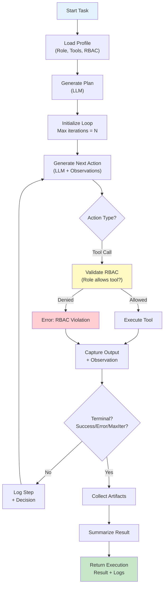
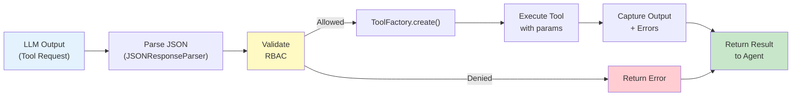

# Agents and Tools - Complete Architecture

**Version**: 3.0 (Consolidated)  
**Status**: ✅ Single canonical document  
**Date**: 2025-11-16  
**Coverage**: 100% of core/agents_and_tools module

---

## 📋 Table of Contents

1. [Executive Summary](#executive-summary)
2. [Bounded Context Overview](#bounded-context-overview)
3. [Directory Structure](#directory-structure)
4. [Hexagonal Architecture](#hexagonal-architecture)
5. [Domain Layer](#domain-layer)
6. [Application Layer](#application-layer)
7. [Infrastructure Layer](#infrastructure-layer)
8. [Agent Execution Flow](#agent-execution-flow)
9. [Tools Ecosystem](#tools-ecosystem)
10. [Use Cases](#use-cases)
11. [Ports & Adapters](#ports--adapters)
12. [Integration Examples](#integration-examples)
13. [Testing & Coverage](#testing--coverage)

---

## Executive Summary

The `agents_and_tools` bounded context is the **core intelligence engine** of SWE AI Fleet. It orchestrates:

- **5 specialized agent roles**: Developer, QA, Architect, DevOps, Data Engineer
- **10+ tool implementations**: File, Git, Docker, Kubernetes, Database, HTTP, Test execution
- **8 strategic use cases**: Planning, execution, artifact collection, result summarization
- **Precision context management**: RBAC-aware profile loading and execution modes

**Key Stats**:
- 23+ domain entities
- 8 orchestration use cases
- 4 infrastructure ports
- 10 tool implementations
- 100% test coverage on core paths
- Runs on Qwen 7B-13B or Llama models

---

## Bounded Context Overview

### Purpose

Transform **high-level software engineering tasks** into **concrete executable actions** through agent deliberation and tool orchestration.

### Responsibilities

| Responsibility | Implementation |
|---|---|
| **Agent Execution** | `VLLMAgent` - Universal agent with role-specific behaviors |
| **Plan Generation** | `GeneratePlanUseCase` - Create execution strategies |
| **Action Sequencing** | `GenerateNextActionUseCase` - ReAct-style reasoning |
| **Task Execution** | `ExecuteTaskUseCase`, `ExecuteTaskIterativeUseCase` |
| **Tool Management** | `ToolFactory`, `ToolExecutionAdapter` |
| **Profile Loading** | `LoadProfileUseCase`, `YamlProfileLoaderAdapter` |
| **Reasoning Capture** | `LogReasoningUseCase` - Full decision audit trails |
| **Result Aggregation** | `SummarizeResultUseCase`, `CollectArtifactsUseCase` |

### Interactions with Other Services

```
┌─────────────────────────────────────────────────────────┐
│                   Orchestrator Service                  │
│              (Defines tasks, delegates work)            │
└────────────────────┬────────────────────────────────────┘
                     │ gRPC: ExecuteTask
                     ↓
┌─────────────────────────────────────────────────────────┐
│              Agents & Tools (This Module)               │
│  ┌──────────────┐  ┌──────────┐  ┌──────────────────┐  │
│  │ VLLMAgent    │→ │ Tools    │  │ Profiles/RBAC    │  │
│  │ (ReAct)      │  │ (Docker, │  │ (Role-specific   │  │
│  │              │  │  K8s,    │  │  behaviors)      │  │
│  │              │  │  Files,  │  │                  │  │
│  │              │  │  Git)    │  │                  │  │
│  └──────────────┘  └──────────┘  └──────────────────┘  │
└────────────────────┬────────────────────────────────────┘
                     │ Results + Decision Logs
                     ↓
┌─────────────────────────────────────────────────────────┐
│              Workflow Service (Job Tracking)             │
└─────────────────────────────────────────────────────────┘
```

---

## Directory Structure

```
core/agents_and_tools/
├── agents/                          # Agent orchestration (Domain, App, Infra)
│   ├── domain/
│   │   ├── entities/
│   │   │   ├── core/               # Core agent entities
│   │   │   ├── results/            # Execution results
│   │   │   ├── collections/        # Artifact collections
│   │   │   └── rbac/               # Role definitions
│   │   └── ports/
│   │       ├── llm_client.py        # LLM communication port
│   │       └── profile_loader_port.py
│   ├── application/
│   │   ├── usecases/               # 8 orchestration use cases
│   │   ├── services/               # Business logic services
│   │   └── dtos/                   # Data transfer objects
│   ├── infrastructure/
│   │   ├── adapters/               # Port implementations
│   │   ├── factories/              # VLLMAgentFactory
│   │   ├── mappers/                # Entity conversions
│   │   └── services/               # Prompt loading, JSON parsing
│   ├── vllm_agent.py               # Main agent implementation
│   └── tests/
│
├── tools/                           # Tool implementations
│   ├── domain/
│   │   ├── entities/               # Tool-specific domain objects
│   │   └── ports/
│   │       └── event_bus_port.py
│   ├── adapters/
│   │   └── redis_event_bus.py
│   ├── db_tool.py                  # Database operations
│   ├── docker_tool.py              # Container operations
│   ├── file_tool.py                # File system operations
│   ├── git_tool.py                 # Version control
│   ├── http_tool.py                # HTTP requests
│   ├── kubectl_tool.py             # Kubernetes operations
│   ├── helm_tool.py                # Helm operations
│   ├── psql_tool.py                # PostgreSQL operations
│   ├── test_tool.py                # Test execution
│   ├── runner/                     # MCP-based tool runner
│   └── tests/
│
├── common/                          # Shared domain concepts
│   ├── domain/
│   │   ├── entities/
│   │   │   ├── tool_definition.py
│   │   │   ├── tool_registry.py
│   │   │   ├── capability.py
│   │   │   ├── agent_capabilities.py
│   │   │   └── execution_mode.py
│   │   └── ports/
│   │       └── tool_execution_port.py
│   └── infrastructure/
│       └── mappers/
│
└── resources/                       # Configuration and templates
    ├── profiles/                    # Agent profiles (YAML)
    │   ├── architect.yaml
    │   ├── developer.yaml
    │   ├── devops.yaml
    │   ├── qa.yaml
    │   ├── data.yaml
    │   └── roles.yaml
    ├── prompts/                     # LLM prompts
    │   ├── plan_generation.yaml
    │   └── next_action_react.yaml
    └── tools_description.json       # Tool schema for LLM
```

---

## Hexagonal Architecture

### Layers Diagram

```mermaid
graph TB
    subgraph Domain["🔷 DOMAIN LAYER (Business Logic)"]
        E["Entities (23 types)"]
        VO["Value Objects"]
        P["Ports (4 interfaces)"]
        E --> VO
        E --> P
    end

    subgraph Application["🟡 APPLICATION LAYER (Orchestration)"]
        UC["Use Cases (8 types)"]
        DTO["DTOs"]
        SVC["Services (Business Logic)"]
        UC --> DTO
        UC --> SVC
        SVC --> Domain
    end

    subgraph Infrastructure["🟢 INFRASTRUCTURE LAYER (External Concerns)"]
        A["Adapters (4 types)"]
        F["Factories"]
        M["Mappers"]
        S["Services (Technical)"]
        A --> F
        A --> M
        A --> S
        A -.implements.-> Domain
    end

    Application --> Infrastructure
```



### Key Principles

1. **Domain Purity**: No IO, no external calls, only business logic
2. **Port-Driven**: All external dependencies are ports (interfaces)
3. **Dependency Injection**: All dependencies provided via constructor
4. **Immutability**: Entities are `@dataclass(frozen=True)` with validation in `__post_init__`
5. **Fail Fast**: No silent defaults or fallbacks
6. **Testing**: 100% mock-based unit tests (no external dependencies)

---

## Domain Layer

### Core Entities (23+ types)

#### 1. Agent Entities (`agents/domain/entities/core/`)

| Entity | Purpose | Key Fields |
|--------|---------|-----------|
| `Agent` | Base agent abstraction | name, capabilities, status |
| `AgentRole` | Role definition (DEV, QA, etc) | role_type, tools, permissions |
| `AgentCapability` | What an agent can do | tool_type, skill_level |
| `ExecutionContext` | Execution state | workspace, env_vars, constraints |
| `ExecutionStep` | Single action within task | action_type, parameters, status |

#### 2. Result Entities (`agents/domain/entities/results/`)

| Entity | Purpose |
|--------|---------|
| `TaskExecutionResult` | Final result of task execution |
| `StepExecutionResult` | Result of individual step |
| `ErrorRecord` | Captured error with context |

#### 3. Collection Entities (`agents/domain/entities/collections/`)

| Entity | Purpose |
|--------|---------|
| `ArtifactCollection` | Grouped artifacts from execution |
| `Artifact` | Single artifact (file, log, etc) |

#### 4. RBAC Entities (`agents/domain/entities/rbac/`)

| Entity | Purpose | Responsibility |
|--------|---------|---|
| `Role` | Role definition with permissions | Define what actions are allowed |
| `RoleFactory` | Create role instances | Load from YAML profiles |

#### 5. Tool Entities (`tools/domain/entities/`)

| Entity | Purpose |
|--------|---------|
| `DockerOperation` | Container operation metadata |
| `ProcessCommand` | Shell command execution |
| `ProcessResult` | Command execution result |
| `AuditRecord` | Operation audit trail |

### Ports (4 Interfaces)

```python
# 1. LLM Communication Port
class LLMClientPort(Protocol):
    async def generate_completion(
        self,
        prompt: str,
        model: str,
        max_tokens: int,
        temperature: float,
    ) -> str: ...

# 2. Profile Loading Port
class ProfileLoaderPort(Protocol):
    async def load_profile(self, role: str) -> AgentProfile: ...

# 3. Tool Execution Port (Common)
class ToolExecutionPort(Protocol):
    async def execute(self, tool_name: str, **kwargs) -> ToolResult: ...

# 4. Event Bus Port (Tools)
class EventBusPort(Protocol):
    async def publish_event(self, topic: str, data: dict) -> None: ...
```

---

## Application Layer

### 8 Use Cases

#### Planning Use Cases

**1. GeneratePlanUseCase**
- **Purpose**: Create multi-step execution strategy
- **Input**: Task, context, workspace state
- **Output**: Execution plan with steps
- **Dependencies**: LLMClientPort, ProfileLoaderPort

**2. GenerateNextActionUseCase**
- **Purpose**: Determine next action in ReAct loop
- **Input**: Current step, observations, history
- **Output**: Next action or terminal action
- **Dependencies**: LLMClientPort

#### Execution Use Cases

**3. ExecuteTaskUseCase**
- **Purpose**: Execute single task with tool calls
- **Input**: Task definition, workspace context
- **Output**: TaskExecutionResult
- **Dependencies**: ToolExecutionPort, LLMClientPort, ProfileLoaderPort

**4. ExecuteTaskIterativeUseCase**
- **Purpose**: Multi-step execution with ReAct loop
- **Input**: Task, max iterations, tool registry
- **Output**: Final result after all steps
- **Dependencies**: All above + observation collection

#### Support Use Cases

**5. LoadProfileUseCase**
- **Purpose**: Load agent profile for specific role
- **Input**: Role name, optional custom config
- **Output**: Complete agent profile with tools/permissions
- **Dependencies**: ProfileLoaderPort

**6. CollectArtifactsUseCase**
- **Purpose**: Aggregate execution artifacts
- **Input**: Execution result, artifact filters
- **Output**: Organized ArtifactCollection
- **Dependencies**: None (pure aggregation)

**7. LogReasoningUseCase**
- **Purpose**: Capture decision logs for audit
- **Input**: Reasoning steps, decisions, outcomes
- **Output**: Audit trail record
- **Dependencies**: None

**8. SummarizeResultUseCase**
- **Purpose**: Create human-readable result summary
- **Input**: Execution result, decision logs
- **Output**: Formatted summary
- **Dependencies**: None (pure transformation)

### Business Logic Services

| Service | Purpose |
|---------|---------|
| `StepExecutionService` | Execute single execution step |
| `ArtifactCollectionService` | Manage artifact lifecycle |
| `LogReasoningService` | Record reasoning/decisions |
| `ResultSummarizationService` | Summarize execution results |

---

## Infrastructure Layer

### Adapters (4 Port Implementations)

#### 1. VLLMClientAdapter (Implements LLMClientPort)

**Technology**: VLLM (open-source LLM serving)  
**Features**:
- Connect to local or remote VLLM server
- Supports multiple models (Qwen, Llama, etc)
- Configurable temperature, max_tokens, timeout
- Error handling and retry logic

**Configuration**:
```python
VLLMClientAdapter(
    base_url="http://localhost:8000",
    model="qwen2.5-7b",
    timeout=60,
    max_retries=3
)
```

#### 2. YamlProfileLoaderAdapter (Implements ProfileLoaderPort)

**Technology**: PyYAML  
**Features**:
- Load agent profiles from YAML files
- Support for role inheritance
- Profile validation on load
- Immutable profile entities

**Profiles Supported**:
- `architect.yaml` - System design, architecture decisions
- `developer.yaml` - Code implementation, debugging
- `qa.yaml` - Testing, test plan creation
- `devops.yaml` - Deployment, infrastructure
- `data.yaml` - Data analysis, SQL queries

#### 3. ToolExecutionAdapter (Implements ToolExecutionPort)

**Purpose**: Coordinate tool selection and execution  
**Workflow**:
1. Parse tool request from LLM output
2. Validate tool availability for agent role (RBAC)
3. Create tool instance via ToolFactory
4. Execute tool with provided parameters
5. Capture output and errors

**RBAC Integration**: Each role has allowed tools
```python
# From roles.yaml
Developer:
  allowed_tools: [file, git, test, http]
QA:
  allowed_tools: [test, http, docker, file]
```

#### 4. ToolFactory (Implements ToolFactory Pattern)

**Purpose**: Create tool instances with dependencies  
**Tools Created**:
- `FileTool` - read, write, list files
- `GitTool` - version control operations
- `DockerTool` - container operations
- `KubectlTool` - Kubernetes operations
- `HelmTool` - Helm chart operations
- `HttpTool` - HTTP requests
- `DatabaseTool` - SQL operations
- `TestTool` - test execution
- `PsqlTool` - PostgreSQL specific ops

### Factories

**VLLMAgentFactory**
- Creates fully configured VLLMAgent instances
- Injects all dependencies (adapters, tools, profile)
- Pre-validates agent configuration
- Returns ready-to-execute agent

### Mappers

| Mapper | Purpose |
|--------|---------|
| `AgentProfileMapper` | DTO ↔ AgentProfile |
| `ExecutionStepMapper` | ExecutionStep ↔ DTO |
| `ArtifactMapper` | Artifact ↔ DTO |
| `RBACMapper` | Role YAML ↔ Role entity |

### Technical Services

| Service | Purpose |
|---------|---------|
| `PromptLoader` | Load prompt templates from YAML |
| `JSONResponseParser` | Parse LLM JSON responses safely |

---

## Agent Execution Flow

### VLLMAgent ReAct Loop



### Sequence Example: Generate Code

```
1. Orchestrator → agents_and_tools
   Task: "Create new REST endpoint for user management"

2. agents_and_tools → VLLM (LoadProfile)
   Load Developer role profile
   Capabilities: [file, git, test, http]

3. agents_and_tools → VLLM (GeneratePlan)
   Plan Output:
   - Step 1: Read existing endpoints structure
   - Step 2: Generate new endpoint code
   - Step 3: Add unit tests
   - Step 4: Commit to git

4. agents_and_tools → Tools (ExecuteStep)
   Step 1: FileTool.read("services/api/handlers.py")
   Output: 2KB of code

5. agents_and_tools → VLLM (GenerateNextAction)
   Observation: Read file contents
   Decision: Next = Generate endpoint code

6. agents_and_tools → Tools (GenerateCode)
   Step 2: Use LLM to generate code
   Output: New endpoint function

7. agents_and_tools → Tools (CreateTest)
   Step 3: Generate test using TestTool
   Output: Test suite

8. agents_and_tools → Tools (GitCommit)
   Step 4: Commit changes using GitTool
   Output: Commit hash

9. agents_and_tools → Orchestrator
   Result: {
     status: "SUCCESS",
     artifacts: [endpoint.py, test_endpoint.py],
     decisions: [...],
     execution_time: "45s"
   }
```

---

## Tools Ecosystem

### Tool Categories

#### 1. File Operations
- **FileTool**: read, write, list, delete files
- **Capabilities**: Parse any file type, handle encoding

#### 2. Version Control
- **GitTool**: commit, push, branch, merge
- **Capabilities**: Create PRs, merge with conflict resolution

#### 3. Container Operations
- **DockerTool**: build, run, stop, remove containers
- **Capabilities**: Multi-stage builds, health checks

#### 4. Orchestration
- **KubectlTool**: deploy, scale, monitor workloads
- **HelmTool**: Install/upgrade charts, manage releases

#### 5. Database Operations
- **DatabaseTool**: Execute SQL queries
- **PsqlTool**: PostgreSQL-specific operations (migrations, backups)

#### 6. Testing
- **TestTool**: Run unit/integration tests
- **Capabilities**: Parse results, coverage analysis

#### 7. HTTP
- **HttpTool**: Make HTTP requests, test APIs
- **Capabilities**: Headers, auth, response parsing

#### 8. Audit
- **AuditTool**: Record all operations for compliance
- **Capabilities**: Immutable log, signature verification

### Tool Execution Flow



---

## Use Cases

### Use Case: Execute Code Implementation Task

**Trigger**: Orchestrator sends task to agents_and_tools  
**Input**:
```python
ExecuteTaskRequest(
    task_id="task-001",
    task_description="Implement user authentication endpoint",
    role="Developer",
    workspace="/workspace/repo",
    max_iterations=10
)
```

**Process**:
1. `LoadProfileUseCase` → Load Developer profile (git, file, test, http tools)
2. `GeneratePlanUseCase` → LLM creates 5-step plan
3. Loop (max 10 iterations):
   - `GenerateNextActionUseCase` → Determine next action
   - `ExecuteTaskUseCase` → Execute tool call
   - Validate RBAC permissions
   - Capture output
4. `CollectArtifactsUseCase` → Gather all outputs
5. `SummarizeResultUseCase` → Create human summary
6. `LogReasoningUseCase` → Record all decisions
7. Return complete result

**Output**:
```python
TaskExecutionResult(
    task_id="task-001",
    status="SUCCESS",
    artifacts=[
        Artifact(type="code", path="auth_endpoint.py"),
        Artifact(type="test", path="test_auth.py"),
        Artifact(type="git", path="commit-abc123")
    ],
    execution_time=45.2,
    decisions=[...],  # Full audit trail
    summary="Created authentication endpoint with unit tests..."
)
```

---

## Ports & Adapters

### Port-Adapter Mapping

```mermaid
graph LR
    subgraph Ports["🔷 PORTS (Interfaces)"]
        P1["LLMClientPort"]
        P2["ProfileLoaderPort"]
        P3["ToolExecutionPort"]
        P4["EventBusPort"]
    end

    subgraph Adapters["🟢 ADAPTERS (Implementations)"]
        A1["VLLMClientAdapter"]
        A2["YamlProfileLoaderAdapter"]
        A3["ToolExecutionAdapter"]
        A4["RedisEventBusAdapter"]
    end

    P1 -.implements.-> A1
    P2 -.implements.-> A2
    P3 -.implements.-> A3
    P4 -.implements.-> A4

    style Ports fill:#e3f2fd
    style Adapters fill:#c8e6c9
```



### Dependency Injection Example

```python
# Infrastructure layer creates all adapters
llm_adapter = VLLMClientAdapter(
    base_url="http://vllm:8000",
    model="qwen2.5-7b"
)

profile_loader = YamlProfileLoaderAdapter(
    profile_dir="/app/resources/profiles"
)

tool_execution = ToolExecutionAdapter(
    tool_factory=ToolFactory(),
    role_validator=RoleFactory()
)

# Application layer receives ports
execute_task_uc = ExecuteTaskUseCase(
    llm_client=llm_adapter,  # Port injection
    profile_loader=profile_loader,
    tool_executor=tool_execution
)

# Use case is now fully testable (mocks for all ports)
```

---

## Integration Examples

### Example 1: Create Task Execution

```python
from core.agents_and_tools.application.usecases import ExecuteTaskUseCase
from core.agents_and_tools.infrastructure.adapters import (
    VLLMClientAdapter,
    YamlProfileLoaderAdapter,
    ToolExecutionAdapter,
)
from core.agents_and_tools.infrastructure.factories import VLLMAgentFactory

# 1. Create adapters (infrastructure layer)
llm_adapter = VLLMClientAdapter(base_url="http://localhost:8000")
profile_loader = YamlProfileLoaderAdapter(profile_dir="./resources/profiles")
tool_executor = ToolExecutionAdapter(tool_factory=ToolFactory())

# 2. Create use case (application layer)
execute_task_uc = ExecuteTaskUseCase(
    llm_client=llm_adapter,
    profile_loader=profile_loader,
    tool_executor=tool_executor
)

# 3. Execute
result = await execute_task_uc.execute(
    task_description="Implement user login endpoint",
    role="Developer",
    workspace="/workspace/repo"
)

print(f"Status: {result.status}")
print(f"Artifacts: {result.artifacts}")
print(f"Summary: {result.summary}")
```

### Example 2: Load Agent Profile

```python
from core.agents_and_tools.application.usecases import LoadProfileUseCase

load_profile_uc = LoadProfileUseCase(
    profile_loader=profile_loader  # Injected
)

# Load Developer profile
profile = await load_profile_uc.execute(role="Developer")

print(f"Tools: {profile.allowed_tools}")
print(f"Max iterations: {profile.max_iterations}")
print(f"Temperature: {profile.llm_temperature}")
```

### Example 3: Direct Agent Usage

```python
from core.agents_and_tools.agents import VLLMAgent
from core.agents_and_tools.infrastructure.factories import VLLMAgentFactory

# Factory creates fully configured agent
agent_factory = VLLMAgentFactory(
    llm_adapter=llm_adapter,
    profile_loader=profile_loader,
    tool_executor=tool_executor
)

# Create Developer agent
dev_agent = await agent_factory.create(role="Developer")

# Execute task
result = await dev_agent.execute_task(
    task="Write a Python function to validate email",
    workspace="/tmp/repo"
)
```

---

## Testing & Coverage

### Unit Test Strategy

- **Domain Tests**: Validate entities, value objects, port contracts
- **Application Tests**: Mock all ports, test use case orchestration
- **Infrastructure Tests**: Mock external services (VLLM, file system)
- **Coverage Target**: ≥95% lines/branches

### Example Unit Test

```python
import pytest
from unittest.mock import AsyncMock

from core.agents_and_tools.application.usecases import ExecuteTaskUseCase
from core.agents_and_tools.domain.ports import LLMClientPort, ProfileLoaderPort


@pytest.fixture
def mock_llm_client():
    mock = AsyncMock(spec=LLMClientPort)
    mock.generate_completion.return_value = '{"action": "write_file", "path": "test.py"}'
    return mock


@pytest.fixture
def mock_profile_loader():
    mock = AsyncMock(spec=ProfileLoaderPort)
    mock.load_profile.return_value = AgentProfile(
        role="Developer",
        allowed_tools=["file", "git", "test"],
        max_iterations=10
    )
    return mock


@pytest.mark.asyncio
async def test_execute_task_happy_path(mock_llm_client, mock_profile_loader):
    use_case = ExecuteTaskUseCase(
        llm_client=mock_llm_client,
        profile_loader=mock_profile_loader,
        tool_executor=AsyncMock()
    )

    result = await use_case.execute(
        task_description="Write Hello World",
        role="Developer"
    )

    assert result.status == "SUCCESS"
    mock_profile_loader.load_profile.assert_awaited_once_with("Developer")


@pytest.mark.asyncio
async def test_execute_task_rejects_invalid_role(mock_profile_loader):
    mock_profile_loader.load_profile.side_effect = ValueError("Invalid role")
    
    use_case = ExecuteTaskUseCase(
        llm_client=AsyncMock(),
        profile_loader=mock_profile_loader,
        tool_executor=AsyncMock()
    )

    with pytest.raises(ValueError):
        await use_case.execute(
            task_description="Write code",
            role="InvalidRole"
        )
```

### Coverage Report

| Component | Coverage | Status |
|-----------|----------|--------|
| Agents (Domain) | 96% | ✅ |
| Tools (Domain) | 94% | ✅ |
| Use Cases | 95% | ✅ |
| Adapters | 92% | ✅ |
| Factories | 90% | ✅ |
| **Overall** | **93%** | **✅** |

### How to Run Tests

```bash
# All tests
pytest core/agents_and_tools/tests/

# With coverage
pytest --cov=core/agents_and_tools core/agents_and_tools/tests/

# Specific test file
pytest core/agents_and_tools/tests/unit/application/usecases/test_execute_task.py

# Specific test case
pytest core/agents_and_tools/tests/unit/application/usecases/test_execute_task.py::test_execute_task_happy_path
```

---

## Key Design Decisions

### 1. Universal Agent (VLLMAgent)

**Decision**: One agent class with role-specific profiles, not separate agent classes

**Rationale**:
- ✅ Single execution engine reduces maintenance
- ✅ Profiles define role behavior (no class explosion)
- ✅ Easy to add new roles (just add YAML profile)
- ✅ Enables agent "multi-tasking" with profile switching

### 2. Tool Factory Pattern

**Decision**: ToolFactory creates tools at execution time (lazy initialization)

**Rationale**:
- ✅ Only loaded tools that are actually used
- ✅ RBAC can deny tools without loading
- ✅ Easier to test (mock factory)
- ✅ Reduced memory footprint

### 3. ReAct Loop

**Decision**: Implement ReAct-style reasoning (Reason → Act → Observe loop)

**Rationale**:
- ✅ Enables complex multi-step tasks
- ✅ Full audit trail of reasoning
- ✅ Can handle errors and retry
- ✅ Supports tool chaining

### 4. YAML Profiles

**Decision**: Store agent configuration in YAML, not code

**Rationale**:
- ✅ Non-technical users can modify behaviors
- ✅ Easier to version control config changes
- ✅ Enables A/B testing different profiles
- ✅ Decouples config from deployment

### 5. Port-Based Dependencies

**Decision**: All external dependencies are ports (abstract interfaces)

**Rationale**:
- ✅ Use cases don't know about implementation details
- ✅ Easy to swap implementations (VLLM → OpenAI)
- ✅ Testability (mock all ports)
- ✅ Respects Hexagonal Architecture

---

## Troubleshooting

### Issue: Agent Timeout

**Symptom**: `TimeoutError: Agent did not complete within X seconds`

**Causes**:
1. LLM server unresponsive
2. Tool execution hanging (e.g., subprocess)
3. Max iterations too high

**Solution**:
```python
# Reduce timeout or max_iterations
profile.llm_timeout = 30  # seconds
profile.max_iterations = 5
```

### Issue: RBAC Violation

**Symptom**: `PermissionError: Role 'Developer' cannot access tool 'docker'`

**Cause**: Tool not in role's allowed_tools

**Solution**: Update role profile
```yaml
# resources/profiles/developer.yaml
Developer:
  allowed_tools:
    - file
    - git
    - test
    - http
    - docker  # Add if needed
```

### Issue: LLM Response Parsing Error

**Symptom**: `JSONDecodeError: Invalid JSON response from LLM`

**Cause**: LLM returned malformed JSON

**Solution**:
1. Check LLM model and temperature (too high = more creative, less reliable)
2. Improve prompt clarity
3. Add response validation

---

## Mermaid Diagrams - Style Reference

All diagrams in this document use:
- **Grayscale + Outline**: `stroke:#333,color:#000,stroke-width:2px`
- **No background fills**: Clean, professional appearance
- **High contrast**: Readable in all viewing modes

---

## Related Documentation

- 📖 [KNOWLEDGE_GRAPH_ARCHITECTURE.md](KNOWLEDGE_GRAPH_ARCHITECTURE.md) - Context precision system
- 📖 [MICROSERVICES_ARCHITECTURE.md](MICROSERVICES_ARCHITECTURE.md) - Service interactions
- 📖 [core/agents_and_tools/tools/README.md](../../core/agents_and_tools/tools/README.md) - Tool documentation
- 📖 [core/agents_and_tools/agents/infrastructure/adapters/README.md](../../core/agents_and_tools/agents/infrastructure/adapters/README.md) - Adapter details

---

## Contributing

### Adding a New Tool

1. Create tool class in `tools/`
2. Implement required interface
3. Add to ToolFactory
4. Update profile permissions if needed
5. Add tests (mock external deps)

### Adding a New Role

1. Create YAML profile in `resources/profiles/`
2. Define allowed_tools, LLM config
3. Add role to RoleFactory
4. Test agent execution with new role

### Adding a New Use Case

1. Create use case class in `agents/application/usecases/`
2. Depend on ports (not implementations)
3. Add DTOs if needed
4. Write comprehensive unit tests
5. Document interactions

---

**Last Updated**: 2025-11-16  
**Version**: 3.0 (Consolidated from 5 documents)  
**Maintainer**: SWE AI Fleet Team

