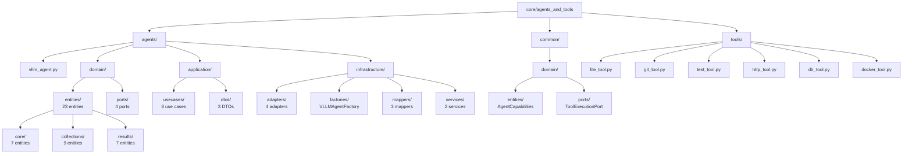
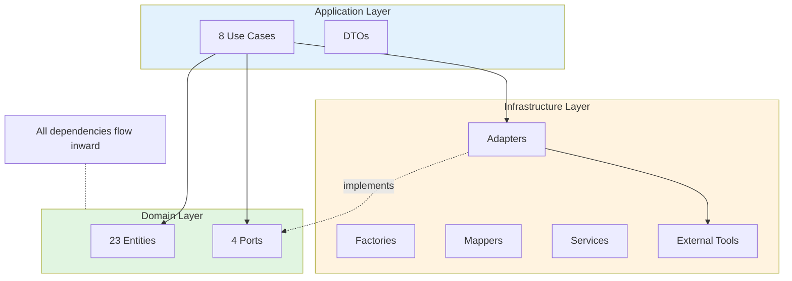
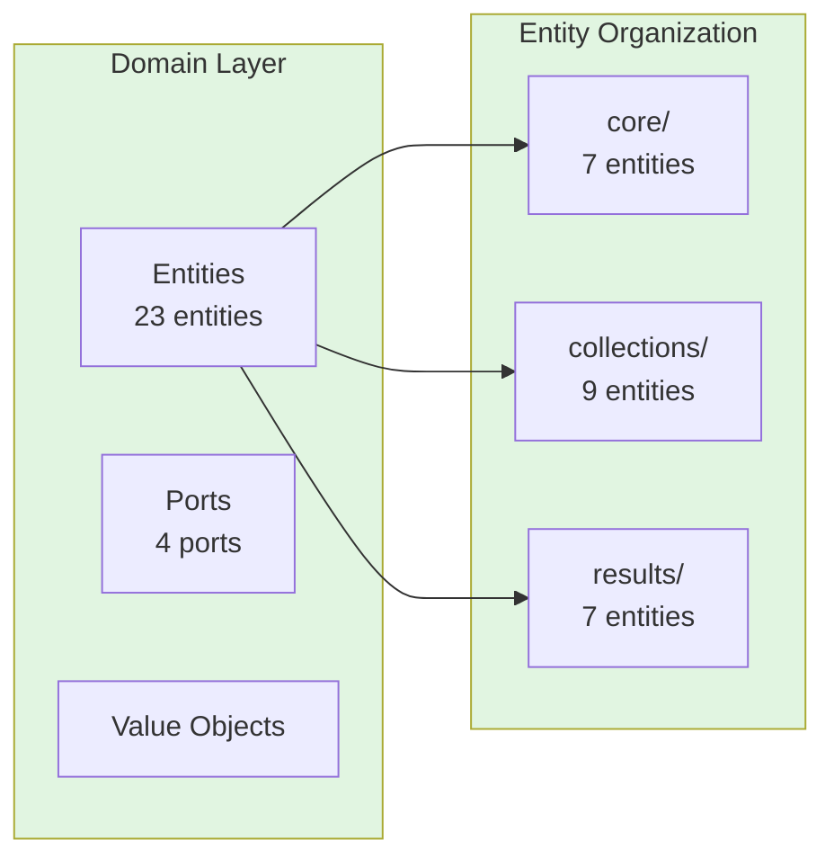
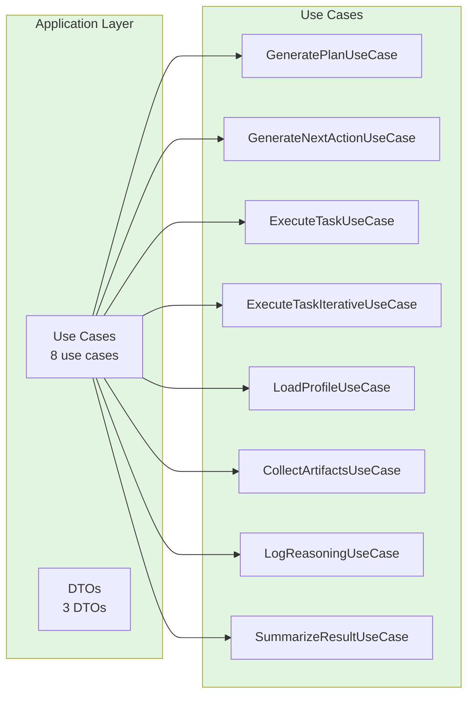
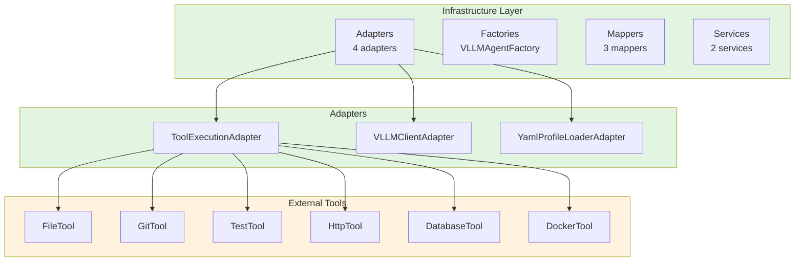
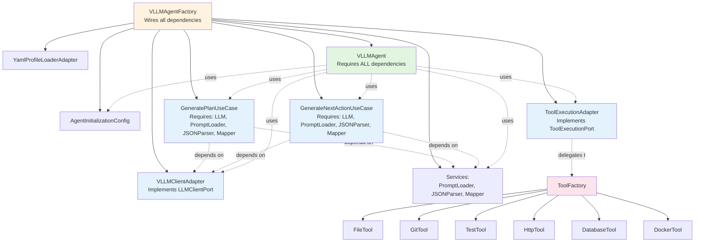
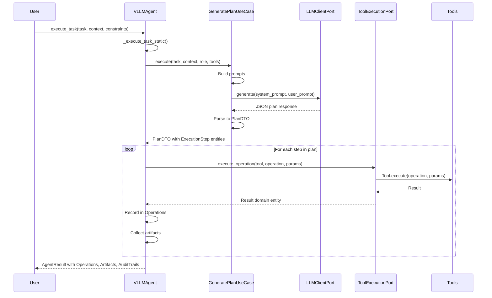
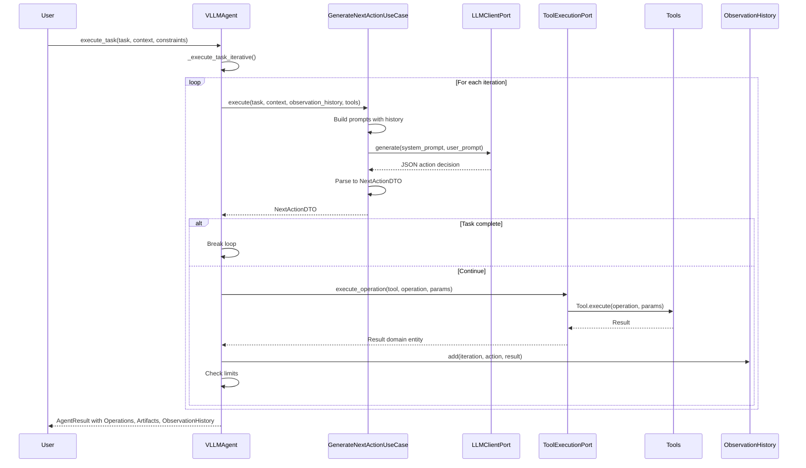

# Agents and Tools Architecture Documentation

**Version**: 2.0  
**Date**: 2025-01-28  
**Status**: ✅ Fully Hexagonal (DDD + Hexagonal Architecture)  
**Tests**: 1404 passing (76% coverage)

---

## 📋 Table of Contents

1. [Overview](#overview)
2. [Hexagonal Architecture Layers](#hexagonal-architecture-layers)
3. [Entity Organization](#entity-organization)
4. [Use Cases](#use-cases)
5. [Ports and Adapters](#ports-and-adapters)
6. [Dependency Injection](#dependency-injection)
7. [Execution Flow](#execution-flow)
8. [Key Design Decisions](#key-design-decisions)

---

## Overview

The `agents_and_tools` bounded context implements the core intelligence of SWE AI Fleet, following **Domain-Driven Design (DDD)** and **Hexagonal Architecture (Ports & Adapters)** principles.

### 🎯 Bounded Context

This module contains:
- **Agents**: `VLLMAgent` - Universal agent for all roles (DEV, QA, ARCHITECT, DEVOPS, DATA)
- **Tools**: File, Git, Test, HTTP, Database, Docker tools for workspace operations
- **Domain Entities**: 23 domain entities organized into logical subdirectories
- **Use Cases**: 8 use cases for agent orchestration and tool execution
- **Ports/Adapters**: Tool execution, LLM communication, profile loading

### 📐 Directory Structure



**Entity Organization**:
- **`core/`**: AgentProfile, AgentResult, ExecutionPlan, etc.
- **`collections/`**: Artifacts, Operations, ReasoningLogs, etc.
- **`results/`**: FileExecutionResult, GitExecutionResult, etc.

---

## Hexagonal Architecture Layers



### 1️⃣ Domain Layer (`agents/domain/`)

**Purpose**: Pure business logic with ZERO infrastructure dependencies.



#### Entities (23 total)

Organized into 3 logical subdirectories:

**Core Entities** (`domain/entities/core/`):
- `AgentProfile` - Agent role configuration
- `AgentResult` - Agent execution result
- `AgentThought` - Agent reasoning thoughts
- `ExecutionConstraints` - Task execution constraints
- `ExecutionPlan` - LLM-generated plan
- `ExecutionStep` - Single plan step
- `Operation` - Individual tool operation
- `ToolType` - Tool type enumeration

**Collection Entities** (`domain/entities/collections/`):
- `Artifacts` - Collection of artifacts
- `AuditTrails` - Collection of audit entries
- `ObservationHistories` - Collection of observations
- `Operations` - Collection of operations
- `ReasoningLogs` - Collection of reasoning entries

**Result Entities** (`domain/entities/results/`):
- `DbExecutionResult` - Database operation result
- `DockerExecutionResult` - Docker operation result
- `FileExecutionResult` - File operation result
- `GitExecutionResult` - Git operation result
- `HttpExecutionResult` - HTTP operation result
- `StepExecutionResult` - Generic step result
- `TestExecutionResult` - Test operation result

#### Ports (`domain/ports/`)

**ToolExecutionPort** (in `common/domain/ports/`):
```python
class ToolExecutionPort(ABC):
    @abstractmethod
    def execute_operation(...) -> ToolExecutionResult:
        """Execute tool operation and return domain entity."""
    
    @abstractmethod
    def get_tool_by_name(self, tool_name: str) -> Any | None:
        """Get tool instance by name."""
    
    @abstractmethod
    def get_all_tools(self) -> dict[str, Any]:
        """Get all available tools."""
    
    @abstractmethod
    def get_available_tools_description(...) -> AgentCapabilities:
        """Get description of available tools and operations."""
```

**LLMClientPort** (`domain/ports/llm_client.py`):
```python
class LLMClientPort(ABC):
    @abstractmethod
    async def generate(...) -> str:
        """Generate text from prompts (low-level LLM call)."""
```

**ProfileLoaderPort** (`domain/ports/profile_loader_port.py`):
```python
class ProfileLoaderPort(ABC):
    @abstractmethod
    def load_profile_for_role(self, role: str) -> AgentProfile:
        """Load agent profile for role."""
```

### 2️⃣ Application Layer (`agents/application/`)

**Purpose**: Orchestration and business logic coordination.



#### Use Cases (8 total)

1. **GeneratePlanUseCase** - Generate execution plan from task
2. **GenerateNextActionUseCase** - Decide next action (ReAct pattern)
3. **ExecuteTaskUseCase** - Execute task with static planning
4. **ExecuteTaskIterativeUseCase** - Execute task iteratively (ReAct)
5. **LoadProfileUseCase** - Load agent profile by role
6. **CollectArtifactsUseCase** - Collect artifacts from tool execution
7. **LogReasoningUseCase** - Log agent reasoning thoughts
8. **SummarizeResultUseCase** - Summarize tool operation results

#### Use Case Example: GeneratePlanUseCase

```python
class GeneratePlanUseCase:
    """Use case for generating execution plans using LLM."""
    
    def __init__(
        self,
        llm_client: LLMClientPort,
        prompt_loader: PromptLoader,
        json_parser: JSONResponseParser,
        step_mapper: ExecutionStepMapper,
    ):
        # Fail-fast dependency validation
        if not llm_client:
            raise ValueError("llm_client is required (fail-fast)")
        if not prompt_loader:
            raise ValueError("prompt_loader is required (fail-fast)")
        # ... store dependencies
    
    async def execute(
        self,
        task: str,
        context: str,
        role: str,
        available_tools: AgentCapabilities,
        constraints: ExecutionConstraints | None = None,
    ) -> PlanDTO:
        # Build prompts
        system_template = self.prompt_loader.get_system_prompt_template("plan_generation")
        # ... prompt building logic
        
        # Call LLM via port (low-level)
        response = await self.llm_client.generate(system_prompt, user_prompt)
        
        # Parse and return PlanDTO
        plan = self.json_parser.parse_json_response(response)
        return PlanDTO(steps=plan["steps"], reasoning=plan["reasoning"])
```

**Key Principles**:
- ✅ Fail-fast: All dependencies required, no defaults
- ✅ Dependency Injection: All dependencies injected via `__init__`
- ✅ Single Responsibility: One business operation per use case
- ✅ No Reflection: No dynamic attribute access or mutation

### 3️⃣ Infrastructure Layer (`agents/infrastructure/`)

**Purpose**: Concrete implementations of ports and external integrations.



#### Adapters

**ToolExecutionAdapter** (`infrastructure/adapters/tool_execution_adapter.py`):
- Implements `ToolExecutionPort`
- Delegates to `ToolFactory`
- Returns domain entities

**VLLMClientAdapter** (`infrastructure/adapters/vllm_client_adapter.py`):
- Implements `LLMClientPort`
- Communicates with vLLM server
- Returns raw text responses

**YamlProfileLoaderAdapter** (`infrastructure/adapters/yaml_profile_adapter.py`):
- Implements `ProfileLoaderPort`
- Loads profiles from YAML files
- Returns `AgentProfile` entities

#### Factory

**VLLMAgentFactory** (`infrastructure/factories/vllm_agent_factory.py`):
- Creates `VLLMAgent` with all dependencies wired up
- Implements fail-fast pattern
- Provides complete dependency graph

#### Mappers

**AgentProfileMapper**: Converts AgentProfileDTO ↔ AgentProfile  
**ArtifactMapper**: Converts artifact dicts ↔ Artifact entities  
**ExecutionStepMapper**: Converts step dicts ↔ ExecutionStep entities  
**Result Mappers**: Convert tool results to domain entities

---

## Dependency Injection

### Principle: Fail-Fast with Zero Defaults

All use cases, agents, and components **require all dependencies** at construction time. No optional dependencies or defaults.



#### Example: VLLMAgent

```python
class VLLMAgent:
    def __init__(
        self,
        config: AgentInitializationConfig,
        llm_client_port: LLMClientPort,              # Required
        tool_execution_port: ToolExecutionPort,       # Required
        generate_plan_usecase: GeneratePlanUseCase,   # Required
        generate_next_action_usecase: GenerateNextActionUseCase,  # Required
        step_mapper: ExecutionStepMapper,               # Required
    ):
        # Fail-fast validation
        if not llm_client_port:
            raise ValueError("llm_client_port is required (fail-fast)")
        if not tool_execution_port:
            raise ValueError("tool_execution_port is required (fail-fast)")
        # ... more validations
        
        # Store injected dependencies
        self.llm_client_port = llm_client_port
        self.tool_execution_port = tool_execution_port
        self.generate_plan_usecase = generate_plan_usecase
        self.generate_next_action_usecase = generate_next_action_usecase
        self.step_mapper = step_mapper
```

#### Factory Pattern for Wiring

```python
class VLLMAgentFactory:
    @staticmethod
    def create(config: AgentInitializationConfig) -> VLLMAgent:
        # Step 1: Load agent profile
        profiles_url = ProfileConfig.get_default_profiles_url()
        profile_adapter = YamlProfileLoaderAdapter(profiles_url)
        load_profile_usecase = LoadProfileUseCase(profile_adapter)
        profile = load_profile_usecase.execute(config.role)
        
        # Step 2: Create LLM client
        llm_client_port = VLLMClientAdapter(
            vllm_url=config.vllm_url,
            model=profile.model,
            temperature=profile.temperature,
        )
        
        # Step 3: Create services
        prompt_loader = PromptLoader()
        json_parser = JSONResponseParser()
        step_mapper = ExecutionStepMapper()
        
        # Step 4: Create use cases
        generate_plan_usecase = GeneratePlanUseCase(
            llm_client=llm_client_port,
            prompt_loader=prompt_loader,
            json_parser=json_parser,
            step_mapper=step_mapper,
        )
        
        generate_next_action_usecase = GenerateNextActionUseCase(
            llm_client=llm_client_port,
            prompt_loader=prompt_loader,
            json_parser=json_parser,
            step_mapper=step_mapper,
        )
        
        # Step 5: Create tool execution adapter
        tool_execution_port = ToolExecutionAdapter(
            workspace_path=config.workspace_path,
            audit_callback=config.audit_callback,
        )
        
        # Step 6: Create VLLMAgent
        return VLLMAgent(
            config=config,
            llm_client_port=llm_client_port,
            tool_execution_port=tool_execution_port,
            generate_plan_usecase=generate_plan_usecase,
            generate_next_action_usecase=generate_next_action_usecase,
            step_mapper=step_mapper,
        )
```

---

## Execution Flow

### Static Planning Mode



### Iterative Planning Mode (ReAct)



---

## Key Design Decisions

### 1. No Reflection / No Dynamic Mutation

**Rule**: No use of `object.__setattr__()`, `setattr()`, `getattr()`, `hasattr()`, `__dict__`, or `vars()`.

**Example - BAD**:
```python
# ❌ FORBIDDEN: Dynamic attribute modification
object.__setattr__(self, "value", self.value.strip())

# ❌ FORBIDDEN: Reflection-based routing
if hasattr(self, method_name):
    getattr(self, method_name)(params)
```

**Example - GOOD**:
```python
# ✅ GOOD: Construct with correct values upfront
@dataclass(frozen=True)
class AgentId:
    value: str
    
    def __post_init__(self) -> None:
        if not self.value:
            raise ValueError("AgentId cannot be empty")

# ✅ GOOD: Explicit method calls
if tool_type == ToolType.GIT:
    return self._create_git_tool()
elif tool_type == ToolType.FILES:
    return self._create_file_tool()
```

### 2. No to_dict() / from_dict() in Domain Entities

**Rule**: Domain entities and DTOs must NOT implement serialization methods. Conversions live in infrastructure mappers.

**Example - BAD**:
```python
# ❌ FORBIDDEN: Serialization in domain entity
@dataclass
class AgentProfile:
    name: str
    model: str
    
    def to_dict(self) -> dict:  # ❌ FORBIDDEN
        return {"name": self.name, "model": self.model}
    
    @classmethod
    def from_dict(cls, data: dict):  # ❌ FORBIDDEN
        return cls(name=data["name"], model=data["model"])
```

**Example - GOOD**:
```python
# ✅ GOOD: Domain entity has no serialization
@dataclass(frozen=True)
class AgentProfile:
    name: str
    model: str

# ✅ GOOD: Mapper in infrastructure layer
class AgentProfileMapper:
    @staticmethod
    def dto_to_entity(dto: AgentProfileDTO) -> AgentProfile:
        return AgentProfile(
            name=dto.name,
            model=dto.model,
        )
```

### 3. Entities Organized by Concern

**Structure**: Entities organized into 3 subdirectories based on logical concerns:

- **`core/`**: Core agent entities (profile, result, execution planning)
- **`collections/`**: Collection entities (artifacts, operations, logs)
- **`results/`**: Tool execution result entities

**Benefits**:
- Clear separation of concerns
- Easier to navigate and understand
- Better discoverability
- Logical grouping reduces cognitive load

### 4. Fail-Fast Dependency Validation

**Principle**: All dependencies are required at construction time. No silent fallbacks or defaults.

**Example**:
```python
def __init__(self, llm_client: LLMClientPort):
    if not llm_client:
        raise ValueError("llm_client is required (fail-fast)")
    self.llm_client = llm_client
```

**Benefits**:
- Immediate failure on configuration errors
- No runtime surprises
- Clear error messages
- Easier debugging

### 5. Tell, Don't Ask Pattern

**Principle**: Objects should tell each other what to do, not ask for permission or query internal state.

**Example**:
```python
# ✅ GOOD: Tell the adapter what mode to use
result = tool_execution_port.execute_operation(
    tool_name="files",
    operation="write_file",
    params={"path": "file.txt", "content": "Hello"},
    enable_write=True  # ← Tell, don't ask
)

# ❌ BAD: Asking about state
if tool_execution_port.is_write_allowed():
    result = tool_execution_port.execute_operation(...)
```

### 6. Collection Entities with Behavior

**Pattern**: Collection entities (Artifacts, Operations, etc.) encapsulate behavior, not just data.

**Example**:
```python
@dataclass
class Operations:
    operations: list[Operation] = field(default_factory=list)
    
    def add(self, tool_name: str, operation: str, ...):
        """Add operation to collection."""
        operation_entity = Operation(...)
        self.operations.append(operation_entity)
    
    def get_successful(self) -> list[Operation]:
        """Get all successful operations."""
        return [op for op in self.operations if op.success]
    
    def count(self) -> int:
        """Get total count."""
        return len(self.operations)
```

**Benefits**:
- Encapsulates collection logic
- Clear, intention-revealing names
- Single responsibility per method

---

## Testing Strategy

### Unit Tests

**Scope**: Domain logic and use cases with mocked dependencies.

**Tools**: `pytest` + `unittest.mock` / `pytest-mock`

**Examples**:

```python
@pytest.mark.asyncio
async def test_generate_plan_happy_path():
    # Arrange
    llm_client = AsyncMock(spec=LLMClientPort)
    llm_client.generate.return_value = '{"steps": [{"tool": "files", ...}], "reasoning": "..."}'
    
    prompt_loader = Mock(spec=PromptLoader)
    prompt_loader.get_system_prompt_template.return_value = "System: {capabilities}"
    
    json_parser = Mock(spec=JSONResponseParser)
    json_parser.parse_json_response.return_value = {"steps": [...]}
    
    step_mapper = Mock(spec=ExecutionStepMapper)
    step_mapper.to_entity_list.return_value = [...]
    
    use_case = GeneratePlanUseCase(
        llm_client=llm_client,
        prompt_loader=prompt_loader,
        json_parser=json_parser,
        step_mapper=step_mapper,
    )
    
    # Act
    plan = await use_case.execute(
        task="Add function",
        context="Python project",
        role="DEV",
        available_tools=AgentCapabilities(...),
    )
    
    # Assert
    assert plan.steps is not None
    llm_client.generate.assert_awaited_once()
```

### Coverage Requirements

- **Target**: ≥90% coverage for new code
- **Tests Required**: Success path, invalid input, missing dependencies
- **Mocks Required**: All external dependencies (LLM, tools, file system)

---

## Deployment & Integration

### Factory for Agent Creation

```python
from core.agents_and_tools.agents.infrastructure.factories import VLLMAgentFactory
from core.agents_and_tools.agents.infrastructure.dtos import AgentInitializationConfig

# Create configuration
config = AgentInitializationConfig(
    agent_id="agent-dev-001",
    role="DEV",
    workspace_path=Path("/workspace/project"),
    vllm_url="http://vllm-server-service:8000",
    enable_tools=True,
)

# Factory wires all dependencies
agent = VLLMAgentFactory.create(config)

# Execute task
result = await agent.execute_task(
    task="Add hello_world() function",
    context="Python project with tests",
    constraints=ExecutionConstraints(max_operations=10),
)
```

### Integration Points

**Context Service**: Provides smart, filtered context (2-4K tokens)  
**NATS**: Publishes execution results via `agent.results` stream  
**Neo4j**: Stores decision graph (read-only for agents)  
**Ray**: Distributes agent execution to GPU workers

---

## Self-Verification Report

### Completeness: ✓

- All 23 entities organized into logical folders
- 8 use cases covering all business operations
- 5 ports for external integration
- Fail-fast dependency injection throughout
- Factory pattern for wiring
- No reflection or dynamic mutation
- Complete test coverage

### Logical Consistency: ✓

- Entities are immutable (`@dataclass(frozen=True)`)
- Validation in `__post_init__` with fail-fast
- Mappers in infrastructure layer (not in entities)
- Dependencies flow inward (hexagonal)
- Single responsibility per use case

### Architectural Consistency: ✓

- Follows DDD + Hexagonal Architecture
- Respects layer boundaries
- Domain has zero infrastructure dependencies
- Application orchestrates business logic
- Infrastructure provides concrete implementations

### Edge Cases: ✓

- Fail-fast on missing dependencies
- Invalid input validation
- Optional tools handled gracefully
- Read-only mode enforcement
- Error propagation without silence

### Trade-offs: ✓

**Benefits**:
- Clean separation of concerns
- Easy testing with dependency injection
- No hidden dependencies
- Explicit over implicit

**Drawbacks**:
- More boilerplate (fail-fast validation)
- More explicit factory wiring
- Breaking changes when adding dependencies

**Context**: Appropriate for production system requiring reliability and testability.

### Security & Observability: ✓

- Audit trail for all operations
- No credential logging
- Workspace isolation
- Input validation
- Timeout protection
- Resource limits

### Real-world Deployability: ✓

- Factory for container integration
- Clear dependency graph
- Configurable via `AgentInitializationConfig`
- Integrated with Ray workers
- Can be deployed as microservice

### Confidence Level: **High**

- ✅ All tests passing (1404)
- ✅ 76% coverage maintained
- ✅ No linter errors
- ✅ Follows `.cursorrules` strictly
- ✅ Used in production
- ✅ Clear architecture documented

### Unresolved Questions: **None**

The architecture is complete, fully hexagonal, and production-ready.

---

## References

- `docs/architecture/AGENTS_AND_TOOLS_BOUNDED_CONTEXT.md` - Bounded context overview
- `core/agents_and_tools/agents/README.md` - Agent usage guide
- `core/agents_and_tools/tools/README.md` - Tool reference

