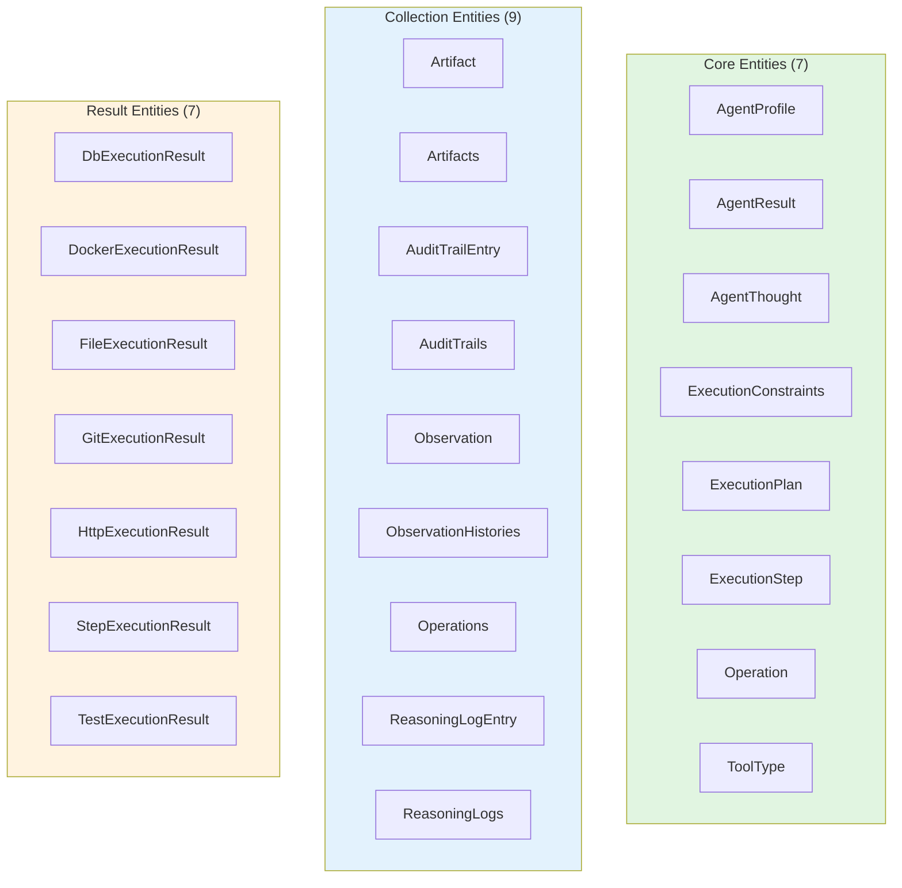
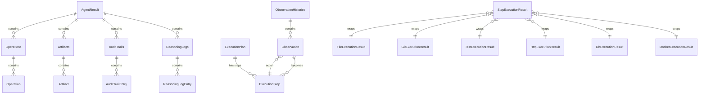

# Agents and Tools - Domain Model Documentation

**Version**: 2.0  
**Date**: 2025-01-28  
**Status**: ✅ Complete domain model documented  
**Entities**: 23 immutable domain entities

---

## 📋 Table of Contents

1. [Overview](#overview)
2. [Entity Organization](#entity-organization)
3. [Core Entities](#core-entities)
4. [Collection Entities](#collection-entities)
5. [Result Entities](#result-entities)
6. [Value Objects](#value-objects)
7. [Entity Relationships](#entity-relationships)
8. [Immutability & Validation](#immutability--validation)

---

## Overview

The domain model contains **23 immutable domain entities** organized into three categories:

1. **Core Entities** (7) - Core agent concepts (profile, result, execution planning)
2. **Collection Entities** (9) - Collections with utility methods (artifacts, operations, logs)
3. **Result Entities** (7) - Tool execution results

**Architectural Principles**:
- ✅ All entities are `@dataclass(frozen=True)` (immutable)
- ✅ Validation in `__post_init__` (fail-fast)
- ✅ No reflection or dynamic mutation
- ✅ No `to_dict()` or `from_dict()` methods
- ✅ Mappers convert to/from external formats

---

## Entity Organization



**Directory Structure**:
```
agents/domain/entities/
├── __init__.py          # Re-exports all entities
├── core/                # Core entities (7)
│   ├── agent_profile.py
│   ├── agent_result.py
│   ├── agent_thought.py
│   ├── execution_constraints.py
│   ├── execution_plan.py
│   ├── execution_step.py
│   ├── operation.py
│   └── tool_type.py
├── collections/         # Collection entities (9)
│   ├── artifact.py
│   ├── artifacts.py
│   ├── audit_trail.py
│   ├── audit_trails.py
│   ├── observation_history.py
│   ├── observation_histories.py
│   ├── operations.py
│   ├── reasoning_log.py
│   └── reasoning_logs.py
└── results/             # Result entities (7)
    ├── db_execution_result.py
    ├── docker_execution_result.py
    ├── file_execution_result.py
    ├── git_execution_result.py
    ├── http_execution_result.py
    ├── step_execution_result.py
    └── test_execution_result.py
```

---

## Core Entities

### 1. AgentProfile

**Purpose**: Agent configuration with LLM model settings.

**Location**: `entities/core/agent_profile.py`

**Fields**:
- `name: str` - Profile name (e.g., "developer")
- `model: str` - LLM model identifier (e.g., "deepseek-coder:33b")
- `context_window: int` - Max context size in tokens (e.g., 32768)
- `temperature: float` - Sampling temperature (0.0-2.0)
- `max_tokens: int` - Max tokens to generate

**Validation**:
- Temperature must be between 0 and 2
- Max tokens must be positive
- Context window >= max tokens
- Model and name cannot be empty

**Example**:
```python
profile = AgentProfile(
    name="developer",
    model="deepseek-coder:33b",
    context_window=32768,
    temperature=0.7,
    max_tokens=4096,
)
```

---

### 2. AgentResult

**Purpose**: Result of agent task execution with complete audit trail.

**Location**: `entities/core/agent_result.py`

**Fields**:
- `success: bool` - Whether task succeeded
- `operations: Operations` - Collection of tool operations
- `artifacts: Artifacts` - Collected artifacts (commits, files, etc.)
- `audit_trail: AuditTrails` - Full execution log
- `reasoning_log: ReasoningLogs` - Agent's internal thoughts
- `error: str | None` - Error message if failed

**Example**:
```python
result = AgentResult(
    success=True,
    operations=Operations(),
    artifacts=Artifacts(),
    audit_trail=AuditTrails(),
    reasoning_log=ReasoningLogs(),
)
```

---

### 3. ExecutionConstraints

**Purpose**: Execution constraints and limits for agent tasks.

**Location**: `entities/core/execution_constraints.py`

**Fields**:
- `max_operations: int = 100` - Max tool operations allowed
- `abort_on_error: bool = True` - Stop on first error
- `iterative: bool = False` - Use iterative planning
- `max_iterations: int = 10` - Max iterations if iterative

**Example**:
```python
constraints = ExecutionConstraints(
    max_operations=50,
    abort_on_error=True,
    iterative=True,
    max_iterations=5,
)
```

---

### 4. ExecutionPlan

**Purpose**: Structured execution plan from LLM.

**Location**: `entities/core/execution_plan.py`

**Fields**:
- `steps: list[dict]` - Execution steps (tool, operation, params)
- `reasoning: str | None` - Why this plan

**Example**:
```python
plan = ExecutionPlan(
    steps=[
        {"tool": "files", "operation": "read_file", "params": {"path": "src/utils.py"}},
        {"tool": "files", "operation": "write_file", "params": {"path": "src/utils.py", "content": "..."}},
        {"tool": "tests", "operation": "pytest", "params": {"path": "tests/"}},
    ],
    reasoning="Read current code, add function, verify with tests",
)
```

---

### 5. ExecutionStep

**Purpose**: Single step in an execution plan.

**Location**: `entities/core/execution_step.py`

**Fields**:
- `tool: str` - Tool name (e.g., "files", "git")
- `operation: str` - Operation name (e.g., "read_file", "commit")
- `params: dict[str, Any] | None` - Operation parameters

**Validation**:
- Tool and operation cannot be empty

**Example**:
```python
step = ExecutionStep(
    tool="files",
    operation="read_file",
    params={"path": "src/utils.py"},
)
```

---

### 6. Operation

**Purpose**: Single tool operation executed by agent.

**Location**: `entities/core/operation.py`

**Fields**:
- `tool_name: str` - Tool name
- `operation: str` - Operation name
- `params: dict[str, Any]` - Parameters
- `result: dict[str, Any]` - Operation result
- `timestamp: datetime` - When executed
- `success: bool` - Whether succeeded
- `error: str | None` - Error message if failed
- `duration_ms: int | None` - Execution duration

**Example**:
```python
operation = Operation(
    tool_name="files",
    operation="read_file",
    params={"path": "src/utils.py"},
    result={"content": "..."},
    timestamp=datetime.now(),
    success=True,
    error=None,
    duration_ms=15,
)
```

---

### 7. ToolType

**Purpose**: Enumeration of available tool types.

**Location**: `entities/core/tool_type.py`

**Values**:
- `FILES = "files"`
- `GIT = "git"`
- `TESTS = "tests"`
- `HTTP = "http"`
- `DB = "db"`
- `DOCKER = "docker"`

**Methods**:
- `from_string(tool_name: str) -> ToolType` - Convert string to enum
- `__str__() -> str` - Return tool name

---

## Collection Entities

### 8. Artifact

**Purpose**: Single artifact produced by agent execution.

**Location**: `entities/collections/artifact.py`

**Fields**:
- `name: str` - Artifact identifier (e.g., "commit_sha", "files_changed")
- `value: Any` - Artifact value
- `artifact_type: str` - Type (commit, file, test_result, etc.)

---

### 9. Artifacts

**Purpose**: Collection of artifacts with utility methods.

**Location**: `entities/collections/artifacts.py`

**Methods**:
- `add(name, value, artifact_type)` - Add artifact
- `get(name)` - Get artifact by name
- `get_all()` - Get all artifacts
- `count()` - Count artifacts

**Example**:
```python
artifacts = Artifacts()
artifacts.add("commit_sha", "abc123", "commit")
artifacts.add("files_changed", 5, "file_count")

print(artifacts.get("commit_sha"))  # "abc123"
print(artifacts.count())  # 2
```

---

### 10. AuditTrailEntry

**Purpose**: Single audit trail entry.

**Location**: `entities/collections/audit_trail.py`

**Fields**:
- `timestamp: datetime` - When event occurred
- `event_type: str` - Type (operation_start, operation_end, error, etc.)
- `details: dict[str, Any]` - Event details
- `success: bool = True` - Whether successful
- `error: str | None = None` - Error if failed

---

### 11. AuditTrails

**Purpose**: Collection of audit trail entries.

**Location**: `entities/collections/audit_trails.py`

**Methods**:
- `add(event_type, details, success, error)` - Add entry
- `get_all()` - Get all entries
- `get_by_event_type(event_type)` - Filter by type
- `get_errors()` - Get error entries
- `count()` - Count entries

---

### 12. Observation

**Purpose**: Single observation from agent execution (ReAct pattern).

**Location**: `entities/collections/observation_history.py`

**Fields**:
- `iteration: int` - Iteration number
- `action: ExecutionStep` - The action executed
- `result: Any` - Result from operation
- `success: bool` - Whether succeeded
- `error: str | None` - Error if failed

---

### 13. ObservationHistories

**Purpose**: Collection of observations (for ReAct-style execution).

**Location**: `entities/collections/observation_histories.py`

**Methods**:
- `add(iteration, action, result, success, error)` - Add observation
- `get_all()` - Get all observations
- `get_last()` - Get last observation
- `get_last_n(n)` - Get last n observations
- `get_successful()` - Get successful observations
- `get_failed()` - Get failed observations
- `count()` - Count observations

---

### 14. Operations

**Purpose**: Collection of tool operations.

**Location**: `entities/collections/operations.py`

**Methods**:
- `add(tool_name, operation, success, params, result, error, duration_ms)` - Add operation
- `get_all()` - Get all operations
- `get_by_tool(tool_name)` - Filter by tool
- `get_by_operation(operation_name)` - Filter by operation
- `get_successful()` - Get successful operations
- `get_failed()` - Get failed operations
- `count()` - Count operations

---

### 15. ReasoningLogEntry

**Purpose**: Single reasoning log entry (agent thought).

**Location**: `entities/collections/reasoning_log.py`

**Fields**:
- `agent_id: str` - Agent identifier
- `role: str` - Agent role
- `iteration: int` - Iteration number
- `thought_type: str` - Type (analysis, decision, action, observation, conclusion, error)
- `content: str` - Thought content
- `related_operations: list[str]` - Related tool operations
- `confidence: float | None` - Confidence level (0.0-1.0)
- `timestamp: datetime` - When thought occurred

---

### 16. ReasoningLogs

**Purpose**: Collection of reasoning log entries.

**Location**: `entities/collections/reasoning_logs.py`

**Methods**:
- `add(agent_id, role, iteration, thought_type, content, related_operations, confidence)` - Add entry
- `get_all()` - Get all entries
- `get_by_thought_type(thought_type)` - Filter by type
- `get_by_iteration(iteration)` - Filter by iteration
- `get_last_n(n)` - Get last n entries
- `count()` - Count entries

---

## Result Entities

### 17. FileExecutionResult

**Purpose**: Result of file operation.

**Location**: `entities/results/file_execution_result.py`

**Fields**:
- `success: bool`
- `content: str | None`
- `error: str | None`

---

### 18. GitExecutionResult

**Purpose**: Result of git operation.

**Location**: `entities/results/git_execution_result.py`

**Fields**:
- `success: bool`
- `content: str | None`
- `error: str | None`
- `exit_code: int | None`
- `metadata: dict[str, Any] | None`

---

### 19. TestExecutionResult

**Purpose**: Result of test operation.

**Location**: `entities/results/test_execution_result.py`

**Fields**:
- `success: bool`
- `content: str | None`
- `error: str | None`
- `exit_code: int | None`
- `metadata: dict[str, Any] | None`

---

### 20. HttpExecutionResult

**Purpose**: Result of HTTP operation.

**Location**: `entities/results/http_execution_result.py`

**Fields**:
- `success: bool`
- `content: str | None`
- `error: str | None`
- `status_code: int | None`
- `metadata: dict[str, Any] | None`

---

### 21. DbExecutionResult

**Purpose**: Result of database operation.

**Location**: `entities/results/db_execution_result.py`

**Fields**:
- `success: bool`
- `content: str | None`
- `error: str | None`
- `metadata: dict[str, Any] | None`

---

### 22. DockerExecutionResult

**Purpose**: Result of Docker operation.

**Location**: `entities/results/docker_execution_result.py`

**Fields**:
- `success: bool`
- `content: str | None`
- `error: str | None`
- `exit_code: int | None`
- `metadata: dict[str, Any] | None`

---

### 23. StepExecutionResult

**Purpose**: Result of executing a single step.

**Location**: `entities/results/step_execution_result.py`

**Fields**:
- `success: bool` - Whether step succeeded
- `result: Any` - Actual result from tool (domain entity)
- `error: str | None` - Error message if failed
- `operation: str | None` - Operation name
- `tool_name: str | None` - Tool name

---

## Entity Relationships



---

## Immutability & Validation

### Key Principles

✅ **All entities are immutable** (`@dataclass(frozen=True)`)

✅ **Fail-fast validation** in `__post_init__`

✅ **No reflection** - No `object.__setattr__()`, `setattr()`, etc.

✅ **No serialization methods** - No `to_dict()`, `from_dict()`, `model_dump()`

✅ **Mappers handle conversions** - In infrastructure layer

### Example: AgentProfile

```python
@dataclass(frozen=True)
class AgentProfile:
    """Agent profile domain entity."""

    name: str
    model: str
    context_window: int
    temperature: float
    max_tokens: int

    def __post_init__(self) -> None:
        """Validate profile values (fail fast)."""
        if self.temperature < 0 or self.temperature > 2:
            raise ValueError(f"Temperature must be between 0 and 2, got {self.temperature}")
        if self.max_tokens <= 0:
            raise ValueError(f"Max tokens must be positive, got {self.max_tokens}")
        if self.context_window < self.max_tokens:
            raise ValueError(
                f"Context window ({self.context_window}) must be >= max_tokens ({self.max_tokens})"
            )
        if not self.model:
            raise ValueError("Model name cannot be empty")
        if not self.name:
            raise ValueError("Profile name cannot be empty")
```

**Validation Rules**:
- Temperature must be 0.0-2.0
- Max tokens must be positive
- Context window >= max tokens
- Model and name cannot be empty

---

## Self-Verification Report

### Completeness: ✓

- All 23 entities documented
- Core, collections, and results categories documented
- Relationships diagrammed
- Immutability and validation documented

### Logical Consistency: ✓

- All entities are frozen dataclasses
- Validation in `__post_init__`
- No reflection or mutation
- Clear entity organization

### Architectural Consistency: ✓

- Domain entities have no infrastructure dependencies
- No serialization methods in entities
- Mappers handle conversions
- Follows `.cursorrules`

### Edge Cases: ✓

- Validation covers all edge cases
- Fail-fast on invalid input
- No silent fallbacks

### Trade-offs: ✓

**Benefits**:
- Immutability prevents bugs
- Fail-fast catches errors early
- Clear domain model

**Drawbacks**:
- More verbose validation code
- No defaults (by design)

### Confidence Level: **High**

- ✅ All entities properly organized
- ✅ Validation implemented
- ✅ No reflection used
- ✅ Mappers in infrastructure layer

### Unresolved Questions: **None**

Domain model documentation is complete.

