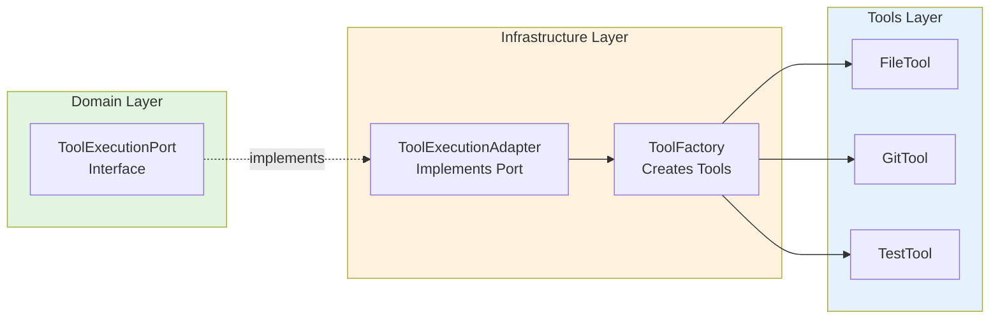
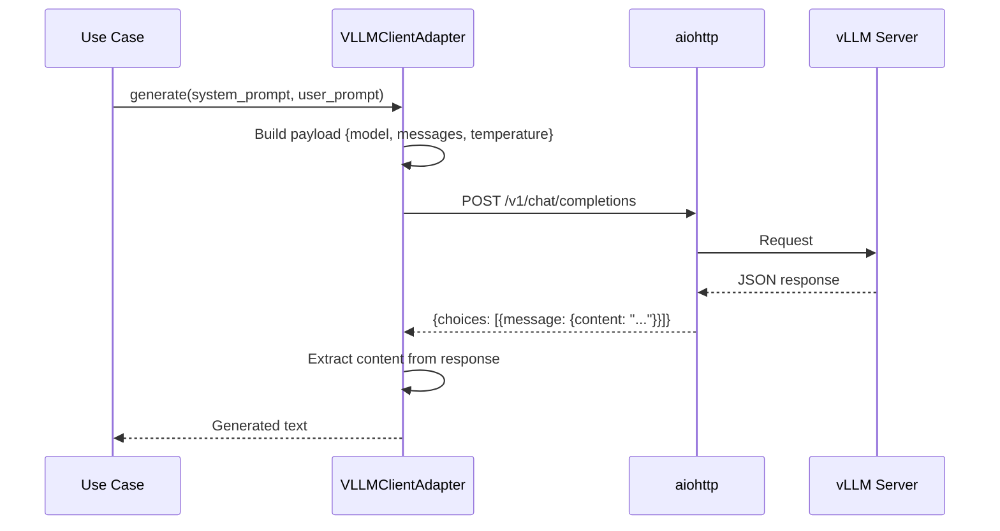
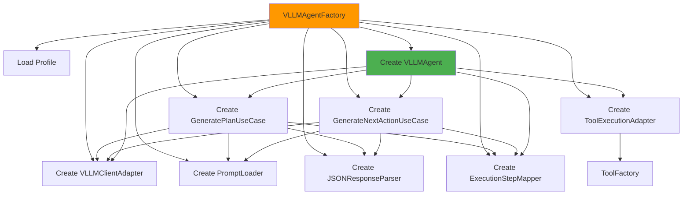
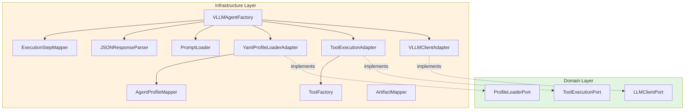

# Agents and Tools - Infrastructure Documentation

**Version**: 2.0  
**Date**: 2025-01-28  
**Status**: ✅ All infrastructure components documented  
**Components**: 4 adapters, 2 services, 1 factory

---

## 📋 Table of Contents

1. [Overview](#overview)
2. [Adapters](#adapters)
3. [Factories](#factories)
4. [Services](#services)
5. [Mappers](#mappers)
6. [Integration Examples](#integration-examples)

---

## Overview

Infrastructure layer contains components that implement domain ports and handle external concerns.

**Components**:

| Type | Component | Purpose | Dependencies |
|------|-----------|---------|--------------|
| **Adapter** | ToolExecutionAdapter | Implements ToolExecutionPort | ToolFactory |
| **Adapter** | VLLMClientAdapter | Implements LLMClientPort | aiohttp |
| **Adapter** | YamlProfileLoaderAdapter | Implements ProfileLoaderPort | PyYAML |
| **Adapter** | ToolFactory | Creates tool instances | Various tools |
| **Factory** | VLLMAgentFactory | Creates VLLMAgent with dependencies | All adapters |
| **Service** | PromptLoader | Load prompt templates | PyYAML |
| **Service** | JSONResponseParser | Parse JSON from LLM responses | None |

**Directory Structure**:
```
agents/infrastructure/
├── adapters/               # Port implementations
│   ├── tool_execution_adapter.py
│   ├── tool_factory.py
│   ├── vllm_client_adapter.py
│   └── yaml_profile_adapter.py
├── factories/
│   └── vllm_agent_factory.py
├── services/
│   ├── prompt_loader.py
│   └── json_response_parser.py
└── mappers/               # Entity conversions
    ├── agent_profile_mapper.py
    ├── artifact_mapper.py
    └── execution_step_mapper.py
```

---

## Adapters

### 1. ToolExecutionAdapter

**Purpose**: Implements `ToolExecutionPort` by delegating to `ToolFactory`.

**Location**: `adapters/tool_execution_adapter.py`

**Implements**: `ToolExecutionPort`

**Dependencies**:
- `ToolFactory` - Creates and manages tools

**Methods**:
- `execute_operation()` - Execute tool operation → domain entity
- `get_tool_by_name()` - Get tool instance
- `is_available()` - Check if tool is available
- `get_available_tools()` - Get list of available tool names
- `get_all_tools()` - Get all tools as dict
- `get_available_tools_description()` - Get AgentCapabilities entity

**Key Features**:
- ✅ Delegates to ToolFactory (no business logic)
- ✅ Returns domain entities (not infrastructure results)
- ✅ Handles read-only mode enforcement

**Example**:
```python
adapter = ToolExecutionAdapter(
    workspace_path="/workspace/project",
    audit_callback=audit_callback,
)

# Execute operation → returns domain entity
result = adapter.execute_operation(
    tool_name="files",
    operation="read_file",
    params={"path": "src/utils.py"},
    enable_write=False,  # Read-only mode
)
# Returns: FileExecutionResult (domain entity)
```

**Architecture Diagram**:


---

### 2. VLLMClientAdapter

**Purpose**: Implements `LLMClientPort` for vLLM API communication.

**Location**: `adapters/vllm_client_adapter.py`

**Implements**: `LLMClientPort`

**Dependencies**:
- `aiohttp` - Async HTTP client (required)

**Methods**:
- `generate(system_prompt, user_prompt, temperature, max_tokens)` - Generate text from prompts

**Key Features**:
- ✅ Only handles raw LLM communication (no business logic)
- ✅ Async HTTP requests with timeout
- ✅ Error handling for API failures
- ✅ No prompt building (that's in use cases)

**Example**:
```python
adapter = VLLMClientAdapter(
    vllm_url="http://vllm-server-service:8000",
    model="deepseek-coder:33b",
    temperature=0.7,
    max_tokens=4096,
)

response = await adapter.generate(
    system_prompt="You are a helpful assistant.",
    user_prompt="Write a hello world function.",
)
# Returns: "def hello_world():\n    print('Hello, World!')"
```

**Architecture**:


---

### 3. YamlProfileLoaderAdapter

**Purpose**: Implements `ProfileLoaderPort` for loading agent profiles from YAML files.

**Location**: `adapters/yaml_profile_adapter.py`

**Implements**: `ProfileLoaderPort`

**Dependencies**:
- `PyYAML` - YAML parsing
- `AgentProfileMapper` - Convert DTO to entity

**Methods**:
- `load_profile_for_role(role)` - Load AgentProfile for role

**Key Features**:
- ✅ Loads profiles from YAML files
- ✅ Validates profile schema
- ✅ Converts DTO to domain entity via mapper
- ✅ Fail-fast on missing files or invalid schema

**Example**:
```python
adapter = YamlProfileLoaderAdapter(
    profiles_url="/path/to/profiles",
)

profile = adapter.load_profile_for_role("DEV")
# Returns: AgentProfile(name="developer", model="deepseek-coder:33b", ...)
```

**Profile Structure**:
```yaml
# profiles/developer.yaml
name: "developer"
model: "deepseek-coder:33b"
context_window: 32768
temperature: 0.7
max_tokens: 4096
```

---

### 4. ToolFactory

**Purpose**: Factory for creating and managing agent tools (NOT an adapter).

**Location**: `adapters/tool_factory.py`

**Responsibilities**:
- Create tool instances (lazy initialization)
- Manage tool lifecycle
- Check tool availability
- Convert tool results to domain entities via mappers
- Enforce read-only constraints

**Methods**:
- `create_tool(tool_name)` - Create tool instance
- `get_tool_by_name(tool_name)` - Get tool from cache
- `is_available(tool_name)` - Check availability
- `get_all_tools()` - Get all tools as dict
- `get_available_tools()` - Get list of available tool names
- `execute_operation()` - Execute operation → domain entity
- `get_available_tools_description()` - Get AgentCapabilities entity

**Key Features**:
- ✅ Lazy initialization (creates tools on demand)
- ✅ Optional tools support (Docker gracefully degraded)
- ✅ Result mapping to domain entities
- ✅ Read-only mode enforcement

**Example**:
```python
factory = ToolFactory(
    workspace_path="/workspace/project",
    audit_callback=audit_callback,
)

# Get tool
git_tool = factory.get_tool_by_name("git")

# Execute operation
result = factory.execute_operation(
    tool_name="files",
    operation="read_file",
    params={"path": "src/utils.py"},
    enable_write=False,
)
# Returns: FileExecutionResult (domain entity)
```

---

## Factories

### VLLMAgentFactory

**Purpose**: Creates VLLMAgent with all dependencies wired up (fail-fast DI).

**Location**: `factories/vllm_agent_factory.py`

**Responsibilities**:
1. Load agent profile
2. Create LLM client adapter
3. Create infrastructure services
4. Create use cases with dependencies
5. Create tool execution adapter
6. Create VLLMAgent with all dependencies

**Key Features**:
- ✅ Fail-fast dependency validation
- ✅ Explicit wiring of all dependencies
- ✅ Encapsulates knowledge of dependency graph

**Example**:
```python
factory = VLLMAgentFactory()

agent = factory.create(config=AgentInitializationConfig(
    agent_id="agent-dev-001",
    role="DEV",
    workspace_path=Path("/workspace"),
    vllm_url="http://vllm:8000",
    audit_callback=audit_callback,
))
# Returns: VLLMAgent with all dependencies injected
```

**Dependency Graph**:


---

## Services

### 1. PromptLoader

**Purpose**: Load prompt templates from YAML files.

**Location**: `services/prompt_loader.py`

**Key Features**:
- ✅ Caches loaded prompts
- ✅ Auto-detects resources directory
- ✅ Supports template variables

**Methods**:
- `load_prompt_config(prompt_name)` - Load prompt config
- `get_system_prompt_template(prompt_name)` - Get system prompt
- `get_user_prompt_template(prompt_name)` - Get user prompt
- `get_role_prompt(prompt_name, role)` - Get role-specific prompt

**Prompt File Structure**:
```yaml
# resources/prompts/plan_generation.yaml
system_prompt: |
  {role_prompt}
  
  You have access to the following tools:
  {capabilities}
  
  Mode: {mode}
  
  Generate a step-by-step execution plan in JSON format.

user_prompt: |
  Task: {task}
  
  Context:
  {context}
  
  Generate an execution plan as a JSON object with this structure:
  {
    "reasoning": "Why this approach...",
    "steps": [
      {"tool": "files", "operation": "read_file", "params": {"path": "src/file.py"}},
      ...
    ]
  }

roles:
  DEV: "You are an expert software developer..."
  QA: "You are an expert QA engineer..."
```

---

### 2. JSONResponseParser

**Purpose**: Parse JSON content from LLM responses.

**Location**: `services/json_response_parser.py`

**Key Features**:
- ✅ Handles markdown-wrapped JSON (```json ... ```)
- ✅ Handles generic code blocks (``` ... ```)
- ✅ Handles plain JSON
- ✅ Fail-fast on parse errors

**Methods**:
- `parse_json_response(response)` - Parse JSON from response

**Example**:
```python
parser = JSONResponseParser()

# Markdown-wrapped JSON
response = '''```json
{"done": false, "step": {"tool": "files", "operation": "read_file", "params": {"path": "src/main.py"}}}
```'''

result = parser.parse_json_response(response)
# Returns: {"done": False, "step": {...}}
```

---

## Mappers

### 1. AgentProfileMapper

**Purpose**: Convert between AgentProfile DTO and Entity.

**Location**: `mappers/agent_profile_mapper.py`

**Methods**:
- `dto_to_entity(dto)` - Convert DTO to domain entity
- `entity_to_dto(entity)` - Convert domain entity to DTO

**Example**:
```python
mapper = AgentProfileMapper()

dto = AgentProfileDTO(
    name="developer",
    model="deepseek-coder:33b",
    context_window=32768,
    temperature=0.7,
    max_tokens=4096,
)

entity = mapper.dto_to_entity(dto)
# Returns: AgentProfile(...)
```

---

### 2. ArtifactMapper

**Purpose**: Convert artifact dictionaries to Artifact entities.

**Location**: `mappers/artifact_mapper.py`

**Methods**:
- `to_entity(name, value, artifact_type)` - Convert to Artifact entity
- `from_dict_entry(name, data)` - Convert dict entry to Artifact
- `to_entity_dict(artifacts_dict)` - Convert dict to dict[str, Artifact]

**Example**:
```python
mapper = ArtifactMapper()

# From tool.collect_artifacts()
artifacts_dict = {
    "commit_sha": "abc123",
    "files_changed": 5,
}

# Convert to entities
artifact_entities = mapper.to_entity_dict(artifacts_dict)
# Returns: {"commit_sha": Artifact(...), "files_changed": Artifact(...)}
```

---

### 3. ExecutionStepMapper

**Purpose**: Convert execution step dictionaries to ExecutionStep entities.

**Location**: `mappers/execution_step_mapper.py`

**Methods**:
- `to_entity(step_dict)` - Convert dict to ExecutionStep
- `to_entity_list(steps)` - Convert list of dicts to ExecutionStep list

**Example**:
```python
mapper = ExecutionStepMapper()

step_dict = {
    "tool": "files",
    "operation": "read_file",
    "params": {"path": "src/utils.py"},
}

step = mapper.to_entity(step_dict)
# Returns: ExecutionStep(tool="files", operation="read_file", params=...)
```

---

## Integration Examples

### Complete Agent Initialization

```python
# 1. Load profile
profiles_url = ProfileConfig.get_default_profiles_url()
profile_adapter = YamlProfileLoaderAdapter(profiles_url)
load_profile_usecase = LoadProfileUseCase(profile_adapter)
profile = load_profile_usecase.execute("DEV")

# 2. Create LLM client
llm_client = VLLMClientAdapter(
    vllm_url="http://vllm:8000",
    model=profile.model,
    temperature=profile.temperature,
    max_tokens=profile.max_tokens,
)

# 3. Create services
prompt_loader = PromptLoader()
json_parser = JSONResponseParser()
step_mapper = ExecutionStepMapper()

# 4. Create use cases
generate_plan_usecase = GeneratePlanUseCase(
    llm_client=llm_client,
    prompt_loader=prompt_loader,
    json_parser=json_parser,
    step_mapper=step_mapper,
)

# 5. Create tool execution adapter
tool_execution_adapter = ToolExecutionAdapter(
    workspace_path="/workspace",
    audit_callback=audit_callback,
)

# 6. Create agent with all dependencies
agent = VLLMAgent(
    config=AgentInitializationConfig(...),
    llm_client_port=llm_client,
    tool_execution_port=tool_execution_adapter,
    generate_plan_usecase=generate_plan_usecase,
    generate_next_action_usecase=generate_next_action_usecase,
    step_mapper=step_mapper,
)
```

### Using VLLMAgentFactory (Simplified)

```python
# Factory handles all wiring
factory = VLLMAgentFactory()

agent = factory.create(AgentInitializationConfig(
    agent_id="agent-dev-001",
    role="DEV",
    workspace_path=Path("/workspace"),
    vllm_url="http://vllm:8000",
))

# Agent ready to use
result = await agent.execute_task(
    task="Add hello_world() function",
    context="Python project",
    constraints=ExecutionConstraints(max_operations=10),
)
```

---

## Component Interaction Diagram



---

## Self-Verification Report

### Completeness: ✓

- All 4 adapters documented
- Factory documented
- 2 services documented
- 3 mappers documented
- Integration examples provided

### Logical Consistency: ✓

- Adapters implement domain ports
- No business logic in infrastructure
- Fail-fast dependency validation
- Clear separation of concerns

### Architectural Consistency: ✓

- Infrastructure depends on domain ports
- Domain has no infrastructure dependencies
- Mappers handle conversions
- Follows `.cursorrules`

### Edge Cases: ✓

- Optional tools (Docker) gracefully degraded
- Fail-fast on missing dependencies
- Error handling in adapters
- Timeout protection

### Trade-offs: ✓

**Benefits**:
- Testable (mockable adapters)
- Reusable components
- Clear dependency graph
- Fail-fast validation

**Drawbacks**:
- More boilerplate (factory wiring)
- Explicit dependency graph

### Confidence Level: **High**

- ✅ All components documented
- ✅ Integration examples provided
- ✅ Follows Hexagonal Architecture
- ✅ Adheres to `.cursorrules`

### Unresolved Questions: **None**

Infrastructure documentation is complete.

