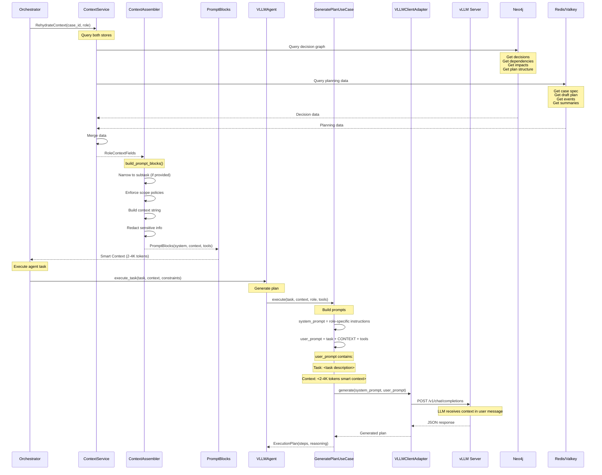
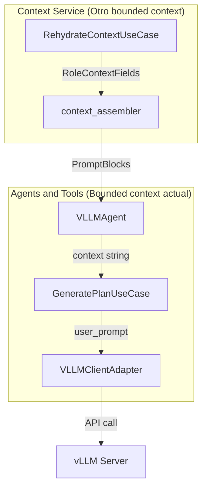

# Context Rehydration Flow - Cómo se pasa contexto al LLM

**Fecha**: 26 Oct 2025
**Estado**: Análisis del flujo actual
**Relación**: Rehidratación → Prompt Blocks → LLM

---

## 🎯 Resumen

El sistema usa **Smart Context** (2-4K tokens) filtrado y relevante, en lugar de dumpear todo el repo (1M+ tokens).

Flujo:
1. **Context Service** rehydrata datos de **Neo4j + Redis/Valkey**
2. **context_assembler** construye prompt blocks estructurados
3. **VLLMAgent** recibe contexto en `execute_task(context=...)`
4. **Use cases** pasan contexto al LLM vía prompts

**Fuentes de datos**:
- **Neo4j**: Decision graph (decisiones, dependencias, impactos)
- **Redis/Valkey**: Case specs, draft plans, planning events, summaries

---

## 📊 Flujo Completo



---

## 🔍 Detalles por Componente

### 1. Context Rehydration

**Ubicación**: `core/context/session_rehydration.py`

```python
class SessionRehydrationUseCase:
    def __init__(
        self,
        planning_store: PlanningReadPort,  # ← Redis/Valkey
        graph_store: DecisionGraphReadPort,  # ← Neo4j
    ):
        self.plan_store = planning_store
        self.graph = graph_store
    
    def build(self, request: RehydrationRequest) -> RehydrationBundle:
        # 1. Read from Neo4j (decision graph)
        decisions = self.graph.list_decisions(req.case_id)
        decision_dependencies = self.graph.list_decision_dependencies(req.case_id)
        decision_impacts = self.graph.list_decision_impacts(req.case_id)
        
        # 2. Read from Redis/Valkey (planning data)
        spec = self.plan_store.get_case_spec(req.case_id)
        redis_plan = self.plan_store.get_plan_draft(req.case_id)
        events = self.plan_store.get_planning_events(req.case_id)
        
        # 3. Merge both sources into RoleContextFields
        # Retorna bundle con packs por rol
```

**Qué hace**:
- **Desde Neo4j**: Consulta decision graph (decisiones, dependencias, impactos, estructura del plan)
- **Desde Redis/Valkey**: Obtiene case spec, draft plan, planning events, summaries
- **Merge**: Combina ambos en `RoleContextFields`
- **Retorna**: Bundle con datos filtrados por rol

---

### 2. Context Assembler

**Ubicación**: `core/context/context_assembler.py`

**Función clave**: `build_prompt_blocks()`

```python
def build_prompt_blocks(
    rehydrator: SessionRehydrationUseCase,
    case_id: str,
    role: str,
    phase: str,
    current_subtask_id: str | None,
) -> PromptBlocks:
    # 1. Rehydrate context from Neo4j
    role_context_fields = _rehydrate_context_data(rehydrator, case_id, role)

    # 2. Narrow to specific subtask if provided
    if current_subtask_id:
        role_context_fields = _narrow_pack_to_subtask(role_context_fields, current_subtask_id)

    # 3. Enforce scope policies
    _enforce_scope_policies(policy, role_context_fields, phase, role)

    # 4. Build context string
    context_text = _build_context(role_context_fields, current_subtask_id)

    # 5. Redact sensitive information
    redacted_context = policy.redact(role, context_text)

    # 6. Return PromptBlocks
    return PromptBlocks(
        system=_build_system(role, title),
        context=redacted_context,  # ← CONTEXTO QUE VA AL LLM
        tools=_build_tools_message()
    )
```

**Datos incluidos en contexto**:
- **Case header**: Título y descripción del caso *(de Redis)*
- **Plan header**: ID del plan y versión *(de Neo4j o Redis)*
- **Role subtasks**: Subtasks relevantes para el rol *(de Redis draft plan)*
- **Relevant decisions**: Decisiones del grafo Neo4j *(de Neo4j)*
- **Decision dependencies**: Dependencias entre decisiones *(de Neo4j)*
- **Impacted subtasks**: Subtasks impactadas *(de Neo4j)*
- **Recent milestones**: Últimos 10 milestones *(de Redis planning events)*
- **Last summary**: Resumen previo *(de Redis)*

**Distribución de fuentes**:
| Dato | Fuente | Tipo |
|------|--------|------|
| Case spec | Redis/Valkey | Estructurado (JSON) |
| Draft plan | Redis/Valkey | Estructurado (JSON) |
| Planning events | Redis/Valkey | Stream de eventos |
| Decisions | Neo4j | Graph queries |
| Dependencies | Neo4j | Graph edges |
| Impacts | Neo4j | Graph relationships |
| Plan structure | Neo4j | Graph nodes |

---

### 3. VLLMAgent Recibe Contexto

**Ubicación**: `core/agents_and_tools/agents/vllm_agent.py`

```python
async def execute_task(
    self,
    task: str,
    context: str = "",  # ← SMART CONTEXT (2-4K tokens)
    constraints: dict | None = None,
) -> AgentResult:
    # ... usa context para generar plan ...

    plan = await self._generate_plan(task, context, constraints)
```

**Cómo se pasa**:
- El agente recibe `context` como string
- Este string viene de `PromptBlocks.context`
- Es texto plano, formateado, redactado

---

### 4. Use Case Construye Prompt con Contexto

**Ubicación**: `core/agents_and_tools/agents/application/usecases/generate_plan_usecase.py`

```python
async def execute(
    self,
    task: str,
    context: str,  # ← CONTEXTO AQUÍ
    role: str,
    available_tools: dict,
    constraints: dict,
) -> dict:
    # Build system prompt (role-specific)
    system_prompt = role_prompts.get(role)
    system_prompt += f"You have access to the following tools:\n{tools_json}"

    # Build user prompt - CONTEXTO SE PASA AQUÍ
    user_prompt = f"""Task: {task}

Context:  # ← CONTEXTO VA EN EL USER PROMPT
{context}

Generate an execution plan...
"""

    # Call LLM with context in user prompt
    response = await self.llm_client.generate(system_prompt, user_prompt)
```

**Formato del prompt para LLM**:
```
System Prompt:
"You are an expert DEV engineer focused on writing clean code.
You have access to the following tools:
{...}
Mode: full
Generate a step-by-step execution plan in JSON format."

User Prompt:
"Task: Add JWT authentication to login endpoint

Context:  ← 2-4K TOKENS AQUÍ
Story: US-123 - Add JWT authentication
Phase: BUILD
Role: DEV

Relevant Decisions (from Neo4j):
- Decision-042: Use JWT tokens (ARCHITECT, 2025-10-10)
- Decision-051: Store sessions in Redis (DATA, 2025-10-12)

Existing Code Structure:
- src/auth/middleware.py exists (uses simple auth)
- src/models/user.py has User model
- Redis client at src/db/redis_client.py

Dependencies:
- pyjwt==2.8.0 already installed

Test Coverage:
- auth module: 60% (needs improvement)

Generate an execution plan..."
```

---

## 🎯 Innovación Clave

### ❌ Lo que hacen otros sistemas

```
User: "Implement login"
Context: <TODO EL REPO>  # 1M+ tokens
```

Problemas:
- Llama costosa (muchos tokens)
- Latencia alta
- LLM se confunde con información irrelevante
- Escalamiento imposible

### ✅ Lo que hace SWE AI Fleet

```
User: "Implement login"
Context: <DATOS FILTRADOS POR ROL/PHASE/SUBTASK>  # 2-4K tokens
```

Ventajas:
- ✅ Llama barata (pocos tokens)
- ✅ Latencia baja
- ✅ LLM se enfoca en lo relevante
- ✅ Escalable a proyectos grandes
- ✅ Contexto dinámico (se actualiza con el grafo)

---

## 📊 Ejemplo Real

### Paso 1: Context Service Rehydratate

```python
# En AgentJobWorker
ctx = RehydrateContextUseCase(self.gq, self.pr).execute(
    sprint_id="sprint-001",
    role="DEV"
)

# Retorna:
{
    "case_id": "case-123",
    "role": "DEV",
    "tasks": [...],
    "decisions": [...],
    "milestones": [...]
}
```

### Paso 2: Context Assembler construye prompt

```python
# En context_assembler.py
prompt_blocks = build_prompt_blocks(
    rehydrator=rehydrator,
    case_id="case-123",
    role="DEV",
    phase="BUILD",
    current_subtask_id="task-456"
)

# Retorna:
PromptBlocks(
    system="You are the DEV agent working on case 'Implement Login'...",
    context="""Story: Implement Login
               Phase: BUILD
               Role: DEV

               Relevant Decisions:
               - D-042: Use JWT tokens
               - D-051: Store in Redis

               Existing Code:
               - src/auth/middleware.py exists
               - User model at src/models/user.py

               Dependencies:
               - pyjwt==2.8.0 installed
               ...""",
    tools="You may call tools approved for your role..."
)
```

### Paso 3: VLLMAgent recibe contexto

```python
# En VLLMAgent
result = await agent.execute_task(
    task="Add JWT token generation to login endpoint",
    context=prompt_blocks.context,  # ← CONTEXTO AQUÍ
    constraints={"enable_tools": True}
)
```

### Paso 4: Use Case construye prompt final

```python
# En GeneratePlanUseCase
user_prompt = f"""Task: Add JWT token generation to login endpoint

Context:  # ← CONTEXTO SE INSERTA AQUÍ
{prompt_blocks.context}

Generate an execution plan as a JSON object...
"""

response = await self.llm_client.generate(system_prompt, user_prompt)
```

### Paso 5: LLM recibe contexto en el mensaje de usuario

```
System: "You are an expert DEV engineer..."
User: "Task: Add JWT...

Context: Story: Implement Login...
         Phase: BUILD...
         ... (2-4K tokens) ...

Generate a plan..."
```

---

## 🔗 Relación con Arquitectura Hexagonal

El contexto fluye a través de las capas:



---

## ✅ Conclusión

**Cómo se pasa contexto al LLM**:

1. **Context Service** rehydrata desde Neo4j
2. **context_assembler** construye string de contexto (2-4K tokens)
3. **VLLMAgent** recibe string como parámetro `context`
4. **GeneratePlanUseCase** inserta contexto en `user_prompt`
5. **VLLMClientAdapter** llama a API con prompt que incluye contexto
6. **vLLM Server** recibe contexto en mensaje de usuario

**Innovación**: Contexto inteligente y filtrado, no dump masivo del repo.

