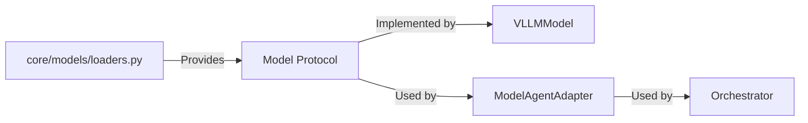
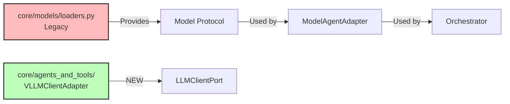

# Decision: core/models/loaders.py Status

**Fecha**: 26 Oct 2025
**Contexto**: Bounded context "Agents and Tools" refactor
**Decision**: Status and relationship with VLLMClientAdapter

---

## 🤔 Situación Actual

El archivo `core/models/loaders.py` define:

1. **Protocol `Model`**: Interfaz para inferencia LLM
2. **Implementaciones**:
   - `LlamaCppModel` (TODO)
   - `OllamaModel` (implementado)
   - `VLLMModel` (implementado)
3. **Factory**: `get_model_from_env()`

## 🔗 Relación con Refactor Actual

### Antes del Refactor



### Después del Refactor (Agents and Tools)



---

## 📊 Uso Actual

**Usado por Orchestrator**:
- `core/orchestrator/domain/agents/model_adapter.py`
- `core/orchestrator/domain/agents/agent_factory.py`
- `core/orchestrator/infrastructure/executor/real_agent_executor.py`

**NO usado por Agents and Tools**:
- VLLMAgent usa `VLLMClientAdapter` + `LLMClientPort`
- Bounded context es independiente

---

## 🎯 Opciones

### Opción A: Mantener Separado (Recomendado)

**Pros**:
- Bounded contexts independientes
- Orchestrator no se ve afectado
- Menos riesgo de breaking changes

**Contras**:
- Duplicación (VLLMModel vs VLLMClientAdapter)
- Mantenimiento de dos rutas

### Opción B: Consolidar

**Pros**:
- Single source of truth
- Menos duplicación de código

**Contras**:
- Cambios en loaders.py afectan a Orchestrator
- Acoplamiento entre bounded contexts
- Alto riesgo de breaking changes

### Opción C: Marcar loaders.py como Legacy

**Pros**:
- Claridad sobre estado del código
- Puede migrarse gradualmente

**Contras**:
- Código legacy en proyecto activo

---

## ✅ Decisión: Opción A - Mantener Separado

**Razón**: Arquitectura hexagonal permite bounded contexts independientes.

**Estado**:
- ✅ `core/models/loaders.py` sigue siendo usado por **Orchestrator**
- ✅ `core/agents_and_tools/` es **independiente** con su propia arquitectura
- ✅ No hay conflicto: son bounded contexts diferentes

**Acción**: Documentar esta separación y mantener ambos sistemas funcionando.

---

## 📝 Relación Técnica

### VLLMModel (loaders.py) - Orchestrator

```python
# Uso en Orchestrator
from core.models.loaders import VLLMModel

model = VLLMModel(model="llama3.1", endpoint="http://vllm:8000/v1")
agent = ModelAgentAdapter(model=model, agent_id="...", role="DEV")
```

### VLLMClientAdapter (agents_and_tools) - Agents

```python
# Uso en Agents
from core.agents_and_tools.agents import VLLMAgent

agent = VLLMAgent(
    agent_id="agent-dev-001",
    role="DEV",
    workspace_path="/workspace",
    vllm_url="http://vllm:8000"
)
```

---

## 🔄 Migración Futura (Opcional)

Si en el futuro se quiere consolidar:

1. **Paso 1**: Hacer que `VLLMClientAdapter` implemente el protocolo `Model`
2. **Paso 2**: Actualizar `ModelAgentAdapter` para usar la nueva implementación
3. **Paso 3**: Deprecar `VLLMModel` y usar `VLLMClientAdapter` en su lugar
4. **Paso 4**: Eliminar `loaders.py`

**Timeline**: No prioritario, posible en M5 o posterior.

---

## 📊 Conclusión

**Estado actual**: ✅ Funciona correctamente con separación clara

**loaders.py**:
- ✅ Usado por Orchestrator (legítimo)
- ✅ Independiente de Agents and Tools
- ✅ No requiere cambios inmediatos

**Agents and Tools**:
- ✅ Usa VLLMClientAdapter con arquitectura hexagonal
- ✅ Independiente de Orchestrator
- ✅ Bounded context autocontenido

**Acción requerida**: Ninguna. Ambos sistemas coexisten pacíficamente.
