# SWE AI Fleet — Microservices Architecture

**Last Updated:** 2025-11-07
**Status:** ✅ Production (6 microservices deployed)
**Architecture:** Domain-Driven Design (DDD) + Hexagonal (Ports & Adapters)

---

## 🎯 Executive Summary

SWE AI Fleet is a **microservices-based AI software development platform** with:

- **6 production microservices** (all Python 3.13+)
- **Event-driven architecture** (NATS JetStream)
- **gRPC synchronous APIs** (Protocol Buffers)
- **DDD + Hexagonal Architecture** (all services)
- **Knowledge graph backend** (Neo4j + Valkey cache)
- **GPU-accelerated agents** (Ray + vLLM)
- **RBAC Levels 1, 2, 3** (tool, workflow, data access control)

---

## 🏗️ Architecture Overview

### Technology Stack

- **Backend:** Python 3.13+ (async/await, type hints)
- **Async Messaging:** NATS JetStream (event-driven, durable consumers)
- **Sync RPC:** gRPC + Protocol Buffers (type-safe APIs)
- **Agent Execution:** Ray 2.49+ (distributed, GPU-accelerated)
- **LLM Backend:** vLLM (Qwen 7B-13B, self-hosted)
- **Databases:** Neo4j (graph) + Valkey (Redis-compatible cache)
- **Container Runtime:** Podman + CRI-O
- **Orchestration:** Kubernetes 1.28+
- **Architecture:** DDD + Hexagonal (Ports & Adapters)

### Design Principles

1. **API-First:** All contracts (gRPC protobuf) defined before implementation
2. **Event-Driven:** Domain events propagate via NATS JetStream
3. **DDD Bounded Contexts:** Each service owns clear domain boundary
4. **Hexagonal Architecture:** Domain → Application → Infrastructure layers
5. **Type Safety:** Full type hints, protobuf contracts, mypy validation
6. **Fail-Fast:** No silent errors, explicit validation
7. **Test-Driven:** >90% coverage on new code

---

## 📦 Microservices (Production)

### 1. Orchestrator Service

**Port:** 50055 (gRPC)
**Language:** Python
**Status:** ✅ Production

**Responsibilities:**
- Multi-agent deliberation orchestration
- Council management (create, query deliberations)
- Task dispatch to agents
- Agent response collection and scoring
- Deliberation result aggregation
- Context assembly coordination

**Domain Concepts:**
- Council (group of 3 agents)
- Deliberation (discussion round)
- Proposal (agent submission)
- AgentResponse (work result)
- Statistics (scoring, metrics)

**Integrations:**
- → Context Service (gRPC) - Get surgical context
- → Ray Executor (gRPC) - Execute agent tasks
- ← NATS (agent.responses) - Agent work results
- → NATS (deliberation.completed) - Publish results

**APIs:**
- `CreateCouncil()` - Create deliberation council
- `GetCouncilInfo()` - Query council status
- `GetDeliberationResult()` - Get final result

**Tests:** 142 passing
**Coverage:** 65%

---

### 2. Context Service

**Port:** 50054 (gRPC)
**Language:** Python
**Status:** ✅ Production

**Responsibilities:**
- Knowledge graph context assembly (Neo4j)
- Surgical context extraction (precision context technology)
- Role-scoped context (different context per agent role)
- Session rehydration
- Context caching (Valkey)
- Timeline event storage

**Domain Concepts:**
- ContextSection (code, decisions, plans, cases)
- RoleContextFields (what each role sees)
- PromptScope (role-specific filtering)
- SessionBundle (rehydration data)

**Integrations:**
- ← Orchestrator (gRPC) - Context requests
- → Neo4j - Knowledge graph queries
- → Valkey - Cache reads/writes
- → NATS (context.updated) - Publish context changes

**APIs:**
- `GetContext()` - Get surgical context for task
- `RehydrateSession()` - Restore session context
- `ProjectEvent()` - Project event to graph

**Coverage:** 96%

---

### 3. Planning Service

**Port:** 50051 (gRPC)
**Language:** Python
**Status:** ✅ Production

**Responsibilities:**
- Story lifecycle FSM (13 states: draft → ready → executing → done)
- Story approval/rejection flow
- Decision management (PO decisions)
- DoR (Definition of Ready) validation
- Story-task relationship tracking
- Story state transitions (event-driven)

**Domain Concepts:**
- Story (aggregate root)
- StoryState (FSM: draft, ready_for_execution, executing, done, etc.)
- Decision (PO approval/rejection)
- Brief (story description)
- DorScore (quality score)

**Integrations:**
- → NATS (planning.story.transitioned) - Story state changes
- → Neo4j - Story persistence
- → Valkey - Story caching

**APIs:**
- `CreateStory()` - Create user story
- `TransitionStory()` - FSM state transition
- `ApproveDecision()` - PO approves story
- `RejectDecision()` - PO rejects with feedback
- `ListStories()` - Query stories

**Tests:** 278 passing
**Coverage:** 95%

---

### 4. Workflow Service ✨ NEW

**Port:** 50056 (gRPC)
**Language:** Python
**Status:** ✅ Ready to Deploy (RBAC Level 2)

**Responsibilities:**
- Task workflow FSM (9 states: todo → implementing → reviewing → done)
- RBAC Level 2: Workflow Action Control
- WHO can do WHAT actions (FSM + role enforcement)
- Task assignment and claiming
- Validation requests (Architect, QA, PO)
- Workflow state persistence
- Task-level audit trail

**Domain Concepts:**
- WorkflowState (aggregate root, task FSM)
- StateTransition (audit trail)
- Action (RBAC action: claim_task, approve_design, etc.)
- Role (developer, architect, qa, po)
- WorkflowStateMachine (FSM engine)

**Integrations:**
- ← Planning Service (planning.story.transitioned) - Create task workflows
- ← Agent work (agent.work.completed) - Execute workflow actions
- → NATS (workflow.task.assigned) - Assign tasks to agents
- → NATS (workflow.validation.required) - Request validations
- → Neo4j - Workflow persistence
- → Valkey - Workflow caching (no TTL, persistent)

**APIs:**
- `GetWorkflowState()` - Query task workflow state
- `RequestValidation()` - Execute workflow action (RBAC enforced)
- `GetPendingTasks()` - Get tasks for role
- `ClaimTask()` - Claim task (transition to active)

**RBAC Enforcement:**
- Developer: claim_task, commit_code, revise_code
- Architect: claim_review, approve_design, reject_design
- QA: claim_testing, approve_tests, reject_tests
- PO: approve_story, reject_story, discard_task
- System: auto-routing (auto_route_to_architect, etc.)

**Tests:** 138 passing
**Coverage:** 94%

**Created:** 2025-11-07 (RBAC Level 2 implementation)

---

### 5. Ray Executor Service

**Port:** 50057 (gRPC)
**Language:** Python
**Status:** ✅ Production

**Responsibilities:**
- Execute agent tasks on Ray cluster
- GPU worker management
- vLLM agent initialization
- Task result collection
- Agent execution lifecycle

**Domain Concepts:**
- AgentTask (execution request)
- AgentResult (execution response)
- ExecutionRequest (task + context)
- VLLMAgent (GPU-accelerated agent)

**Integrations:**
- ← Orchestrator (gRPC) - Task execution requests
- → Ray Cluster - Distributed execution
- → vLLM - LLM inference (Qwen 7B-13B)

**APIs:**
- `ExecuteTask()` - Execute agent task on Ray cluster
- `GenerateProposal()` - Generate proposal (simplified)

**Coverage:** 90%

---

### 6. Monitoring Service

**Port:** 8080 (HTTP)
**Language:** Python
**Status:** ✅ Production

**Responsibilities:**
- System health monitoring
- NATS stream monitoring (consumers, messages)
- Orchestrator health checks
- Service status dashboard
- Metrics collection

**Domain Concepts:**
- StreamInfo (NATS stream metadata)
- OrchestratorInfo (orchestrator status)
- CouncilInfo (deliberation metrics)
- AgentInfo (agent status)

**Integrations:**
- → NATS - Stream queries
- → Orchestrator (gRPC) - Health checks
- → HTTP UI - Dashboard

**APIs:**
- HTTP endpoints for dashboard
- `/health` - System health
- `/streams` - NATS stream status
- `/orchestrator` - Orchestrator info

**Tests:** 305 passing
**Coverage:** 98%

---

## 🔄 Service Interaction Patterns

### Event-Driven Flow (NATS)


### Synchronous RPC Flow (gRPC)


---

## 🎯 Domain-Driven Design (DDD)

### Bounded Contexts

| Context | Service | Responsibility | Events Published |
|---------|---------|----------------|------------------|
| **Planning** | Planning | Story lifecycle FSM | planning.story.transitioned |
| **Workflow** | Workflow | Task workflow FSM + RBAC L2 | workflow.task.assigned, workflow.validation.required |
| **Deliberation** | Orchestrator | Multi-agent deliberation | deliberation.completed |
| **Context** | Context | Knowledge graph queries | context.updated |
| **Execution** | Ray Executor | Agent task execution | - |
| **Monitoring** | Monitoring | System observability | - |

**Shared Kernel:** `core/shared/domain/` (Action, ActionEnum, ScopeEnum)

### Anti-Corruption Layers

**Workflow Service** consumes events from Planning Service via:
- `PlanningServiceContract` (defines external integration)
- `PlanningEventMapper` (translates external events to domain DTOs)
- `PlanningStoryTransitionedDTO` (validates external data)

This ensures Planning Service can change independently without breaking Workflow.

---

## 🏛️ Hexagonal Architecture (All Services)

### Layer Structure


### Dependency Rules

- ✅ **Domain** depends on NOTHING (pure business logic)
- ✅ **Application** depends on Domain only
- ✅ **Infrastructure** depends on Application + Domain
- ✅ **Infrastructure** implements Ports (defined in Application)
- ✅ **Use Cases** receive dependencies via constructor (Dependency Injection)

### Example: Workflow Service

```
services/workflow/
├── domain/                      🟢 DOMAIN
│   ├── entities/
│   │   ├── workflow_state.py    (aggregate root)
│   │   └── state_transition.py  (audit trail)
│   ├── value_objects/
│   │   ├── task_id.py
│   │   ├── role.py
│   │   └── workflow_state_enum.py
│   ├── services/
│   │   ├── workflow_state_machine.py  (FSM engine)
│   │   └── workflow_transition_rules.py
│   └── exceptions/
│       └── workflow_transition_error.py
│
├── application/                 🔵 APPLICATION
│   ├── usecases/
│   │   ├── execute_workflow_action_usecase.py
│   │   ├── get_workflow_state_usecase.py
│   │   └── initialize_task_workflow_usecase.py
│   ├── dto/
│   │   ├── planning_event_dto.py
│   │   └── state_transition_dto.py
│   ├── ports/
│   │   ├── workflow_state_repository_port.py  (interface)
│   │   └── messaging_port.py                  (interface)
│   └── contracts/
│       └── planning_service_contract.py  (anti-corruption)
│
└── infrastructure/              🟠 INFRASTRUCTURE
    ├── adapters/
    │   ├── neo4j_workflow_adapter.py     (implements Port)
    │   ├── valkey_workflow_cache_adapter.py
    │   ├── nats_messaging_adapter.py
    │   └── environment_configuration_adapter.py
    ├── consumers/
    │   ├── planning_events_consumer.py   (NATS handler)
    │   └── agent_work_completed_consumer.py
    ├── mappers/
    │   ├── grpc_workflow_mapper.py       (protobuf ↔ domain)
    │   ├── workflow_event_mapper.py      (NATS ↔ domain)
    │   ├── planning_event_mapper.py
    │   └── state_transition_mapper.py
    ├── grpc_servicer.py                  (gRPC handler)
    └── server.py                         (main entry point)
```

**Key Patterns:**
- Entities are immutable (`@dataclass(frozen=True)`)
- Use Cases orchestrate (no infrastructure code)
- Adapters implement Ports (DI via constructor)
- Mappers handle ALL serialization (DTOs don't have `to_dict()`)
- Consumers delegate to Use Cases (thin wrappers)
- Tell, Don't Ask (domain methods encapsulate state access)

---

## 🔄 System Architecture Diagram

```mermaid
graph TB
    PO[👤 Product Owner<br/>Human] -->|gRPC| Planning

    subgraph Core["Core Services"]
        Planning[📅 Planning<br/>:50051<br/>Story FSM]
        Workflow[🔄 Workflow<br/>:50056<br/>Task FSM<br/>RBAC L2]
        Orch[🎯 Orchestrator<br/>:50055<br/>Deliberation]
        Context[🧠 Context<br/>:50054<br/>Knowledge Graph]
    end

    subgraph Execution["Execution Layer"]
        RayExec[⚡ Ray Executor<br/>:50057<br/>GPU workers]
        Ray[☁️ RayCluster<br/>vLLM agents]
    end

    subgraph Observability["Observability"]
        Monitor[📊 Monitoring<br/>:8080<br/>Health dashboard]
    end

    subgraph Infrastructure["Infrastructure"]
        NATS[📨 NATS JetStream<br/>Event Backbone]
        Neo4j[(🗄️ Neo4j<br/>Graph DB)]
        Valkey[(💾 Valkey<br/>Cache)]
    end

    Planning -->|planning.story.transitioned| NATS
    NATS -->|planning events| Workflow

    Workflow -->|workflow.task.assigned| NATS
    NATS -->|task assigned| Orch

    Orch -->|gRPC| Context
    Orch -->|gRPC| RayExec
    RayExec --> Ray

    Ray -->|agent.work.completed| NATS
    NATS -->|work completed| Workflow

    Planning -.-> Neo4j
    Workflow -.-> Neo4j
    Context -.-> Neo4j

    Planning -.-> Valkey
    Workflow -.-> Valkey
    Context -.-> Valkey

    Monitor -.-> NATS
    Monitor -.-> Orch

    style Planning fill:#c5cae9
    style Workflow fill:#bbdefb
    style Orch fill:#b2dfdb
    style Context fill:#fff9c4
    style RayExec fill:#c8e6c9
    style Ray fill:#dcedc8
    style Monitor fill:#ffccbc
    style NATS fill:#f8bbd0
    style Neo4j fill:#d1c4e9
    style Valkey fill:#ffccbc
```



---

## 📡 Communication Patterns

### Asynchronous (NATS JetStream)

**Pattern:** Event-Driven, Durable Consumers

**Streams:**
- `PLANNING_EVENTS` - Story state transitions
- `AGENT_WORK` - Agent execution results
- `WORKFLOW_EVENTS` - Task workflow events
- `CONTEXT_EVENTS` - Context updates

**Example Flow:**
```python
# Planning Service publishes event
await nats_client.publish(
    subject="planning.story.transitioned",
    payload={
        "story_id": "story-123",
        "from_state": "draft",
        "to_state": "ready_for_execution",
        "timestamp": "2025-11-07T10:00:00Z"
    }
)

# Workflow Service consumes (durable PULL subscription)
async for msg in pull_subscription:
    event = PlanningEventMapper.from_nats_message(msg.data)
    await initialize_task_workflow_usecase.execute(
        story_id=event.story_id,
        task_id=generate_task_id()
    )
    await msg.ack()
```

**Benefits:**
- Decoupling (services don't know about each other)
- Resilience (messages persist if consumer down)
- At-least-once delivery (with ack)
- Horizontal scaling (multiple consumers)

### Synchronous (gRPC)

**Pattern:** Request-Response, Type-Safe

**Example Flow:**
```python
# Orchestrator calls Context Service
context_response = await context_stub.GetContext(
    GetContextRequest(
        task_id="task-123",
        role="developer",
        scope="implementation"
    )
)

# Type-safe response (protobuf)
surgical_context: str = context_response.context_markdown
```

**Benefits:**
- Type safety (protobuf contracts)
- Request-response semantics
- Streaming support
- Performance (binary protocol)

---

## 🔐 RBAC System (3 Levels)

### Level 1: Tool Access Control ✅ PRODUCTION

**What:** Controls which tools agents can execute

**Rules:**
- Developer: git, file, docker (implementation tools)
- Architect: file, audit (review tools)
- QA: docker, http, db (testing tools)
- DevOps: docker, kubectl, helm (deployment tools)
- Data: db, migrate (data tools)

**Enforcement:** `agents_and_tools` library (policy checks before execution)

**Tests:** 676 passing

**Implemented:** Oct 28, 2025 (PR #95)

### Level 2: Workflow Action Control ✅ PRODUCTION-READY

**What:** Controls which workflow actions agents can execute

**Rules:**
- FSM enforces WHO can do WHAT in WHICH state
- Developer: claim_task (in TODO), commit_code (in IMPLEMENTING)
- Architect: claim_review, approve_design, reject_design (in ARCH_REVIEWING)
- QA: claim_testing, approve_tests, reject_tests (in QA_TESTING)
- PO: approve_story (in PENDING_PO_APPROVAL)

**Enforcement:** Workflow Service (FSM + gRPC API)

**Tests:** 138 passing

**Implemented:** Nov 7, 2025 (commit b88210d)

### Level 3: Data Access Control ⏳ PLANNED

**What:** Controls which data agents can see/modify

**Rules:**
- Story-level isolation (agents only see assigned stories)
- Column-level filtering (developers don't see PO business notes)
- Audit trail for all data access
- Context filtering by role

**Enforcement:** Context Service (graph queries with role filters)

**Tests:** TBD

**ETA:** Nov 14, 2025

---

## 🗄️ Data Architecture

### Neo4j (Knowledge Graph)

**Purpose:** Primary persistence for domain entities

**Data Models:**
- **Planning:** Story nodes, Decision relationships
- **Workflow:** WorkflowState nodes, StateTransition relationships
- **Context:** Code nodes, Decision nodes, relationships (DEPENDS_ON, RELATES_TO)

**Query Pattern:** Cypher queries via adapters

### Valkey (Cache)

**Purpose:** Write-through cache for hot data

**Data Models:**
- **Planning:** Story cache (TTL: 1 hour)
- **Workflow:** WorkflowState cache (no TTL, persistent)
- **Context:** Session cache

**Pattern:** Write-through (write to Neo4j, then cache)

---

## 🚀 Deployment Architecture

### Kubernetes Manifests

```
deploy/k8s/
├── 00-namespace.yaml
├── 01-nats.yaml                    (NATS JetStream StatefulSet)
├── 08-context-service.yaml         (Context deployment)
├── 09-neo4j.yaml                   (Neo4j StatefulSet)
├── 10-valkey.yaml                  (Valkey deployment)
├── 11-orchestrator-service.yaml    (Orchestrator deployment)
├── 12-planning-service.yaml        (Planning deployment)
├── 14-ray-executor.yaml            (Ray Executor deployment)
├── 15-workflow-service.yaml        (Workflow deployment) ✨ NEW
├── 15-nats-streams-init.yaml       (NATS stream creation Job)
└── 13-monitoring-dashboard.yaml    (Monitoring deployment)
```

### Deployment Strategy

**Command:**
```bash
cd scripts/infra && ./fresh-redeploy.sh
```

**Process:**
1. Scale down services with NATS consumers (to 0)
2. Build all images (Podman multi-stage builds)
3. Push to registry (registry.underpassai.com)
4. Update deployments (kubectl set image)
5. Scale services back up (read replicas from YAML)
6. Verify health (kubectl rollout status)

**Duration:** ~10-15 minutes (full rebuild)

**Why scale to 0?** NATS durable consumers (avoid "consumer already bound" errors)

---

## 📊 Service Topology

### Production Configuration

| Service | Replicas | CPU | Memory | GPU | NATS Consumer? |
|---------|----------|-----|--------|-----|----------------|
| **Orchestrator** | 1 | 1 | 2Gi | - | ✅ Yes |
| **Context** | 2 | 1 | 2Gi | - | ✅ Yes |
| **Planning** | 2 | 500m | 1Gi | - | ✅ Yes |
| **Workflow** | 2 | 500m | 1Gi | - | ✅ Yes |
| **Ray Executor** | 1 | 1 | 2Gi | - | ❌ No |
| **Monitoring** | 1 | 500m | 512Mi | - | ✅ Yes |
| **NATS** | 1 | 1 | 1Gi | - | N/A |
| **Neo4j** | 1 | 2 | 4Gi | - | N/A |
| **Valkey** | 1 | 500m | 512Mi | - | N/A |

**Total Resources:** ~7 CPU, ~14Gi RAM (without Ray workers)

### Network Policies

**Internal Services (ClusterIP):**
- All services communicate within cluster
- No external exposure (except via Ingress)

**External Access (Ingress):**
- Monitoring dashboard (optional)
- Ray dashboard (optional)
- PO UI (planned)

---

## 🔒 Security Architecture

### Service Mesh (Planned)

- mTLS between services
- Traffic policies
- Circuit breakers

### RBAC Enforcement

**Level 1 (Tool Access):**
- Policy checks in `agents_and_tools` library
- Fail-fast if tool not allowed for role

**Level 2 (Workflow Actions):**
- FSM + role validation in Workflow Service
- gRPC API returns permission denied if not allowed

**Level 3 (Data Access):**
- Graph queries filtered by role
- Column-level masking
- Audit trail for all queries

---

## 📈 Scalability

### Horizontal Scaling

**Services that scale:**
- Context Service (2+ replicas)
- Planning Service (2+ replicas)
- Workflow Service (2+ replicas)

**Services that DON'T scale:**
- Orchestrator (1 replica - deliberation coordination)
- Ray Executor (1 replica - Ray client)
- Monitoring (1 replica - metrics aggregation)

### GPU Scaling

**Pattern:** Add Ray workers = Add GPU capacity

```
1 GPU = 1 concurrent deliberation
8 GPUs = 8 concurrent deliberations
```

**Proven:** RTX 3090 × 4 with time-slicing (8 virtual GPUs)

---

## 🧪 Testing Strategy

### Test Pyramid

| Level | Count | Coverage | Purpose |
|-------|-------|----------|---------|
| **Unit** | 1,265 | 90% | Business logic isolation |
| **Integration** | ~50 | - | Adapter correctness |
| **E2E** | ~20 | - | Full workflow validation |

**Test Execution:**
```bash
make test-unit         # 1,265 tests, ~20s
make test-integration  # ~50 tests, ~45s
make test-e2e         # ~20 tests, ~3-5min
```

**CI Pipeline:** All tests run on every PR

---

## 📚 API Specifications

### gRPC APIs (Protocol Buffers)

```
specs/
├── orchestrator.proto    (CreateCouncil, GetDeliberationResult)
├── context.proto         (GetContext, ProjectEvent)
├── planning.proto        (CreateStory, TransitionStory)
├── workflow.proto        (GetWorkflowState, RequestValidation) ✨ NEW
└── ray_executor.proto    (ExecuteTask)
```

**Generation:**
- Protobuf → Python stubs (in Dockerfile multi-stage build)
- NOT committed to git (generated at build time)

### NATS Events (AsyncAPI)

**Subjects:**
- `planning.story.transitioned` - Story FSM events
- `workflow.task.assigned` - Task assignments
- `workflow.validation.required` - Validation requests
- `agent.work.completed` - Agent execution results
- `deliberation.completed` - Deliberation outcomes

---

## 🔗 Inter-Service Dependencies


**Critical Path:**
```
PO → Planning → Workflow → Orchestrator → Context → Ray → Workflow → Planning
```

---

## 🎯 Design Decisions

### Why Python (Not Go)?

**Original Plan:** Go for services near frontend

**Reality:** Python for all services

**Reasons:**
1. ✅ Ray integration (Python-native)
2. ✅ vLLM integration (Python libraries)
3. ✅ Neo4j driver (better Python support)
4. ✅ Rapid prototyping (faster iteration)
5. ✅ Type hints (similar to Go static typing)
6. ✅ Async/await (performance adequate for use case)

**Performance:** Not CPU-bound (I/O bound: NATS, gRPC, Neo4j, LLM inference)

### Why NATS (Not Kafka/RabbitMQ)?

**Reasons:**
1. ✅ Lightweight (single binary, <100MB)
2. ✅ JetStream (built-in persistence)
3. ✅ PULL subscriptions (no push overhead)
4. ✅ Durable consumers (resilience)
5. ✅ Request-reply patterns
6. ✅ K8s native (simple StatefulSet)

### Why Neo4j + Valkey (Not PostgreSQL)?

**Neo4j (Primary):**
- Graph relationships (code dependencies, decision history)
- Context traversal (find related decisions/code)
- Cypher queries (expressive, domain-appropriate)

**Valkey (Cache):**
- Write-through cache pattern
- Redis-compatible (drop-in replacement)
- Open source (no licensing issues)

---

## 📊 Metrics & Observability

### Service Metrics

**Each service exposes:**
- Health endpoints (liveness, readiness)
- Structured logging (JSON)
- gRPC reflection (grpcui compatible)

**Monitoring Service provides:**
- NATS stream status
- Service health checks
- Consumer lag monitoring
- HTTP dashboard (:8080)

### Future: Prometheus + Grafana

**Planned metrics:**
- Request latency (p50, p95, p99)
- Error rates
- Queue depths
- GPU utilization
- Deliberation duration

---

## 🔗 Related Documentation

- [RBAC Strategy](./RBAC_REAL_WORLD_TEAM_MODEL.md) - 3-level RBAC design
- [Workflow vs Planning](./PLANNING_VS_WORKFLOW_ORCHESTRATION.md) - Bounded context separation
- [NATS Consumers](./NATS_CONSUMERS_DESIGN.md) - Event consumption patterns
- [Hexagonal Principles](../normative/HEXAGONAL_ARCHITECTURE_PRINCIPLES.md) - Normative architecture
- [Deployment Guide](../operations/DEPLOYMENT.md) - Ops procedures

---

## 📝 Change Log

### 2025-11-07: Major Update

- ✅ Corrected language (Python, not Go)
- ✅ Removed non-existent services (StoryCoach, Workspace)
- ✅ Added Workflow Service (RBAC L2)
- ✅ Added Orchestrator, Ray Executor, Monitoring
- ✅ Updated architecture diagrams (Mermaid)
- ✅ Added Hexagonal Architecture explanation
- ✅ Added RBAC 3-level system
- ✅ Corrected ports and topology
- ✅ Added deployment strategy

### Previous: 2025-10-21

- Original document (now obsolete)

---

**Maintained by:** Tirso García Ibáñez (Software Architect)
**Review Frequency:** After each microservice change
**Next Review:** After RBAC L3 implementation (Nov 14, 2025)
