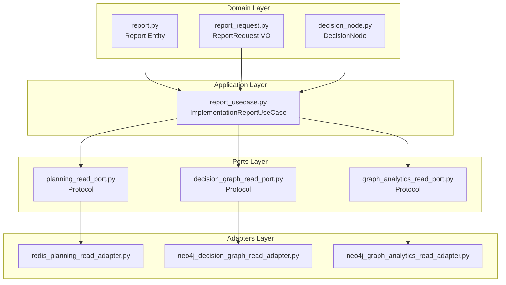
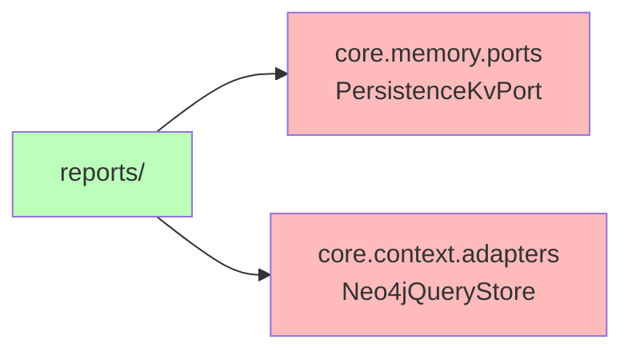

# Reports Module - Análisis Arquitectónico

**Fecha**: 26 Oct 2025
**Ubicación**: `core/reports/`
**Estado**: Análisis sin modificaciones
**Relación con refactor actual**: Pendiente de decisión

---

## 📊 Estructura Actual

```
core/reports/
├── __init__.py
├── report_usecase.py           # Use case principal
├── decision_enriched_report.py # Decision enrichment
│
├── ports/                       # Interfases (Protocols)
│   ├── planning_read_port.py           # Leer planning (Redis)
│   ├── decision_graph_read_port.py     # Leer decision graph (Neo4j)
│   └── graph_analytics_read_port.py     # Analíticas del grafo (Neo4j)
│
├── adapters/                    # Implementaciones
│   ├── redis_planning_read_adapter.py       # Redis para planning events
│   ├── neo4j_decision_graph_read_adapter.py # Neo4j para decision graph
│   ├── neo4j_graph_analytics_read_adapter.py # Neo4j para analíticas
│   └── neo4j_query_store.py                 # Wrapper Neo4j
│
├── domain/                      # Entidades de dominio
│   ├── report.py                        # Aggregate root
│   ├── report_request.py                # Value Object
│   ├── decision_node.py                 # Decision entity
│   ├── decision_edges.py                # Edges (dependencies)
│   ├── decision_enriched_report.py      # Enriched report
│   ├── subtask_node.py                  # Subtask entity
│   └── graph_analytics_types.py         # Analytics types
│
└── dtos/                        # Data Transfer Objects
    └── dtos.py                          # CaseSpec, PlanningEvent, etc.
```

---

## 🏗️ Arquitectura Hexagonal (¡YA IMPLEMENTADA!)

Este módulo **YA tiene arquitectura hexagonal completa**:



---

## 🔍 Análisis de Componentes

### 1. Ports (Contratos)

#### `PlanningReadPort`
```python
class PlanningReadPort(Protocol):
    def get_case_spec(self, case_id: str) -> CaseSpecDTO | None
    def get_plan_draft(self, case_id: str) -> PlanVersionDTO | None
    def get_planning_events(self, case_id: str, count: int) -> list[PlanningEventDTO]
    def save_report(self, case_id: str, report: Report, ttl_seconds: int) -> None
```

**Responsabilidad**: Acceso a datos de planning (Redis)
**Implementaciones**: `RedisPlanningReadAdapter`

#### `DecisionGraphReadPort`
```python
class DecisionGraphReadPort(Protocol):
    def get_plan_by_case(self, case_id: str) -> PlanVersionDTO | None
    def list_decisions(self, case_id: str) -> list[DecisionNode]
    def list_decision_dependencies(self, case_id: str) -> list[DecisionEdges]
    def list_decision_impacts(self, case_id: str) -> list[tuple[str, SubtaskNode]]
```

**Responsabilidad**: Consultas a grafo de decisiones (Neo4j)
**Implementaciones**: `Neo4jDecisionGraphReadAdapter`

#### `GraphAnalyticsReadPort`
```python
class GraphAnalyticsReadPort(Protocol):
    def get_critical_decisions(self, case_id: str, limit: int) -> list[CriticalNode]
    def find_cycles(self, case_id: str, max_depth: int) -> list[PathCycle]
    def topo_layers(self, case_id: str) -> LayeredTopology
    def agent_metrics(self, agent_id: str, since_iso: str) -> AgentMetrics
```

**Responsabilidad**: Análisis avanzado del grafo (Cypher queries)
**Implementaciones**: `Neo4jGraphAnalyticsReadAdapter`

---

### 2. Adapters (Implementaciones)

#### `RedisPlanningReadAdapter`
- **Infraestructura**: Redis (Planning Service)
- **Datos**: Case specs, plan drafts, planning events
- **Keys**: `swe:case:{case_id}:spec`, `swe:plan:{case_id}:draft`, etc.
- **Dependencias**: `PersistenceKvPort` (core.memory.ports)`

#### `Neo4jDecisionGraphReadAdapter`
- **Infraestructura**: Neo4j (Knowledge Graph)
- **Datos**: Decisions, subtasks, edges, impacts
- **Cypher queries**: Específicas para estructura de grafo
- **Dependencias**: `Neo4jQueryStore` (core.context.adapters)

#### `Neo4jGraphAnalyticsReadAdapter`
- **Infraestructura**: Neo4j (Advanced analytics)
- **Datos**: Critical nodes, cycles, topology
- **Cypher queries**: Complejas, análisis temporal
- **Dependencias**: `Neo4jQueryStore`

---

### 3. Use Case

#### `ImplementationReportUseCase`
```python
class ImplementationReportUseCase:
    def __init__(
        self,
        planning_store: PlanningReadPort,
        analytics_port: GraphAnalyticsReadPort | None = None,
    )

    def generate(self, req: ReportRequest) -> Report:
        # 1. Fetch data from ports
        # 2. Render markdown
        # 3. Compute stats
        # 4. Return Report entity
```

**Patrón**: Application Service (Use Case)
**Inyección de dependencias**: ✅ Sí
**Orquestación**: ✅ Sí (múltiples puertos)
**Separación de concerns**: ✅ Sí

---

## 🔗 Relaciones con Otros Módulos

### Dependencias



**Observación**: Reports depende de módulos externos (`core.memory` y `core.context`)

### Usado Por

- **Tests**: 15 archivos de tests
- **Context Service**: (posible uso, necesita verificación)
- **Monitoring Dashboard**: (posible uso, necesita verificación)

---

## 🎯 Preguntas Clave

### ¿Es un Bounded Context independiente?

**Sí, pero con acoplamiento a `core.memory` y `core.context`**

Razones:
- ✅ Tiene su propia arquitectura hexagonal
- ✅ Tiene domain entities propios
- ✅ Tiene puertos específicos
- ✅ Tiene use cases específicos
- ❌ Depende de infraestructura externa

### ¿Debería moverse a `agents_and_tools`?

**NO recomendado**:
1. Reports es un **bounded context diferente** (analytics/reporting)
2. No está relacionado con agentes directamente
3. Tiene su propia estructura hexagonal ya completa
4. Moverlo rompería la separación de concerns

### ¿Debería quedar en `core/reports`?

**SÍ**, con observaciones:
- ✅ Estructura hexagonal correcta
- ✅ Bounded context independiente
- ⚠️ Acoplamiento a `core.memory` y `core.context` (aceptable)

---

## 📊 Comparación con Agents and Tools

| Aspecto | Agents and Tools | Reports |
|---------|------------------|---------|
| Arquitectura | ✅ Hexagonal | ✅ Hexagonal |
| Bounded Context | ✅ Independiente | ✅ Independiente |
| Ports | ✅ LLMClientPort, ToolExecutorPort | ✅ PlanningReadPort, DecisionGraphReadPort |
| Adapters | ✅ VLLMClientAdapter, ToolExecutorAdapter | ✅ Redis adapter, Neo4j adapters |
| Use Cases | ✅ GeneratePlan, ExecutePlan | ✅ GenerateReport |
| Domain Entities | ✅ AgentResult, ExecutionPlan | ✅ Report, DecisionNode |
| Dependencias externas | ⚠️ Tools | ⚠️ core.memory, core.context |

---

## 🔄 Posibles Mejoras (Futuras)

1. **Reducir acoplamiento**:
   - Crear abstracción para `Neo4jQueryStore`
   - Crear abstracción para `PersistenceKvPort`

2. **Mejorar testabilidad**:
   - Ya usa dependency injection ✅
   - Podría añadir más unit tests

3. **Documentación**:
   - Diagramas de secuencia para use case
   - Documentar queries Cypher

---

## ✅ Conclusión

**Estado**: ✅ **Módulo bien estructurado, NO requiere refactor**

**Razones**:
1. ✅ Ya implementa arquitectura hexagonal completa
2. ✅ Bounded context independiente y autocontenido
3. ✅ Dependency injection implementado
4. ✅ Separation of concerns respetado
5. ✅ Tests existentes (15 archivos)

**Acción requerida**: **Ninguna** - Dejar como está

**Relación con refactor actual**:
- No afectado por refactor de `agents_and_tools`
- Puede coexistir pacíficamente
- No necesita ser movido

---

**Documento de análisis** - Sin modificaciones realizadas ✅


