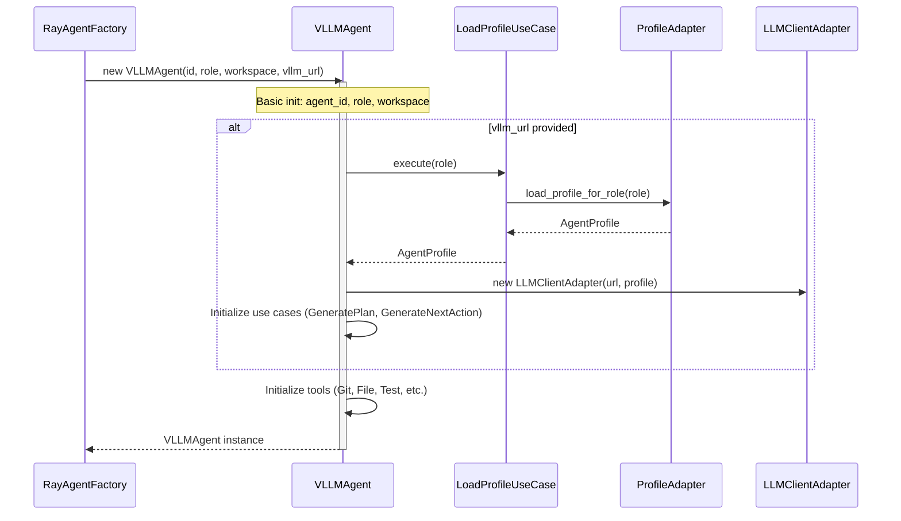

# VLLMAgent Initialization Sequence

## Overview
This document describes the initialization sequence of `VLLMAgent` following hexagonal architecture principles.

## Architecture Flow

```
RayAgentFactory → VLLMAgent.__init__() → LoadProfileUseCase → YamlProfileLoaderAdapter → AgentProfile
                                                       ↓
                                                    ProfileLoaderPort
```

## Sequence Diagram



## Component Responsibilities

### 1. RayAgentFactory (Infrastructure)
- **Responsibility**: Creates RayAgentExecutor with all dependencies injected
- **Location**: `core/ray_jobs/infrastructure/ray_agent_factory.py`
- **Knows**: Agent ID, role, vllm_url, workspace_path, enable_tools
- **Creates**: VLLMAgent instance

### 2. VLLMAgent (Domain)
- **Responsibility**: Main agent orchestration
- **Injects**: Dependencies for profile loading and LLM interaction
- **Knows**: Agent ID, role, workspace, tools

### 3. LoadProfileUseCase (Application Layer)
- **Responsibility**: Use case for loading profiles
- **Depends on**: `ProfileLoaderPort` (abstraction)
- **Returns**: `AgentProfile` entity

### 4. YamlProfileLoaderAdapter (Infrastructure)
- **Responsibility**: Loads profiles from YAML files
- **Implements**: `ProfileLoaderPort`
- **Uses**: `AgentProfileMapper` to convert DTO to Entity
- **Returns**: `AgentProfile` domain entity

### 5. ProfileLoaderPort (Domain Port)
- **Responsibility**: Abstract interface for loading profiles
- **Implemented by**: `YamlProfileLoaderAdapter`
- **Allows**: Different implementations (YAML, database, API)

### 6. AgentProfileMapper (Infrastructure)
- **Responsibility**: Converts between DTO and Entity
- **Input**: `AgentProfileDTO`
- **Output**: `AgentProfile` (domain entity)

## Dependency Injection

```python
# In vllm_agent.py (lines 266-300)
if vllm_url and USE_CASES_AVAILABLE:
    # 1. Get profiles URL
    profiles_url = ProfileConfig.get_default_profiles_url()

    # 2. Create adapter (implements ProfileLoaderPort)
    profile_adapter = YamlProfileLoaderAdapter(profiles_url)

    # 3. Create use case with injected adapter
    load_profile_usecase = LoadProfileUseCase(profile_adapter)

    # 4. Execute use case
    profile = load_profile_usecase.execute(role)

    # 5. Create LLM adapter with profile settings
    llm_adapter = VLLMClientAdapter(
        vllm_url=vllm_url,
        model=profile.model,
        temperature=profile.temperature,
        max_tokens=profile.max_tokens,
    )

    # 6. Create use cases
    self.generate_plan_usecase = GeneratePlanUseCase(llm_adapter)
    self.generate_next_action_usecase = GenerateNextActionUseCase(llm_adapter)
```

## Hexagonal Architecture Layers

1. **Domain Layer**: `AgentProfile` (entity)
2. **Ports Layer**: `ProfileLoaderPort` (interface)
3. **Application Layer**: `LoadProfileUseCase` (use case)
4. **Infrastructure Layer**: `YamlProfileLoaderAdapter`, `AgentProfileMapper`, `ProfileConfig` (implementations)
5. **Adapters Layer**: `VLLMClientAdapter`, `GeneratePlanUseCase`, `GenerateNextActionUseCase` (LLM interaction)

## Fail-Fast Principles

- `ProfileConfig.get_default_profiles_url()`: Raises `FileNotFoundError` if directory doesn't exist
- `YamlProfileLoaderAdapter.__init__()`: Raises `FileNotFoundError` if `profiles_url` invalid
- `AgentProfile.__post_init__()`: Validates all values (temperature, max_tokens, context_window)
- `VLLMAgent.__init__()`: Raises `ValueError` if workspace doesn't exist

## Initialization States

### State 1: Basic Initialization
- Agent ID, role, workspace set
- Tools initialized (GitTool, FileTool, etc.)
- No LLM connection yet

### State 2: Full Initialization (with vLLM)
- Everything from State 1
- Profile loaded via use case
- LLM adapter created with profile settings
- Use cases initialized (GeneratePlan, GenerateNextAction)

## Error Handling

```python
try:
    # Initialize use cases
    ...
except Exception as e:
    logger.warning(f"Failed to initialize use cases: {e}")
    # Continue with basic functionality (planning without execution)
```

## Related Files

- `core/agents_and_tools/agents/vllm_agent.py` - Main agent class
- `core/agents_and_tools/agents/application/usecases/load_profile_usecase.py` - Use case
- `core/agents_and_tools/agents/infrastructure/adapters/yaml_profile_adapter.py` - Adapter
- `core/agents_and_tools/agents/domain/ports/profile_loader_port.py` - Port interface
- `core/agents_and_tools/agents/infrastructure/adapters/profile_config.py` - Config helper
- `core/agents_and_tools/agents/infrastructure/mappers/agent_profile_mapper.py` - Mapper
- `core/agents_and_tools/agents/domain/entities/agent_profile.py` - Domain entity

## Summary

The initialization follows a clear hexagonal architecture flow:
1. Configuration helper provides profiles URL (fail-fast)
2. Adapter implements the port and loads from YAML
3. Mapper converts DTO to Entity
4. Use case orchestrates the port
5. Agent receives configuration and initializes LLM adapter
6. Tools are always initialized regardless of vLLM availability

