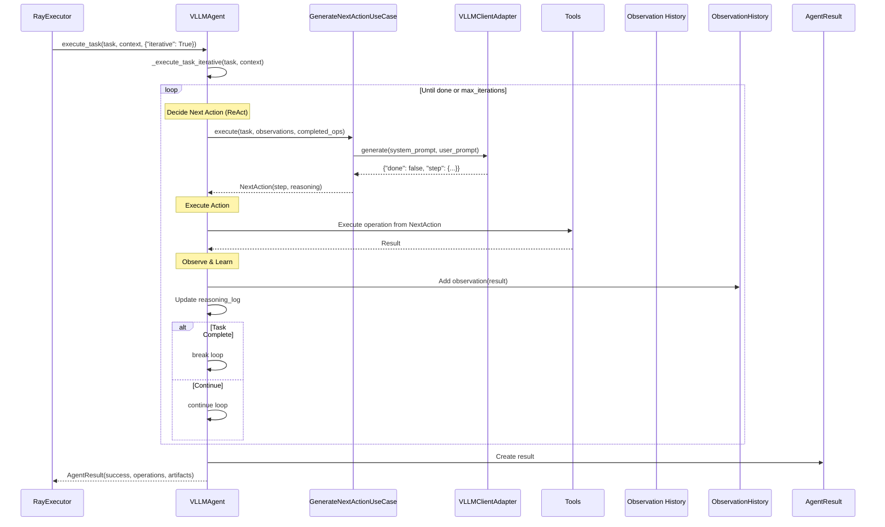
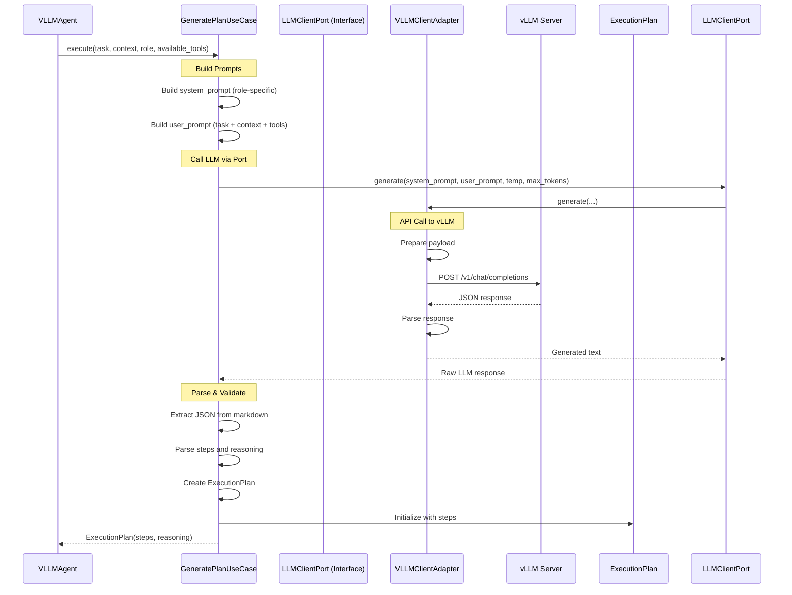
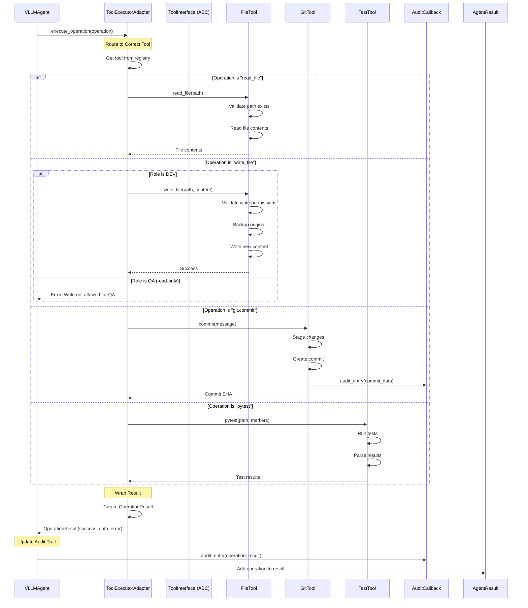
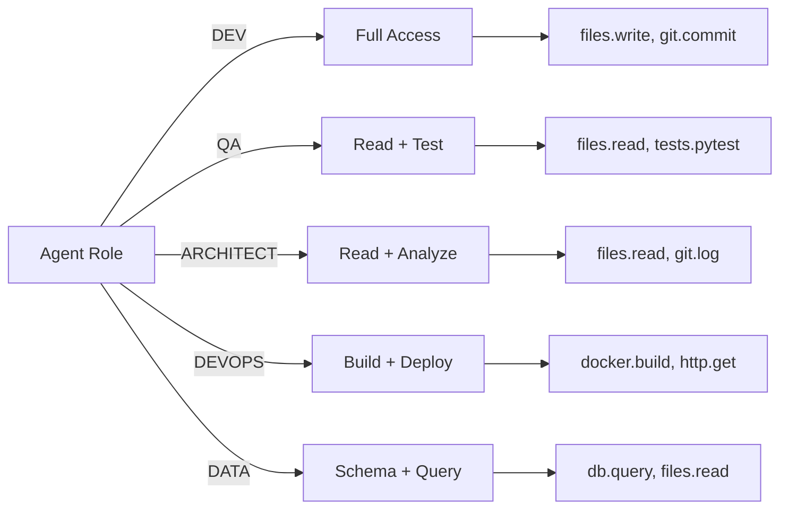
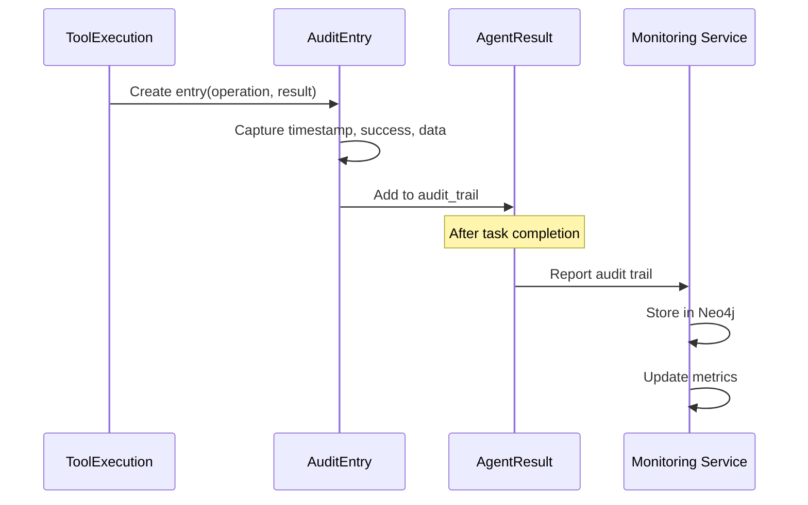
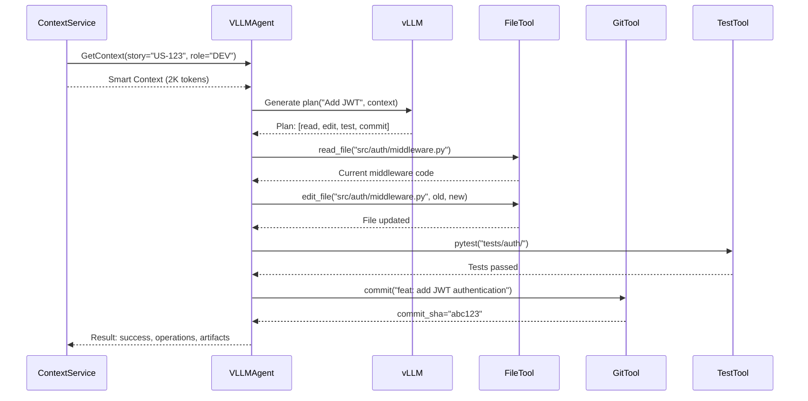
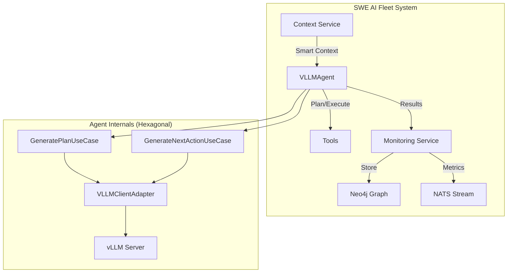

# VLLMAgent - Diagramas de Secuencia

**Versión**: Impresión
**Fecha**: 26 Oct 2025
**Última actualización**: 50fb174

---

## 📋 Tabla de Contenidos

1. [Flujo Principal: execute_task() (Estático)](#1-flujo-principal-execute_task-estático)
2. [Flujo Iterativo: execute_task() (ReAct)](#2-flujo-iterativo-execute_task-react)
3. [Generación de Plan con vLLM](#3-generación-de-plan-con-vllm)
4. [Ejecución de Tools](#4-ejecución-de-tools)

---

## 1. Flujo Principal: execute_task() (Estático)

Este es el flujo por defecto donde el agente:
1. Genera un plan completo (usando vLLM o patrón simple)
2. Ejecuta todas las operaciones en secuencia
3. Retorna resultado con audit trail

```mermaid
sequenceDiagram
    participant RayExecutor
    participant VLLMAgent
    participant GeneratePlanUseCase
    participant VLLMClientAdapter
    participant Tools (FileTool, GitTool, TestTool)
    participant AgentResult

    RayExecutor->>VLLMAgent: execute_task(task, context, constraints)
    VLLMAgent->>VLLMAgent: _execute_task_static(task, context)

    Note over VLLMAgent: Generate Execution Plan
    VLLMAgent->>GeneratePlanUseCase: execute(task, context, role, tools)
    GeneratePlanUseCase->>VLLMClientAdapter: generate(system_prompt, user_prompt)
    VLLMClientAdapter->>VLLMClientAdapter: Call vLLM API
    VLLMClientAdapter-->>GeneratePlanUseCase: JSON plan response
    GeneratePlanUseCase-->>VLLMAgent: ExecutionPlan(steps, reasoning)

    Note over VLLMAgent: Execute Tools Sequentially
    VLLMAgent->>VLLMAgent: For each step in plan:
    VLLMAgent->>Tools: Execute tool operation
    Tools-->>VLLMAgent: Operation result

    Note over VLLMAgent: Collect Results
    VLLMAgent->>VLLMAgent: Add operation to audit trail
    VLLMAgent->>VLLMAgent: Collect artifacts
    VLLMAgent->>AgentResult: Create result object
    VLLMAgent-->>RayExecutor: AgentResult(success, operations, artifacts)
```

---

## 2. Flujo Iterativo: execute_task() (ReAct)

Flujo ReAct (Reasoning + Acting) donde el agente:
1. Ejecuta una acción
2. Observa el resultado
3. Decide la siguiente acción
4. Repite hasta completar o fallar



---

## 3. Generación de Plan con vLLM

Detalle del proceso de generación de plan usando arquitectura hexagonal:



---

## 4. Ejecución de Tools

Proceso de ejecución de herramientas con patrones de seguridad por rol:



---

## 🔍 Detalles Arquitectónicos

### Arquitectura Hexagonal Aplicada

**Domain Layer (Ports):**
- `LLMClientPort`: Interface para generación de texto
- `ToolExecutorPort`: Interface para ejecución de herramientas

**Application Layer (Use Cases):**
- `GeneratePlanUseCase`: Genera planes de ejecución
- `GenerateNextActionUseCase`: Decide siguiente acción (ReAct)
- `ExecutePlanUseCase`: Ejecuta plan completo
- `ExecuteOperationUseCase`: Ejecuta operación individual

**Infrastructure Layer (Adapters):**
- `VLLMClientAdapter`: Implementa `LLMClientPort` con llamadas a API vLLM
- `ToolExecutorAdapter`: Implementa `ToolExecutorPort` con herramientas reales

### Patrones de Seguridad por Rol



### Flujo de Auditoría



---

## 📊 Estadísticas de Ejecución

| Operación | Tiempo Promedio | Tokens Usados | API Calls |
|-----------|----------------|---------------|-----------|
| Generate Plan | 500ms | 2K | 1 |
| Read File | 50ms | 0 | 0 |
| Write File | 100ms | 0 | 0 |
| Run Tests | 5s | 0 | 0 |
| Git Commit | 200ms | 0 | 0 |
| **Task completo** | **10-30s** | **2-4K** | **1-10** |

---

## 🎯 Ejemplo Real: "Add JWT Authentication"



---

## 🔄 Relación con Otros Componentes



---

**Documento generado para impresión**
**Sistema**: SWE AI Fleet
**Componente**: VLLMAgent
**Arquitectura**: Hexagonal (Ports & Adapters)
**Patrón**: ReAct (Reasoning + Acting)

