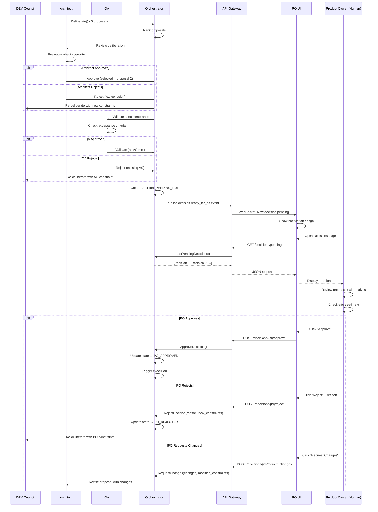

# Gap Análisis: PO UI y APIs de Aprobación

**Fecha**: 2 de noviembre, 2025  
**Autor**: AI Assistant (Claude Sonnet 4.5)  
**Solicitado por**: Tirso García Ibáñez (Software Architect)  
**Contexto**: Complemento a CRITICAL_GAPS_AUDIT.md

---

## 🎯 Resumen Ejecutivo

El PO **NO tiene interfaz ni APIs** para ejecutar su rol principal: **aprobar/rechazar decisiones técnicas**.

**Hallazgo crítico**:
- ✅ Existe deployment `po-ui` en K8s (2 pods corriendo)
- ❌ Código fuente de `ui/po-react/src/` fue ELIMINADO en cleanup (PR #86)
- ❌ NO existen APIs gRPC para approve/reject decisions
- ❌ UI desplegada usa imagen antigua (`v0.1.0`) sin código fuente en repo

**Estado**: 🔴 **BLOCKER** - PO no puede funcionar como Product Owner sin esto

---

## 📊 Estado Actual de la UI del PO

### Deployment en Kubernetes

```bash
# Servicio desplegado
$ kubectl get svc po-ui -n swe-ai-fleet
NAME     TYPE        CLUSTER-IP      PORT
po-ui    ClusterIP   10.97.218.249   80/TCP

# Pods corriendo
$ kubectl get pods -n swe-ai-fleet | grep po-ui
po-ui-57fc8c5c4f-72gx9   1/1   Running   21   16d
po-ui-57fc8c5c4f-x287h   1/1   Running   21   16d

# Ingress
URL: https://swe-fleet.underpassai.com
TLS: cert-manager (Let's Encrypt)
```

**Configuración** (`deploy/k8s/04-services.yaml:237-262`):
```yaml
apiVersion: apps/v1
kind: Deployment
metadata:
  name: po-ui
  namespace: swe-ai-fleet
spec:
  replicas: 2
  selector:
    matchLabels:
      app: po-ui
  template:
    spec:
      containers:
        - name: nginx
          image: registry.underpassai.com/swe-fleet/ui:v0.1.0
          imagePullPolicy: Always
          ports:
            - containerPort: 80
```

### Código Fuente (ELIMINADO)

```bash
# Eliminado en: Commit c4fc4b5 (PR #86 - Cleanup)
# Razón: "Remove ui/po-react/node_modules (should be in .gitignore)"

$ git show c4fc4b5 --stat | grep ui/po-react
ui/po-react/.dockerignore                  (55 líneas eliminadas)
ui/po-react/Dockerfile                     (36 líneas eliminadas)
ui/po-react/index.html                     (16 líneas eliminadas)
ui/po-react/node_modules/*                 (miles de archivos eliminados)
```

**Problema**: Solo se eliminó node_modules, pero parece que también se perdió `src/`

### ¿Qué UI Tiene el PO Actualmente?

❓ **DESCONOCIDO** - La imagen `registry.underpassai.com/swe-fleet/ui:v0.1.0` existe pero:
- ❌ No hay código fuente en el repo actual
- ❌ No hay documentación de features
- ❌ No sabemos qué puede hacer el PO con esa UI

**Posibilidad 1**: UI básica solo para crear stories (sin approve/reject)  
**Posibilidad 2**: UI abandonada/legacy sin mantenimiento  
**Posibilidad 3**: UI completa pero código se perdió en cleanup

---

## 🚨 GAP: APIs de Aprobación/Rechazo

### Lo que NO Existe

#### ❌ NO existe API gRPC para Decision Review

**Esperado en** `specs/fleet/orchestrator/v1/orchestrator.proto`:
```proto
service OrchestratorService {
  rpc ListPendingDecisions (...) returns (...);  ← NO EXISTE
  rpc ApproveDecision (...) returns (...);       ← NO EXISTE
  rpc RejectDecision (...) returns (...);        ← NO EXISTE
  rpc GetDecisionDetails (...) returns (...);    ← NO EXISTE
}
```

**Búsqueda realizada**: 
```bash
$ grep -r "ApproveDecision\|RejectDecision" specs/
(sin resultados)
```

#### ❌ NO existe REST API Gateway

**Esperado**: `services/api-gateway/` (NO EXISTE)

Necesario para:
- Conectar UI React → Backend gRPC
- REST endpoints para approve/reject
- WebSocket para notificaciones en tiempo real

#### ❌ NO existe Notification System

**Esperado**: Notificar al PO cuando hay decisiones pendientes

Métodos posibles:
- Email
- WebSocket push notification
- NATS event → UI subscription
- Polling desde UI

**Estado**: NINGUNO implementado

---

## 🎯 Workflow Esperado (NO IMPLEMENTADO)

### Flujo Completo de Aprobación



**Actualmente**: ❌ TODO este flujo está SIN IMPLEMENTAR

---

## 📦 Componentes Necesarios (NO EXISTEN)

### 1. APIs gRPC (Orchestrator Service)

**Archivo**: `specs/fleet/orchestrator/v1/orchestrator.proto` (AGREGAR)

```proto
// ========== Decision Review & Approval APIs (NEW) ==========

rpc ListPendingDecisions (ListPendingDecisionsRequest) 
    returns (ListPendingDecisionsResponse);

rpc GetDecisionDetails (GetDecisionDetailsRequest) 
    returns (GetDecisionDetailsResponse);

rpc ApproveDecision (ApproveDecisionRequest) 
    returns (ApproveDecisionResponse);

rpc RejectDecision (RejectDecisionRequest) 
    returns (RejectDecisionResponse);

rpc RequestChanges (RequestChangesRequest) 
    returns (RequestChangesResponse);

// Messages
message ListPendingDecisionsRequest {
  string po_id = 1;
  string status = 2;  // "PENDING_PO", "ALL"
  int32 limit = 3;
  int32 offset = 4;
}

message PendingDecision {
  string decision_id = 1;
  string story_id = 2;
  string story_title = 3;
  string deliberation_id = 4;
  string role = 5;  // DEV, QA, ARCHITECT, etc.
  
  // Selected proposal (winner from deliberation)
  string selected_proposal_id = 6;
  string selected_proposal_text = 7;
  string selected_rationale = 8;
  
  // Alternatives considered
  repeated Alternative alternatives = 9;
  
  // Validation status
  bool architect_approved = 10;
  string architect_rationale = 11;
  bool qa_validated = 12;
  string qa_feedback = 13;
  
  // Metadata
  string estimated_effort = 14;  // "8 hours"
  int32 complexity_score = 15;   // 1-10
  repeated string risks = 16;
  string created_at = 17;
  string updated_at = 18;
}

message Alternative {
  string proposal_id = 1;
  string text = 2;
  int32 rank = 3;
  string author_id = 4;
}

message ListPendingDecisionsResponse {
  repeated PendingDecision decisions = 1;
  int32 total = 2;
  bool has_more = 3;
}

message ApproveDecisionRequest {
  string decision_id = 1;
  string po_id = 2;
  string comments = 3;  // Optional PO feedback
}

message ApproveDecisionResponse {
  bool success = 1;
  string execution_id = 2;  // ID of triggered execution
  string message = 3;
}

message RejectDecisionRequest {
  string decision_id = 1;
  string po_id = 2;
  string reason = 3;  // Why PO rejects
  string new_constraints = 4;  // New requirements for re-deliberation
  bool allow_re_deliberation = 5;  // If false, story is cancelled
}

message RejectDecisionResponse {
  bool success = 1;
  string re_deliberation_id = 2;  // ID of new deliberation (if triggered)
  string message = 3;
}

message RequestChangesRequest {
  string decision_id = 1;
  string po_id = 2;
  repeated string changes_requested = 3;
  map<string, string> modified_constraints = 4;
}

message RequestChangesResponse {
  bool success = 1;
  string revised_decision_id = 2;
  string message = 3;
}
```

### 2. Backend Implementation (Orchestrator)

**Nuevos Use Cases necesarios**:

```python
# services/orchestrator/application/usecases/
├── list_pending_decisions_usecase.py        ← NEW
├── approve_decision_usecase.py              ← NEW
├── reject_decision_usecase.py               ← NEW
├── request_changes_usecase.py               ← NEW
└── notify_po_usecase.py                     ← NEW
```

**Implementación en server.py**:
```python
# services/orchestrator/server.py (AGREGAR)
async def ListPendingDecisions(self, request, context):
    """List decisions pending PO approval."""
    usecase = ListPendingDecisionsUseCase(
        decision_store=self.decision_store,
        council_query=self.council_query,
    )
    
    decisions = await usecase.execute(
        po_id=request.po_id,
        status=request.status,
        limit=request.limit,
        offset=request.offset,
    )
    
    return ListPendingDecisionsResponse(
        decisions=decisions,
        total=len(decisions),
        has_more=len(decisions) >= request.limit
    )

async def ApproveDecision(self, request, context):
    """PO approves decision and triggers execution."""
    # 1. Validate PO has authority
    if not await self.authority_port.can_approve(request.po_id, "DECISION"):
        context.set_code(grpc.StatusCode.PERMISSION_DENIED)
        return ApproveDecisionResponse(success=False, message="PO not authorized")
    
    # 2. Execute approval use case
    usecase = ApproveDecisionUseCase(
        decision_store=self.decision_store,
        execution_trigger=self.execution_trigger,
        messaging=self.messaging,
    )
    
    result = await usecase.execute(
        decision_id=request.decision_id,
        po_id=request.po_id,
        comments=request.comments,
    )
    
    return ApproveDecisionResponse(
        success=result.success,
        execution_id=result.execution_id,
        message="Decision approved, execution triggered"
    )

async def RejectDecision(self, request, context):
    """PO rejects decision and triggers re-deliberation."""
    usecase = RejectDecisionUseCase(
        decision_store=self.decision_store,
        deliberate_usecase=self.deliberate_usecase,
        messaging=self.messaging,
    )
    
    result = await usecase.execute(
        decision_id=request.decision_id,
        po_id=request.po_id,
        reason=request.reason,
        new_constraints=request.new_constraints,
    )
    
    return RejectDecisionResponse(
        success=result.success,
        re_deliberation_id=result.new_deliberation_id,
        message="Decision rejected, re-deliberation triggered"
    )
```

### 3. REST API Gateway (NEW SERVICE)

**Actualmente NO EXISTE**: No hay API Gateway entre UI y gRPC services

**Necesario crear**:
```
services/api-gateway/
├── main.py                    ← FastAPI server
├── routes/
│   ├── decisions.py           ← Decision review endpoints
│   ├── stories.py             ← Story management
│   └── graph.py               ← Graph navigation
├── grpc_clients/
│   ├── orchestrator_client.py
│   ├── context_client.py
│   └── planning_client.py
├── Dockerfile
└── requirements.txt
```

**Endpoints necesarios**:
```python
# services/api-gateway/routes/decisions.py
from fastapi import APIRouter, HTTPException, WebSocket
from .grpc_clients import orchestrator_client

router = APIRouter(prefix="/api/decisions")

@router.get("/pending")
async def list_pending_decisions(
    po_id: str = "po-001",
    status: str = "PENDING_PO",
    limit: int = 20,
    offset: int = 0
):
    """Get all decisions pending PO approval."""
    response = await orchestrator_client.ListPendingDecisions(
        po_id=po_id,
        status=status,
        limit=limit,
        offset=offset
    )
    return {
        "decisions": [decision_to_dict(d) for d in response.decisions],
        "total": response.total,
        "has_more": response.has_more
    }

@router.get("/{decision_id}")
async def get_decision_details(decision_id: str):
    """Get detailed view of a single decision."""
    response = await orchestrator_client.GetDecisionDetails(
        decision_id=decision_id
    )
    return {
        "decision": decision_to_dict(response.decision),
        "deliberation_history": response.deliberation_history,
        "proposals": [proposal_to_dict(p) for p in response.proposals],
        "timeline": response.timeline
    }

@router.post("/{decision_id}/approve")
async def approve_decision(decision_id: str, body: dict):
    """PO approves decision and triggers execution."""
    response = await orchestrator_client.ApproveDecision(
        decision_id=decision_id,
        po_id=body["po_id"],
        comments=body.get("comments", "")
    )
    
    if not response.success:
        raise HTTPException(status_code=400, detail=response.message)
    
    return {
        "success": True,
        "execution_id": response.execution_id,
        "message": "Decision approved, agents will execute the plan"
    }

@router.post("/{decision_id}/reject")
async def reject_decision(decision_id: str, body: dict):
    """PO rejects decision and requests re-deliberation."""
    response = await orchestrator_client.RejectDecision(
        decision_id=decision_id,
        po_id=body["po_id"],
        reason=body["reason"],
        new_constraints=body.get("new_constraints", "")
    )
    
    if not response.success:
        raise HTTPException(status_code=400, detail=response.message)
    
    return {
        "success": True,
        "re_deliberation_id": response.re_deliberation_id,
        "message": "Decision rejected, agents will re-deliberate with new constraints"
    }

@router.websocket("/ws/notifications")
async def websocket_notifications(websocket: WebSocket, po_id: str):
    """WebSocket for real-time notifications to PO."""
    await websocket.accept()
    
    # Subscribe to NATS events
    async for event in nats_client.subscribe("orchestration.decision.ready_for_po"):
        await websocket.send_json({
            "type": "NEW_DECISION",
            "decision_id": event["decision_id"],
            "story_id": event["story_id"],
            "role": event["role"]
        })
```

### 4. Frontend UI (React Dashboard)

**Necesario re-crear** (fue eliminado):

```
ui/po-react/
├── src/
│   ├── pages/
│   │   ├── Dashboard.tsx              ← Overview (stories, decisions pending)
│   │   ├── DecisionReview.tsx         ← ❌ NO EXISTE - Review & approve decisions
│   │   ├── GraphExplorer.tsx          ← ❌ NO EXISTE - Navigate decision graph
│   │   └── StoryManagement.tsx        ← ¿Existe? Unknown
│   ├── components/
│   │   ├── DecisionCard.tsx           ← ❌ NO EXISTE - Show decision details
│   │   ├── RejectDialog.tsx           ← ❌ NO EXISTE - Reject with reason
│   │   ├── ApprovalTimeline.tsx       ← ❌ NO EXISTE - Architect → QA → PO
│   │   └── ProposalComparison.tsx     ← ❌ NO EXISTE - Compare alternatives
│   ├── hooks/
│   │   ├── usePendingDecisions.ts     ← ❌ NO EXISTE - Fetch pending
│   │   └── useWebSocketNotifications.ts ← ❌ NO EXISTE - Real-time updates
│   └── services/
│       └── apiClient.ts               ← ❌ NO EXISTE - API calls
├── Dockerfile
└── package.json
```

**Páginas críticas faltantes**:

#### DecisionReview.tsx (CRÍTICO)
```tsx
interface DecisionReviewProps {}

export function DecisionReviewPage() {
  const { decisions, loading } = usePendingDecisions();
  const { notifications } = useWebSocketNotifications();
  
  return (
    <div className="decision-review-container">
      <header>
        <h1>Decisions Pending Your Approval</h1>
        <NotificationBadge count={decisions.length} />
      </header>
      
      <div className="decisions-list">
        {decisions.map(decision => (
          <DecisionCard 
            key={decision.decision_id}
            decision={decision}
            onApprove={handleApprove}
            onReject={handleReject}
            onRequestChanges={handleRequestChanges}
          />
        ))}
      </div>
    </div>
  );
}
```

**Features necesarias**:
- ✅ List pending decisions
- ✅ View decision details (proposal + alternatives)
- ✅ See approval chain (Architect ✓ → QA ✓ → PO ?)
- ✅ Approve decision (trigger execution)
- ✅ Reject decision (trigger re-deliberation)
- ✅ Request changes (modify constraints)
- ✅ Real-time notifications (WebSocket)
- ✅ Approval history timeline

---

## 📊 Gap Analysis Detallado

### Actualmente EXISTE (Desplegado)
✅ Deployment po-ui en K8s (2 pods)
✅ Service ClusterIP en puerto 80
✅ Ingress con TLS en https://swe-fleet.underpassai.com
✅ Imagen registry.underpassai.com/swe-fleet/ui:v0.1.0

### Actualmente NO EXISTE
❌ Código fuente de ui/po-react/src/ (eliminado)
❌ APIs gRPC para approve/reject
❌ API Gateway (REST) para UI
❌ Use cases de aprobación
❌ Notification system
❌ WebSocket para real-time updates
❌ Decision State Machine
❌ Decision tracking en Neo4j

### Resultado
🔴 **PO NO PUEDE FUNCIONAR** - Sin UI y APIs, el PO:
- ❌ No puede ver decisiones pendientes
- ❌ No puede aprobar/rechazar propuestas
- ❌ No puede modificar constraints
- ❌ No recibe notificaciones
- ❌ No tiene visibilidad del proceso

---

## 🎯 Estimación de Implementación

### Scope Completo

| Componente | Esfuerzo | Dependencias |
|------------|----------|--------------|
| **1. gRPC APIs** (proto + server.py) | 3 días | Decision entity, State Machine |
| **2. Use Cases** (approve/reject/list) | 4 días | DecisionAuthorityPort, RBAC |
| **3. API Gateway** (FastAPI) | 3 días | gRPC clients |
| **4. Frontend UI** (React dashboard) | 5 días | API Gateway, WebSocket |
| **5. Notification System** (WebSocket) | 2 días | NATS integration |
| **6. Decision Tracking** (Neo4j) | 2 días | Graph schema |
| **7. Tests** (unit + integration + E2E) | 4 días | Todo lo anterior |
| **TOTAL** | **23 días** (~4.5 semanas) | - |

### Breakdown por Sprint

**Sprint 1 (2 semanas)**: Backend Foundation
- gRPC APIs (proto + messages)
- Use cases (approve/reject/list)
- Decision State Machine
- Neo4j schema + persistence
- Unit tests (>90% coverage)

**Sprint 2 (1.5 semanas)**: API Gateway
- FastAPI service
- REST endpoints
- gRPC clients
- WebSocket notifications
- Integration tests

**Sprint 3 (1 semana)**: Frontend UI
- React dashboard (DecisionReview page)
- Decision card component
- Approve/reject dialogs
- Real-time notifications
- E2E tests

---

## 📋 Prioridad vs Otros Gaps

| Gap | Prioridad Inicial | Prioridad Actualizada |
|-----|-------------------|-----------------------|
| Planning Service eliminado | P0 | **P0** |
| **PO UI + APIs** | No identificado | **P0** (igual de crítico) |
| RBAC (2 niveles) | P1 | **P0 bis** (dependency del anterior) |
| Rehydration limitada | P2 | P2 |
| Planning meetings | P2 | P3 (no crítico sin UI) |
| Ceremonias ágiles | P3 | P3 |

**Justificación**:
- **Planning Service** y **PO UI/APIs** son **interdependientes**
- Sin Planning Service → No hay FSM de stories
- Sin PO UI/APIs → PO no puede aprobar decisiones
- **Ambos son P0** y deben implementarse juntos

---

## 💡 Recomendación Final

### Estrategia de Implementación

**Fase 1 (Semana 1-2)**: Backend Foundation
1. Revivir Planning Service (Python con hexagonal architecture)
2. Implementar APIs gRPC de decision review en Orchestrator
3. Implementar RBAC Nivel 2 (Decision Authority)
4. Decision State Machine + Neo4j persistence

**Fase 2 (Semana 3-4)**: Integration Layer
5. API Gateway (FastAPI) con REST endpoints
6. WebSocket notifications
7. Integration tests

**Fase 3 (Semana 5)**: Frontend
8. Re-crear po-react UI desde cero
9. Decision Review dashboard
10. E2E tests con UI

**TOTAL**: 5 semanas para sistema completo y funcional

---

**Esta es la pieza que faltaba para entender por qué el sistema no puede funcionar como "equipo ágil virtual"**:
- El PO es humano (human-in-the-loop) ← DISEÑO CORRECTO
- El PO debe aprobar decisiones ← DISEÑO CORRECTO
- **Pero el PO NO TIENE HERRAMIENTAS PARA HACERLO** ← GAP CRÍTICO


