# Guia De Usuario - Planning UI

URL objetivo: `https://planning.underpassai.com`  
Fecha de verificacion: `2026-02-08`

## 1. Resumen
Esta guia describe:
- Todas las acciones visibles en la UI.
- Donde esta cada accion (pantalla y zona exacta).
- Que resultado esperar.
- Capturas de pantalla reales de `planning.underpassai.com`.

## 2. Mapa Rapido De Navegacion
| Seccion | Ruta | Proposito |
|---|---|---|
| Dashboard | `/` | Entrada principal con accesos rapidos. |
| Projects | `/projects` | Listar y crear proyectos. |
| New Project | `/projects/new` | Crear proyecto. |
| Project Detail | `/projects/{project_id}` | Ver proyecto y sus epicas; crear epica. |
| Epics | `/epics` | Listar y crear epicas. |
| New Epic | `/epics/new` | Crear epica. |
| Epic Detail | `/epics/{epic_id}` | Ver epica y sus stories; crear story. |
| Stories | `/stories` | Listar stories y filtrar por estado. |
| New Story | `/stories/new` | Crear story. |
| Story Detail | `/stories/{story_id}` | Ver story, transicionar estado, abrir tareas/ceremonias. |
| Tasks | `/tasks` | Listar tareas; soporta filtro por query string. |
| Task Detail | `/tasks/{task_id}` | Ver detalle de tarea y enlaces relacionados. |
| Ceremonies (Backlog Review) | `/ceremonies` | Listar backlog review ceremonies. |
| New Backlog Review | `/ceremonies/new` | Crear ceremonia de backlog review. |
| Backlog Review Detail | `/ceremonies/{ceremony_id}` | Iniciar, aprobar/rechazar planes y completar ceremonia. |
| Task Derivation Ceremonies | `/ceremonies/task-derivation` | Listar ceremonias de derivacion de tareas. |
| New Task Derivation | `/ceremonies/task-derivation/new` | Crear ceremonia de derivacion. |
| Task Derivation Detail | `/ceremonies/task-derivation/{ceremony_id}` | Iniciar derivacion por story y ver tareas derivadas. |
| Task Derivation By Story | `/ceremonies/task-derivation/{story_id}` | Vista por story de tareas derivadas. |
| Planning Ceremony Start | `/ceremonies/planning` | Arrancar ceremonia step-based (cuando esta desplegada). |

## 3. Acciones Por Pantalla (Ubicacion Exacta)

### 3.1 Dashboard (`/`)
| Accion | Ubicacion en UI | Resultado |
|---|---|---|
| Ver proyectos | Tarjeta `Quick Actions` -> `View Projects` | Navega a `/projects`. |
| Ver stories | Tarjeta `Quick Actions` -> `View Stories` | Navega a `/stories`. |
| Ver epics | Tarjeta `Quick Actions` -> `View Epics` | Navega a `/epics`. |
| Iniciar planning ceremony | Tarjeta `Quick Actions` -> `Start Planning Ceremony` | Navega a `/ceremonies/planning` (si esta disponible). |

### 3.2 Projects (`/projects`)
| Accion | Ubicacion en UI | Resultado |
|---|---|---|
| Crear proyecto | Boton superior derecho `New Project` | Navega a `/projects/new`. |
| Crear proyecto (estado vacio) | Boton central `New Project` dentro de empty state | Navega a `/projects/new`. |
| Abrir detalle de proyecto | Card de proyecto (`View details ->`) | Navega a `/projects/{id}`. |

### 3.3 New Project (`/projects/new`)
| Accion | Ubicacion en UI | Resultado |
|---|---|---|
| Capturar nombre | Campo `Project Name *` | Requerido para crear. |
| Capturar descripcion | Campo `Description` | Opcional. |
| Capturar owner | Campo `Owner *` | Requerido para crear. |
| Cancelar | Boton `Cancel` | Regresa a `/projects`. |
| Crear proyecto | Boton `Create Project` | Crea y redirige a `/projects/{project_id}`. |

### 3.4 Project Detail (`/projects/{project_id}`)
| Accion | Ubicacion en UI | Resultado |
|---|---|---|
| Crear epica | Panel `Epics` -> boton `New Epic` | Navega a `/epics/new?project_id={id}`. |
| Abrir epica | Lista en panel `Epics` | Navega a `/epics/{epic_id}`. |

### 3.5 Epics (`/epics`)
| Accion | Ubicacion en UI | Resultado |
|---|---|---|
| Crear epica | Boton superior derecho `New Epic` | Navega a `/epics/new`. |
| Crear epica (estado vacio) | Boton central `New Epic` | Navega a `/epics/new`. |
| Abrir detalle de epica | Card de epica | Navega a `/epics/{epic_id}`. |

### 3.6 New Epic (`/epics/new`)
| Accion | Ubicacion en UI | Resultado |
|---|---|---|
| Ver contexto jerarquico | Caja `Context` -> `Show Graph View` | Muestra breadcrumb y vista de grafo (si hay datos). |
| Capturar proyecto | Campo `Project *` (si no viene por query) | Requerido para crear. |
| Capturar titulo | Campo `Epic Title *` | Requerido para crear. |
| Capturar descripcion | Campo `Description` | Opcional. |
| Cancelar | Boton `Cancel` | Regresa a proyecto o lista de epics. |
| Crear epica | Boton `Create Epic` | Crea y redirige. |

### 3.7 Epic Detail (`/epics/{epic_id}`)
| Accion | Ubicacion en UI | Resultado |
|---|---|---|
| Crear story | Panel `Stories` -> boton `New Story` | Navega a `/stories/new?epic_id={id}`. |
| Abrir story | Lista de stories | Navega a `/stories/{story_id}`. |

### 3.8 Stories (`/stories`)
| Accion | Ubicacion en UI | Resultado |
|---|---|---|
| Crear story | Boton superior derecho `New Story` | Navega a `/stories/new`. |
| Filtrar por estado | Barra `Filter by state` (`ALL`, `BACKLOG`, `DRAFT`, `DESIGN`, `BUILD`, `TEST`, `DOCS`, `DONE`) | Recarga con query `?state=`. |
| Crear story (estado vacio) | Boton central `New Story` | Navega a `/stories/new`. |
| Abrir detalle de story | Card `View details ->` | Navega a `/stories/{story_id}`. |

### 3.9 New Story (`/stories/new`)
| Accion | Ubicacion en UI | Resultado |
|---|---|---|
| Ver contexto jerarquico | Caja `Context` -> `Show Graph View` | Muestra breadcrumb/grafo. |
| Capturar epica | Campo `Epic *` (si no viene por query) | Requerido para crear. |
| Capturar titulo | Campo `Story Title *` | Requerido para crear. |
| Capturar descripcion | Campo `Description *` | Requerido para crear. |
| Capturar creador | Campo `Created By` | Opcional (default `ui-user`). |
| Cancelar | Boton `Cancel` | Regresa a `/stories`. |
| Crear story | Boton `Create Story` | Crea y redirige a `/stories/{story_id}`. |

### 3.10 Story Detail (`/stories/{story_id}`)
| Accion | Ubicacion en UI | Resultado |
|---|---|---|
| Ver contexto jerarquico | Caja `Context` | Navegacion Project -> Epic -> Story y grafo. |
| Transicionar estado | Seccion `State Transitions` -> botones `Transition to ...` | Llama `/api/stories/{id}/transition`. |
| Abrir ceremonia de derivacion | Seccion `Tasks` -> boton `Derivation Ceremony` | Navega a `/ceremonies/task-derivation/{story_id}`. |
| Abrir planning ceremony | Seccion `Tasks` -> boton `Planning Ceremony` | Navega a `/ceremonies/planning?...`. |
| Crear nueva tarea | Seccion `Tasks` -> boton `New Task` | Navega a `/tasks/new?story_id={id}`. |
| Abrir tarea | Lista `Tasks` | Navega a `/tasks/{task_id}`. |

Transiciones configuradas en UI:
- `BACKLOG -> DRAFT`
- `DRAFT -> DESIGN`
- `DESIGN -> BUILD | DRAFT`
- `BUILD -> TEST | DESIGN`
- `TEST -> DOCS | BUILD`
- `DOCS -> DONE | BUILD`

### 3.11 Tasks (`/tasks`)
| Accion | Ubicacion en UI | Resultado |
|---|---|---|
| Abrir tarea | Fila de tarea | Navega a `/tasks/{task_id}`. |
| Filtrar por plan desde enlace | Link `Plan: {plan_id}` dentro de fila | Navega a `/tasks?plan_id={plan_id}`. |
| Filtrar por story desde enlace | Link `Story: {story_id}` dentro de fila | Navega a `/stories/{story_id}`. |
| Limpiar filtro de plan | Banner superior cuando hay `plan_id` -> `Clear Filter` | Regresa a `/tasks`. |

Notas:
- La pantalla soporta query params: `plan_id`, `story_id`, `status_filter`, `limit`, `offset`.
- No hay boton de `New Task` en esta vista.

### 3.12 Task Detail (`/tasks/{task_id}`)
| Accion | Ubicacion en UI | Resultado |
|---|---|---|
| Ver contexto jerarquico | Caja `Context` | Navegacion jerarquica y grafo. |
| Ver story padre | Link `View parent story` | Navega a `/stories/{story_id}`. |
| Ver tareas del plan | Link `View plan tasks` | Navega a `/tasks?plan_id={plan_id}`. |

### 3.13 Ceremonies - Backlog Review (`/ceremonies`)
| Accion | Ubicacion en UI | Resultado |
|---|---|---|
| Crear backlog review | Boton superior derecho `New Backlog Review` | Navega a `/ceremonies/new`. |
| Crear task derivation | Boton superior derecho `New Task Derivation` | Navega a `/ceremonies/task-derivation/new`. |
| Ir a planning ceremony | Boton superior derecho `Start Planning Ceremony` | Navega a `/ceremonies/planning`. |
| Cambiar tipo de ceremonia | Tabs (`Backlog Review`, `Task Derivation`, `Planning Ceremony`) | Cambia de seccion. |
| Filtrar por estado | Barra `Filter by status` (`ALL`, `DRAFT`, `IN_PROGRESS`, `REVIEWING`, `COMPLETED`, `CANCELLED`) | Recarga con query. |
| Abrir ceremonia | Fila de ceremonia | Navega a `/ceremonies/{ceremony_id}`. |

### 3.14 New Backlog Review (`/ceremonies/new`)
| Accion | Ubicacion en UI | Resultado |
|---|---|---|
| Capturar PO | Campo `Created By (PO Email)` | Requerido. |
| Seleccionar stories | Lista de checkboxes `Select Stories to Review` | Requerido al menos 1. |
| Cancelar | Boton `Cancel` | Regresa a `/ceremonies`. |
| Crear ceremonia | Boton `Create Ceremony` | Crea y redirige a `/ceremonies/{id}`. |

### 3.15 Backlog Review Detail (`/ceremonies/{ceremony_id}`)
| Accion | Ubicacion en UI | Resultado |
|---|---|---|
| Iniciar review | Estado `DRAFT` -> boton `Start Review Process` | Envia `start` de ceremonia. |
| Aprobar plan | En `Story Review Results`, cuando `PENDING` + `REVIEWING` -> `Approve Plan` | Solicita email + notas PO; envia `approve`. |
| Rechazar plan | En `Story Review Results`, cuando `PENDING` + `REVIEWING` -> `Reject Plan` | Solicita email + razon; envia `reject`. |
| Completar ceremonia | Estado `REVIEWING` -> boton `Complete Ceremony` | Envia `complete`. |
| Ver story asociada | Bloque de resultado aprobado -> `Ver Story ->` | Navega a `/stories/{story_id}`. |
| Ver tareas del plan | Bloque de resultado aprobado -> `Ver todas las tareas ->` | Navega a `/tasks?plan_id={plan_id}`. |
| Ver tareas de una historia | Bloque de resultado aprobado -> `Ver tareas de esta historia ->` | Navega a `/tasks?story_id=...&plan_id=...`. |

### 3.16 Task Derivation Ceremonies (`/ceremonies/task-derivation`)
| Accion | Ubicacion en UI | Resultado |
|---|---|---|
| Crear ceremonia | Boton superior derecho `New Ceremony` | Navega a `/ceremonies/task-derivation/new`. |
| Cambiar tipo de ceremonia | Tabs (`Backlog Review`, `Task Derivation`, `Planning Ceremony`) | Cambia de seccion. |
| Filtrar por estado | Barra `Filter by status` (`ALL`, `DRAFT`, `IN_PROGRESS`, `DERIVING`, `COMPLETED`, `CANCELLED`) | Recarga con query. |
| Abrir ceremonia | Fila de ceremonia | Navega a `/ceremonies/task-derivation/{ceremony_id}`. |

### 3.17 New Task Derivation (`/ceremonies/task-derivation/new`)
| Accion | Ubicacion en UI | Resultado |
|---|---|---|
| Capturar PO | Campo `Created By (PO Email)` | Requerido. |
| Seleccionar stories | Lista `Select Stories for Task Derivation` | Requerido al menos 1. |
| Cancelar | Boton `Cancel` | Regresa a `/ceremonies`. |
| Crear ceremonia | Boton `Create Ceremony` | Crea y redirige a `/ceremonies/task-derivation/{id}`. |

### 3.18 Task Derivation Detail (`/ceremonies/task-derivation/{ceremony_id}`)
| Accion | Ubicacion en UI | Resultado |
|---|---|---|
| Iniciar derivacion por story | Card de cada story -> `Start Derivation` | Pide email (prompt) y envia start por story. |
| Ver story | Card de story -> link `View Story ->` | Navega a `/stories/{story_id}`. |
| Ver tareas derivadas | Seccion `Derived Tasks` (cuando estado `COMPLETED`) | Muestra TaskCard(s) y navega a detalle de tarea. |

### 3.19 Task Derivation By Story (`/ceremonies/task-derivation/{story_id}`)
| Accion | Ubicacion en UI | Resultado |
|---|---|---|
| Ver tareas derivadas de la story | Seccion `Derived Tasks` | Muestra tareas y estado. |
| Volver a story | Boton `Back to Story` | Navega a `/stories/{story_id}`. |
| Ver todas las stories | Boton `View All Stories` | Navega a `/stories`. |

### 3.20 Planning Ceremony Start (`/ceremonies/planning`)
Si la ruta esta disponible en el despliegue, las acciones son:
| Accion | Ubicacion en UI | Resultado |
|---|---|---|
| Cargar preset | Cambio en `Ceremony Definition` y boton `Reset Preset` | Autocompleta `Step IDs` + `Inputs JSON`. |
| Configurar solicitud | Campos `Requested By`, `Story`, `Definition`, `Step IDs`, `Ceremony ID`, `Correlation ID`, `Inputs` | Prepara request `StartPlanningCeremony`. |
| Iniciar planning ceremony | Boton `Start Planning Ceremony` | Llama `/api/ceremonies/planning/start` y muestra `instance_id`. |

## 4. Flujos Operativos Recomendados
1. Crear estructura base:
`/projects/new` -> `/epics/new?project_id=...` -> `/stories/new?epic_id=...`

2. Ejecutar backlog review:
`/ceremonies/new` -> `/ceremonies/{id}` -> `Start Review Process` -> `Approve Plan` o `Reject Plan` -> `Complete Ceremony`

3. Derivar tareas:
`/ceremonies/task-derivation/new` -> `/ceremonies/task-derivation/{id}` -> `Start Derivation` por story -> revisar en `/tasks` o `/stories/{id}`

4. Revisar ejecucion y trazabilidad:
usar `Context` (NodeContextViewer) en formularios y detalles para navegar por jerarquia y grafo.

## 5. Capturas Reales (planning.underpassai.com)

### 5.1 Dashboard
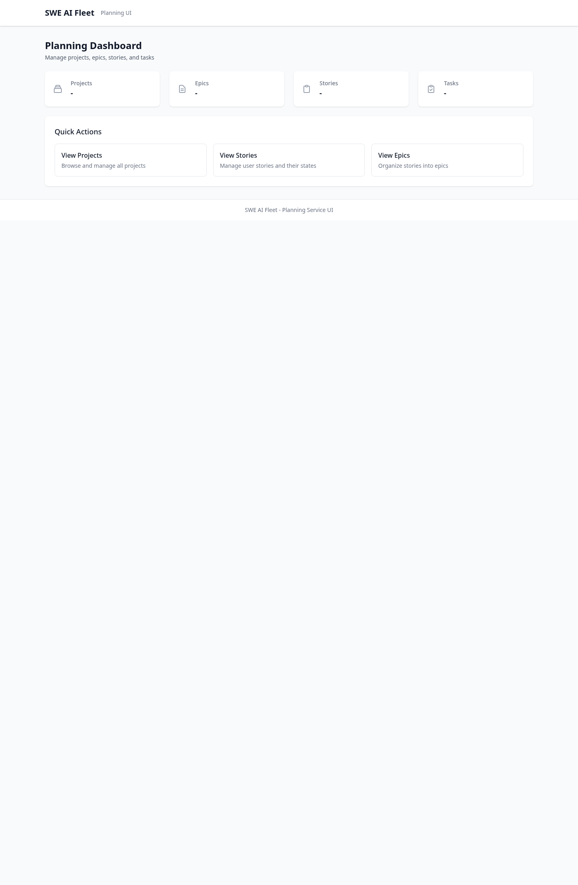

### 5.2 Projects
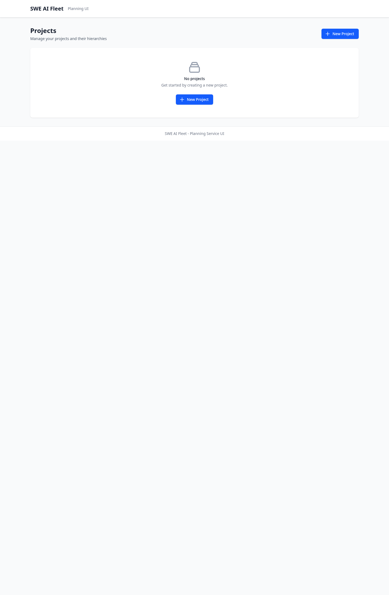
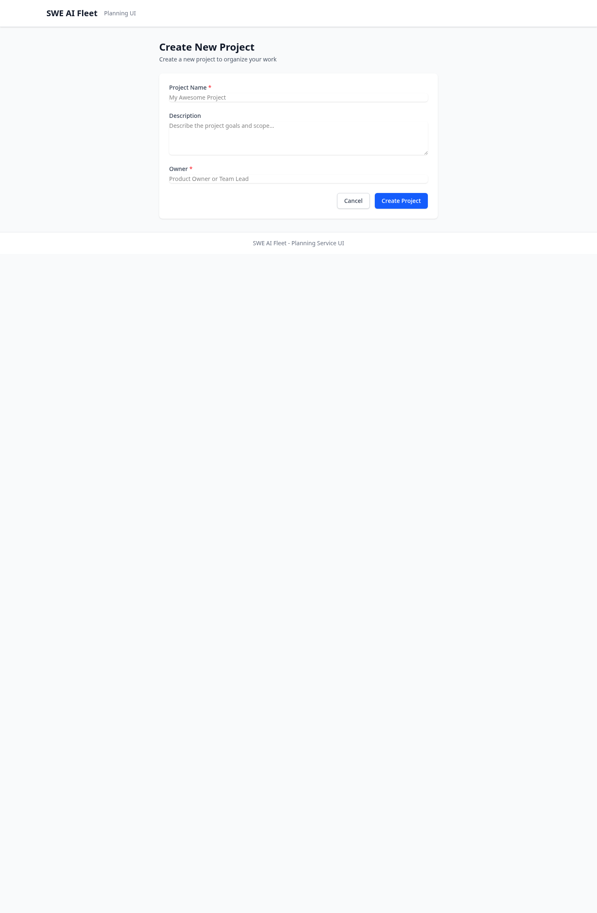

### 5.3 Epics
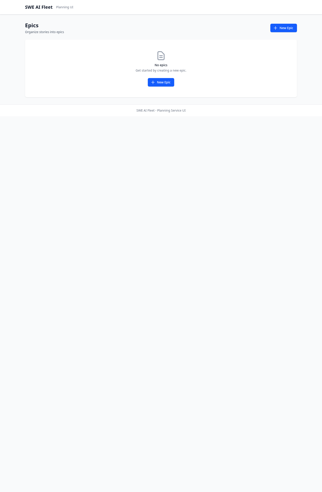

### 5.4 Stories
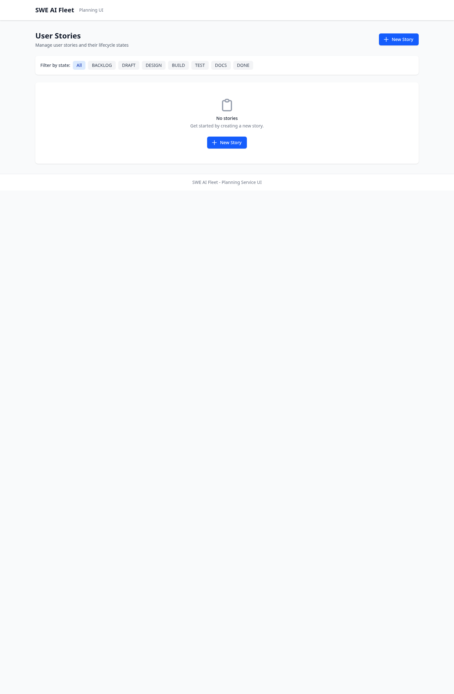
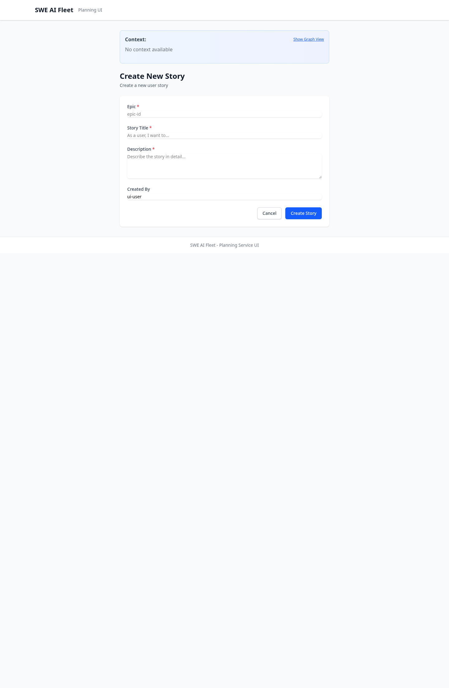

### 5.5 Tasks
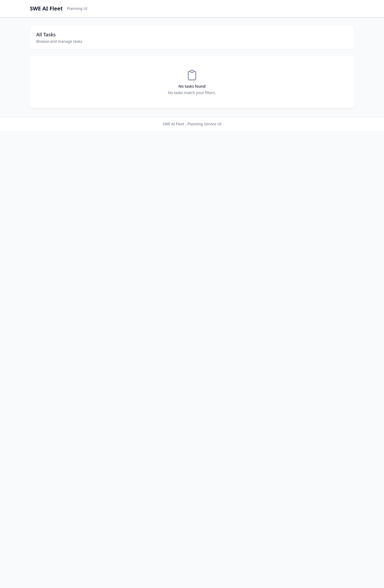

### 5.6 Backlog Review Ceremonies
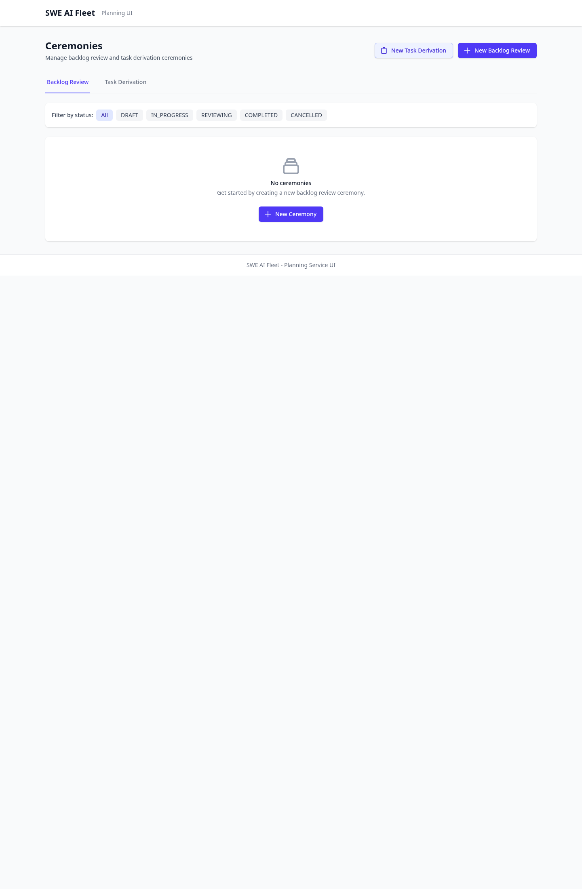
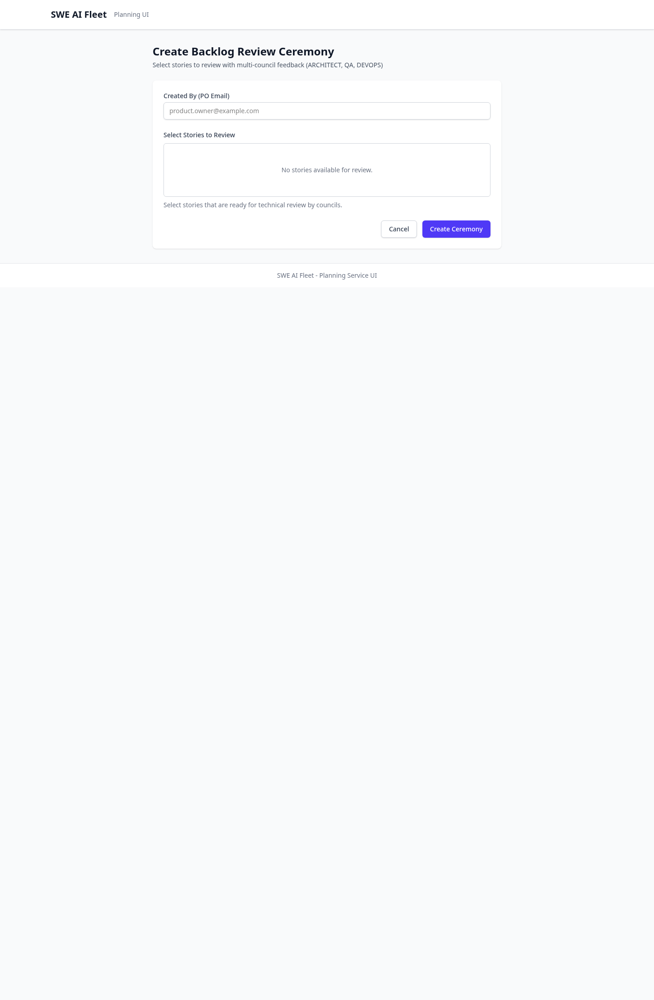

### 5.7 Task Derivation Ceremonies
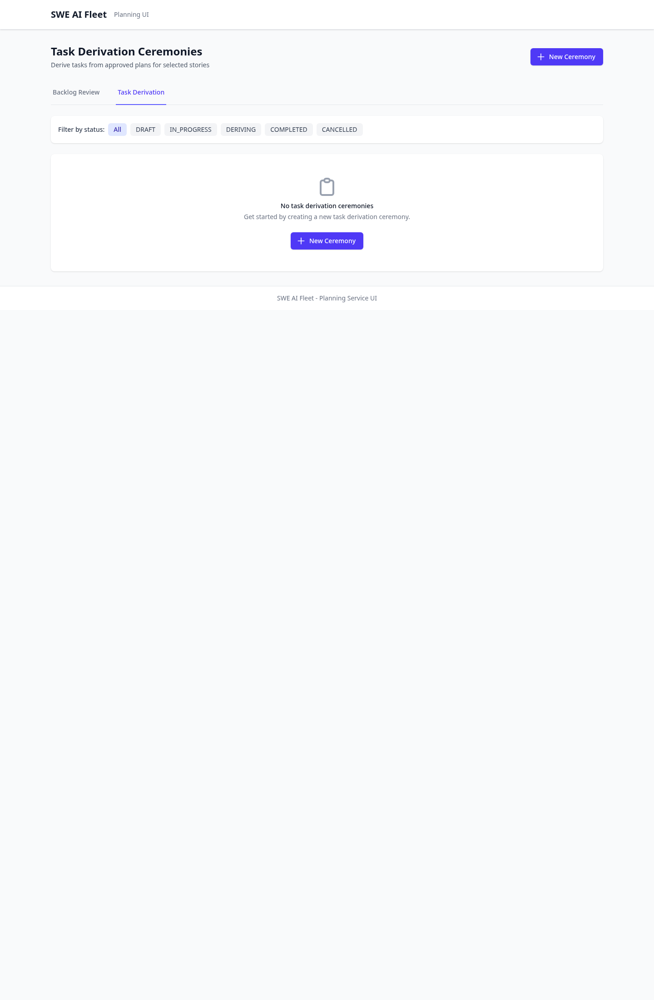
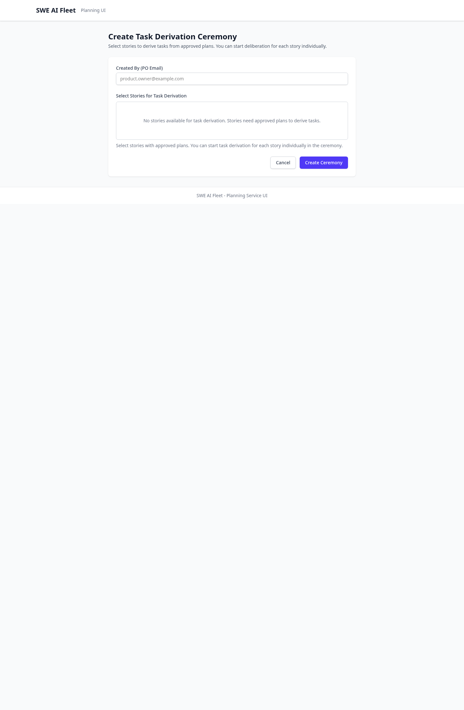

### 5.8 Rutas Con Comportamiento Inconsistente En Instancia Actual
`/ceremonies/planning` actualmente cae en error de ceremonia no encontrada:

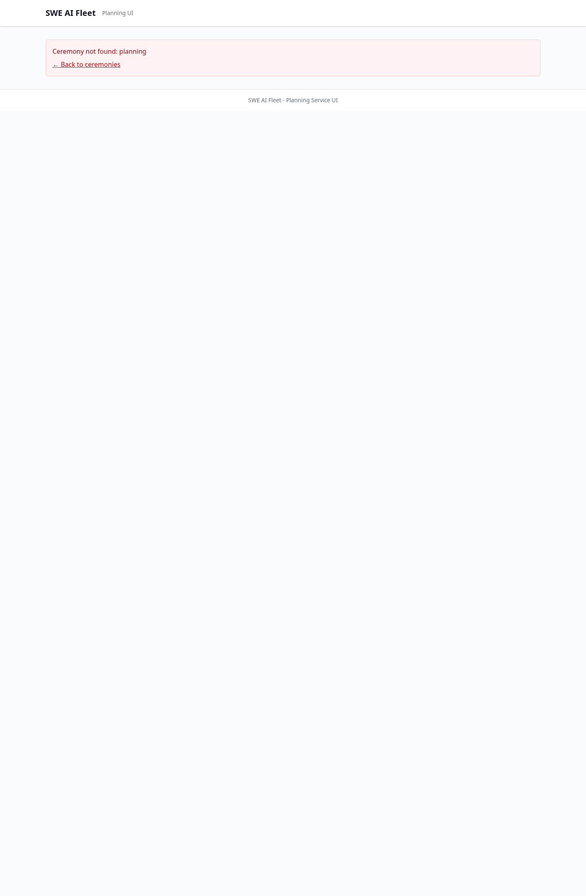

`/tasks/new` actualmente no esta implementada como formulario:

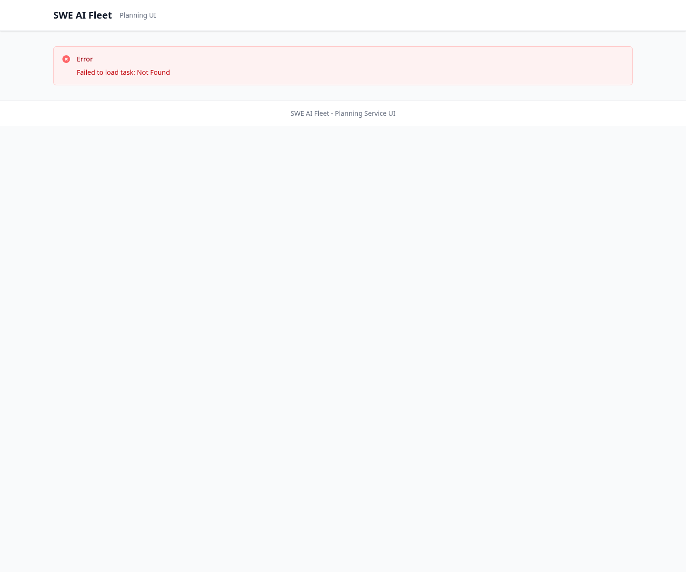

## 6. Hallazgos De La Instancia Revisada
- La instancia estaba vacia en la verificacion (`0` projects, epics, stories, ceremonies), por eso no hay capturas de detalles con datos reales.
- `Start Planning Ceremony` no estaba accesible en la URL publica (ruta colisionada con detalle dinamico de ceremonia o despliegue sin esa pagina).
- El boton `New Task` en detalle de story apunta a `/tasks/new`, pero no existe formulario para crear tarea en esa ruta.
- En `Task Derivation Ceremonies`, la UI de listado/filtro existe, pero el endpoint backend de listado aun no esta implementado y responde vacio (`API not yet implemented`), por lo que no se puede validar acceso a ceremonias reales desde esa lista.

## 6.1 Validacion Especifica: Listar Y Filtrar Ceremonias
| Tipo de ceremonia | Listar | Filtrar por estado | Acceso a detalle desde listado | Estado |
|---|---|---|---|---|
| Backlog Review (`/ceremonies`) | Si | Si (`?status=`) | Si (`/ceremonies/{ceremony_id}`) | OK |
| Task Derivation (`/ceremonies/task-derivation`) | UI: Si, Backend: No | UI: Si, Backend: No | UI: Si, pero sin datos reales del backend | Parcial/Bloqueado por backend |
| Planning Ceremony | No (solo start) | No | No listado de instancias | Pendiente de backend/API de list/detail |

## 7. Notas Tecnicas De Uso
- La UI es SSR y consulta APIs internas bajo `/api/*`.
- En detalles de story y task, la caja `Context` permite navegacion jerarquica y vista de grafo (si hay relaciones cargadas).
- En backlog review, las acciones de aprobacion/rechazo solo aparecen cuando la ceremonia esta en `REVIEWING` y el resultado esta en `PENDING`.
