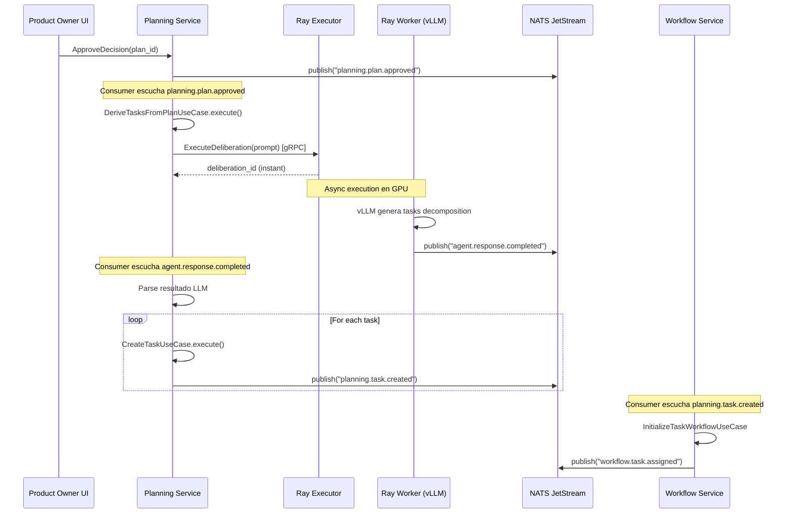

# Task Derivation - Análisis Arquitectónico Completo

**Fecha:** 11 de noviembre, 2025
**Contexto:** Revisión con Workflow Orchestration Service Design

---

## 🏗️ Arquitectura Actual del Sistema (Completa)

### Bounded Contexts y Responsabilidades

```
┌─────────────────────────────────────────────────────────────────────┐
│                     MICROSERVICES ARCHITECTURE                       │
└─────────────────────────────────────────────────────────────────────┘

┌──────────────────┐  1. planning.plan.approved    ┌─────────────────┐
│                  ├──────────────────────────────>│                 │
│  Planning        │                                │  ???            │
│  Service         │                                │  (TASK          │
│  :50051          │  ¿Quién deriva tasks?         │  DERIVATION)    │
│                  │                                │                 │
│  - Stories       │                                └────────┬────────┘
│  - Projects      │                                         │
│  - Epics         │                                         │
│  - **Tasks**     │<────────────────────────────────────────┘
│  - Plans         │  planning.task.created (x N tasks)
└──────────────────┘
        │
        │ planning.task.created
        ↓
┌──────────────────┐  2. Initialize workflow       ┌─────────────────┐
│                  ├──────────────────────────────>│                 │
│  Workflow        │                                │  Workflow       │
│  Service         │  3. agent.work.completed      │  Service        │
│  :50056          │<──────────────────────────────┤  :50056         │
│                  │                                │                 │
│  - FSM (12 est.) │  4. workflow.task.assigned    │  - State FSM    │
│  - RBAC L2       ├──────────────────────────────>│  - Validation   │
│  - Routing       │                                │  - Routing      │
└──────────────────┘                                └─────────────────┘
        │                                                     ↑
        │ workflow.task.assigned                             │
        ↓                                                     │
┌──────────────────┐                                ┌────────┴────────┐
│                  │  5. Execute agent on Ray       │                 │
│  Orchestrator    ├──────────────────────────────>│  Ray Executor   │
│  Service         │                                │  :50056         │
│  :50055          │  6. deliberation_id (instant)  │                 │
│                  │<──────────────────────────────┤  - Ray jobs     │
│  - Deliberation  │                                │  - GPU alloc    │
│  - Multi-agent   │                                │  - vLLM client  │
│  - Councils      │                                └────────┬────────┘
└──────────────────┘                                         │
        ↑                                                     │
        │                                                     │
        │ 7. agent.response.completed                        │
        └─────────────────────────────────────────────────────┘
                    (Ray Worker publica a NATS)
```

---

## 🎯 La Pregunta Clave

### ¿Dónde debe vivir "Task Derivation"?

**Task Derivation** = Descomponer un plan aprobado en múltiples tasks atómicas usando LLM.

**Opciones:**

---

## 📊 Opción 1: Planning Service (✅ RECOMENDADO)

### Responsabilidad Natural

```
Planning Service :50051
├── Bounded Context: Project Planning & Story Management
├── Gestiona:
│   ├── Projects (root)
│   ├── Epics (grupos de stories)
│   ├── Stories (user stories)
│   ├── Plans (versiones de implementación)
│   └── **Tasks** (unidades atómicas de trabajo) ← AQUÍ
│
├── Use Cases Existentes:
│   ├── CreateTaskUseCase (manual - una por una) ✅
│   ├── GetTaskUseCase ✅
│   └── ListTasksUseCase ✅
│
└── Use Case FALTANTE:
    └── DeriveTasksFromPlanUseCase (automático - LLM) ❌ IMPLEMENTAR
```

### Flow Completo:

```
1. PO aprueba plan en UI
   └─> Planning Service: ApproveDecisionUseCase
       └─> Publica: planning.plan.approved

2. Planning Service Consumer escucha planning.plan.approved
   └─> Llama: DeriveTasksFromPlanUseCase
       ├─> Fetch plan de Neo4j/Valkey
       ├─> Genera prompt para LLM
       └─> Submite a Ray Executor (async, retorna deliberation_id)

3. Ray Worker ejecuta vLLM agent
   └─> Genera texto con tasks decompostas
   └─> Publica: agent.response.completed

4. Planning Service Consumer escucha agent.response.completed
   └─> Parse tasks del resultado LLM
   └─> Por cada task:
       ├─> Llama CreateTaskUseCase (N veces)
       └─> Publica: planning.task.created (N eventos)

5. Workflow Service escucha planning.task.created
   └─> Por cada task:
       └─> Llama: InitializeTaskWorkflowUseCase
           └─> Crea workflow state inicial (state=todo)

6. Workflow Service publica workflow.task.assigned
   └─> Task lista para ejecución

7. Orchestrator escucha workflow.task.assigned
   └─> Asigna task a agent developer
```

### Ventajas ✅

1. **Bounded Context correcto**
   - Tasks son entidades de Planning Service
   - Planning ya gestiona todo el ciclo de planning

2. **Cohesión alta**
   - CreateTaskUseCase ya existe
   - Reutiliza misma infraestructura (Neo4j, Valkey, NATS)
   - Mappers ya implementados

3. **Event-driven natural**
   - Planning escucha sus propios eventos
   - Publica planning.task.created (otros escuchan)

4. **Separación clara**
   - Planning: Crea tasks
   - Workflow: Gestiona ejecución de tasks
   - Orchestrator: Ejecuta agentes

### Desventajas ⚠️

1. **Planning Service necesita integración con Ray Executor**
   - Actualmente Planning no habla con Ray
   - Necesita cliente gRPC nuevo

2. **Event-driven más complejo**
   - Submit job → esperar evento NATS → persistir
   - No puede ser síncrono

---

## 📊 Opción 2: Orchestrator Service (❌ NO RECOMENDADO)

### Lo que implementé

```
Orchestrator Service :50055
├── Bounded Context: Agent Execution & Deliberation
├── Responsabilidad ACTUAL:
│   ├── Ejecutar deliberaciones multi-agente
│   ├── Crear councils
│   ├── Gestionar Ray jobs
│   └── Coordinar peer review
│
└── Responsabilidad NUEVA (si dejamos task derivation aquí):
    └── DeriveSubtasksUseCase ← VIOLACIÓN DE BOUNDED CONTEXT
```

### Desventajas ❌

1. **Violación de bounded context**
   - Tasks NO son entidad de Orchestrator
   - Orchestrator ejecuta agentes, no gestiona planning

2. **Acoplamiento incorrecto**
   - Orchestrator tendría que crear Tasks en Planning
   - Necesitaría llamar Planning Service vía gRPC

3. **Confusión de responsabilidades**
   ```
   Orchestrator haría:
   ├── Ejecutar agentes (correcto)
   ├── Crear councils (correcto)
   └── Derivar tasks (INCORRECTO - eso es Planning)
   ```

4. **Duplicación**
   - Planning tiene CreateTaskUseCase
   - Orchestrator tendría DeriveTasksUseCase
   - ¿Por qué dos lugares crean tasks?

---

## 📊 Opción 3: Nuevo Microservicio "Task Derivation Service" (⚖️ OVERKILL)

### Servicio dedicado

```
Task Derivation Service :50057
├── Bounded Context: Automatic Task Decomposition
├── Escucha: planning.plan.approved
├── Publica: tasks.derived
└── Responsabilidad única: LLM-based task derivation
```

### Ventajas ✅

1. Responsabilidad única clara
2. Escalabilidad independiente
3. Puede evolucionar algoritmos de derivation

### Desventajas ❌

1. **Overkill para una funcionalidad**
   - Un use case no justifica microservicio
   - Aumenta complejidad operacional

2. **Overhead**
   - Deployment separado
   - Monitoring separado
   - Más puntos de falla

3. **Planning sigue siendo dueño de Tasks**
   - Task Derivation crearía tasks en Planning anyway
   - Mejor que esté integrado en Planning

---

## 🎯 Decisión Arquitectónica Recomendada

### ✅ Opción 1: Implementar en Planning Service

**Rationale:**

1. **DDD principles:** Tasks son aggregate del bounded context de Planning
2. **Single Responsibility:** Planning gestiona todo el ciclo de planning
3. **Cohesión:** Reutiliza infraestructura existente
4. **Simplicidad:** No introduce nuevos servicios ni acoplamientos raros

---

## 🔄 Flujo Event-Driven Correcto (Planning Service)

### Paso a Paso



---

## 📁 Estructura de Planning Service (Con Task Derivation)

```
services/planning/
├── planning/
│   ├── domain/
│   │   ├── entities/
│   │   │   ├── task.py ✅ (existe)
│   │   │   └── plan.py ✅ (existe)
│   │   ├── services/
│   │   │   └── dependency_analysis_service.py ← MOVER AQUÍ
│   │   └── value_objects/
│   │       └── task_dependency.py ← NUEVO
│   │
│   ├── application/
│   │   ├── usecases/
│   │   │   ├── create_task_usecase.py ✅ (existe)
│   │   │   └── derive_tasks_from_plan_usecase.py ← NUEVO
│   │   └── ports/
│   │       ├── llm_port.py ← NUEVO
│   │       └── ray_executor_port.py ← NUEVO (wrapper)
│   │
│   └── infrastructure/
│       ├── adapters/
│       │   └── ray_executor_adapter.py ← NUEVO
│       └── consumers/
│           ├── plan_approved_consumer.py ← NUEVO
│           └── task_derivation_result_consumer.py ← NUEVO
│
└── server.py ← Modificar para inyectar nuevo use case
```

---

## 🔧 Componentes a Implementar en Planning

### 1. Domain Layer

**Reutilizar de Orchestrator:**
- `DependencyAnalysisService` → Mover a Planning
- Value objects: `TaskNode`, `DependencyEdge`, `DependencyGraph`

**Nuevo:**
```python
# planning/domain/value_objects/task_dependency.py
@dataclass(frozen=True)
class TaskDependency:
    source_task_id: TaskId
    target_task_id: TaskId
    dependency_type: DependencyType  # BLOCKS, REQUIRES
```

### 2. Application Layer

**Use Case Principal:**
```python
# planning/application/usecases/derive_tasks_from_plan_usecase.py

@dataclass
class DeriveTasksFromPlanUseCase:
    """
    Use case for automatic task derivation from approved plans.

    Flow:
    1. Submit LLM job to Ray Executor (async)
    2. Return immediately (event-driven)
    3. Consumer will handle result when agent completes
    """

    storage: StoragePort  # Neo4j + Valkey (ya existe)
    ray_executor: RayExecutorPort  # Cliente gRPC a Ray Executor
    messaging: MessagingPort  # NATS (ya existe)

    async def execute(self, plan_id: PlanId) -> str:
        """
        Submit task derivation job to Ray Executor.

        Returns:
            deliberation_id for tracking
        """
        # 1. Fetch plan
        plan = await self.storage.get_plan(plan_id)

        # 2. Build LLM prompt
        prompt = self._build_decomposition_prompt(plan)

        # 3. Submit to Ray Executor (async)
        submission = await self.ray_executor.execute_deliberation(
            task_id=f"derive-{plan_id.value}",
            task_description=prompt,
            role="SYSTEM",
            agents=[{"id": "task-deriver", "role": "SYSTEM"}],
            constraints={},
            vllm_url=self.config.vllm_url,
            vllm_model=self.config.vllm_model,
        )

        # 4. Store tracking info (for consumer to match)
        await self.storage.save_derivation_tracking(
            deliberation_id=submission.deliberation_id,
            plan_id=plan_id,
            status="pending"
        )

        # 5. Return immediately (event-driven)
        return submission.deliberation_id
```

**Consumer para resultados:**
```python
# planning/infrastructure/consumers/task_derivation_result_consumer.py

class TaskDerivationResultConsumer:
    """
    Escucha agent.response.completed para task derivation.
    """

    async def handle_agent_response(self, msg):
        payload = json.loads(msg.data)
        task_id = payload["task_id"]

        # 1. Verificar si es un task derivation
        if not task_id.startswith("derive-"):
            return  # Not our event

        # 2. Parse resultado LLM
        generated_text = payload["result"]["proposal"]
        tasks = self._parse_tasks_from_llm(generated_text)

        # 3. Analizar dependencias
        dep_graph = self.dependency_service.infer_dependencies(tasks)

        # 4. Persistir tasks (usar CreateTaskUseCase existente)
        for task_data in tasks:
            await self.create_task_usecase.execute(
                plan_id=task_data["plan_id"],
                story_id=task_data["story_id"],
                title=task_data["title"],
                description=task_data["description"],
                priority=task_data["priority"],
            )

        # 5. Persistir dependencias
        await self.storage.save_task_dependencies(dep_graph.dependencies)

        # Planning.task.created ya se publicó (N veces)
        # Workflow Service lo escuchará y creará workflow states
```

### 3. Infrastructure Layer

**Ray Executor Adapter:**
```python
# planning/infrastructure/adapters/ray_executor_adapter.py

class RayExecutorAdapter:
    """
    Adapter para comunicarse con Ray Executor Service.

    Planning Service NO ejecuta Ray directamente,
    usa Ray Executor Service como intermediario.
    """

    def __init__(self, grpc_address: str):
        self.channel = grpc.aio.insecure_channel(grpc_address)
        self.stub = RayExecutorServiceStub(self.channel)

    async def execute_deliberation(self, ...):
        # Implementación gRPC call a Ray Executor
        pass
```

---

## 🚦 Integración con Workflow Service

### Planning → Workflow

```python
# Workflow Service (YA EXISTE)
# services/workflow/infrastructure/consumers/task_created_consumer.py

class TaskCreatedConsumer:
    """
    Escucha planning.task.created y crea workflow state.
    """

    async def handle_task_created(self, msg):
        task_id = msg["task_id"]

        # Inicializar workflow FSM para este task
        await self.initialize_workflow_usecase.execute(
            task_id=task_id,
            initial_state="todo",
            assigned_role="developer"
        )

        # Publicar asignación
        await self.messaging.publish(
            "workflow.task.assigned",
            {
                "task_id": task_id,
                "assigned_to_role": "developer",
                "required_action": "IMPLEMENT_FEATURE"
            }
        )
```

**NO hay cambios en Workflow Service** - solo escucha planning.task.created

---

## ✅ Plan de Implementación

### Fase 1: Mover código a Planning Service (2 días)

1. **Copiar componentes de Orchestrator a Planning:**
   - `DependencyAnalysisService` → `planning/domain/services/`
   - Value objects → `planning/domain/value_objects/`
   - Tests → `planning/tests/domain/services/`

2. **Crear ports en Planning:**
   - `RayExecutorPort` (wrapper simple a gRPC)
   - Reutilizar `MessagingPort` existente

3. **Implementar use case:**
   - `DeriveTasksFromPlanUseCase`
   - Integrar con `CreateTaskUseCase` existente

4. **Implementar consumers:**
   - `PlanApprovedConsumer` (escucha planning.plan.approved)
   - `TaskDerivationResultConsumer` (escucha agent.response.completed)

5. **Implementar adapter:**
   - `RayExecutorAdapter` (cliente gRPC a Ray Executor :50056)

### Fase 2: Tests (1 día)

1. Unit tests para use case
2. Unit tests para consumers
3. Integration tests con mocks

### Fase 3: Validación E2E (1 día)

1. Aprobar plan en Planning
2. Verificar derivation automática
3. Verificar tasks creados
4. Verificar Workflow inicializa correctamente

---

## 📊 Comparación Final

| Aspecto | Orchestrator | Planning | Nuevo Service |
|---------|-------------|----------|---------------|
| Bounded Context | ❌ Incorrecto | ✅ Correcto | ⚖️ Overkill |
| Cohesión | ❌ Baja | ✅ Alta | ⚖️ Media |
| Acoplamiento | ❌ Alto | ✅ Bajo | ⚖️ Medio |
| Complejidad | 🟡 Media | 🟢 Baja | 🔴 Alta |
| Mantenibilidad | ❌ Confuso | ✅ Claro | ⚖️ Más componentes |
| Tiempo impl. | 🟢 1 día | 🟡 2-3 días | 🔴 1-2 semanas |

---

## 🎯 Recomendación Final

### ✅ Implementar en Planning Service

**Razón principal:** **Bounded Context correcto + Arquitectura limpia**

**Next Steps:**
1. Crear branch: `feature/planning-task-derivation`
2. Mover código de Orchestrator a Planning
3. Implementar consumers event-driven
4. Tests + validación E2E
5. Deploy

**Estimación:** 3-4 días

---

**Tirso, ¿estás de acuerdo con esta decisión arquitectónica?**

Si confirmas, procedo con:
1. Mover componentes a Planning Service
2. Implementar event-driven con NATS consumers
3. Integración con Workflow Service

