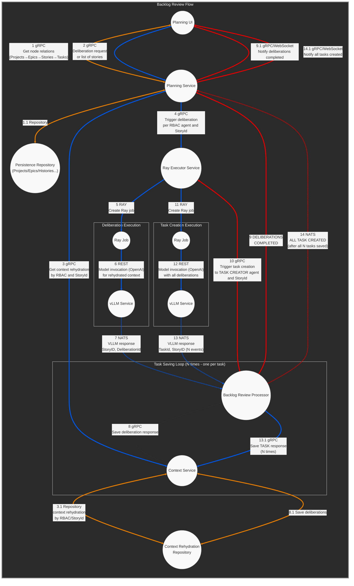

# Backlog Review Flow

**This is the designed source of the truth by owner Tirso Garcia**

### Color Legend

- **Blue lines**: Forward arrows
- **Red lines**: Return arrows
- **Orange lines**: Bidirectional arrows
