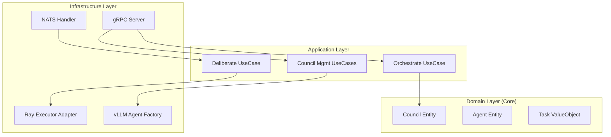

# Orchestrator Service

**Package**: `services.orchestrator`
**Type**: Microservice (gRPC + NATS)
**Architecture**: Hexagonal (Ports & Adapters) + DDD

## 📖 Overview

The **Orchestrator Service** is the runtime execution engine of the SWE AI Fleet. While the **Planning Service** decides *what* needs to be done (User Stories), and the **Workflow Service** tracks *status* (FSM), the Orchestrator is responsible for **how** work is executed.

It implements the **Council of Agents** pattern, where multiple specialized AI agents (Roles) collaborate via **Deliberation** (Generate → Critique → Revise → Select) to produce high-quality code and artifacts.

## 🏗 Architecture

This service is a **Hexagonal Architecture** wrapper around the `core.orchestrator` bounded context. It provides the infrastructure plumbing (gRPC, NATS, Ray integration) to make the core domain logic deployable and scalable.



### Directory Structure

```
services/orchestrator/
├── application/          # Application Services & Use Cases (Service-specific)
├── domain/               # Service Domain Entities (Registry, Stats) & Ports
├── infrastructure/       # Adapters (NATS, Ray, vLLM) & Handlers
├── server.py             # Main Entry Point & Dependency Injection
└── tests/                # Unit & Integration Tests
```

## 🔌 API & Interfaces

### 1. gRPC API (Synchronous & Control)
Defined in `specs/fleet/orchestrator/v1/orchestrator.proto`.

| RPC | Description | Status |
|-----|-------------|--------|
| `Orchestrate` | Execute full task workflow (Select Council → Deliberate → Result) | ✅ Ready |
| `Deliberate` | Run a specific deliberation round (Peer Review) | ✅ Ready |
| `CreateCouncil` | Initialize a new council for a role (e.g., "DEV") | ✅ Ready |
| `ListCouncils` | Get active councils and their agents | ✅ Ready |
| `DeleteCouncil` | Teardown a council | ✅ Ready |
| `GetStatus` | Health check and internal statistics | ✅ Ready |
| `StreamDeliberation` | Real-time progress streaming | 🚧 Unimplemented |

### 2. NATS Events (Asynchronous)
The service operates as an Event-Driven Architecture (EDA) consumer and producer.

**Consumes:**
*   `planning.events` (Topic: `planning.>`): Triggers task derivation when stories move to 'In Progress'.
*   `agent.responses` (Topic: `agent.responses.>`): Receives async results from Ray workers.

**Produces:**
*   `orchestration.task.dispatched`: When a task is assigned to an agent/council.
*   `orchestration.deliberation.completed`: When a consensus is reached.

## ⚙️ Configuration

The service is configured via Environment Variables (typically injected via K8s ConfigMaps/Secrets).

| Variable | Description | Default |
|----------|-------------|---------|
| `GRPC_PORT` | Service listening port | `50055` |
| `NATS_URL` | NATS JetStream URL | `nats://nats:4222` |
| `ENABLE_NATS` | Master switch for messaging | `true` |
| `EXECUTOR_ADDRESS` | Ray Executor gRPC address | `localhost:50056` |
| `VLLM_URL` | vLLM Inference Server URL | `http://vllm:8000` |
| `VLLM_MODEL` | Model to use for agents | `Qwen/Qwen3-0.6B` |
| `DELIBERATION_TIMEOUT` | Timeout for async jobs (sec) | `300` |

## 🚀 Deployment & Usage

### Local Development (Podman)

The service is designed to run in a containerized environment.

```bash
# Build the image
make build-orchestrator

# Run with local dependencies (NATS/Redis required)
podman run -d --net host \
  -e NATS_URL=nats://localhost:4222 \
  -e VLLM_URL=http://localhost:8000 \
  registry.underpassai.com/swe-fleet/orchestrator:latest
```

### Testing

We maintain a high bar for quality with **90% coverage requirement**.

**Unit Tests:**
```bash
pytest services/orchestrator/tests/
```

**E2E Tests (Integration):**
Uses real NATS and Orchestrator containers.
```bash
./tests/integration/services/orchestrator/run-e2e.sh
```

## 🧠 Key Concepts

### Councils
A **Council** is a group of agents assigned to a specific **Role** (e.g., `DEV`, `QA`, `ARCHITECT`).
*   Managed via `CouncilRegistry` (In-Memory/Redis).
*   Created dynamically via `CreateCouncil`.
*   Agents in a council are typically stateless `VLLMAgent` instances that wrap LLM calls.

### Deliberation Process
1.  **Request**: Task comes in (e.g., "Implement login").
2.  **Dispatch**: Orchestrator finds the `DEV` council.
3.  **Generation**: 3 Agents generate solutions in parallel (offloaded to Ray/vLLM).
4.  **Peer Review**: Agents critique each other's code.
5.  **Selection**: The `ARCHITECT` (or scoring logic) picks the winner.

## 🛠 Infrastructure Adapters

*   **`NATSMessagingAdapter`**: Handles JetStream pub/sub.
*   **`GRPCRayExecutorAdapter`**: Proxies heavy compute to the Ray cluster.
*   **`VLLMAgentFactoryAdapter`**: Creates agents configured for the specific vLLM model endpoint.
*   **`ScoringAdapter`**: Provides rubric evaluation logic.

## ⚠️ Known Limitations

1.  **Context Hydration**: Currently basic. Integration with `Context Service` for surgical context retrieval (<200 tokens) is in progress.
2.  **Streaming**: `StreamDeliberation` RPC is not yet implemented.
3.  **Persistence**: Council state is currently ephemeral (re-created on restart via `init_default_councils_if_empty`).

