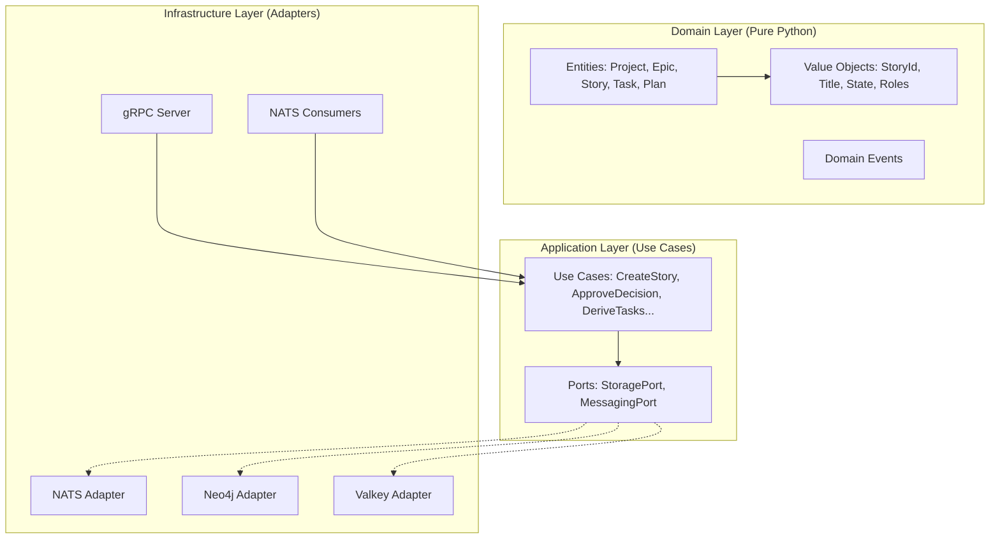

# Planning Service

**Version**: v2.0.0
**Status**: ✅ Production Ready
**Architecture**: DDD + Hexagonal
**Language**: Python 3.13+

---

## 📋 Executive Summary

The **Planning Service** is the core microservice responsible for managing the hierarchical structure of work (Projects, Epics, Stories, Tasks) and the lifecycle of user stories via a **Finite State Machine (FSM)**.

It implements a strictly typed, Domain-Driven Design (DDD) approach where all business logic resides in the domain layer, isolated from infrastructure concerns. It integrates with the **Task Derivation Service** to automatically generate tasks from approved plans using LLMs.

**Key Responsibilities:**
- **Hierarchy Management**: Project → Epic → Story → Task.
- **Story Lifecycle**: FSM transitions (DRAFT → PO_REVIEW → READY_FOR_PLANNING → ... → DONE).
- **Decision Workflow**: Product Owner approval/rejection of stories and plans.
- **Task Derivation**: Triggers external task derivation upon plan approval.
- **Persistence**: Dual-write to Neo4j (Graph/Relationships) and Valkey (Key-Value/Details).

---

## 🏗️ Architecture

This service follows **Hexagonal Architecture (Ports & Adapters)** to ensure separation of concerns and testability.



### Directory Structure

- `planning/domain/`: **Pure business logic**. Entities, Value Objects, Events. No external dependencies.
- `planning/application/`: **Orchestration**. Use Cases, Ports (interfaces), DTOs.
- `planning/infrastructure/`: **Implementation**. Adapters (Neo4j, NATS), gRPC Handlers, Consumers.
- `server.py`: Entry point and dependency injection container.

---

## 🧩 Domain Model

### Entities (Aggregate Roots)

All entities are immutable (`@dataclass(frozen=True)`) and enforce fail-fast validation.

| Entity | Description | Key Responsibilities |
| for | for | for |
| **Project** | Root of the hierarchy. | High-level grouping of work. |
| **Epic** | Large body of work. | Groups related Stories. |
| **Story** | The core unit of work. | Manages FSM state, DoR score, and PO decisions. |
| **Plan** | Implementation approach. | Holds acceptance criteria, tech notes, and roles for derivation. |
| **Task** | Atomic work unit. | Represents executable steps derived from a Plan. |

### Finite State Machine (FSM)

Stories transition through strict states:
1. `DRAFT`: Initial state.
2. `PO_REVIEW`: Awaiting PO approval.
3. `READY_FOR_PLANNING`: Approved, ready for task derivation.
4. `PLANNED`: Tasks have been derived.
5. `READY_FOR_EXECUTION`: Queued for development.
6. `IN_PROGRESS` → `CODE_REVIEW` → `TESTING` → `READY_TO_REVIEW` → `ACCEPTED` → `DONE`.

---

## 📡 API Reference (gRPC)

The service exposes a gRPC API on port `50051` (default).

### Project Management
- `CreateProject(CreateProjectRequest) → CreateProjectResponse`
- `GetProject(GetProjectRequest) → Project`
- `ListProjects(ListProjectsRequest) → ListProjectsResponse`

### Epic Management
- `CreateEpic(CreateEpicRequest) → CreateEpicResponse`
- `GetEpic(GetEpicRequest) → Epic`
- `ListEpics(ListEpicsRequest) → ListEpicsResponse`

### Story Management
- `CreateStory(CreateStoryRequest) → CreateStoryResponse`
- `GetStory(GetStoryRequest) → Story`
- `ListStories(ListStoriesRequest) → ListStoriesResponse`
- `TransitionStory(TransitionStoryRequest) → TransitionStoryResponse`
- `ApproveDecision(ApproveDecisionRequest) → ApproveDecisionResponse`
- `RejectDecision(RejectDecisionRequest) → RejectDecisionResponse`

### Task Management
- `CreateTask(CreateTaskRequest) → CreateTaskResponse`
- `GetTask(GetTaskRequest) → Task`
- `ListTasks(ListTasksRequest) → ListTasksResponse`

> **Note**: The `GetPlanContext` RPC is NOT exposed by this service. Context data is managed by the **Context Service**.

---

## ⚡ Event-Driven Workflow

The service uses **NATS JetStream** for asynchronous communication.

### Published Events
| Event Type | Topic | Trigger |
| for | for | for |
| `story.created` | `planning.story.created` | A new story is created. |
| `story.transitioned` | `planning.story.transitioned` | Story changes state (e.g., DRAFT -> PO_REVIEW). |
| `decision.approved` | `planning.decision.approved` | PO approves a story/decision. |
| `decision.rejected` | `planning.decision.rejected` | PO rejects a story/decision. |
| `task.derivation.requested` | `task.derivation.requested` | A plan is approved, triggering external task derivation. |

### Consumed Events
| Event Type | Topic | Handler | Action |
| for | for | for | for |
| `plan.approved` | `planning.plan.approved` | `PlanApprovedConsumer` | Triggers `DeriveTasksFromPlanUseCase`. |
| `task.derivation.completed` | `task.derivation.completed` | `TaskDerivationResultConsumer` | Updates Story state to `PLANNED`, creates Tasks. |
| `task.derivation.failed` | `task.derivation.failed` | `TaskDerivationResultConsumer` | Handles failure, updates status. |

---

## 💾 Data Persistence

The service uses a **Dual Storage** pattern:

1.  **Neo4j (Graph)**:
    -   Stores relationships: `(:Story)-[:HAS_TASK]->(:Task)`, `(:User)-[:CREATED]->(:Story)`.
    -   Used for graph traversals and structural queries.
2.  **Valkey (Key-Value)**:
    -   Stores entity details (titles, descriptions, acceptance criteria).
    -   Used for fast point lookups by ID.

Configuration is handled via `StorageAdapter`.

---

## 🚀 Getting Started

### Prerequisites
- Python 3.13+
- Neo4j (running on `bolt://neo4j:7687`)
- Valkey/Redis (running on `redis://valkey:6379`)
- NATS (running on `nats://nats:4222`)

### Installation
```bash
# In services/planning/
pip install -e .
pip install -r requirements.txt
```

### Running the Server
```bash
# Ensure environment variables are set (or use defaults)
python server.py
```

### Running Tests
```bash
# Run unit tests
make test-unit

# Run coverage
make coverage
```

---

## 🛡️ Compliance & Standards

- **Immutability**: All domain objects are frozen.
- **Validation**: Fail-fast in `__post_init__`.
- **No Reflection**: No `setattr`, `getattr` or dynamic dict manipulation.
- **Type Safety**: Full type hinting usage.
- **Testing**: High coverage (>90%) required for domain logic.

This service adheres to the **SWE AI Fleet** architectural guidelines.

