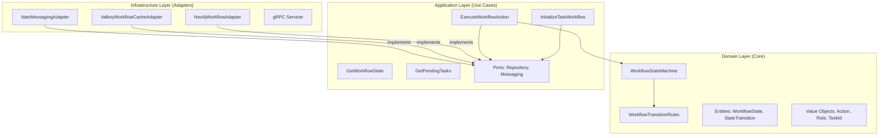

# Workflow Service - Bounded Context Documentation

**Version**: v1.0.0
**Status**: ✅ Production Ready
**Pattern**: DDD + Hexagonal Architecture (Ports & Adapters)
**RBAC Level**: Level 2 - Workflow Action Control
**Language**: Python 3.13

---

## 📋 Executive Summary

The **Workflow Service** is the multi-role task execution coordinator of the SWE AI Fleet platform. It acts as the "traffic controller" for tasks, managing their lifecycle through a rigorous Finite State Machine (FSM). It ensures that tasks move correctly between agents (Developer → Architect → QA → Product Owner) and that all RBAC policies are enforced before any transition occurs.

**Core Responsibilities:**
- 🔄 **FSM Management**: Manages the 15-state workflow lifecycle.
- 🔐 **RBAC Enforcement**: Validates that only authorized roles can perform specific actions (e.g., only Architect can `APPROVE_DESIGN`).
- 🎯 **Task Routing**: Automatically routes tasks to the next responsible role (e.g., `DEV_COMPLETED` → `PENDING_ARCH_REVIEW`).
- 📊 **Audit Trail**: Maintains an immutable history of all state transitions in Neo4j.
- ⚡ **Event-Driven**: Reacts to `planning.task.created` and `agent.work.completed` events via NATS.

---

## 🏗️ Architecture Overview

This service strictly follows **Hexagonal Architecture (Ports & Adapters)** to separate domain logic from infrastructure concerns.

### Layered Design



### Directory Structure
- **`domain/`**: Pure business logic. Contains the FSM, Role definitions, and State enumerations. No external dependencies.
- **`application/`**: Orchestration of use cases. Defines Ports (interfaces) for infrastructure.
- **`infrastructure/`**: Concrete implementations of Ports (Neo4j, Valkey, NATS) and the gRPC server.
- **`gen/`**: Generated Protobuf/gRPC code (not checked into git).

---

## 🧩 Domain Model

### Workflow State Machine (FSM)
The core of the service is the `WorkflowStateMachine`, which governs the lifecycle of a task.

#### States (15 Total)
Defined in `WorkflowStateEnum`:
1.  **TODO**: Initial state, assigned to Developer.
2.  **IMPLEMENTING**: Developer is working.
3.  **DEV_COMPLETED**: (Intermediate) Developer finished, ready for routing.
4.  **PENDING_ARCH_REVIEW**: Waiting for Architect.
5.  **ARCH_REVIEWING**: Architect is reviewing.
6.  **ARCH_APPROVED**: (Intermediate) Architect approved.
7.  **ARCH_REJECTED**: Architect rejected, sent back to Developer.
8.  **PENDING_QA**: Waiting for QA.
9.  **QA_TESTING**: QA is testing.
10. **QA_PASSED**: (Intermediate) QA passed.
11. **QA_FAILED**: QA failed, sent back to Developer.
12. **PENDING_PO_APPROVAL**: Waiting for Product Owner.
13. **PO_APPROVED**: (Intermediate) PO approved.
14. **DONE**: Terminal state (Success).
15. **CANCELLED**: Terminal state (Cancelled).

#### Roles & Responsibilities
Defined in `WorkflowStateMetadata`:

| State | Responsible Role | Expected Action |
| :--- | :--- | :--- |
| `IMPLEMENTING` | **Developer** | `COMMIT_CODE` |
| `PENDING_ARCH_REVIEW` | **Architect** | `APPROVE_DESIGN` |
| `ARCH_REJECTED` | **Developer** | `REVISE_CODE` |
| `PENDING_QA` | **QA** | `APPROVE_TESTS` |
| `QA_FAILED` | **Developer** | `REVISE_CODE` |
| `PENDING_PO_APPROVAL` | **Product Owner** | `APPROVE_STORY` |

### Entities
- **`WorkflowState`**: Immutable root entity. Holds the `current_state`, `role_in_charge`, and the list of `history` (transitions).
- **`StateTransition`**: Immutable record of a change. Includes `from_state`, `to_state`, `action`, `actor_role`, and optional `feedback`.

---

## 📡 API & Integration

### gRPC API
Exposed on port **50056**.

- **`InitializeTaskWorkflow`**: Creates a new workflow for a task (usually triggered by Planning).
- **`ExecuteWorkflowAction`**: Attempts to transition a task's state based on an agent's action.
- **`GetWorkflowState`**: Returns the current state, responsible role, and history of a task.
- **`GetPendingTasks`**: Returns a list of tasks waiting for a specific role (e.g., "All tasks waiting for Architect").

### Events (NATS)

#### Consumes
- **`agent.work.completed`**: Triggered when an Agent finishes a job. Payload includes `action_performed` (e.g., "COMMIT_CODE"). The service validates this action against the FSM and transitions the state.
- **`planning.task.created`**: Triggered when the Planning Service creates a task. This initializes the workflow in `TODO` state.

#### Publishes
- **`workflow.task.assigned`**: Notifies the Orchestrator that a task is ready for a specific role.
- **`workflow.state.changed`**: General notification of state change.

---

## 💾 Data Persistence

### Neo4j (Primary Store)
- Stores the graph of **WorkflowState** and **StateTransition** nodes.
- Maintains the audit trail of who did what and when.

### Valkey (Cache)
- Caches the current `WorkflowState` for fast lookups (TTL 1 hour).
- Uses the `ValkeyWorkflowCacheAdapter` (Decorator pattern over the Neo4j adapter).

---

## 🛠️ Development & Testing

### Prerequisites
- Python 3.13+
- Neo4j, Valkey, and NATS running (locally or in cluster).

### Running Tests
The service aims for >90% coverage, focusing on domain logic and use cases.

```bash
# Run unit tests
make test-unit

# Run integration tests (requires infra)
make test-integration
```

### Configuration
Configured via environment variables (handled by `EnvironmentConfigurationAdapter`):
- `GRPC_PORT`: Service port (default: 50056)
- `NEO4J_URI`, `NEO4J_USER`, `NEO4J_PASSWORD`
- `VALKEY_HOST`, `VALKEY_PORT`
- `NATS_URL`
- `WORKFLOW_FSM_CONFIG`: Path to FSM YAML rule definition.

---

## ⚠️ Known Limitations & Notes
1.  **`QA_FAILED` Action**: Currently maps to `REVISE_CODE` in `WorkflowStateMetadata`. Architectural analysis suggests this might be better as `FIX_BUGS` in the future to distinguish from design revisions.
2.  **Auto-Transitions**: Intermediate states like `DEV_COMPLETED` or `ARCH_APPROVED` automatically transition to the next pending state (e.g., `PENDING_ARCH_REVIEW` or `PENDING_QA`).


