# SWE AI Fleet - API-First Strategy

## Overview

SWE AI Fleet follows a **strict API-First architecture** where all service contracts (gRPC, AsyncAPI, REST) are defined upfront as code specifications and generated during the container build phase. This ensures:

- **Contract-driven development**: Contracts are the source of truth before any code is written
- **Version consistency**: All services generate code from the same versioned specs
- **Clean separation**: API definitions are decoupled from implementation
- **Reproducible builds**: Same spec version always produces identical generated code
- **Testability**: Tests can be executed against stable, pre-generated APIs

---

## API-First Workflow Diagram

```mermaid
%%{init: {
  'theme': 'default',
  'themeVariables': {
    'primaryColor': '#f9f9f9',
    'primaryBorderColor': '#555',
    'textColor': '#000',
    'fontFamily': 'sans-serif'
  }
}}%%

graph LR
    A["1. Design<br/>Update .proto<br/>or .yaml"] -->|Spec is Source<br/>of Truth| B["2. Generate<br/>make generate<br/>Produces Code"]

    B -->|Development| C["3. Implement<br/>Business Logic<br/>in Service"]

    C -->|Local Testing| D["4. Test<br/>Ephemeral API<br/>Generate → Test → Clean"]

    D -->|Code Review| E["5. Commit<br/>Only specs + code<br/>NO gen/ files"]

    E -->|Build Image| F["6. Build<br/>Dockerfile regenerates<br/>API code"]

    F -->|Deploy| G["Image Ready<br/>Contains generated<br/>code"]

    style A fill:#f9f9f9,stroke:#555,stroke-width:2px,color:#000,rx:8,ry:8
    style B fill:#f9f9f9,stroke:#555,stroke-width:2px,color:#000,rx:8,ry:8
    style C fill:#f9f9f9,stroke:#555,stroke-width:2px,color:#000,rx:8,ry:8
    style D fill:#f9f9f9,stroke:#555,stroke-width:2px,color:#000,rx:8,ry:8
    style E fill:#f9f9f9,stroke:#555,stroke-width:2px,color:#000,rx:8,ry:8
    style F fill:#f9f9f9,stroke:#555,stroke-width:2px,color:#000,rx:8,ry:8
    style G fill:#f9f9f9,stroke:#555,stroke-width:2px,color:#000,rx:8,ry:8
```



---

## Directory Structure

```
specs/
├── asyncapi.yaml              # NATS JetStream event contracts
├── openapi.yaml               # REST gateway API (future)
├── dependencies.yaml          # Service versioning & dependencies
├── VERSION                    # Global spec version
├── Makefile                   # Code generation orchestration
├── buf.yaml                   # Buf configuration (protoc plugins)
├── buf.gen.yaml               # Code generation rules
├── fleet/                     # Microservice specifications
│   ├── context/v1/
│   ├── orchestrator/v1/
│   ├── planning/v2/
│   ├── ray_executor/v1/
│   ├── storycoach/v1/
│   ├── task_derivation/v1/
│   ├── workflow/v1/
│   └── workspace/v1/
└── docs/                      # API documentation
    ├── api/                   # Per-service API docs
    └── Makefile               # Doc generation
```

---

## API Specifications by Type

### 1. **gRPC Services** (Synchronous, Request-Response)
- **Location**: `specs/fleet/{service}/v{N}/{service}.proto`
- **Language**: Protocol Buffers 3
- **Version control**: Semantic versioning per service (v1, v2, etc.)
- **Generation targets**:
  - Go: `services/{service}/gen/pb/*.pb.go`
  - Python: `services/{service}/{service}/gen/pb2/*.pb2.py`

**Example services**:
- `planning/v2/planning.proto` → Planning Service gRPC definitions
- `task_derivation/v1/task_derivation.proto` → Task Derivation Service

### 2. **Async Events** (NATS JetStream)
- **Location**: `specs/asyncapi.yaml`
- **Language**: AsyncAPI 2.6.0
- **Subjects**: Event channels defined with patterns
- **Message schema**: JSON Schema embedded in spec

**Example events** (see `asyncapi.yaml` for complete list):
- Task derivation: `task.derivation.requested`, `task.derivation.completed`, `task.derivation.failed`
- Agent work: `agent.work.completed`, `agent.work.failed`
- Planning: `planning.story.transitioned`
- Workflow: `workflow.task.assigned`, `workflow.state.changed`


### 3. **REST API** (Future - Gateway Layer)
- **Location**: `specs/openapi.yaml`
- **Language**: OpenAPI 3.1.0
- **Purpose**: External API gateway (not yet deployed)
- **Consumers**: Frontend, External clients

---

## Build Phase: Generating APIs from Specs

### When APIs are Generated

**Container build time** (triggered automatically):

```dockerfile
# Example: Dockerfile for Planning Service
FROM golang:1.22-alpine AS builder

WORKDIR /build

# Copy spec files
COPY specs/ ./specs/

# Generate code from .proto files
RUN cd specs && make generate-planning

# Copy generated code to service
RUN cp -r fleet/planning/v2/gen/ ../services/planning/gen/

# Build service binary with generated code
COPY services/planning ./services/planning
RUN cd services/planning && go build -o server
```

### Generation Steps (executed in `specs/Makefile`)

1. **Validate specs** → Check syntax, naming conventions, dependencies
2. **Generate gRPC code** → Use `protoc` + plugins (buf for Go, grpc-tools for Python)
3. **Generate AsyncAPI mappers** → DTOs and marshallers for NATS events
4. **Generate documentation** → API reference from specs
5. **Copy to service directories** → Make generated code available to each service

### Example Command

```bash
cd specs
make generate-all
# Generates:
#   services/planning/gen/pb/*.pb.go
#   services/context/gen/pb2/*.pb2.py
#   services/task_derivation/gen/pb2/*.pb2.py
#   ... etc for all services
```

---

## Test Phase: Ephemeral API Generation

### Why Ephemeral?

- **Isolation**: Each test run uses its own generated APIs (no cross-contamination)
- **Consistency**: Tests always run against the current spec version
- **Cleanup**: No artifacts left behind after tests complete
- **Safety**: Prevents accidental production code modifications

### Test Workflow

```bash
#!/bin/bash
# scripts/test/_generate_protos.sh

# Phase 1: GENERATE - Create API code for this test run
make generate-all --directory specs

# Phase 2: TEST - Run unit tests, integration tests, E2E tests
make test unit
make test integration
make test e2e

# Phase 3: CLEANUP - Remove generated code (but keep source specs!)
make clean-generated --directory specs

# Result: specs/ still has .proto and .yaml files
#         services/ has NO generated code
#         Clean working directory for next run
```

### Key Points

- **Generated files are NOT committed to git**
- `.gitignore` entries:
  ```
  services/*/gen/
  services/*/*/gen/
  *_pb2.py
  *_pb2_grpc.py
  *.pb.go
  ```

- **Only .proto and .yaml specs are version controlled**
- **Generated code is always reproducible** from specs + tool versions

---

## Versioning Strategy

### Spec Versions

```yaml
# specs/VERSION
SPEC_VERSION=2.0.0
SPEC_RELEASE_DATE=2025-11-16

# specs/dependencies.yaml
services:
  planning:
    spec_version: v2
    proto_version: 2.0.0

  context:
    spec_version: v1
    proto_version: 1.5.0

  task_derivation:
    spec_version: v1
    proto_version: 1.0.0
```

### Backward Compatibility

- **Within version**: APIs are backward-compatible (e.g., v1 → v1.1)
- **Major version bumps**: Breaking changes only in new major version (e.g., v1 → v2)
- **Service independence**: Each service can have different major versions
- **Migration path**: Old versions supported during deprecation period

### Example

```protobuf
// planning/v2/planning.proto
syntax = "proto3";
package swe_ai_fleet.planning.v2;

service PlanningService {
  // GetStory (stable in v2)
  rpc GetStory(GetStoryRequest) returns (GetStoryResponse);

  // CreateTask (new in v2 - replaces v1's DecomposeTasks)
  rpc CreateTask(CreateTaskRequest) returns (CreateTaskResponse);
}

// Deprecated methods for v1 compatibility
// (removed in v3)
```

---

## Development Workflow

### 1. **Design**: Update spec (e.g., add new field to proto)
```bash
# Edit specs/fleet/planning/v2/planning.proto
# Add new field to GetStoryResponse
# Increment version if breaking change
```

### 2. **Generate**: Create API code locally
```bash
cd specs
make generate-planning
# Generated code now available in services/planning/gen/
```

### 3. **Implement**: Write business logic against generated API
```go
// services/planning/main.go
import "services/planning/gen/pb"

func (s *Server) GetStory(ctx context.Context, req *pb.GetStoryRequest) (*pb.GetStoryResponse, error) {
    // Implementation uses generated pb package
}
```

### 4. **Test**: Run tests with ephemeral APIs
```bash
make test unit  # Generates → Tests → Cleans
```

### 5. **Build**: Container image includes spec-generated code
```bash
make build service=planning  # Generates during build
docker build -t planning:v0.1.0 .
```

### 6. **Commit**: Only specs and implementation code
```bash
git add specs/fleet/planning/v2/planning.proto
git add services/planning/*.go
# gen/ is NOT committed
```

---

## Key Files and Scripts

| File | Purpose |
|------|---------|
| `specs/Makefile` | Orchestrates generation across all services |
| `specs/buf.yaml` | Buf module configuration and dependencies |
| `specs/buf.gen.yaml` | Code generation rules (Go, Python, etc.) |
| `specs/VERSION` | Global spec version identifier |
| `specs/dependencies.yaml` | Service-to-spec version mapping |
| `scripts/test/_generate_protos.sh` | Test phase ephemeral generation |
| `services/*/Makefile` | Service-specific build targets |

---

## Benefits of API-First Approach

### ✅ Contract-Driven Development
- Contracts define the interface before implementation
- Frontend and backend can develop in parallel
- Clear expectations about data structures

### ✅ Reproducibility
- Same spec version always produces identical generated code
- Builds are deterministic and auditable
- No manual API maintenance burden

### ✅ Clean Separation
- API definitions (specs/) are separate from implementation (services/)
- Easy to review API changes (diff .proto files)
- Specs are the single source of truth

### ✅ Version Management
- Each service independently versioned
- Backward compatibility tracked in specs
- Clear deprecation paths

### ✅ Testing Confidence
- Tests always run against spec-compliant APIs
- No risk of manual API code drifting from specs
- Generated code quality guaranteed by protoc

### ✅ Documentation
- API docs auto-generated from specs
- Always in sync with implementation
- Reduces documentation maintenance

---

## Deployment Impact

### Development Environment
```
specs/ + implementation
  ↓
make test (generates → tests → cleans)
  ↓
makes commits (only specs & code, no gen/)
```

### CI/CD Pipeline
```
Build stage:
  Dockerfile → COPY specs/ → make generate → Binary with API code

Test stage:
  Test container → make test (ephemeral gen)

Push stage:
  Image → registry (contains generated code at build time)
```

### Container Image
```
myregistry/planning:v0.1.0
  ├── Binary (planning/server)
  ├── Generated gRPC code (gen/pb/*.pb.go)
  └── Config files

(specs/ NOT included in image - only needed at build time)
```

---

## Anti-Patterns (What NOT to Do)

❌ **Manual API code** - Never write `*.pb.go` or `*_pb2.py` by hand

❌ **Committing generated code** - Always add `gen/` to `.gitignore`

❌ **Out-of-sync specs** - If API code changes, update specs first

❌ **Version mismatch** - Don't mix v1 and v2 protos in same generation

❌ **Testing without generation** - Always regenerate for each test run

---

## FAQ

**Q: How often should we update specs?**
A: Update specs when API contracts change. Increment version if breaking. Always regenerate code after spec updates.

**Q: Can we version specs per service?**
A: Yes! Each service has its own version (e.g., planning/v2, context/v1). See `specs/dependencies.yaml`.

**Q: What if generated code is buggy?**
A: Fix the spec or upgrade protoc/grpc-tools versions. Don't patch generated code directly.

**Q: How do we handle API deprecation?**
A: Keep old methods in spec with `deprecated: true` annotation. Support for 2-3 releases before removal.

**Q: Can external clients use our APIs?**
A: Yes, once REST gateway (openapi.yaml) is deployed. gRPC is internal microservice communication.

---

## References

- **Protocol Buffers**: https://protobuf.dev/
- **gRPC**: https://grpc.io/
- **AsyncAPI**: https://www.asyncapi.com/
- **Buf**: https://buf.build/
- **OpenAPI**: https://www.openapis.org/

### Related Documentation

- **[MERMAID_STYLE_GUIDE.md](../docs/MERMAID_STYLE_GUIDE.md)** - Standard Mermaid diagram styling for all project documentation

---

**Last Updated**: 2025-11-16
**Version**: 1.0.0
**Maintained by**: SWE AI Fleet Architecture Team

