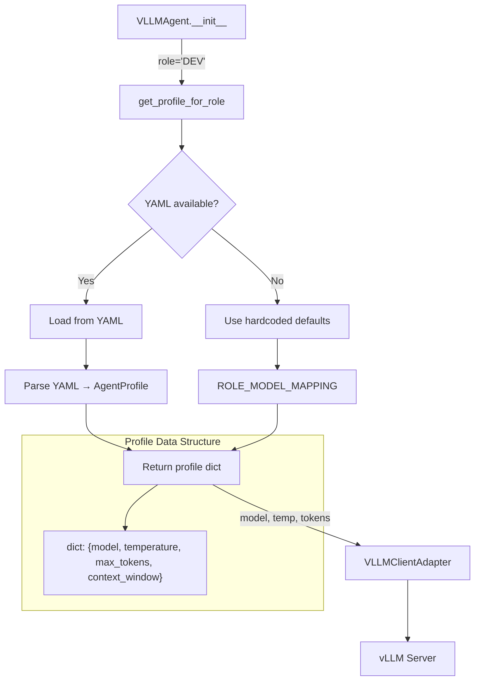
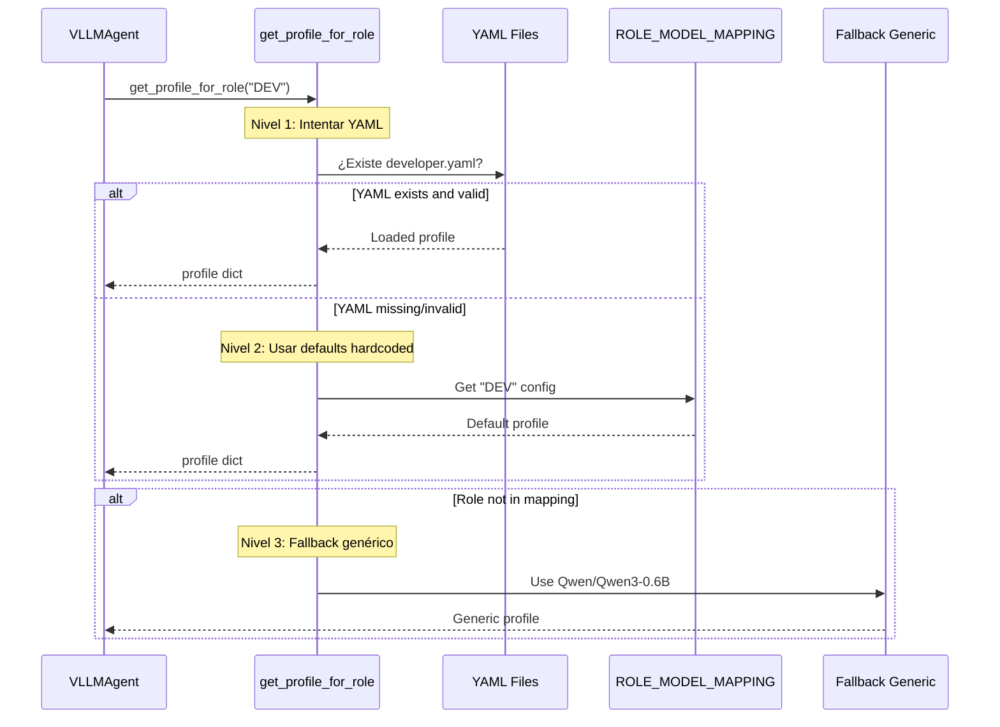
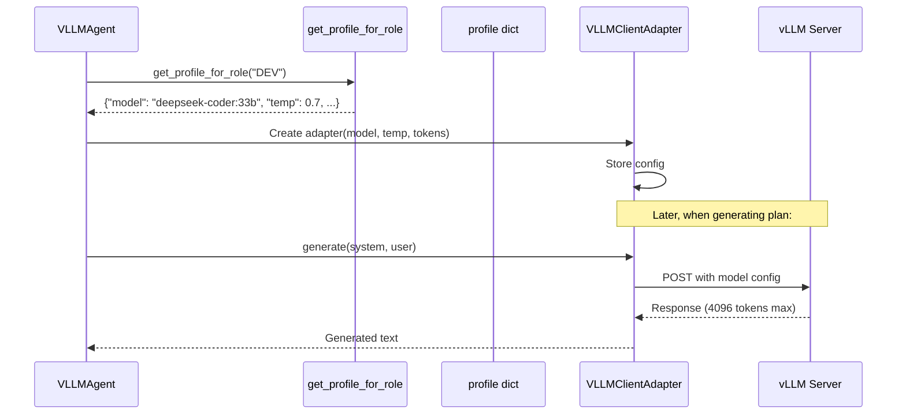

# Agent Profile Loader - Explicación Completa

**Última actualización**: 26 Oct 2025
**Commit**: 50fb174
**Ubicación**: `core/agents_and_tools/agents/profile_loader.py`

---

## 🎯 Propósito

Este módulo proporciona **configuraciones específicas por rol** para agentes VLLM. Cada rol (DEV, QA, ARCHITECT, DEVOPS, DATA) tiene un modelo LLM diferente con parámetros optimizados para su función.

---

## 📊 Arquitectura y Flujo



---

## 🏗️ Clases y Funciones

### 1. `AgentProfile` (Dataclass)

**Responsabilidad**: Representar un perfil de agente con configuración del modelo.

```python
@dataclass
class AgentProfile:
    name: str              # Nombre del perfil (ej: "Developer")
    model: str             # Modelo LLM (ej: "deepseek-coder:33b")
    context_window: int    # Tamaño del contexto (ej: 32768)
    temperature: float     # Temperatura del modelo (ej: 0.7)
    max_tokens: int        # Máximo de tokens a generar (ej: 4096)
```

**Factory Method**: `AgentProfile.from_yaml(yaml_path)`
- Carga configuración desde archivo YAML
- Valida que PyYAML esté disponible
- Retorna `AgentProfile` inicializado

---

### 2. `get_profile_for_role(role, profiles_dir=None)`

**Responsabilidad**: Obtener configuración del modelo para un rol específico.

**Estrategia de Fallback (3 niveles):**



---

## 🎭 Perfiles por Rol

### Mapeo de Roles a Modelos

| Rol | Modelo | Temperature | Max Tokens | Context Window | ¿Por qué? |
|-----|--------|-------------|------------|----------------|-----------|
| **ARCHITECT** | databricks/dbrx-instruct | 0.3 | 8192 | 128K | Low temp = deterministic designs, huge context = entire codebase analysis |
| **DEV** | deepseek-coder:33b | 0.7 | 4096 | 32K | High temp = creative coding, large context = multi-file refactoring |
| **QA** | mistralai/Mistral-7B-Instruct-v0.3 | 0.5 | 3072 | 32K | Medium temp = structured test creation, focused context for test isolation |
| **DEVOPS** | Qwen/Qwen2.5-Coder-14B-Instruct | 0.6 | 4096 | 32K | Slight creativity for config automation, large output for Dockerfiles/K8s |
| **DATA** | deepseek-ai/deepseek-coder-6.7b-instruct | 0.7 | 4096 | 32K | Creative SQL/DML, structured schema changes |

---

## 🔄 Uso en VLLMAgent

### Inicialización del Agente

```python
# En VLLMAgent.__init__()
if vllm_url and USE_CASES_AVAILABLE:
    # 1. Cargar perfil según el rol
    profile = get_profile_for_role(role)  # role="DEV"

    # 2. Crear adapter con configuración del perfil
    llm_adapter = VLLMClientAdapter(
        vllm_url=vllm_url,
        model=profile["model"],              # "deepseek-coder:33b"
        temperature=profile["temperature"],  # 0.7
        max_tokens=profile["max_tokens"],    # 4096
    )

    # 3. Crear use cases con el adapter configurado
    self.generate_plan_usecase = GeneratePlanUseCase(llm_adapter)
    self.generate_next_action_usecase = GenerateNextActionUseCase(llm_adapter)
```

---

## 📁 Estructura de Archivos YAML (Opcional)

Si quieres personalizar perfiles, crea archivos YAML en `core/models/profiles/`:

```
core/
├── models/
│   └── profiles/
│       ├── architect.yaml      # ARCHITECT profile
│       ├── developer.yaml      # DEV profile
│       ├── qa.yaml             # QA profile
│       ├── devops.yaml          # DEVOPS profile
│       └── data.yaml           # DATA profile
```

### Ejemplo: `developer.yaml`

```yaml
name: Developer
model: deepseek-coder:33b
context_window: 32768
temperature: 0.7
max_tokens: 4096
```

---

## 🎯 Casos de Uso

### Caso 1: Agente DEV estándar

```python
from core.agents_and_tools.agents import VLLMAgent

# Crear agente DEV
agent = VLLMAgent(
    agent_id="agent-dev-001",
    role="DEV",  # ← get_profile_for_role("DEV") se llama internamente
    workspace_path="/workspace/project",
    vllm_url="http://vllm:8000"
)

# Internamente, profile_load hace:
# 1. Busca core/models/profiles/developer.yaml
# 2. Si no existe, usa ROLE_MODEL_MAPPING["DEV"]
# 3. Retorna: {"model": "deepseek-coder:33b", "temperature": 0.7, ...}
# 4. VLLMAgent usa esos valores para configurar el LLM
```

### Caso 2: Agente ARCHITECT con modelo grande

```python
agent = VLLMAgent(
    agent_id="agent-arch-001",
    role="ARCHITECT",  # ← Usa dbrx-instruct con 128K context
    workspace_path="/workspace/project",
    vllm_url="http://vllm:8000"
)

# Internamente:
# profile = {"model": "databricks/dbrx-instruct", "temperature": 0.3, ...}
# Este modelo puede analizar código completo (128K tokens)
```

### Caso 3: Fallback cuando no hay YAML

```python
# Si PyYAML no está instalado O no hay archivos YAML:
profile = get_profile_for_role("DEV")

# Retorna directamente desde ROLE_MODEL_MAPPING:
{
    "model": "deepseek-coder:33b",
    "temperature": 0.7,
    "max_tokens": 4096,
    "context_window": 32768
}
```

---

## 🔗 Relaciones con Otros Componentes

### Integración con VLLMClientAdapter



---

## 🛡️ Manejo de Errores

```python
# Estrategia de defensa en profundidad:

def get_profile_for_role(role, profiles_dir=None):
    # Nivel 1: Intentar YAML
    if profiles_dir.exists() and YAML_AVAILABLE:
        try:
            profile = AgentProfile.from_yaml(profile_file)
            return profile.to_dict()  # ✅ Éxito
        except Exception as e:
            logger.warning(f"Failed to load from YAML: {e}")

    # Nivel 2: Usar defaults hardcoded
    if role in ROLE_MODEL_MAPPING:
        return ROLE_MODEL_MAPPING[role]  # ✅ Éxito

    # Nivel 3: Fallback genérico
    return {
        "model": "Qwen/Qwen3-0.6B",  # ✅ Siempre funciona
        "temperature": 0.7,
        "max_tokens": 2048,
        "context_window": 8192,
    }
```

**Ventaja**: El sistema nunca falla, siempre retorna una configuración válida.

---

## 📊 Resumen de Arquitectura

```
┌─────────────────────────────────────────────────────────────┐
│                    profile_loader.py                         │
│                                                               │
│  ┌────────────────┐          ┌──────────────────────┐      │
│  │ AgentProfile   │          │ get_profile_for_role  │      │
│  │ (Dataclass)    │          │ (Function)            │      │
│  │                │          │                       │      │
│  │ - from_yaml()  │          │ - 3-level fallback    │      │
│  │ - Validation   │          │ - Logging             │      │
│  └────────────────┘          └──────────────────────┘      │
│                                                               │
│  ┌───────────────────────────────────────────────────┐       │
│  │   ROLE_MODEL_MAPPING (Dict with 5 roles)          │       │
│  │   - ARCHITECT, DEV, QA, DEVOPS, DATA              │       │
│  └───────────────────────────────────────────────────┘       │
└─────────────────────────────────────────────────────────────┘
                           ▼
                    ┌──────────────┐
                    │  VLLMAgent   │
                    │  __init__()  │
                    └──────────────┘
                           ▼
                    ┌────────────────┐
                    │ VLLMClient     │
                    │   Adapter      │
                    └────────────────┘
```

---

## ✅ Características Clave

1. **Separación de concerns**: Configuración separada de lógica de agente
2. **Flexibilidad**: YAML opcional, defaults hardcoded
3. **Resiliencia**: Triple fallback garantiza que siempre funciona
4. **Especialización**: Cada rol tiene modelo y parámetros óptimos
5. **Observabilidad**: Logging en cada nivel de fallback

---

**Próximos pasos**:
- Crear archivos YAML personalizados si necesitas ajustar modelos
- Ajustar `ROLE_MODEL_MAPPING` si cambian los modelos disponibles
- Monitorear logs para ver qué perfil se usa en cada agente

