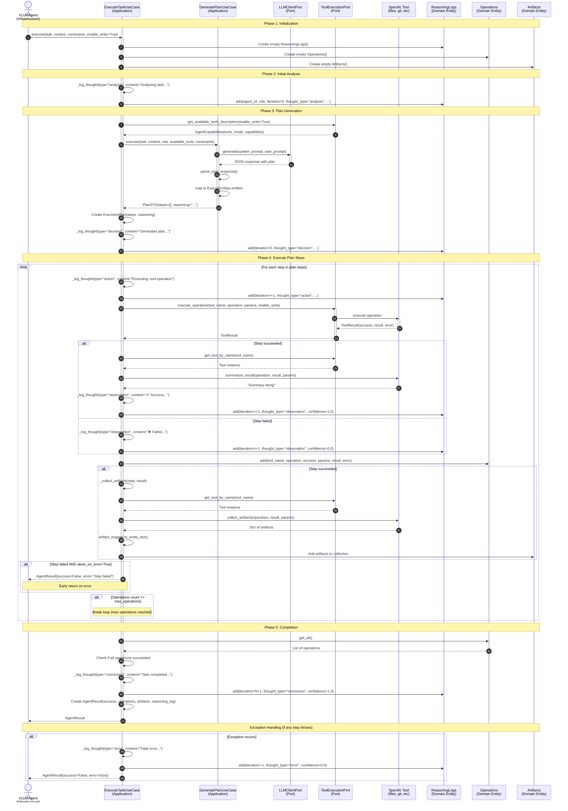
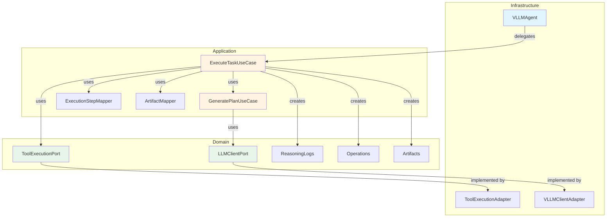
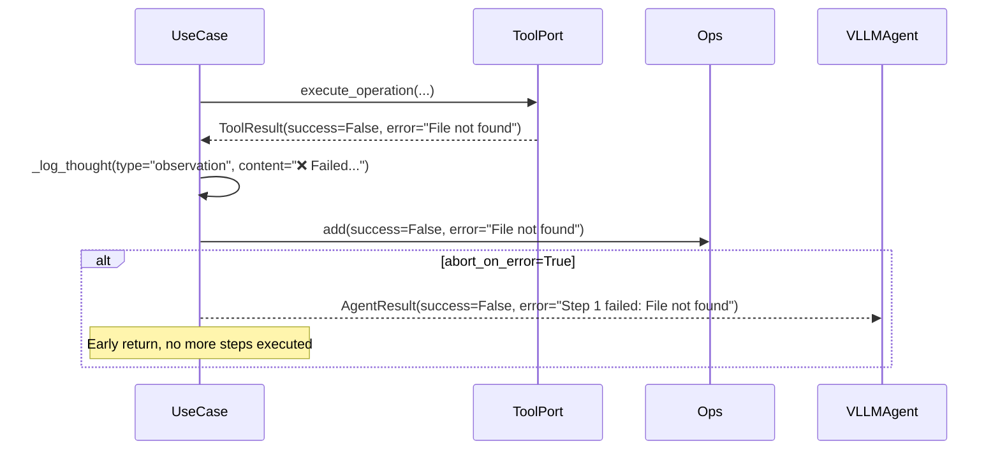
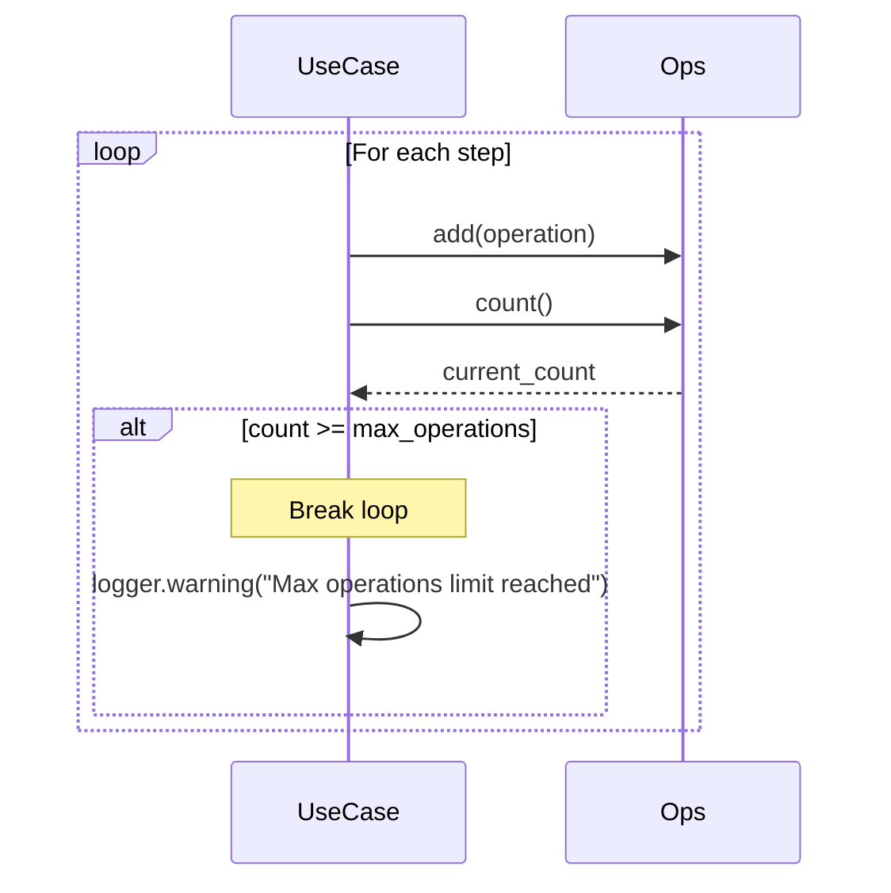
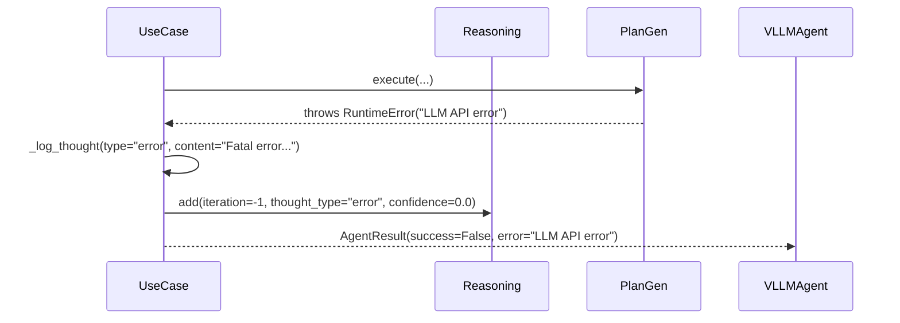

# ExecuteTaskUseCase - Sequence Diagram

## Overview

This diagram shows the complete flow of `ExecuteTaskUseCase` (static planning) following hexagonal architecture principles.

---

## Sequence Diagram



---

## Flow Description

### Phase 1: Initialization
1. VLLMAgent calls `execute()` on the use case
2. Use case creates empty domain entities (ReasoningLogs, Operations, Artifacts)

### Phase 2: Initial Analysis
3. Log initial thought ("Analyzing task...")
4. Add reasoning entry with analysis

### Phase 3: Plan Generation
5. Get available tools from ToolExecutionPort
6. Call GeneratePlanUseCase to get execution plan
   - GeneratePlanUseCase calls LLM via LLMClientPort
   - LLM returns JSON with steps
   - Parse and map to ExecutionStep entities
7. Log decision thought ("Generated plan with N steps...")

### Phase 4: Execute Plan Steps (Loop)

For each step in the plan:

8. **Log Action** - What we're about to do
9. **Execute Step** - Call ToolExecutionPort.execute_operation()
   - Port delegates to specific tool
   - Tool returns result
10. **Log Observation** - What happened (success/failure)
11. **Record Operation** - Add to Operations collection
12. **Collect Artifacts** - If successful, gather artifacts
13. **Error Handling** - If failed and abort_on_error, return early
14. **Check Limits** - Break if max_operations reached

### Phase 5: Completion
15. Verify all operations succeeded
16. Log final conclusion
17. Return AgentResult with all data

### Exception Handling
- If any exception occurs, log error thought and return failure result

---

## Key Components

### Domain Entities (Collections)
- **ReasoningLogs**: Captures agent's "stream of consciousness"
- **Operations**: Records all tool operations executed
- **Artifacts**: Collects outputs from successful operations

### Ports (Abstractions)
- **ToolExecutionPort**: Executes tool operations (implemented by ToolExecutionAdapter)
- **LLMClientPort**: Communicates with LLM (implemented by VLLMClientAdapter)

### Use Cases (Application Logic)
- **GeneratePlanUseCase**: Generates execution plan using LLM
- **ExecuteTaskUseCase**: Orchestrates plan execution (this diagram)

---

## Hexagonal Architecture Layers

```
┌─────────────────────────────────────────────────────┐
│  Infrastructure Layer                               │
│  ┌────────────────┐                                 │
│  │  VLLMAgent     │ (thin facade)                   │
│  └────────────────┘                                 │
└─────────────────────────────────────────────────────┘
              ↓ delegates to
┌─────────────────────────────────────────────────────┐
│  Application Layer                                  │
│  ┌──────────────────────┐  ┌────────────────────┐  │
│  │ ExecuteTaskUseCase   │→ │ GeneratePlanUseCase│  │
│  └──────────────────────┘  └────────────────────┘  │
└─────────────────────────────────────────────────────┘
              ↓ uses
┌─────────────────────────────────────────────────────┐
│  Domain Layer (Ports + Entities)                    │
│  ┌──────────────────┐  ┌──────────────────┐        │
│  │ ToolExecutionPort│  │ LLMClientPort    │        │
│  └──────────────────┘  └──────────────────┘        │
│  ┌──────────────────┐  ┌──────────────────┐        │
│  │ ReasoningLogs    │  │ Operations       │        │
│  └──────────────────┘  └──────────────────┘        │
└─────────────────────────────────────────────────────┘
              ↓ implemented by
┌─────────────────────────────────────────────────────┐
│  Infrastructure Layer (Adapters)                    │
│  ┌──────────────────────┐  ┌─────────────────────┐ │
│  │ ToolExecutionAdapter │  │ VLLMClientAdapter   │ │
│  └──────────────────────┘  └─────────────────────┘ │
└─────────────────────────────────────────────────────┘
```

---

## Complexity Analysis

### Current Complexity: 25 (CRITICAL)

**Contributors to complexity:**

1. **Main try-catch** (+1)
2. **Plan steps loop** (+1)
3. **Success/failure branching** (+2-3 per step)
4. **Artifact collection conditional** (+2)
5. **Error handling conditionals** (+3)
6. **Max operations check** (+2)
7. **Nested if statements** (+6-8)

**Total**: ~25 points

### Potential Simplification Strategies

1. **Extract Step Execution**
   - Move step loop body to `_execute_single_step()` method
   - Reduction: -5 to -8 points

2. **Extract Observation Logging**
   - Move success/failure logging to `_log_step_observation()` method
   - Reduction: -3 to -5 points

3. **Extract Artifact Collection**
   - Already has `_collect_artifacts()` but could simplify usage
   - Reduction: -2 points

4. **Extract Final Verification**
   - Move completion logic to `_verify_and_conclude()` method
   - Reduction: -2 to -3 points

**Estimated final complexity after refactoring**: 10-12 (within limits)

---

## Data Flow

### Input
```python
task: str                      # "Fix bug in auth module"
context: str                   # Smart context from Context Service
constraints: ExecutionConstraints  # max_operations, abort_on_error, etc.
enable_write: bool            # True = full execution, False = planning only
```

### Output
```python
AgentResult(
    success: bool,              # True if all steps succeeded
    operations: Operations,      # Collection of executed operations
    artifacts: Artifacts,        # Collection of gathered artifacts
    audit_trail: AuditTrails,   # Audit information (currently unused)
    reasoning_log: ReasoningLogs, # Agent's thoughts and decisions
    error: str | None            # Error message if failed
)
```

### Intermediate Data

1. **ExecutionPlan** (from GeneratePlanUseCase)
   - steps: list[ExecutionStep]
   - reasoning: str

2. **StepExecutionDTO** (from ToolExecutionPort)
   - success: bool
   - result: ToolResult entity
   - error: str | None

3. **Reasoning Entries** (added to ReasoningLogs)
   - analysis (iteration 0)
   - decision (iteration 0)
   - action (each step, iteration i+1)
   - observation (each step, iteration i+1)
   - conclusion (final, iteration N+1)
   - error (if exception, iteration -1)

---

## Dependencies Graph



---

## Execution Example

### Input
```python
task = "Fix the bug in auth module"
context = """
Project: Authentication Service
Files: src/auth/login.py, src/auth/session.py
Recent changes: Added JWT validation
"""
constraints = ExecutionConstraints(
    max_operations=10,
    abort_on_error=True,
    iterative=False
)
```

### Execution Flow

**Step 1: Initial Analysis**
```
[agent-001:DEV] ANALYSIS: Analyzing task: Fix the bug in auth module.
                          Mode: full execution
```

**Step 2: Plan Generation**
```
Calling GeneratePlanUseCase...
  → LLM analyzes task and context
  → Returns plan:
    1. files.search_in_files(pattern="BUG", path="src/auth/")
    2. files.read_file(path="src/auth/login.py")
    3. files.edit_file(path="src/auth/login.py", ...)
    4. tests.pytest(path="tests/auth/")

[agent-001] DECISION: Generated execution plan with 4 steps.
                      Reasoning: Need to find bug, read code, fix it, verify tests
```

**Step 3: Execute Steps**

*Iteration 1:*
```
[agent-001] ACTION: Executing: files.search_in_files({"pattern": "BUG", ...})
  → Tool executes...
  → Result: Found "# BUG: null check missing" in login.py:45
[agent-001] OBSERVATION: ✅ Operation succeeded. Found 1 match in src/auth/login.py
```

*Iteration 2:*
```
[agent-001] ACTION: Executing: files.read_file({"path": "src/auth/login.py"})
  → Tool executes...
  → Result: File content returned
[agent-001] OBSERVATION: ✅ Operation succeeded. Read 150 lines from src/auth/login.py
  → Artifacts collected: {"file_content": "def validate_token(token):\n..."}
```

*Iteration 3:*
```
[agent-001] ACTION: Executing: files.edit_file({"path": "src/auth/login.py", ...})
  → Tool executes...
  → Result: File edited successfully
[agent-001] OBSERVATION: ✅ Operation succeeded. Edited src/auth/login.py (1 change)
  → Artifacts collected: {"files_modified": ["src/auth/login.py"]}
```

*Iteration 4:*
```
[agent-001] ACTION: Executing: tests.pytest({"path": "tests/auth/"})
  → Tool executes...
  → Result: All tests passed
[agent-001] OBSERVATION: ✅ Operation succeeded. 15 tests passed
```

**Step 4: Conclusion**
```
[agent-001] CONCLUSION: Task completed successfully.
                        Executed 4 operations.
                        Artifacts: ['file_content', 'files_modified', 'test_results']
```

### Output
```python
AgentResult(
    success=True,
    operations=Operations(count=4),
    artifacts=Artifacts(
        file_content="...",
        files_modified=["src/auth/login.py"],
        test_results={...}
    ),
    reasoning_log=ReasoningLogs(count=10),  # 1 analysis + 1 decision + 4*2 observations + 1 conclusion
    error=None
)
```

---

## Error Handling Scenarios

### Scenario 1: Step Fails with abort_on_error=True



### Scenario 2: Max Operations Reached



### Scenario 3: Fatal Exception



---

## Reasoning Log Structure

The reasoning log captures the agent's "stream of consciousness":

```python
ReasoningLogs([
    # Iteration 0: Analysis and Planning
    Reasoning(iteration=0, thought_type="analysis", content="Analyzing task..."),
    Reasoning(iteration=0, thought_type="decision", content="Generated plan with 4 steps..."),

    # Iteration 1: First step
    Reasoning(iteration=1, thought_type="action", content="Executing: files.search..."),
    Reasoning(iteration=1, thought_type="observation", content="✅ Found 1 match...", confidence=1.0),

    # Iteration 2: Second step
    Reasoning(iteration=2, thought_type="action", content="Executing: files.read_file..."),
    Reasoning(iteration=2, thought_type="observation", content="✅ Read 150 lines...", confidence=1.0),

    # ... more iterations ...

    # Final: Conclusion
    Reasoning(iteration=N+1, thought_type="conclusion", content="Task completed...", confidence=1.0),
])
```

**Thought Types:**
- `analysis`: Initial understanding of task
- `decision`: Plan generation or strategic decision
- `action`: About to execute operation
- `observation`: Result of operation
- `conclusion`: Final summary
- `error`: Fatal error occurred

---

## Comparison: Before vs After Refactoring

### Before (VLLMAgent - Infrastructure Layer)

```python
class VLLMAgent:
    async def _execute_task_static(self, task, context, constraints):
        # 163 lines of orchestration logic here
        plan = await self._generate_plan(...)
        for step in plan.steps:
            result = await self._execute_step(step)
            # ... artifact collection, error handling ...
        return AgentResult(...)
```

- ❌ Orchestration in infrastructure layer
- ❌ Violates hexagonal architecture
- ❌ Hard to test in isolation
- ❌ Complexity 21 (CRITICAL)

### After (ExecuteTaskUseCase - Application Layer)

```python
class ExecuteTaskUseCase:
    async def execute(self, task, context, constraints, enable_write):
        # Orchestration logic with injected dependencies
        plan = await self.generate_plan_usecase.execute(...)
        for step in plan.steps:
            result = await self._execute_step(step, enable_write)
            # ... artifact collection, error handling ...
        return AgentResult(...)
```

- ✅ Orchestration in application layer (correct!)
- ✅ Follows hexagonal architecture
- ✅ Easy to test (all dependencies mockable)
- ⚠️ Complexity 25 (can be reduced with helpers)

---

## Testing Strategy

### Unit Tests (24 tests, 97% coverage)

**Test with all dependencies mocked:**
```python
usecase = ExecuteTaskUseCase(
    tool_execution_port=Mock(spec=ToolExecutionPort),
    step_mapper=Mock(spec=ExecutionStepMapper),
    artifact_mapper=Mock(spec=ArtifactMapper),
    generate_plan_usecase=Mock(spec=GeneratePlanUseCase),
    agent_id="test-agent",
    role="DEV",
)
```

**Verify orchestration:**
- Plan generation is called
- Steps executed in order
- Artifacts collected
- Reasoning logged
- Errors handled correctly
- Constraints enforced

### Integration Tests (via VLLMAgent)

**Test through VLLMAgent facade:**
```python
agent = VLLMAgentFactory.create(config)
result = await agent.execute_task(task, constraints, context)
```

**Verify end-to-end behavior:**
- Real tool execution
- Real artifact collection
- Integration between layers

---

## Performance Characteristics

### Execution Time

- **Plan Generation**: ~1-3 seconds (LLM call)
- **Step Execution**: Variable (depends on tool and operation)
  - File operations: 10-100ms
  - Git operations: 50-500ms
  - Test execution: 1-10 seconds
- **Logging Overhead**: <10ms per thought
- **Artifact Collection**: <10ms per step

### Scalability

- **Small Plans** (1-3 steps): <5 seconds total
- **Medium Plans** (4-10 steps): 10-60 seconds
- **Large Plans** (10+ steps): Limited by `max_operations` constraint

### Resource Usage

- **Memory**: Minimal (collections are lightweight)
- **CPU**: Mainly in tool execution and LLM calls
- **I/O**: Depends on tools used (file reads, git commands, etc.)

---

## Related Diagrams

For complete architecture understanding, also see:
- `EXECUTE_TASK_ITERATIVE_USECASE_SEQUENCE.md` - ReAct pattern (iterative execution)
- `GENERATE_PLAN_USECASE_SEQUENCE.md` - How plans are generated
- `VLLM_AGENT_ARCHITECTURE.md` - Overall agent architecture

