# RBAC Level 3 - Data Access Control Implementation Plan

**Date:** 2025-11-07
**Architect:** Tirso García Ibáñez
**Status:** 🔵 DESIGN PHASE
**Priority:** P1 (High)
**ETA:** 5-7 days

---

## 🎯 Objective

Implement **Data Access Control** (RBAC Level 3) to ensure agents only see data they need for their role.

**Core Principle:** **Least Privilege** - Each role sees minimum necessary data

---

## 📊 Scope Definition

### **What RBAC L3 Controls:**

✅ **Story/Task Visibility** (who sees what entities)
✅ **Column-Level Filtering** (hide business_notes from developers)
✅ **Graph Traversal Limits** (developer: 1 story, architect: epic)
✅ **Audit Trail** (log all data access)

### **What RBAC L3 Does NOT Control:**

❌ Tool execution (covered by RBAC L1)
❌ Workflow actions (covered by RBAC L2)
❌ Authentication/Authorization (out of scope)

---

## 🗂️ Data Access Matrix

### **Visibility Rules by Role:**

| Role | Task | Story | Epic | Other Tasks | Other Stories | Decisions |
|------|------|-------|------|-------------|---------------|-----------|
| **Developer** | ✅ Assigned | ✅ Parent | ✅ Parent | ❌ No | ❌ No | ✅ Story-level |
| **Architect** | ✅ All in story | ✅ All in epic | ✅ Yes | ✅ All in story | ✅ All in epic | ✅ Epic-level |
| **QA** | ✅ All in story | ✅ Parent | ✅ Parent | ✅ All in story | ❌ No | ✅ Story-level |
| **PO** | ❌ No (abstraction) | ✅ All in epic | ✅ Yes | ❌ No | ✅ All in epic | ✅ Epic-level |
| **DevOps** | ✅ Assigned | ✅ Parent | ❌ No | ✅ Deploy deps | ❌ No | ✅ Story-level |
| **Data** | ✅ Assigned | ✅ Parent | ✅ Parent | ✅ Schema deps | ❌ No | ✅ Data-related |

### **Column-Level Filtering:**

| Field | Developer | Architect | QA | PO | DevOps | Data |
|-------|-----------|-----------|----|----|--------|------|
| `task.id` | ✅ | ✅ | ✅ | ❌ | ✅ | ✅ |
| `task.description` | ✅ | ✅ | ✅ | ❌ | ✅ | ✅ |
| `story.id` | ✅ | ✅ | ✅ | ✅ | ✅ | ✅ |
| `story.title` | ✅ | ✅ | ✅ | ✅ | ✅ | ✅ |
| `story.brief` | ✅ | ✅ | ✅ | ✅ | ✅ | ✅ |
| `story.business_notes` | ❌ | ❌ | ❌ | ✅ | ❌ | ❌ |
| `story.acceptance_criteria` | ✅ | ✅ | ✅ | ✅ | ❌ | ✅ |
| `epic.product_vision` | ❌ | ✅ | ❌ | ✅ | ❌ | ❌ |
| `epic.budget_notes` | ❌ | ❌ | ❌ | ✅ | ❌ | ❌ |

**Rule:** Business fields (vision, budget, notes) only visible to PO and Architect

---

## 🏗️ Architecture Design

### **Service Affected:** Context Service (port 50054)

**Why Context Service?**
- Owns knowledge graph queries (Neo4j)
- Already has context assembly logic
- Natural place for role-based filtering

### **Changes Required:**

```mermaid
graph TB
    subgraph Before["❌ Before RBAC L3"]
        REQ1[GetContext request<br/>task_id only]
        UC1[GetContextUseCase<br/>no role param]
        Q1[Neo4j query<br/>returns ALL data]
        RES1[Response<br/>unfiltered]
    end

    subgraph After["✅ After RBAC L3"]
        REQ2[GetContext request<br/>task_id + role]
        UC2[GetRoleBasedContextUseCase<br/>role parameter]
        Q2[Neo4j query BY ROLE<br/>filtered at DB level]
        FILT[Column filter<br/>remove business fields]
        RES2[Response<br/>role-filtered]
        AUDIT[Audit log<br/>who accessed what]
    end

    REQ1 --> UC1 --> Q1 --> RES1
    REQ2 --> UC2 --> Q2 --> FILT --> RES2 --> AUDIT

    style Before fill:#fee
    style After fill:#efe
```



---

## 📋 Implementation Tasks (12 total)

### **Phase 1: Context Service Core (Days 1-3)**

#### Task 1: Protobuf API Update ⏱️ 1 hour

**File:** `specs/context.proto`

**Changes:**
```protobuf
message GetContextRequest {
  string task_id = 1;
  string role = 2;  // NEW: "developer", "architect", "qa", "po", "devops", "data"
}

message GetContextResponse {
  string task_id = 1;
  string role = 2;  // NEW: Echo role for verification
  ContextData context = 3;
  AccessAudit audit = 4;  // NEW: Audit trail
}

message AccessAudit {
  string accessed_by_role = 1;
  string timestamp = 2;
  repeated string entities_accessed = 3;  // ["task-123", "story-456", "epic-789"]
}
```

#### Task 2: Domain Model (Value Objects) ⏱️ 2 hours

**New files:**
- `services/context/domain/value_objects/data_access_scope.py`

```python
@dataclass(frozen=True)
class DataAccessScope:
    """Defines what data a role can access for a given task."""

    role: Role
    task_id: TaskId
    can_see_assigned_task: bool
    can_see_parent_story: bool
    can_see_parent_epic: bool
    can_see_other_tasks_in_story: bool
    can_see_other_stories_in_epic: bool
    can_see_business_fields: bool

    @staticmethod
    def for_role(role: Role, task_id: TaskId) -> "DataAccessScope":
        """Factory: Create scope based on role."""
        if role.is_developer():
            return DataAccessScope(
                role=role,
                task_id=task_id,
                can_see_assigned_task=True,
                can_see_parent_story=True,
                can_see_parent_epic=True,
                can_see_other_tasks_in_story=False,
                can_see_other_stories_in_epic=False,
                can_see_business_fields=False,
            )
        elif role.is_architect():
            return DataAccessScope(
                role=role,
                task_id=task_id,
                can_see_assigned_task=True,
                can_see_parent_story=True,
                can_see_parent_epic=True,
                can_see_other_tasks_in_story=True,
                can_see_other_stories_in_epic=True,
                can_see_business_fields=True,  # Architect sees business context
            )
        # ... other roles
```

#### Task 3: Domain Service (Role-Based Queries) ⏱️ 4 hours

**New file:**
- `services/context/domain/services/role_based_context_service.py`

```python
class RoleBasedContextService:
    """Domain service: Determines what data a role can access.

    Tell, Don't Ask: Encapsulates RBAC L3 business rules.
    """

    def can_access_story(self, role: Role, story_id: StoryId, task_id: TaskId) -> bool:
        """Check if role can access a story."""
        scope = DataAccessScope.for_role(role, task_id)

        # Developer: only parent story
        # Architect: all stories in epic
        # QA: parent story + test dependencies
        # ...

    def can_access_task(self, role: Role, target_task_id: TaskId, context_task_id: TaskId) -> bool:
        """Check if role can access a task."""
        # ...

    def should_mask_field(self, role: Role, field_name: str) -> bool:
        """Check if field should be masked for role."""
        business_fields = ["business_notes", "budget_notes", "product_vision"]

        if field_name in business_fields:
            return not role.is_po() and not role.is_architect()

        return False
```

#### Task 4: Application Use Case ⏱️ 3 hours

**New file:**
- `services/context/application/usecases/get_role_based_context_usecase.py`

```python
class GetRoleBasedContextUseCase:
    """Get context filtered by role (RBAC Level 3)."""

    def __init__(
        self,
        repository: ContextRepositoryPort,
        rbac_service: RoleBasedContextService,
        audit_port: AuditPort,
    ) -> None:
        self._repository = repository
        self._rbac = rbac_service
        self._audit = audit_port

    async def execute(self, task_id: TaskId, role: Role) -> RoleFilteredContext:
        """Get context with role-based filtering."""

        # 1. Determine access scope
        scope = DataAccessScope.for_role(role, task_id)

        # 2. Query Neo4j with role filter
        raw_context = await self._repository.get_context_for_scope(scope)

        # 3. Apply column-level filtering
        filtered_context = self._apply_column_filtering(raw_context, role)

        # 4. Audit log
        await self._audit.log_access(
            role=role,
            task_id=task_id,
            entities_accessed=filtered_context.entity_ids
        )

        return filtered_context
```

#### Task 5: Infrastructure (Neo4j Adapter) ⏱️ 6 hours

**Modified file:**
- `services/context/infrastructure/adapters/neo4j_context_adapter.py`

**New methods:**
```python
async def get_context_for_developer(self, task_id: TaskId) -> ContextData:
    """Query for developer (narrow scope)."""
    query = """
    MATCH (task:Task {id: $task_id})
    MATCH (task)-[:BELONGS_TO]->(story:Story)
    MATCH (story)-[:PART_OF]->(epic:Epic)
    OPTIONAL MATCH (story)<-[:RELATES_TO]-(decision:Decision)

    // NO other tasks, NO other stories

    RETURN task, story, epic, collect(decision) as decisions
    """
    # ...

async def get_context_for_architect(self, task_id: TaskId) -> ContextData:
    """Query for architect (epic scope)."""
    query = """
    MATCH (task:Task {id: $task_id})
    MATCH (task)-[:BELONGS_TO]->(story:Story)
    MATCH (story)-[:PART_OF]->(epic:Epic)

    // All stories in epic
    MATCH (epic)<-[:PART_OF]-(allStories:Story)

    // All tasks in those stories
    MATCH (allStories)<-[:BELONGS_TO]-(allTasks:Task)

    // All decisions in epic
    MATCH (epic)<-[:RELATES_TO]-(decisions:Decision)

    RETURN task, story, epic,
           collect(DISTINCT allStories) as all_stories,
           collect(DISTINCT allTasks) as all_tasks,
           collect(DISTINCT decisions) as decisions
    """
    # ...
```

**6 query methods:** One per role (developer, architect, qa, po, devops, data)

#### Task 6: Column Filtering Mapper ⏱️ 2 hours

**New file:**
- `services/context/infrastructure/mappers/column_filter_mapper.py`

```python
class ColumnFilterMapper:
    """Mapper: Filter columns based on role.

    Following Hexagonal Architecture (Infrastructure responsibility).
    """

    @staticmethod
    def filter_story(story_data: dict, role: Role) -> dict:
        """Filter story columns based on role."""

        # Always visible
        filtered = {
            "id": story_data["id"],
            "title": story_data["title"],
            "brief": story_data["brief"],
            "state": story_data["state"],
        }

        # PO + Architect only
        if role.is_po() or role.is_architect():
            filtered["business_notes"] = story_data.get("business_notes")
            filtered["product_vision"] = story_data.get("product_vision")

        # Everyone except PO
        if not role.is_po():
            filtered["acceptance_criteria"] = story_data.get("acceptance_criteria")
            filtered["technical_notes"] = story_data.get("technical_notes")

        return filtered
```

---

### **Phase 2: Integration & Testing (Days 4-5)**

#### Task 7: Orchestrator Integration ⏱️ 2 hours

**Modified file:**
- `services/orchestrator/application/usecases/execute_task_usecase.py`

**Changes:**
```python
# Before:
context = await self._context_client.GetContext(
    GetContextRequest(task_id=task_id)
)

# After:
context = await self._context_client.GetContext(
    GetContextRequest(
        task_id=task_id,
        role=agent.role.value  # NEW: Pass agent role
    )
)
```

#### Task 8: Unit Tests ⏱️ 4 hours

**New test files:**
- `test_data_access_scope.py` (10 tests)
- `test_role_based_context_service.py` (15 tests)
- `test_get_role_based_context_usecase.py` (10 tests)
- `test_column_filter_mapper.py` (12 tests)
- `test_neo4j_role_queries.py` (8 tests - mock Neo4j)

**Total:** 55+ tests, >90% coverage

#### Task 9: Integration Tests ⏱️ 3 hours

**New test file:**
- `tests/integration/context/test_rbac_l3_integration.py`

**Test scenarios:**
1. Developer queries task → gets only assigned task + parent story + epic
2. Architect queries task → gets epic-wide context
3. Developer tries to access business_notes → field masked
4. Audit log records all accesses

#### Task 10: E2E Test ⏱️ 2 hours

**Modified file:**
- `tests/e2e/test_full_workflow_with_rbac.py`

**Scenario:**
```python
@pytest.mark.e2e
async def test_rbac_l1_l2_l3_enforcement():
    """Test all 3 RBAC levels in full workflow."""

    # RBAC L1: Developer can't use helm tool
    with pytest.raises(ToolAccessDenied):
        await agent.execute_tool("helm", ["install", ...])

    # RBAC L2: Developer can't approve design
    with pytest.raises(WorkflowTransitionError):
        await workflow.execute_action("approve_design", role="developer")

    # RBAC L3: Developer can't see other stories
    context = await context_service.get_context(task_id="task-1", role="developer")
    assert len(context.stories) == 1  # Only parent story
    assert "business_notes" not in context.story  # Column masked
```

---

### **Phase 3: Documentation & Deployment (Day 6-7)**

#### Task 11: Documentation ⏱️ 2 hours

**New/Updated files:**
- `docs/architecture/decisions/2025-11-07/RBAC_L3_ADR.md`
- Update `docs/architecture/RBAC_DATA_ACCESS_CONTROL.md`
- Update `ROADMAP.md` (Gap 3 → 100%)

#### Task 12: Deployment ⏱️ 1 hour

**Changes:**
- Update Context Service Dockerfile (if needed)
- Update K8s manifest (if resource limits change)
- Run `./fresh-redeploy.sh`
- Verify RBAC L3 enforcement in logs

---

## 🔄 Implementation Order

### **Day 1-2: Domain + Application**

```
1. Protobuf update (specs/context.proto)
2. DataAccessScope value object
3. RoleBasedContextService (domain service)
4. GetRoleBasedContextUseCase
5. Unit tests (25 tests)
```

### **Day 3-4: Infrastructure**

```
6. Neo4j queries by role (6 methods)
7. ColumnFilterMapper
8. Update Neo4jContextAdapter
9. Update gRPC servicer
10. Unit tests (30 tests)
```

### **Day 5: Integration**

```
11. Orchestrator integration
12. Audit logging
13. Integration tests (5 tests)
14. E2E test (1 test)
```

### **Day 6-7: Polish & Deploy**

```
15. Documentation (ADRs)
16. Code review
17. Deploy to cluster
18. Verify in production
```

---

## 🧪 Test Strategy

### **Test Coverage Target:** >90%

**Unit Tests (55+):**
- DataAccessScope factory methods (all roles)
- RoleBasedContextService (can_access_* methods)
- GetRoleBasedContextUseCase (full flow)
- ColumnFilterMapper (all field combinations)
- Neo4j query builders (mocked)

**Integration Tests (5+):**
- Real Neo4j queries with test data
- Verify Developer sees limited data
- Verify Architect sees epic-wide data
- Verify column masking works
- Verify audit log persists

**E2E Tests (1+):**
- Full workflow with RBAC L1+L2+L3
- Verify all 3 levels enforce correctly

---

## 🔐 Security Considerations

### **Threat Model:**

| Threat | Mitigation |
|--------|------------|
| **Privilege Escalation** | Role passed from Workflow Service (RBAC L2 already validated) |
| **Data Leakage** | Column filtering at query level (DB doesn't return sensitive fields) |
| **Audit Bypass** | Audit log before returning context (fail-fast if audit fails) |
| **Cache Poisoning** | Cache keys include role (developer cache ≠ architect cache) |

### **Defense in Depth:**

```
Layer 1: RBAC L1 (Tool Access) - Can agent use this tool?
Layer 2: RBAC L2 (Workflow Action) - Can agent do this action in this state?
Layer 3: RBAC L3 (Data Access) - Can agent see this data?
Layer 4: Audit - Log all access for forensics
```

---

## 📊 Performance Considerations

### **Query Performance:**

**Concern:** Role-based queries might be slower (more complex)

**Mitigation:**
1. **Neo4j Indexes** - Index on task_id, story_id, epic_id
2. **Query Optimization** - Use OPTIONAL MATCH for optional relationships
3. **Valkey Cache** - Cache per role (key: `context:{role}:{task_id}`)
4. **No TTL** - Context is persistent (invalidate on task update only)

**Expected latency:**
- Developer query: <50ms (narrow scope)
- Architect query: <200ms (epic scope)

### **Cache Strategy:**

**Before RBAC L3:**
```
Key: context:task-123
Value: {full unfiltered context}
```

**After RBAC L3:**
```
Key: context:developer:task-123
Value: {developer-filtered context}

Key: context:architect:task-123
Value: {architect-filtered context}
```

**Cache invalidation:**
- On task update → invalidate ALL role caches for that task
- On story update → invalidate all tasks in story
- On epic update → invalidate all stories in epic

---

## 🎯 Success Criteria

### **Functional:**

- [ ] Developer sees: task + parent story + epic (no other tasks/stories)
- [ ] Architect sees: full epic context (all stories, all tasks)
- [ ] QA sees: story context (all tasks in story)
- [ ] PO sees: epic + stories (no individual tasks)
- [ ] business_notes masked for non-PO roles
- [ ] Audit log records all accesses

### **Non-Functional:**

- [ ] >90% test coverage (new code)
- [ ] <200ms latency (p95)
- [ ] Cache hit rate >80%
- [ ] Zero breaking changes (backward compatible)
- [ ] DDD + Hexagonal Architecture maintained

### **Quality Gates:**

- [ ] All 1,320+ tests passing (1,265 existing + 55 new)
- [ ] Ruff linter clean
- [ ] No regression in existing services
- [ ] SonarCloud quality gate pass

---

## 🔗 Related Work

### **Depends On:**

- ✅ RBAC L1 (Tool Access Control) - DONE (Oct 28)
- ✅ RBAC L2 (Workflow Action Control) - DONE (Nov 7)
- ✅ Context Service - DONE (running in production)
- ✅ Workflow Service - DONE (Nov 7)

### **Enables:**

- Full E2E workflow with 3-level RBAC
- Data sovereignty (roles can't see unauthorized data)
- Compliance (audit trail for data access)
- Security (least privilege enforced)

---

## 📅 Timeline

**Start:** Nov 8, 2025
**End:** Nov 14, 2025 (7 days)

| Day | Tasks | Deliverables |
|-----|-------|--------------|
| **Day 1** | Design + Protobuf | specs/context.proto updated, DataAccessScope |
| **Day 2** | Domain services | RoleBasedContextService, 15 tests |
| **Day 3** | Use Case | GetRoleBasedContextUseCase, 10 tests |
| **Day 4** | Infrastructure | Neo4j queries, ColumnFilterMapper, 30 tests |
| **Day 5** | Integration | Orchestrator integration, 5 integration tests |
| **Day 6** | E2E + Docs | E2E test, ADRs, documentation |
| **Day 7** | Deploy + Verify | Deploy to K8s, verify production |

---

## 🚀 Next Steps

### **Immediate (Start Now):**

1. Update `specs/context.proto` (add role parameter)
2. Create `DataAccessScope` value object
3. Create `RoleBasedContextService` domain service
4. Write unit tests

### **After L3 Complete:**

- [ ] RBAC L1+L2+L3 integration E2E test
- [ ] Performance benchmarks
- [ ] Security audit
- [ ] Production deployment validation

---

**Status:** 🔵 READY TO START
**Architect Approval:** Pending
**Start Date:** Nov 8, 2025

---

**Prepared by:** AI Assistant (architectural analysis)
**To be reviewed by:** Tirso García Ibáñez

