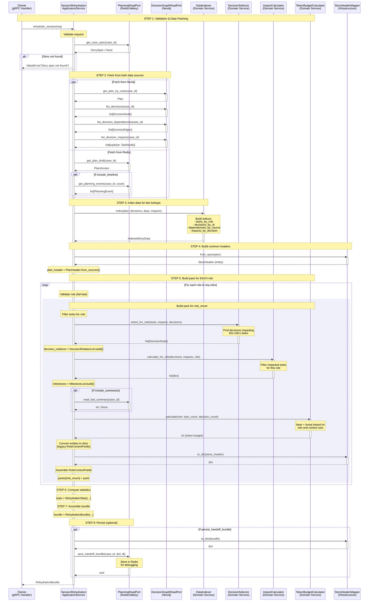
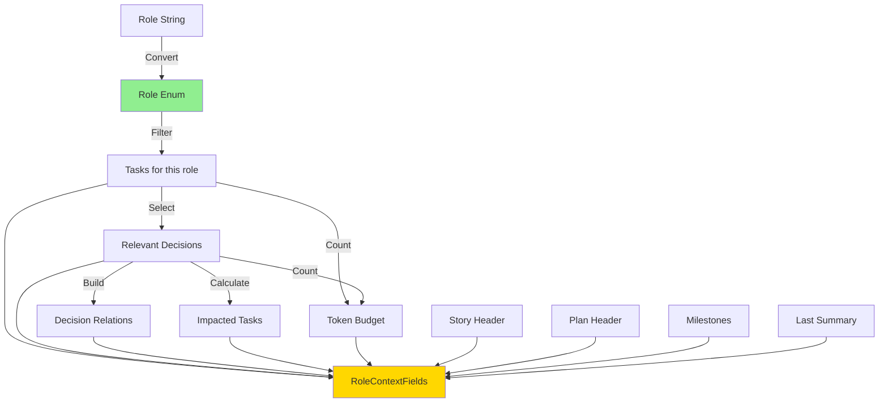

# Session Rehydration - Diagrama de Secuencia

**Fecha**: November 8, 2025
**Componente**: SessionRehydrationApplicationService
**Propósito**: Ensamblar contexto completo para agentes basado en roles

---

## 🎯 Flujo Completo



---

## 📊 Datos de Entrada y Salida

### Input: RehydrationRequest
```python
@dataclass
class RehydrationRequest:
    case_id: str              # Story ID
    roles: list[str]          # Roles to build context for
    include_timeline: bool    # Include planning events?
    timeline_events: int      # Max events to fetch
    include_summaries: bool   # Include last summary?
    persist_handoff_bundle: bool
    ttl_seconds: int
```

### Output: RehydrationBundle
```python
@dataclass(frozen=True)
class RehydrationBundle:
    story_id: StoryId
    generated_at_ms: int
    packs: dict[Role, RoleContextFields]  # One pack per role
    stats: RehydrationStats
```

---

## 🔄 Flujo por Rol

Para CADA rol solicitado, se ejecuta este subflujo:



---

## 🎯 Responsabilidades por Componente

### SessionRehydrationApplicationService
- **Tipo**: Application Service (Orchestrator)
- **Responsabilidad**: Coordinar flujo completo
- **NO hace**: Lógica de negocio (delegada a Domain Services)

### Domain Services (Stateless)
1. **DataIndexer**: Indexar datos para O(1) lookup
2. **DecisionSelector**: Seleccionar decisiones relevantes para rol
3. **ImpactCalculator**: Calcular impactos de decisiones
4. **TokenBudgetCalculator**: Calcular presupuesto de tokens

### Ports (Interfaces)
1. **PlanningReadPort**: Leer specs, plans, eventos (Redis)
2. **DecisionGraphReadPort**: Leer decisiones, impactos (Neo4j)

### Mappers (Infrastructure)
- **StoryHeaderMapper**: spec → StoryHeader entity
- **RehydrationBundleMapper**: bundle → dict (para persistencia)

---

## ⚡ Optimizaciones Posibles

### 1. Paralelización
```python
# ACTUAL: Secuencial
decisions = self.graph_store.list_decisions(case_id)
impacts = self.graph_store.list_decision_impacts(case_id)

# OPTIMIZADO: Paralelo (asyncio)
decisions, impacts = await asyncio.gather(
    self.graph_store.list_decisions_async(case_id),
    self.graph_store.list_decision_impacts_async(case_id),
)
```

### 2. Caché por Rol
```python
# Key incluye role para diferentes vistas
cache_key = f"rehydration:{story_id}:{role}:v{version}"
```

### 3. Lazy Loading
```python
# No cargar timeline si no se solicita
if req.include_timeline:
    events = self.planning_store.get_planning_events(...)
```

---

## 🔍 Puntos de Extensión para RBAC L3

### 1. Filtrado por Rol (Antes de Step 5)
```python
# Aplicar RoleVisibilityPolicy AQUÍ
filtered_data = visibility_policy.filter(indexed_data, role)
```

### 2. Column-Level Filtering (Dentro de Step 5)
```python
# Aplicar ColumnFilterService AQUÍ
filtered_header = column_filter.filter_fields(story_header, role)
```

### 3. Audit Trail (Después de Step 7)
```python
# Registrar acceso a datos AQUÍ
audit_logger.log_data_access(user=req.user_id, role=role, story_id=req.case_id)
```

---

## 🧪 Testing Strategy

### Unit Tests (Domain Services)
```python
def test_decision_selector_selects_relevant_decisions():
    selector = DecisionSelector(fallback_count=3)
    # NO mocks needed - pure logic
    result = selector.select_for_role(tasks, impacts, decisions_by_id, all_decisions)
    assert len(result) == 2
```

### Integration Tests (Application Service)
```python
@pytest.mark.asyncio
async def test_rehydrate_session_e2e():
    # Mock ports
    planning_port = AsyncMock(spec=PlanningReadPort)
    graph_port = AsyncMock(spec=DecisionGraphReadPort)

    # Real domain services (NO mocks)
    service = SessionRehydrationApplicationService(
        planning_store=planning_port,
        graph_store=graph_port,
        token_calculator=TokenBudgetCalculator(),
        decision_selector=DecisionSelector(),
        impact_calculator=ImpactCalculator(),
        data_indexer=DataIndexer(),
    )

    bundle = await service.rehydrate_session(req)
    assert bundle.story_id == expected_story_id
```

---

## 📈 Métricas de Performance

| Métrica | Target | Actual | Status |
|---------|--------|--------|--------|
| Total time | < 200ms | TBD | ⏳ |
| Neo4j queries | < 50ms | TBD | ⏳ |
| Redis queries | < 10ms | TBD | ⏳ |
| Indexing | < 20ms | TBD | ⏳ |
| Per-role assembly | < 30ms | TBD | ⏳ |

---

## 🔗 Referencias

- `core/context/application/session_rehydration_service.py`
- `core/context/domain/services/` (4 domain services)
- `core/context/ports/` (2 ports)
- `docs/architecture/CONTEXT_REHYDRATION_FLOW.md`

