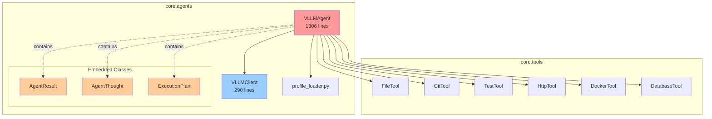
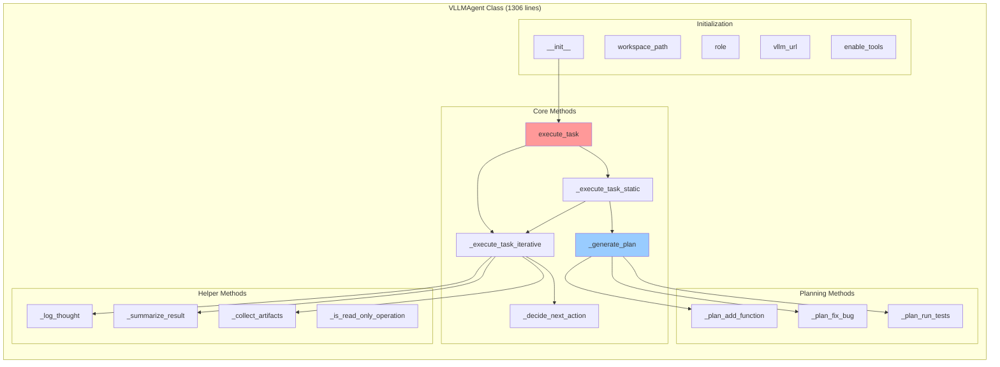
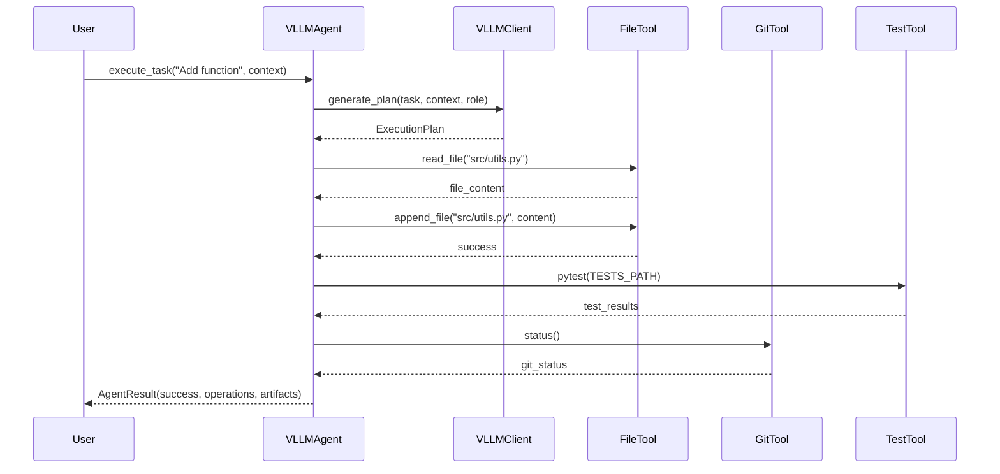
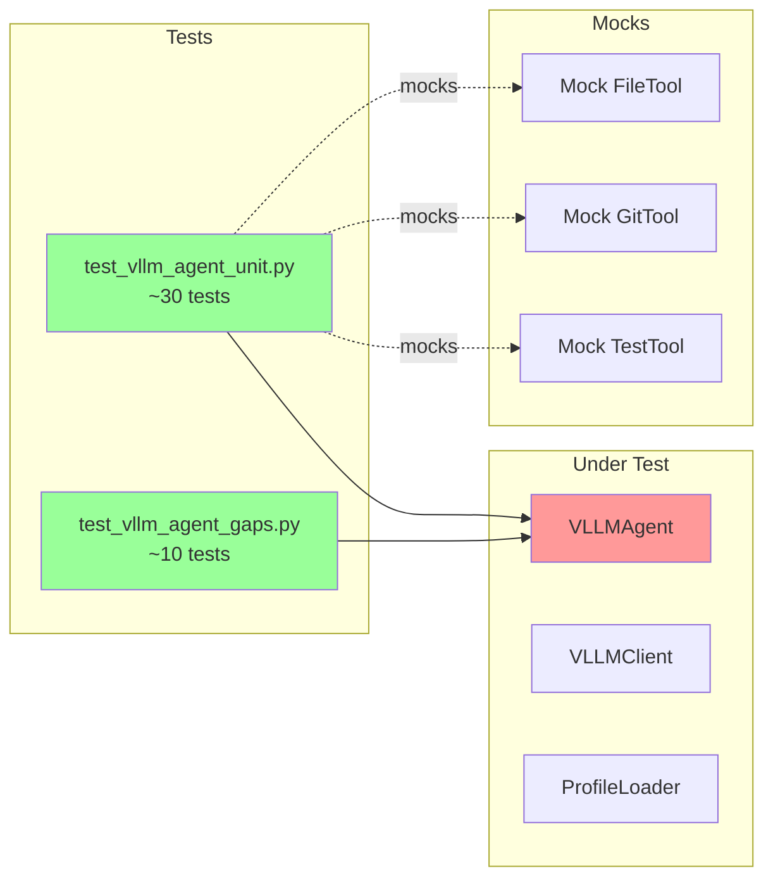
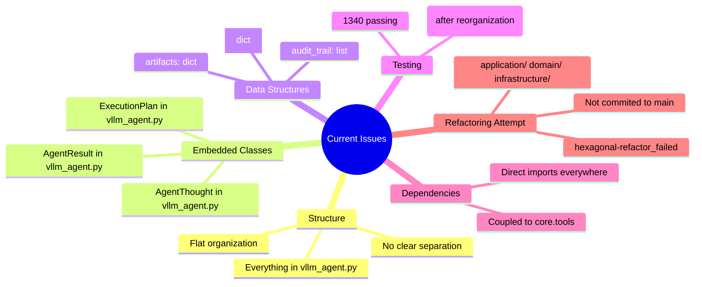

# Core Agents - Current Structure Analysis

**Date**: 2025-01-27
**Branch**: hexagonal-refactor-v2
**Status**: Analysis Phase

## Current Structure

```
core/agents/
├── __init__.py                    # Exports: AgentResult, AgentThought, VLLMAgent
├── vllm_agent.py                  # Main agent class (1306 lines)
├── vllm_client.py                 # vLLM API client (290 lines)
├── profile_loader.py              # Role-specific model profiles
└── [archives from failed attempt]
    ├── application/
    ├── infrastructure/
    └── domain/ (deleted)
```

## Architecture Diagrams

### 1. Current Module Structure



### 2. VLLMAgent Internal Structure



### 3. Data Flow - Agent Execution



### 4. Current Class Dependencies

```mermaid
graph TB
    subgraph "VLLMAgent Dependencies"
        VLLM[VLLMAgent<br/>- vllm_client: VLLMClient<br/>- agent_id, role, workspace<br/>- tools dict]

        subgraph "Embedded Data Classes"
            AR[AgentResult<br/>- success: bool<br/>- operations: list[dict]<br/>- artifacts: dict<br/>- audit_trail: list<br/>- reasoning_log: list]

            AT[AgentThought<br/>- reasoning_log: list<br/>- iteration, thought_type<br/>- content, related_ops<br/>- confidence]

            EP[ExecutionPlan<br/>- steps: list[dict]<br/>- reasoning: str]
        end

        VLLM --> AR
        VLLM --> AT
        VLLM --> EP

        subgraph "External Imports"
            Tools[core.tools.*]
            VLLMClient[VLLMClient]
            Profile[profile_loader]
        end

        VLLM --> Tools
        VLLM --> VLLMClient
        VLLM --> Profile
    end

    style VLLM fill:#ff9999
    style AR fill:#ffcc99
    style AT fill:#ffcc99
    style EP fill:#ffcc99
```

### 5. Test Coverage Map



### 6. Current Issues Summary



## File Statistics

### core/agents/vllm_agent.py
- **Lines**: 1,306
- **Classes**:
  - `AgentResult` (dataclass)
  - `AgentThought` (dataclass)
  - `ExecutionPlan` (dataclass)
  - `VLLMAgent` (main class)
- **Methods**: ~30 public/private methods
- **Dependencies**: core.tools, VLLMClient, profile_loader

### core/agents/vllm_client.py
- **Lines**: 290
- **Classes**: `VLLMClient`
- **Methods**: generate(), decide_next_action()
- **Dependencies**: aiohttp, VLLM API

### core/agents/profile_loader.py
- **Lines**: ~200
- **Function**: get_profile_for_role()
- **Dependencies**: yaml files in core/models/profiles/

## Key Findings

1. **Monolithic Design**: 1306 lines in one file with embedded classes
2. **Mixed Concerns**: Domain logic, application logic, and infrastructure mixed
3. **Strong Coupling**: Direct dependencies on core.tools, VLLMClient
4. **Data as Dicts**: operations, artifacts stored as dicts (not type-safe)
5. **Test Gap**: 17/1357 tests failing after reorganization attempt

## Recommendations

### Phase 1: Prepare (Now)
- ✅ Document current structure (this file)
- ⏸️ Identify real domain entities vs utilities
- ⏸️ Map all dependencies

### Phase 2: Incremental Refactor
- Start small: Extract one class at a time
- Run tests after each change
- Don't reorganize directories yet
- Focus on separation of concerns

### Phase 3: DDD Where It Makes Sense
- AgentResult, ExecutionPlan → Real entities
- Everything else → Keep simple

**Estimated Effort**: 3-5 days for basic refactor, 2-3 weeks for full hexagonal

