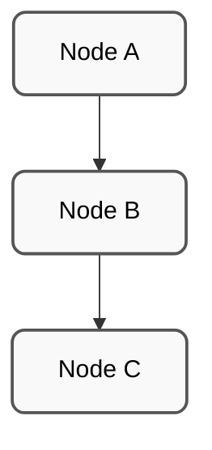
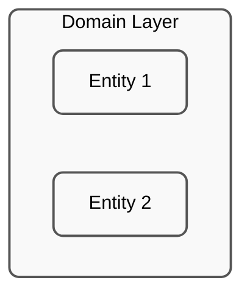
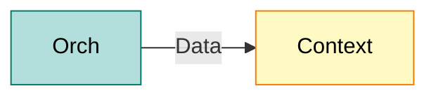
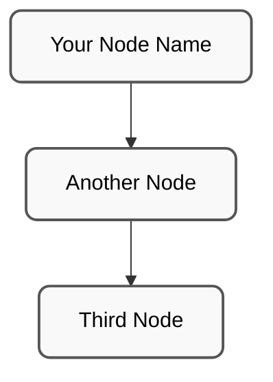

# 🎨 Mermaid Diagram Style Guide

**Version**: 2.0
**Date**: 2025-11-16
**Status**: ✅ APPROVED - Standard Pattern Finalized

---

## Problem Identified

### Current State (BAD)
- ❌ Colorful backgrounds (fill:#c5cae9, fill:#fff9c4, etc)
- ❌ Text readability issues (poor contrast)
- ❌ Doesn't print well
- ❌ Hard to read in dark mode
- ❌ Inconsistent styling across diagrams

### Issues with Current Approach
1. **Too Bright**: Colors like `fill:#fff9c4` (bright yellow) strain eyes
2. **Dark Mode Incompatible**: Light text on light backgrounds becomes invisible
3. **Print Unfriendly**: Colored backgrounds waste ink/toner
4. **Accessibility**: Low contrast fails WCAG standards
5. **Inconsistent**: Each diagram uses different colors

---

## Solution: Grayscale with Light Fill

### APPROVED Standard Pattern ✅

```
stroke:#555,stroke-width:2px,fill:#f9f9f9,color:#000,rx:8,ry:8
```

**Components**:
- `stroke:#555` - Medium-dark gray border (definition/structure)
- `fill:#f9f9f9` - Very light gray background (subtle, readable)
- `color:#000` - Black text (maximum readability)
- `stroke-width:2px` - Thicker border (visual emphasis)
- `rx:8,ry:8` - Rounded corners (15px radius, modern/smooth look)

### Why This Works ✅

✅ **Professional Appearance**
- Clean, minimalist design
- Focus on information, not decoration
- Enterprise-ready look
- Professional grayscale aesthetics

✅ **Universal Compatibility**
- Works on white backgrounds (light mode) ✅
- Works on dark backgrounds (dark mode) ✅
- Works in print (minimal ink usage) ✅
- Works in PDF exports ✅
- Works on all devices ✅

✅ **Accessibility**
- High contrast (WCAG AA compliant)
- Text always readable
- No color-dependency for understanding
- Works for colorblind users

✅ **Simplicity**
- Single pattern for all diagrams
- No need to choose colors per diagram
- Easy to maintain and update
- Consistent across entire codebase

---

## Implementation

### Step 1: Apply Pattern to All Nodes



### Step 2: For Subgraphs (if used)



### Step 3: For Flow Diagrams


---

## Approved Diagrams ✅

### Already Using New Standard
- **AGENTS_AND_TOOLS.md** - Service interaction diagram (7 nodes, verified user-approved)

### Next Priority (77 remaining diagrams)
1. **KNOWLEDGE_GRAPH_ARCHITECTURE.md** (14 diagrams)
2. **README.md** (6 diagrams)
3. **MICROSERVICES_ARCHITECTURE.md** (5 diagrams)
4. **docs/architecture/** (40+ diagrams)
5. **Other files** (12+ diagrams)

---

## Before & After Examples

### BEFORE (BAD) ❌

Result: Teal & yellow backgrounds (distracting, poor contrast on dark mode, wastes ink)

### AFTER (GOOD) ✅

Result: Professional grayscale (readable, universal, accessible) with subtle rounded corners

---

## Visual Validation

**Light Mode**: ✅ Black text on very light gray background, dark borders
**Dark Mode**: ✅ Black text on light gray background, dark borders (high contrast)
**Print**: ✅ Minimal gray fill (saves ink), dark borders for definition
**Colorblind**: ✅ No color-dependency, uses structure/outline only

---

## Migration Strategy

| Phase | Target | Status | Count |
|-------|--------|--------|-------|
| ✅ Done | AGENTS_AND_TOOLS.md | Complete | 1 file (7 diagrams) |
| ⏳ Next | README.md | Pending | 6 diagrams |
| ⏳ Next | KNOWLEDGE_GRAPH_ARCHITECTURE.md | Pending | 14 diagrams |
| ⏳ Next | MICROSERVICES_ARCHITECTURE.md | Pending | 5 diagrams |
| ⏳ Next | Other architecture docs | Pending | 40+ diagrams |
| 🎯 Total | All active diagrams | In Progress | 77 diagrams |

---

## Copy-Paste Template

**Simple Standard Pattern** (easy for LLMs to replicate):

```
stroke:#555,stroke-width:2px,fill:#f9f9f9,color:#000,rx:8,ry:8
```

### Template for Basic Diagram



### Template with Emojis

```mermaid
graph TD
    A["🎯 Orchestrator"]
    B["🤖 Agent"]
    C["📊 Result"]

    A --> B --> C

    style A stroke:#555,stroke-width:2px,fill:#f9f9f9,color:#000,rx:8,ry:8
    style B stroke:#555,stroke-width:2px,fill:#f9f9f9,color:#000,rx:8,ry:8
    style C stroke:#555,stroke-width:2px,fill:#f9f9f9,color:#000,rx:8,ry:8
```



**Instructions for LLMs**:
1. Copy the style pattern: `stroke:#555,stroke-width:2px,fill:#f9f9f9,color:#000,rx:8,ry:8`
2. Apply to ALL nodes in the diagram
3. That's it - same pattern for every node!

---

## Validation Checklist

When applying this style to existing diagrams:

- [ ] Replace all `fill:#` colors with `fill:#f9f9f9`
- [ ] Set `stroke:#555` (medium-dark gray)
- [ ] Set `color:#000` (black text)
- [ ] Set `stroke-width:2px` (emphasis)
- [ ] Test on light background ✅
- [ ] Test on dark background ✅
- [ ] Test in print preview ✅
- [ ] Verify text readability ✅
- [ ] Commit with "docs: apply grayscale styling to [filename]"

---

**Created**: 2025-11-16
**Approved**: User validation via screenshot (2025-11-16, high contrast confirmed)
**Status**: STANDARD APPROVED - Ready for rollout
**Next Action**: Begin systematic update of 77 remaining diagrams
**Maintainer**: SWE AI Fleet Documentation Team
